# 2023 年你能买到的最好的 USB 电缆

> 原文：<https://www.xda-developers.com/best-usb-cables/>

USB 电缆是我们数字生活中不可或缺的一部分，但它们可能会非常令人困惑。从 [USB 一代](https://www.xda-developers.com/usb-standards-explained/)到连接器类型，有许多事情需要考虑。此外，可以给手机或笔记本电脑超快充电的 USB 电缆不一定能超快传输数据。因此，为了让您更轻松地购买符合您需求的 USB 电缆，我们选择了目前市场上最好的 USB 电缆。

在我们开始之前，在购买 USB 电缆之前，您应该记住以下几点。如果你买 USB 线主要是为了给你的智能手机或笔记本电脑快速充电，看看该线支持的充电速度。如果你买的是用于数据传输的 USB 电缆，检查一下电缆的型号。

以下是目前常见的 USB 产品:

*   USB 2.0(也称为 USB 高速)-传输速度高达 480Mbps。
*   USB 超高速 5Gbps(也称为 USB 3.0 或 USB 3.2 Gen 1) -传输速度高达 5 Gbps。
*   USB 超高速 10Gbps(也称为 USB 3.1 或 USB 3.2 Gen 2) -传输速度高达 10 Gbps。
*   USB 超高速 20Gbps(也称为 USB 3.2 Gen 2×2) -传输速度高达 20 Gbps。

显然，数据传输速度还取决于设备中的连接器。因此，除非你两端的设备也能支持高速，否则你在传输数据时不会得到高速。同样不言而喻的是，支持更快传输速度的电缆通常会比那些只在较低速度下工作的电缆更贵(但不要将较高的价格混淆为高速传输能力的完整证明)。

## 最佳 USB A 类到 USB C 类电缆:USB 高速和 USB 超高速 10Gbps

 <picture>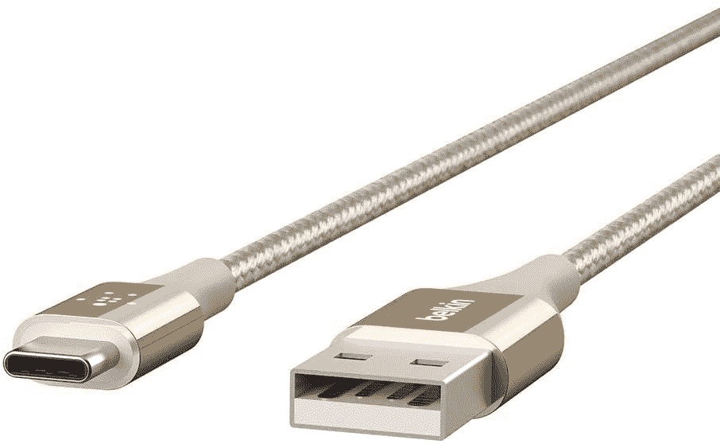</picture> 

Belkin Mixit DuraTek USB-C to USB-A Cable

##### Belkin Mixit DuraTek USB-C 至 USB-A 电缆

Belkin Mixit DuraTek 电缆采用双面编织尼龙，用芳纶纤维加固，非常耐用。它支持 USB 2.0 规范，长四英尺。这种电缆能输送高达 3A 的电力。

 <picture>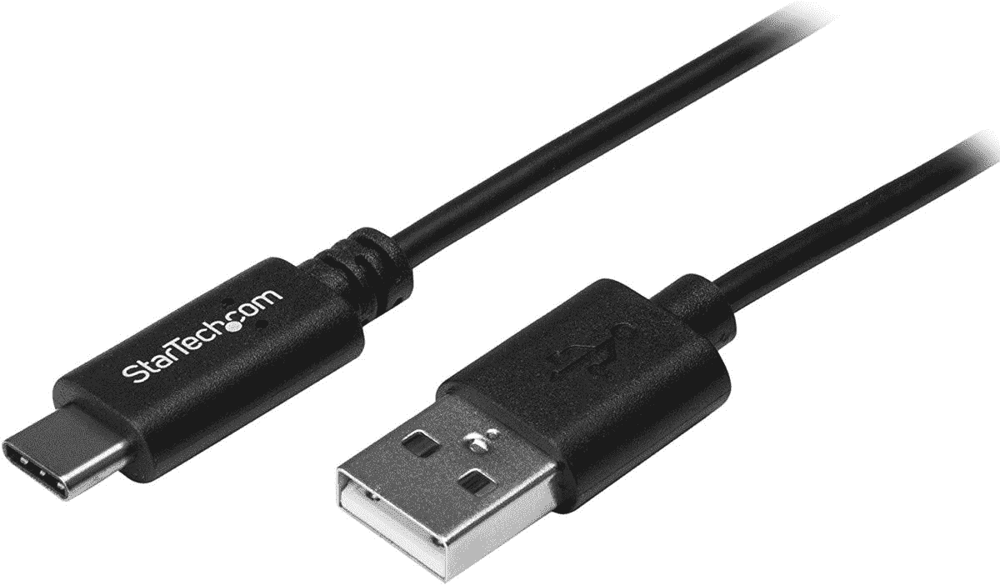</picture> 

StarTech.com USB A to USB C cable

##### StarTech.com USB-A 转 USB-C 线

StarTech.com USB A 到 USB C 电缆有多种长度，从 0.5 米到 4 米不等。此外，它支持 USB 2.0 速度，并提供终身保修。可以应付 2.4A 充电。

 <picture>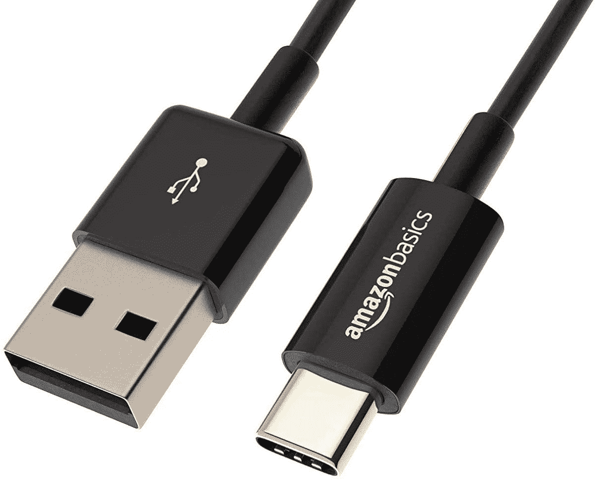</picture> 

AmazonBasics Type C to Type A cable

##### 亚马逊基础 USB-C 转 USB-A 线

这款 AmazonBasics USB 线缆是价格实惠的 USB-IF 认证 A 类至 C 类线缆之一。它支持 USB 2.0 速度和高达 3A 的充电。这种电缆有三种长度——三英尺、六英尺和九英尺。

 <picture>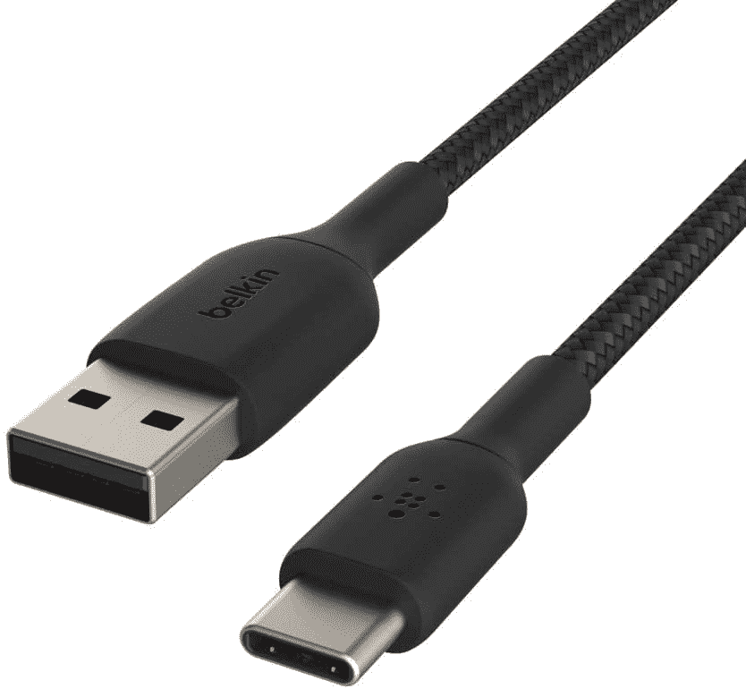</picture> 

Belkin BoostCharge Type-C to Type-A cable

##### belkin boost 充电 USB-C 转 USB-A 线

Belkin BoostCharge USB-C 至 USB-A 电缆由编织尼龙制成，以增强耐用性。它支持 USB 2.0 速度，能够进行 2.4A 充电。可以买一两米码的。

 <picture>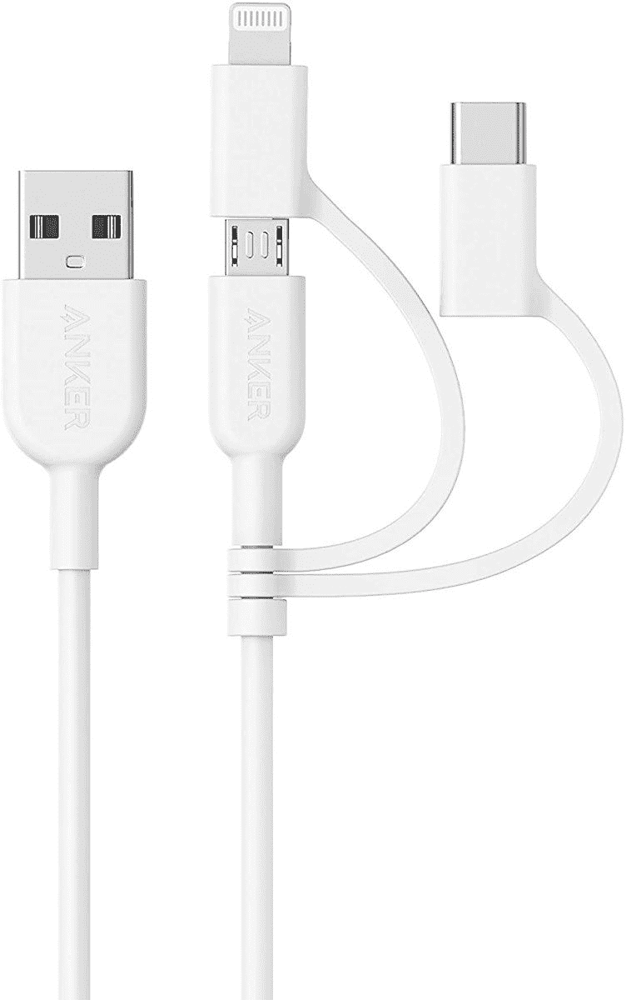</picture> 

Anker Powerline II AK-848061062830

##### Anker 电力线 II AK-848061062830

Anker Powerline II 线缆配有三个连接器——micro USB、lightning 和 Type-C——所以你可以根据自己的需要选择一个。它的大小为三英尺，符合 USB 2.0 规范。

 <picture></picture> 

Anker Powerline+

##### 安科 USB-C 到 USBC-C 电缆

Anker Powerline+配有双层编织尼龙外壳，更加耐用。它有 10 英尺长，你可以选择灰色或红色。该电缆支持 USB 2.0 速度。

 <picture></picture> 

Belkin Type-A to Type-C Cable

##### Belkin USB-A 至 USB-C 电缆

Belkin Type-A 至 Type-C 电缆提供 3A 充电，可以 USB 2.0 速度传输数据。它有四英尺长，如果你不追求快速充电或数据传输，这是一个不错的选择。

 <picture>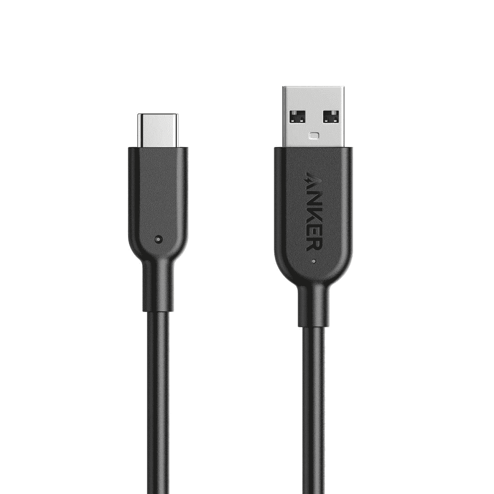</picture> 

Anker Powerline II A8465

##### 安科 USB-C 到 USBC-C 电缆

与 Belkin 电缆一样，这款 Anker Powerline II 电缆也支持 USB SuperSpeed 10Gbps 规格。此外，它能够 3A 充电，并有三英尺长。这种电缆有终身保修。

 <picture></picture> 

Cable Matters Type-A to Type-C Cable

##### 线缆问题 USB-C 转 USB-C 线缆

电缆问题 USB-A 到 USB-C 电缆非常适合数据传输，因为它具有 USB SuperSpeed 10Gbps 的速度。还支持最高 15W 充电。

 <picture></picture> 

Javex Type-C to A Cable

##### Javex USB-C 转 USB-A 电缆

Javex Type-C to A 电缆是一种价格合理的电缆，支持 USB SuperSpeed 10Gbps 规格。如果通过认证，它就是 USB，并且具有耐用的构造。

 <picture></picture> 

Spigen DuraSync 3-in-1

##### Spigen DuraSync 三合一

如果你需要比 Anker 三合一线缆更坚固的东西，这种 Spigen 线缆是一个绝佳的选择。它使用优质尼龙编织来延长其使用寿命，额定承受超过 300，000 次弯曲。该电缆还兼容 QuickCharge 3.0 并通过 MFi(由 iPhone 制成)认证。

 <picture></picture> 

Ugreen Type-C Cable

##### 绿色 USB-C 电缆

Ugreen 有一个稍微不同的方法来解决充电电缆干扰智能手机游戏的问题。该公司提供 A 型到 C 型电缆，在 C 型端有一个 L 型连接器。它也应该有助于保持充电电缆的方式。

## 最佳 USB C 类至 C 类电缆:USB 高速和 USB 超高速 5Gbps、10Gbps

 <picture>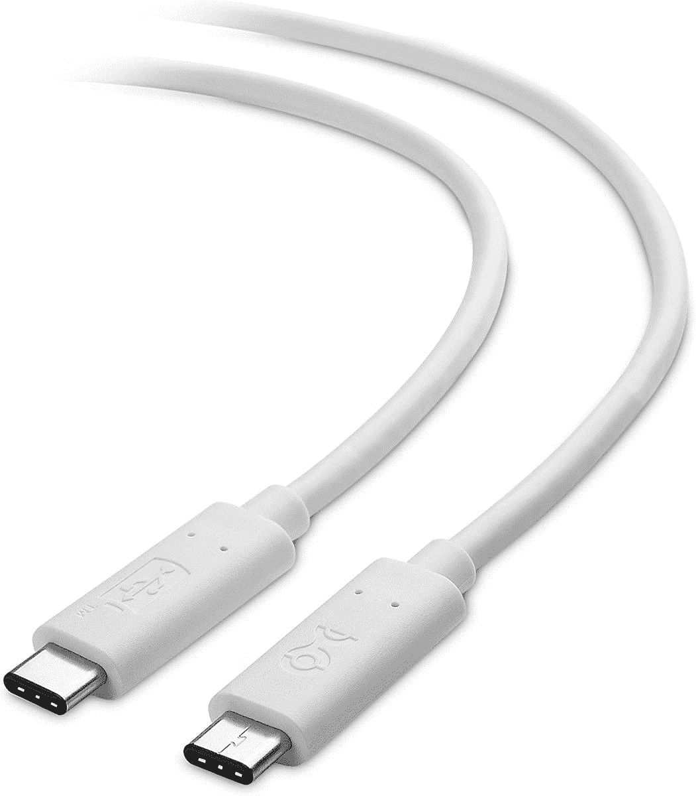</picture> 

Cable Matters Type-C to Type-C cable

##### 线缆问题 USB-C 转 USB-C 线缆

如果你想要一根超快充电的电线，这种电缆很重要。它支持高达 100W 的功率传输，并符合 USB 2.0 规范。该电缆有 3.3 英尺和 6.6 英尺两种尺寸。

 <picture></picture> 

Cable Matters Type-C to Type-C cable

##### 线缆问题 USB-C 转 USB-C 线缆

如果您不需要 100 瓦的高功率 PD，这种支持 60 瓦 PD 的电缆也是一个不错的选择。它支持 USB 2.0 规范，并提供三英尺和六英尺尺寸。

 <picture></picture> 

Satechi Type-C to Type-C cable

##### Satechi USB-C 至 USB-C 电缆

Satechi 电缆是 100W PD 电缆的另一个绝佳选择。它还支持 USB 2.0 规范。此外，电缆是双重编织，以提高耐用性。

 <picture>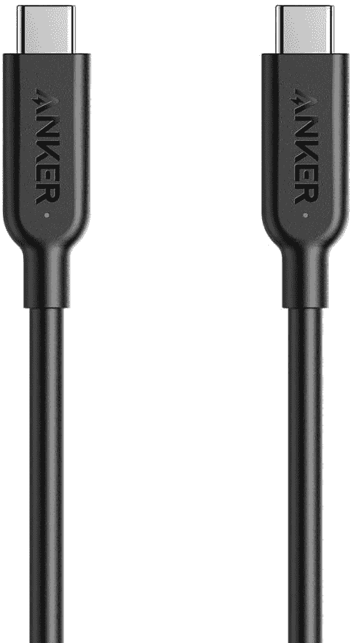</picture> 

Anker Powerline II AK-A8485011

##### 安科 USB-C 到 USBC-C 电缆

这款 Anker Powerline II 电缆支持 100W 充电和超高速 10Gbps 规格。它的长度为 3 英尺，可以与所有带有 Type-C 端口的笔记本电脑和智能手机兼容。

 <picture></picture> 

Cable Matters 10 Gbps Type-C to Type-C Cable

##### 线缆问题 USB-C 转 USB-C 线缆

如果你正在寻找一种可以提供 100W 充电和 10Gbps 数据传输的优秀电缆，这种电缆很重要电缆是一个不错的选择。它价格合理，有白色和黑色两种颜色可供选择。

 <picture>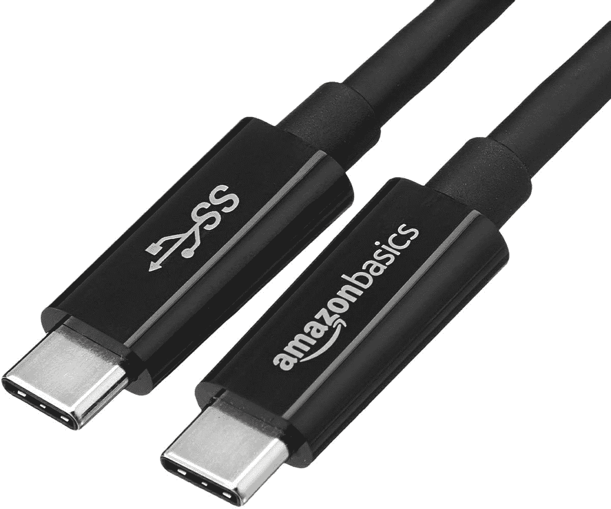</picture> 

AmazonBasics Type-C to Type-C cable

##### 亚马逊基础 USB-C 转 USB-C 线

如果你想要一根更长的 USB Type-C 电缆，并愿意牺牲一点数据传输速度，这种 AmazonBasics 电缆是一个不错的选择。它支持 USB 超高速 5Gbps 规格和高达 3A 的充电。

 <picture>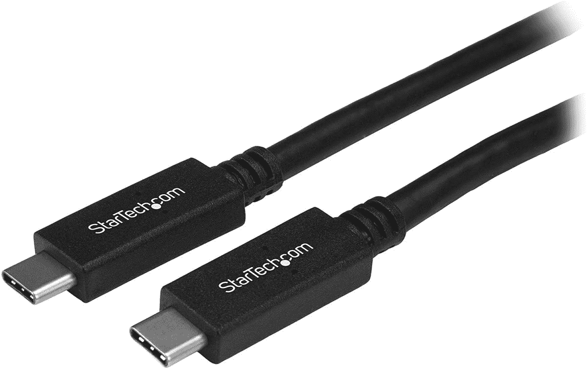</picture> 

StarTech.com Type-C to Type-C cable

##### StarTech.com USB-C 转 USB-C 线

StarTech.com 电缆可以提供高达 60W 的充电功率，并支持 USB SuperSpeed 10Gbps 规格。它有两米大。

 <picture>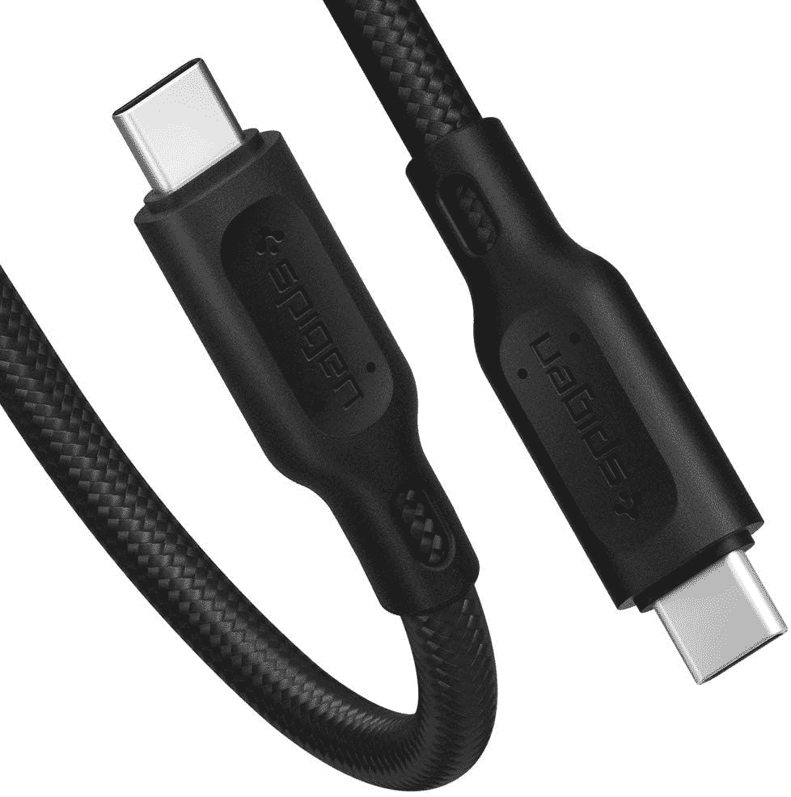</picture> 

Spigen DuraSync

##### Spigen DuraSync USB-C 电缆

Spigen DuraSync USB 电缆采用棉质编织，更加耐用。它配有 USB 2.0 数据传输速度和 60W 功率输出。此外，您还可以获得一个用于线缆管理的线缆带。

 <picture>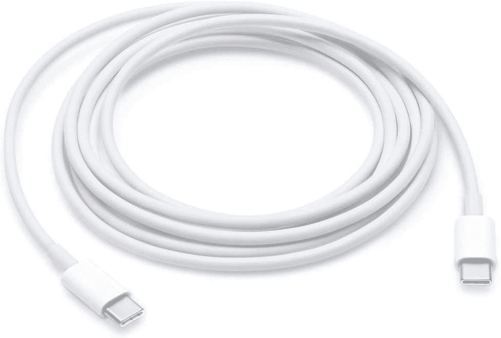</picture> 

Apple USB-C Charge Cable

##### 苹果 USB-C 充电线

苹果官方 USB-C 充电线有一米和两米两种尺寸。此外，它支持 USB 2.0 数据传输速度和高达 96W 的功率输出。

 <picture></picture> 

Apple Thunderbolt 4 Pro cable

##### 苹果雷电 4 Pro 线

苹果新的 Thunderbolt 4 Pro 电缆采用黑色编织设计，缠绕而不缠结。这有两种长度选项，支持高达 40Gb/s 的雷电 3、Thunderbolt 4 和 USB 4 数据传输，还支持高达 100W 的功率传输。

 <picture>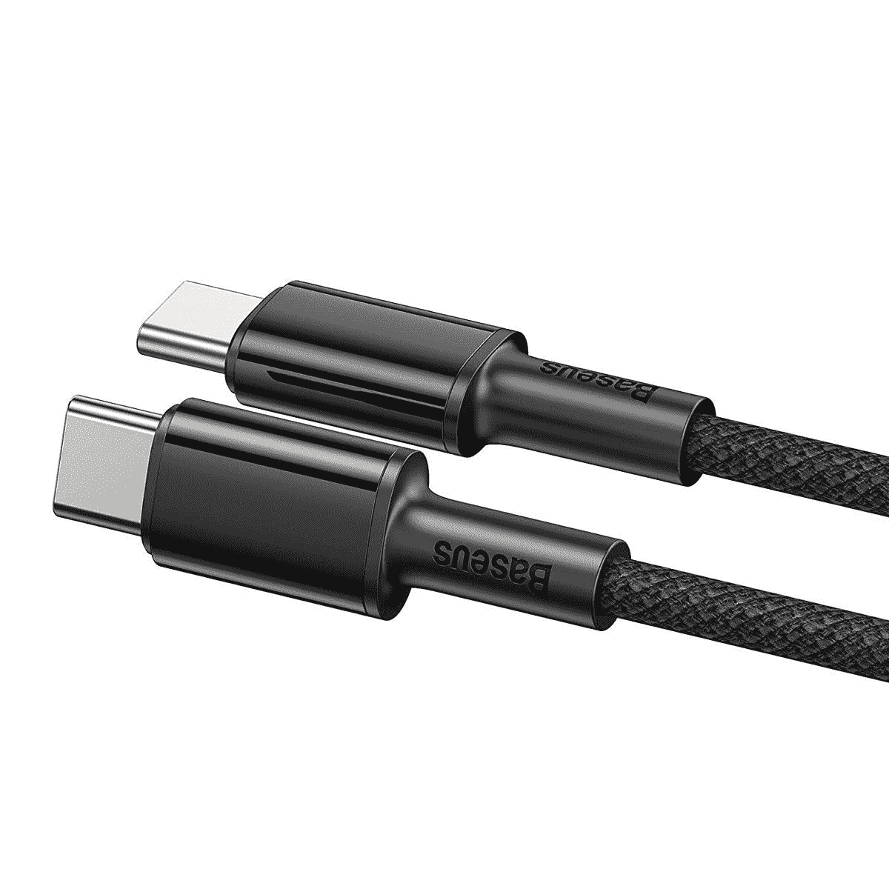</picture> 

Baseus USB C Cable

##### Baseus USB-C 转 USB-C 电缆

Baseus 的这款经济实惠的 USB Type-C 至 Type-C 电缆支持高达 100W 的功率传输，并能够实现 USB 2.0 数据传输速度。此外，电缆是尼龙编织的，以提高耐用性。

 <picture></picture> 

Ugreen 60W fast charge cable

##### Ugreen 60W 快充线

有些情况下，L 形或直角连接器比传统的直线连接器更有意义。对于这些情况，Ugreen 提供了这种 USB Type-C 到 Type-C 电缆，一端是直角连接器，另一端是直连接器。

 <picture>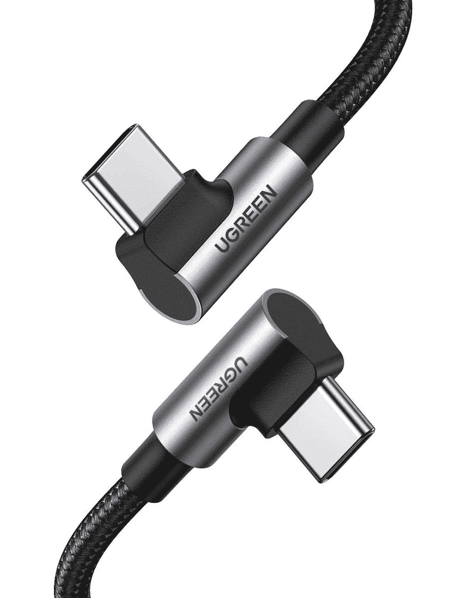</picture> 

Ugreen 100W USB PD cable

##### u 绿色 100W USB-C PD 电缆

如果您正在寻找 C 型到 C 型电缆两端的直角连接器，这款 Ugreen 产品是一个绝佳的选择。它支持高达 100 瓦的功率传输和 USB 2.0 数据传输速度。电缆也有尼龙编织。

 <picture>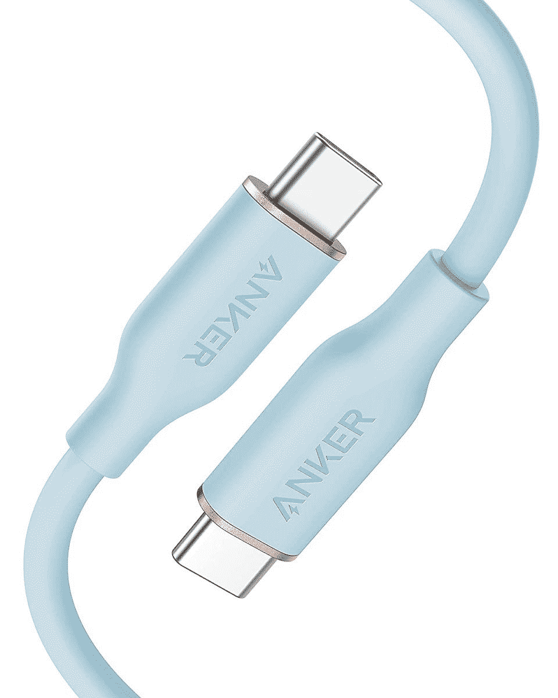</picture> 

Anker Powerline III Flow

##### 安科 USB-C 到 USBC-C 电缆

Anker 以制造出色的电缆而闻名，Powerline III Flow 也不例外。如果你厌倦了普通的黑色或白色 USB Type-C 电缆，它有七种令人兴奋的颜色。您也可以购买三英尺或六英尺大小的电缆。

这些是市场上最好的 USB 电缆。你可以根据你的需求和预算选择一个。请务必检查电缆充电能力和数据传输速度。如果你想要一个很好的 USB A 型到 C 型电缆，Belkin Mixit DuraTek 是一个很好的选择，而如果你正在寻找一个 C 型到 C 型电缆，Satechi Type-C 到 Type-C 电缆是很好的。Anker 和 Cable Matters 也有一些不错的选择。

你打算买哪种 USB 线？请在评论区告诉我们。同时，如果你正在为你的手机或笔记本电脑寻找一个快速充电器，我们已经选择了市场上最好的 USB PD 快速充电器。