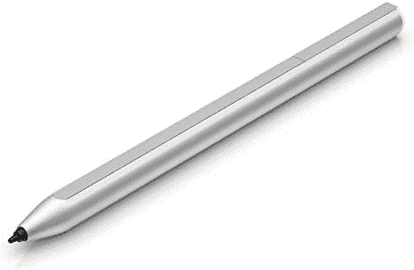
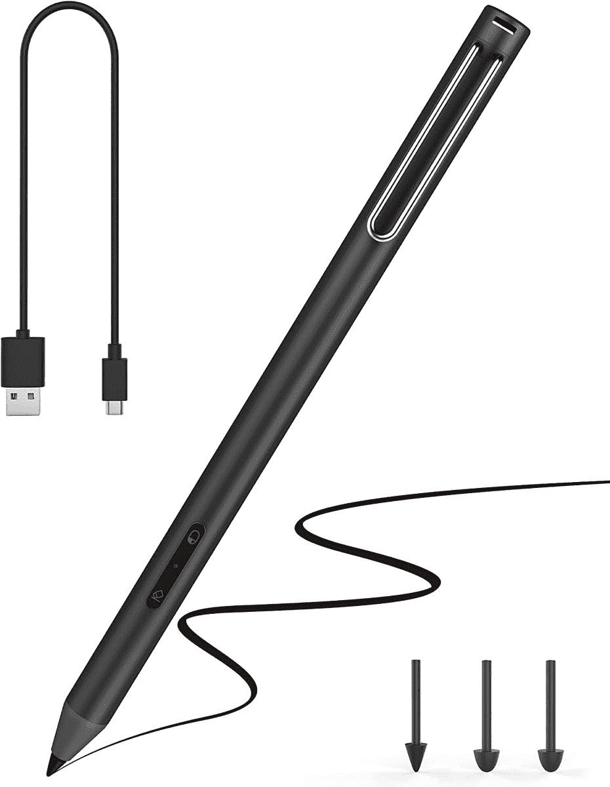
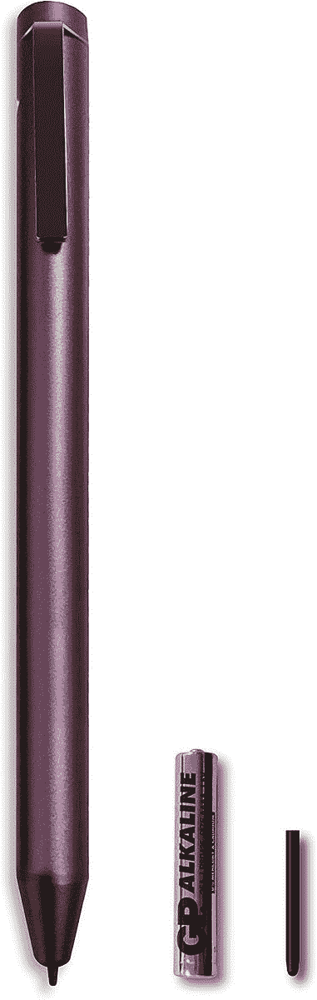
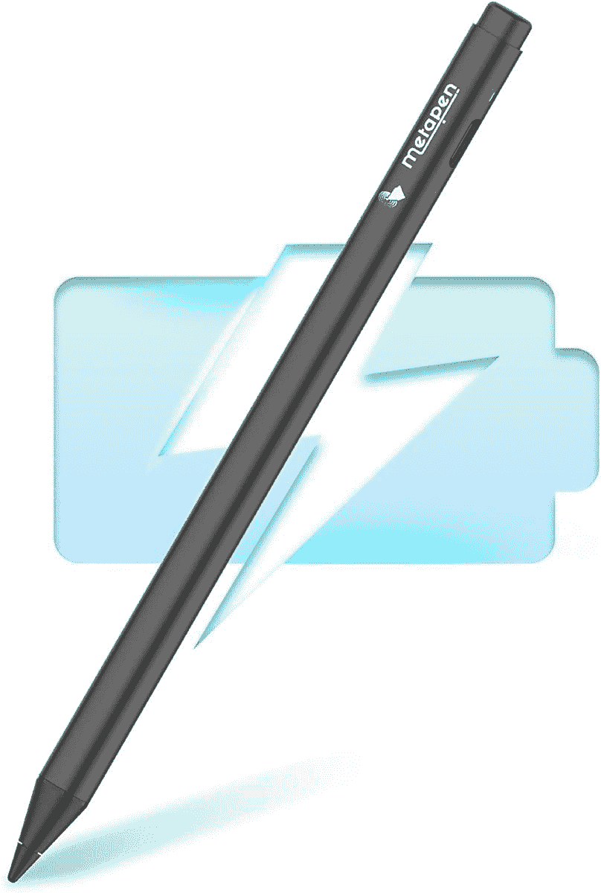

# 2023 年笔记本电脑、Chromebooks 和平板电脑最佳 USI 笔

> 原文：<https://www.xda-developers.com/best-usi-pens/>

# 2023 年笔记本电脑、Chromebooks 和平板电脑最佳 USI 笔

在这篇文章中，我们来看看适用于笔记本电脑、Chromebooks 和其他触摸设备的最佳通用手写笔倡议(USI)笔。

通用手写笔倡议(USI)定义了主动手写笔和[触控设备](https://www.xda-developers.com/best-chromebooks-touchscreens/)之间互操作通信的行业标准，例如电话、[平板电脑](https://www.xda-developers.com/best-chrome-os-tablets/)以及计算和娱乐平台。用 USI 手写笔书写通常比电容式手写笔更好。

到目前为止，市场上有相当多的实心 USI 笔，但它们比老派的电容式触控笔要贵一些。在这篇文章中，我们将为你的笔记本电脑、Chromebook 或平板电脑寻找最好的 USI 笔[。各种价位的都有，所以我们都有。看看我们下面的选择。](https://www.xda-developers.com/best-laptops/)

*   <picture></picture>

    惠普 USI 手写笔

    ##### 惠普无线充电 USI 笔

    很多 USI 手写笔的主要缺点就是处理电池的烦恼。幸运的是，惠普有一支可以通过 USB-C 充电的 USI 笔。这支笔的电池寿命也很长，一般使用时间平均超过 2 周。

*   <picture></picture>

    联想 USI 笔

    ##### 联想 USI 笔

    联想的 USI 手写笔做工精良，拿在手中手感很好。虽然它不像惠普那样容易供电，但在需要更换之前，它应该可以用一块电池维持几个月。它配有一个笔夹，可以帮助您将手写笔固定在背包中

*   <picture></picture>

    MESO USI 手写笔

    ##### MESO USI 手写笔

    MEKO 的这款 USI 手写笔带有三种不同的笔尖，适用于各种类型的绘图情况。也可以通过 USB-C 充电

*   <picture></picture>

    伊卢梅 USI 手写笔

    ##### 伊卢梅 USI 手写笔

    这是亚马逊上最便宜的 USI 笔之一。它与其他 USI 笔具有相同的压力敏感度，并配有可更换的电池，因此您不必担心充电问题。

*   <picture></picture>

    meta Pen USI 手写笔

    ##### meta Pen USI 手写笔

    这是最舒适的 USI 笔之一。它有一个圆锥形的顶端，不是管状的。它还具有防侧倾设计，超级容易抓握。

这些是我们为你的笔记本电脑、 [Chromebook](https://www.xda-developers.com/best-chromebooks/) 或平板电脑挑选的最佳 USI 笔。总的来说，USI 钢笔仍然是相当新的，但我们尽最大努力在亚马逊上找到最好的选择。如果我们错过了，请在评论中告诉我们。