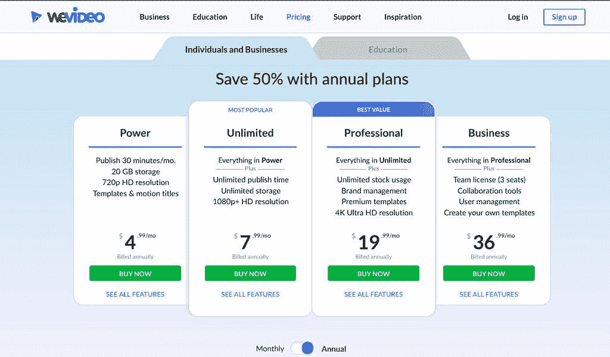
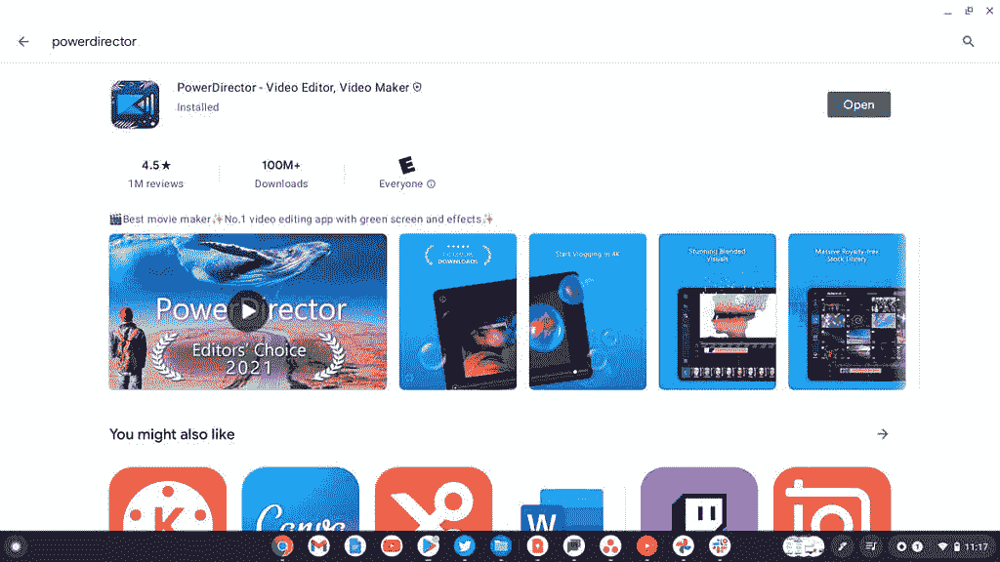

# Chromebook 最佳视频编辑器

> 原文：<https://www.xda-developers.com/best-video-editors-chromebook/>

当你想到 Chromebooks 时，创意专业人士不是第一个想到的人群。从一开始，ChromeOS 就因缺乏生产力应用程序而声名狼藉。好消息是，ChromeOS 自问世以来已经走过了漫长的道路。

现在，你可以通过多种方式在 Chromebook 上进行轻度视频编辑。Android 应用程序和 web 应用程序都能很好地进行快速编辑。如果你想变得更严肃，你也可以利用 Linux 应用来完成更严肃的工作。让我们来看看 Chromebook 上最好的视频编辑解决方案。

## 作为视频编辑器的网络应用

对于大多数用户来说，网络应用是你在 Chromebook 上编辑视频的最佳选择。可以肯定的是，大多数用户希望对个人视频进行一些快速编辑。在 Chrome 操作系统上，网络应用提供了一个简单的方法来做到这一点。网络应用可能是最简单的，完全存在于 Chrome 浏览器中。

### 微软 Clipchamp

最近，一个新的基于云和网络的视频编辑器出现了，它属于微软。[clipcamp](https://clipchamp.com/en/pricing/)是 2022 年 Chromebook 上使用的最好的免费网络视频编辑器之一。基本层具有无限制的无水印导出，以及高达 1080p 的导出，以及免费的音频、图像和视频库。如果你每月花 12 美元升级，你会得到更多的优质过滤器、内容备份、品牌套件和其他额外功能。

但总的来说，Clipchamp 有基本的模板和控制，如修剪视频，加速视频，添加低三分之一，动画等等。最重要的是，它是免费的，易于使用，有很多很棒的屏幕教程。你可以使用微软账户、谷歌账户或其他电子邮件服务来使用 Clipchamp。

### WeVideo 网络应用

### 

WeVideo 是基于云的，所以你可以随时随地制作视频——甚至是在旅途中。使用 WeVideo Jumpstart，上传等待时间为零，这意味着您可以按照灵感的速度进行创作。没有功能强大的电脑？没问题。无论您使用什么设备，WeVideo 都会为您完成云中的所有繁重工作。

WeVideo 不仅非常适合在 Chromebook 上编辑视频，还可以在 MAC、PC、iOS 和 Android 移动设备上无缝运行。无论你喜欢在电脑、平板电脑还是手机上制作视频，WeVideo 都能让你轻而易举。这些计划也非常实惠，可以享受教育和商业折扣。

### YouTube 工作室视频编辑器

[YouTube Studio](https://studio.youtube.com/) 是谷歌官方应用，用于管理你的 YouTube 频道。此应用程序的主要目的是与您的观众互动，检查视频统计数据，并管理其他频道功能。但是，您也可以在 YouTube Studio web 平台中进行一些基本的编辑。

这当然不是什么新奇的东西，但是你可以在 YouTube Studio 中修剪视频、拼接剪辑和进行基本的音频编辑。如果你是一个崭露头角的小 YouTuber，并且想以一种基本的方式开始编辑视频，这是一个不错的选择。

正在寻找一种支持人工智能的高级替代产品，让您可以在 Chromebook 上轻松编辑视频？看看这个环节的赞助商:Wondershare 的 [**Media.io**](https://www.anrdoezrs.net/links/100122946/type/dlg/sid/UUxdaUeUpU4089/https://www.media.io/?utm_source=other_media_sites&utm_medium=referral&utm_campaign=20230105vcoyjl01&utm_term=xda) **。**

**什么是 Media.io？Media.io 是我们 Wondershare 的朋友提供的一个一体化网络解决方案。与上面的其他在线视频编辑套件类似，Media。IO 是一个基于时间线的视频编辑器，可让您在导出之前操纵片段并对媒体执行各种非破坏性更改。凭借其直观的用户界面和健康的功能集，Media.io 使您可以在旅途中轻松编辑、转换、压缩和共享您的所有媒体文件。**

**media . io 有何不同？Media.io 与众多竞争对手的不同之处在于它包含了许多人工智能工具，可以简化您的编辑工作流程。例如，Media.io 提供了一个强大的[人声去除器](https://www.anrdoezrs.net/links/100122946/type/dlg/sid/UUxdaUeUpU4089/https://www.media.io/online-vocal-remover.html)功能，可以立即从任何歌曲中去除人声，因此您可以为任何视频创建完美的背景轨道。它还可以通过其[声音到文本](https://www.anrdoezrs.net/links/100122946/type/dlg/sid/UUxdaUeUpU4089/https://www.media.io/app/sound-to-text)功能自动转录文本，通过[自动字幕](https://www.anrdoezrs.net/links/100122946/type/dlg/sid/UUxdaUeUpU4089/https://www.media.io/online-auto-subtitle-generator.html)功能创建自动字幕，通过[背景移除器](https://www.anrdoezrs.net/links/100122946/type/dlg/sid/UUxdaUeUpU4089/https://www.media.io/image-background-remover-online.html)移除图像背景，等等。**

**media . io 多少钱？**这是最精彩的部分。Media.io 计划从每月 0 美元开始。是的，没错，你可以上传剪辑，进行编辑，并受益于它的所有人工智能功能，而无需花费一分钱。也就是说，免费计划添加了视频水印，并限制了您可以导出的数量，所以如果您想在旅途中做一些严肃的工作，我们建议您查看基本或专业计划。在他们的[定价页面](https://www.anrdoezrs.net/links/100122946/type/dlg/sid/UUxdaUeUpU4089/https://www.media.io/pricing.html)上找到适合你的方案。

*【我们感谢 Media.io 赞助本次会议。]*

## Google 相册应用程序中的视频编辑器

谷歌最近在 ChromeOS 上推出了新版本的照片应用程序，其中包括一个视频编辑器。虽然它不是一个全功能的视频编辑器，但它拥有与家人和朋友快速分享个人视频的基本功能。可以把它想象成一个基本的视频编辑器，用于创建蒙太奇或家庭视频，就像 Windows 11 或 Windows 10 Photos 应用程序中内置的那样。您可以手动控制和选择视频剪辑并排列剪辑，调整这些剪辑的曝光、亮度和对比度，以及应用真实色调滤镜来调整肤色。如果你愿意，你甚至可以添加一个配乐。

你可以在 ChromeOS 的照片应用程序中进入这个新的视频编辑器，方法是在应用程序的侧边栏中进入*实用程序*，然后选择*电影*。将会有一系列视频模板供你选择，这些模板将会从你的 Google 相册账户中提取照片。如果你愿意，你也可以手动添加照片和视频。

## 作为视频编辑器的 Android 应用

ChromeOS 还没有全功能的视频编辑器。这意味着你可以去谷歌 Play 商店看看其他的选择。根据您的 Chromebook 型号，其中一些应用程序将无法工作。可能存在兼容性问题。这就是我们建议使用网络应用程序的原因。当然，你也必须适应使用移动视频编辑器。我们列表中的一些应用并不适合大屏幕、键盘和触摸板。

### PowerDirector 安卓应用

无论您是创建电影风格的电影、最新冒险的视频，还是组合剪辑来分享激动人心的难忘时刻，PowerDirector 都是在 Chromebook 上编辑视频的完美应用。一些专业功能包括:

*   只需轻轻一点，即可修剪、拼接和旋转视频。
*   精确控制亮度、色彩和饱和度。
*   通过拖放应用令人瞠目结舌的效果和过渡。
*   使用多时间轴将图片和视频合并到一个剪辑中。
*   在几秒钟内为您的视频添加文本或动画标题。
*   使用内置编辑器添加录制在移动设备上的画外音。

付费订阅有点贵，但对于您获得的功能数量来说，这是值得的。如果你想为不同的社交平台做大量的视频剪辑，这是一个极好的选择。

### Kinemaster

KineMaster 让你的手机、平板电脑或 Chromebook 上的视频编辑变得有趣。该软件通过许多强大的工具、可下载的内容等等，使得编辑视频变得很容易。一些关键特性包括:

*   从“获取项目”菜单下载并重新编辑项目(新！)
*   导入和导出项目文件(新！)
*   剪切、拼接和裁剪视频的工具。
*   组合和编辑视频、图像、贴纸、特效、文本等。
*   添加音乐、画外音、音效和变声器。

KineMaster 完全免费使用，但如果订阅 KineMaster Premium，您可以解锁更多内容。订阅可以消除 KineMaster 水印，并提供无广告体验。点击应用程序主屏幕上的皇冠按钮，了解更多信息。

### 马吉斯托

[Magisto 的](https://www.magisto.com/)智能在线视频编辑器是将您的日常视频和照片转变为灵感视频故事的最快方式，也是在任何地方分享它们的最简单方式。实际上这不是*魔法，而是*魔法。如果你对视频编辑一无所知，但需要为工作或业务创建专业视频，这是一个很好的选择。

当你上传视频和图片到 Magisto 时，他们的人工智能引擎开始分析这些片段。他们的算法对你上传的所有视频和照片进行虚拟查看，并在三个层面上进行分析——视觉分析、音频分析和讲故事。

Magisto 同时拥有 web 应用和 Android 应用，所以这是一笔买一送一的交易。web 应用程序和 Android 应用程序在 Chrome OS 上运行得一样好，选择你喜欢的一个。

## Linux 应用程序

如果你需要一个更强大的视频编辑器，Linux 应用程序是最好的选择。目前，我只推荐两个 Linux 应用程序用于 Chrome 操作系统上的视频编辑。Kdenlive 是功能更全的应用程序，但它在 Chrome OS Linux 容器中运行得有点慢。另一方面，Shotcut 缺少一些关键功能，但在我的 Chromebook 上运行非常流畅。

安装 Linux 应用程序需要一些命令行知识。如果你不熟悉在 Linux 上使用终端命令，先看看我们的完全指南[Chrome OS 上的 Linux 应用](https://www.xda-developers.com/linux-apps-chrome-os/)。

### Kdenlive

如今视频剪辑是一件大事。每小时有数百万人上传视频到 YouTube、Twitch 和 Tiktok。如果你对视频编辑很认真，迁移到 Chrome 操作系统可能会有点可怕。谢天谢地，Kdenlive 是一个不错的 Linux 视频编辑程序，可以在你的 Chromebook 上运行。

那些习惯运行 Final Cut Pro 或 Adobe Premiere Pro 的人将很快学会直观的界面。值得注意的是，虽然 Kdenlive 在 Chrome 操作系统上运行良好，但你需要一个相当强大的 Chromebook 来充分利用这个应用程序。

**下载使用:**

`sudo apt-get install kdenlive -y`

### 快照剪辑

Shotcut 在 Chrome 操作系统上运行得非常流畅，并且包含了许多功能。该软件有多个可停靠和不可停靠的面板，包括详细的媒体属性、带有搜索的最近文件、带有缩略图视图的播放列表、过滤器面板、历史视图、编码面板、作业队列以及合并的服务器和播放列表。它还支持从文件管理器拖放资产。

Shotcut 的安装比 Kdenlive 稍微复杂一些。最简单的方法是使用[Linux 应用镜像](https://shotcut.org/download/)。接下来，打开终端并运行命令:

```
 chmod +x ./shotcut-linux-x86_64-210321.AppImage 
```

后面跟着命令:

```
 ./shotcut-linux-x86_64-210321.AppImage 
```

这里需要替换' shotcut-linux-x86_64-210321。“AppImage”与您下载的最新版本的当前文件名。这个过程基本上使 AppImage 成为可执行文件，然后运行可执行文件。总的来说，Shotcut 是我最喜欢的在 Chrome OS 上进行更密集视频编辑的应用程序。

这些是我们为 Chromebooks 挑选的最佳视频编辑器。谷歌[开玩笑说](https://luma-touch.com/lumafusion-on-android/)它正在努力将基于 Android 的视频编辑器 LumaFusion 移植到 ChromeOS 上，但这仍在进行中。发布后，它将成为在 Chromebook 上编辑视频的首选方式，但现在，你必须满足于我们列表中的一些应用和服务。