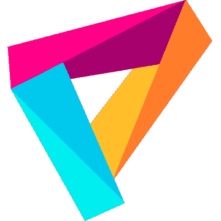

# 2023 年加拿大最佳 VPN

> 原文：<https://www.xda-developers.com/best-vpn-for-canada/>

VPN 是非常通用的工具，可以帮助您保护您的在线隐私，提供对受地理限制的内容的访问，并保护您的数据免受不安全网络上的黑客的攻击。因此，如果你正在寻找一个好的 VPN 供个人使用，这篇文章将谈论一些对加拿大用户最好的 VPN。对于其他地区，请查看我们关于[最佳总体 VPN](https://www.xda-developers.com/best-vpn/)的专门文章。

**导航本指南:**

下面提到的所有美元价格都是美元，不是加元。

## 加拿大最佳虚拟专用网:ExpressVPN

ExpressVPN 是目前最流行的 VPN 服务之一。这不仅对加拿大，而且对世界各地的每个人都是一个极好的 VPN。它速度很快，可以让你访问 94 个国家的服务器。当您只需要保护您的在线隐私和数据，并且不想规避任何地理限制或封锁时，加拿大的四台 ExpressVPN 服务器将会很有帮助。

ExpressVPN 计划每月 12.95 美元起，但长期计划可以获得折扣价格。它还接受多种支付方式，包括比特币。在 VPN 功能中，VPN 服务不保留任何连接或活动日志，为大多数平台提供应用程序，支持隧道分割，并包括一个 kill switch。

 <picture></picture> 

ExpressVPN

##### ExpressVPN

如果你正在寻找一个好的整体 VPN，没有比 ExpressVPN 看得更远。它提供了许多伟大的功能，卓越的性能，一个大型的全球服务器网络，访问顶级流媒体网站，等等。

### 也很棒:隧道熊

对于加拿大用户来说，TunnelBear 是另一个优秀的 VPN。它的服务器网络不像 ExpressVPN 那样庞大，但是你仍然可以在 41 个国家使用 VPN。该服务不保留任何活动日志，包括一个 kill switch，提供隧道分割支持，并有适用于所有主要平台的应用程序。TunnelBear 的一个亮点是它的免费试用，给你 500MB 的带宽，让你在购买之前查看他们的服务。这比其他 VPN 提供的 30 天退款保证要好得多。

TunnelBear 计划的起价为每月 9.99 美元，但你可以在年度和三年计划中获得显著折扣。但是支付方式有限，目前只能在加拿大用卡。该服务还列出了比特币，但我们检查时它还不可用。

 <picture></picture> 

TunnelBear

##### 隧道熊

TunnelBear 是一个很棒的 VPN 服务，有很多服务器位置、免费试用计划和良好的隐私记录。

### 同样重要的是:完美的隐私

完美隐私是较昂贵的 VPN 服务之一，因为它不能为长期计划提供明显的折扣。尽管如此，其整体良好的服务和隐私保护使其成为加拿大最好的 VPN 选择之一。完美隐私不保留任何活动日志，包括一个终止开关，分裂隧道支持，并有 Windows，Android 和 macOS 的应用程序。

该服务在 25 个国家提供 VPN 位置，这是稍微低端，但大多数人应该不会有任何问题。完美的隐私计划每月起价 12.99 美元，长期计划还可以打折。此外，还有几种支付模式可供选择，包括比特币。

 <picture></picture> 

Perfect Privacy

##### 完美的隐私

完美隐私是一个伟大的 VPN 服务，不保留任何活动日志，并在 25 个国家有服务器。

## 最佳隐私保护:Mullvad

如果你主要关心你的隐私，Mullvad 是一个很好的 VPN。它的隐私保护已经过审计，不会收集活动日志。该服务还支持现金支付方式，因此你可以保持匿名。此外，您不需要向 Mullvad 提供您的电子邮件地址、电话号码或其他个人信息来使用该服务。相反，它会为您生成一个用于登录服务的帐号。

服务速度很快，在 38 个国家都有 VPN 站点。你还会得到一个 kill switch，开源应用，分裂隧道，以及所有主流平台的应用。Mullvad 每月收取 5 欧元的固定费用。不幸的是，长期计划没有折扣。

 <picture></picture> 

Mullvad

##### 穆尔瓦德

Mullvad 是一个值得信赖的，快速的，易于使用的 VPN。它还带有许多服务器位置。

## 最佳预算 VPN: CyberGhost

CyberGhost 的长期计划是最受欢迎的 VPN 服务之一。在这项服务的两年计划中，你每月只需支付 2.25 美元。此外，该服务经常进行促销，作为两年计划的一部分，除了疯狂的折扣价格外，还可以获得额外几个月的免费服务。除了低廉的价格，您还可以获得长期计划的 45 天退款保证。

这项服务在 91 个国家设有 VPN 站点，并且不保留任何活动日志。此外，您还可以获得一个 kill switch，包括智能电视在内的所有主要平台的应用程序，以及对隧道分割的支持。它支持卡、PayPal 和比特币作为加拿大用户的支付模式。

 <picture></picture> 

CyberGhost

##### 网络幽灵

CyberGhost 是一个很好的预算 VPN，在 90 多个国家有服务器。它还为许多设备提供应用程序。

## 最佳免费 VPN: ProtonVPN

如果你正在加拿大寻找免费的 VPN 服务，ProtonVPN 的免费计划是你最好的选择。它让你可以访问 3 个国家的 23 台服务器——日本、荷兰和美国。然而，你一次只能有一个 VPN 连接，你的速度会稍微受到限制，因为该服务将优先考虑付费用户。

即使在免费计划中，ProtonVPN 也关心您的隐私，不会保留任何活动日志。他们给你无限的带宽，所以如果你有有限的 VPN 使用，你甚至不需要订阅付费计划。也就是说，付费计划有更多的功能，你可以获得更快的数据传输速度。

如果你不介意每月 10GB 的带宽，WindScribe 的免费计划也是免费 VPN 的一个好选择。你将获得比 ProtonVPN 更快的速度，无限的连接，并访问 10 个国家的服务器。

 <picture></picture> 

ProtonVPN

##### 质子 VPN

ProtonVPN 的免费计划具有无限的带宽，并提供对三个 VPN 位置的访问。

* * *

这些是加拿大用户最好的 VPN。如上所述，ExpressVPN 对大多数人来说是最好的 VPN，但如果你正在寻找一个最注重隐私的 VPN，Mullvad 是最好的选择。如果你想访问某个特定国家的内容，在开始之前一定要检查你选择的 VPN 在那个国家是否有服务器。

你在加拿大用哪个 VPN？你认为我们错过了一个好的选择吗？请在评论区告诉我们。