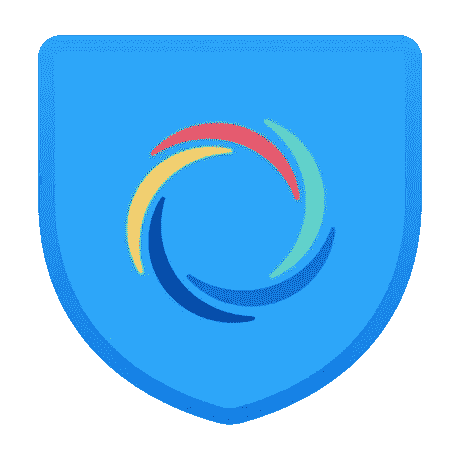
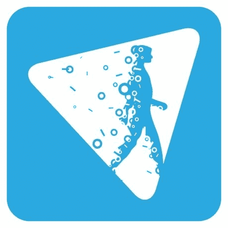

# 2023 年最佳 Mac VPN 应用

> 原文：<https://www.xda-developers.com/best-vpn-mac/>

苹果在 2021 年末的“Unleashed”虚拟活动中展示了功能强大的苹果电脑。如果你已经购买了 [MacBook Pro 2021](https://www.xda-developers.com/apple-macbook-pro-2021-m1-max-review/) ，重要的是[使用外壳](https://www.xda-developers.com/best-macbook-pro-cases/)保护它。这是为了避免潜在的损害，并使其持续更长时间。然而，不管你的 Mac 型号是什么，VPN 应用程序都会保护你的数字身份和指纹。使用虚拟专用网络时，跟踪和分析你变得更加困难。此外，您可以访问被区域性阻止的网站。以下是适用于您的 Mac 的最佳 VPN 应用列表。

## 适用于 Mac 的最佳 VPN 应用

### 热点屏蔽

Hotspot Shield 是我常用的 VPN Mac 应用程序。它免费提供基本的保护和功能。你可以选择订阅一个高级计划来解锁所有功能，但这个应用程序即使没有帐户也可以正常工作。该套餐包括访问 1 密码、服务器区域选择、数字身份保护和其他优惠。

这项免费计划不需要注册，速度限制为 2mbps。所以你可以依靠它进行基本的浏览和小的下载，但是如果你打算广泛地使用互联网，它可能会成为一个烦恼。就我个人而言，我经常用它来访问被屏蔽的网站。否则，我就不管它了。

有些人喜欢让 VPN 一直开着。如果你是这种情况，要么订阅他们的付费计划，要么考虑使用另一个没有速度限制的 VPN 应用程序——但这些很难实现。付费服务的另一个好处是获得专用的流媒体服务器，当从某些来源播放流媒体时，它比普通的服务器更快。

 <picture></picture> 

Hotspot Shield

##### 热点屏蔽

Hotspot Shield 提供了一个免费的、易于使用的 VPN 服务，只需点击一个按钮即可切换。

### 质子 VPN

ProtonVPN 是一项基于瑞士的服务，可以提供很多服务。有四种不同的计划可供选择，包括一种免费计划。

免费计划提供:

*   3 个国家的 23 台服务器
*   1 个 VPN 连接
*   中速
*   严格的无日志策略
*   访问被阻止的内容

这一富有远见的计划是四个计划中最贵的，定价为每月 24 美元，提供:

*   61 个国家的 1300 多台服务器
*   10 个 VPN 连接
*   最高速度(高达 10 Gbps)
*   严格的无日志策略
*   访问被阻止的内容
*   P2P/BitTorrent 支持
*   广告拦截器(网盾)
*   流媒体服务支持
*   安全核心 VPN
*   虚拟专用网上的 Tor
*   ProtonMail 愿景客户

所以不管你的需求和预算如何，你都会找到适合你的计划。另外两个计划的价格分别为每月 4 美元和 5.99 美元，而且还包括一些与其价格相符的额外津贴。

这项 VPN 服务提供了安全的核心服务，保护您的 IP 地址的 kill switch，DNS 泄漏预防，可以将连接速度提高 400%的 VPN 加速器，并且不会留下任何痕迹。这是一个非常棒的应用程序，即使你不打算为此付费。其他平台也支持该应用程序，因此您可以从所有设备上访问您的订阅。

 <picture></picture> 

ProtonVPN

##### 质子 VPN

ProtonVPN 提供四种计划，包括一种免费计划，可以满足不同的预算和需求。它位于瑞士，提供先进的安全和隐私功能，以帮助保护您的在线身份。

### NordVPN

NordVPN 是另一款适合你的 Mac 电脑的虚拟专用网应用。与 Hotspot Shield 和 ProtonVPN 不同，这项服务需要付费订阅才能工作。如果你注册按年计费，费用是 83.99 美元，或者每个月 11.99 美元。这项服务在 60 个国家提供超过 5000 个不同的服务器，所以你有足够的虚拟区域来传送。

启用此应用程序非常简单，只需点击一个按钮。您的流量使用 IKEv2/IPsec 协议加密，不会留下任何日志或痕迹，并且对您的带宽没有限制。虽然这项服务提供了可靠的功能和保护，但它并不是最好的。如果我个人必须为 VPN 服务付费，我可能会选择 ProtonVPN。他们以更低的价格提供更多的功能。

##### NordVPN

NordVPN 是一种只需订购的 VPN 服务，在 60 个国家提供 5，000 多种不同的服务器。它可以在所有主要平台上使用，一个帐户下最多可以连接 6 个设备。

### hide.me VPN

hide.me VPN 应用程序提供免费计划，因此您无需支付一分钱即可保护您的数字身份。它声称是最快的虚拟专用网，但我们还没有证实这一点。如果你不确定整个 VPN 是如何工作的，这个应用程序是为你准备的。它很容易建立，不需要先进的技术知识。

这项服务通过隧道将您的连接传输到多个虚拟位置，因此您的数字身份更加隐私和安全。它还会自动为您选择速度最快、性能最好的服务器。您获得的新 IP 地址正被多人使用，因此您的在线活动不会被链接回您。

hide.me VPN 可用于大多数流行的平台，包括 macOS、iPadOS 和 iOS。所以你可以在你的 Mac 和其他设备上使用它。

 <picture></picture> 

hide.me VPN

##### 隐藏我

hide.me VPN 是一项免费的 VPN 服务，可选择付费订阅。它对不同的用户使用多个虚拟位置和相同的 IP 地址，以确保对你进行剖析尽可能困难。

### Betternet VPN

Betternet VPN 是另一项免费服务，可选择付费订阅。这个应用程序不需要你注册，所以你只需安装并开始使用。如果广告让你烦恼，你想解锁更多的虚拟位置，或者你想没有速度限制，你可以在美国每月支付 11.99 美元或每年 35.99 美元，以充分利用它。订阅后，您最多可以链接 5 台设备。

这款应用可以在 macOS、iOS、iPadOS、Android、Chrome(作为扩展)和 Windows 上使用。因此，无论您使用什么设备，您都可以从所有设备上访问这个应用程序。因此，无论您是想保护您在公共网络上的 web surfacing 活动，还是访问被地区屏蔽的网站，或者只是让页面和追踪者更难对您进行描述，hide.me 都可以免费提供可靠的服务。

 <picture></picture> 

Betternet VPN

##### Betternet VPN

Betternet VPN 是一项免费的 VPN 服务，可选择付费订阅。它的每月订阅允许你免费使用它，消除速度限制，并获得优先客户支持。

* * *

就我个人而言，我使用[热点屏蔽](https://apps.apple.com/us/app/hotspotshield-vpn-wifi-proxy/id771076721)(免费计划)来满足我偶尔的 VPN 需求。不过，如果我决定为此积极使用某个应用或服务，我很可能会订阅某个 [ProtonVPN](https://protonvpn.com/pricing) 的付费计划。我认为它们相对低廉的价格提供了最大的价值。使用 VPN 很重要，尤其是如果您经常在公共场所工作，如网吧。因此，请确保您的数据和数字身份的私密性和安全性。

*你最常用的 VPN 应用程序是哪个，你会付费订阅吗？请在下面的评论区告诉我们。*