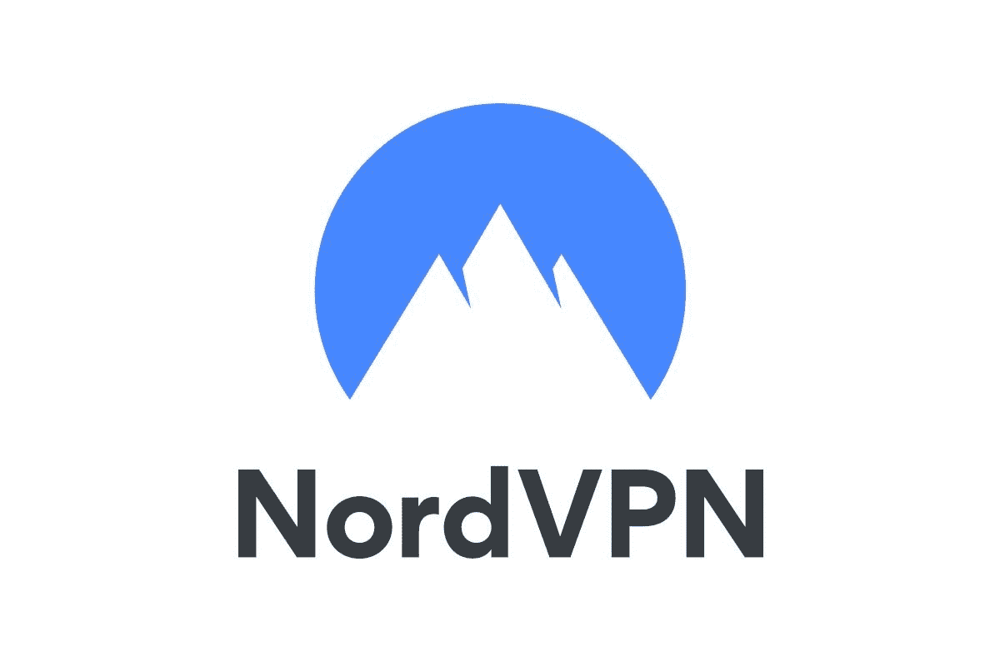
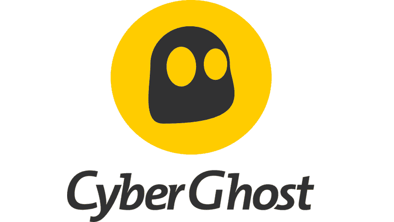
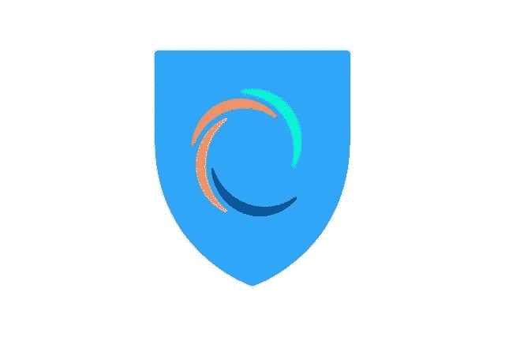

# 这些是在线流媒体内容的最佳 VPN

> 原文：<https://www.xda-developers.com/best-vpns-for-streaming/>

为了在封锁期间保持忙碌，你可能会花很多空闲时间在网飞等流媒体平台上疯狂观看电视节目和电影，了解 HBO Max 和 Peacock 的所有精彩内容，或者沉迷于富波电视或 YouTube 电视的直播世界。虽然现代流媒体网站的目录中有成千上万的电视节目和电影，但总有一些你真正想看的东西在你所在的地区没有。

你可能没有意识到的是，有一个快速简单的解决方案可以解决这个恼人的问题——下载一个 VPN(虚拟专用网)应用程序。有了这些服务之一，你就可以绕过地理限制，观看通常因地理位置而无法观看的流媒体内容。

VPN 应用还可以通过防止影响整体性能的问题来改变流媒体体验，带宽限制和拒绝服务攻击就是明显的例子。但是，哪种 VPN 服务最适合流媒体？市场上肯定有很多，我们在这篇文章中列出了我们最喜欢的。

**浏览这篇文章:**

## 最佳整体流媒体 VPN:express VPN

这家总部位于英属维尔京群岛的公司不仅是 2021 年最佳的整体 VPN 服务，也是全球解除电视流媒体服务和内容封锁的顶级提供商。

因为 [ExpressVPN](http://xda.tv/ExpressVPN) 在 94 个国家提供 3000 多台高速服务器，通过这项服务访问受地理限制的流媒体平台和内容非常容易。它能够解禁网飞、亚马逊 Prime Video、BBC iPlayer、Disney Plus、Youtube 和许多其他流媒体网站。

通过适用于 Android、iOS、Windows、Mac、Linux 和其他操作系统的应用程序，ExpressVPN 将允许您在家中的每台设备上播放电视节目和电影。你还会发现它的应用程序非常容易使用，尤其是你只需轻轻一点就可以快速连接到最快的服务器。但可悲的是，ExpressVPN 只能同时在五台设备上运行。

由于无限制的带宽，当连接到 ExpressVPN 的全球服务器之一时，您将永远不会体验到缓慢的流速度。它还具有 IP 地址屏蔽、网络切断开关、专用 DNS、AES-256 加密、严格的无日志记录策略、内置速度测试、VPN 分割隧道、可信服务器技术、操作指南、24/7 客户支持等功能。

 <picture></picture> 

ExpressVPN

##### ExpressVPN

由于其高速服务器、与顶级流媒体网站的兼容性、多平台应用程序和出色的功能，ExpressVPN 是流媒体的最佳服务。

## 最物有所值的流 VPN

寻找一个伟大的流 VPN，也提供了物超所值？为你提供服务的是 Surfshark，它每月收费不到 3 美元。

[Surfshark](http://xda.tv/SurfSharkVPN) 由 65 个国家的 3200 多台高速服务器组成，这意味着您可以在全球各地轻松访问流媒体服务。它将与一系列顶级流媒体平台合作，如网飞、迪士尼加、亚马逊 Prime Video、BBC iPlayer、Hulu 等。

但可以说，Surfshark 最大的吸引力在于其无限设备政策。因此，您可以在所有连接的设备上使用 VPN。它支持一系列操作系统，包括 Android、iOS、Windows、Mac 和 Linux。总的来说，Surfshark 应用程序看起来非常棒，非常容易使用。

虽然 Surfshark 是顶级的流媒体 VPN 之一，但它也非常适合其他用例。得益于其恶意软件、网络钓鱼、网络跟踪和广告拦截功能，Surfshark 将为您的设备增加额外的保护。还有一个不记录策略，一个 kill switch，私人 DNS 和泄漏保护，伪装模式，AES-256 加密，无数的安全协议，白名单功能，24/7 支持，等等。

 <picture></picture> 

Surfshark

##### 冲浪者

Surfshark 是一个优秀的流媒体 VPN，因为它提供了数千台高速服务器和无限制的设备策略，但它也是最实惠的提供商。

## 最适合流功能的 VPN:nord VPN

[Nord](https://www.anrdoezrs.net/links/100122946/type/dlg/sid/UUxdaUeUpU4041/https://nordvpn.com/) 是 VPN 领域的另一个大名鼎鼎的公司，如果你想在全球范围内解除对流媒体网站的封锁，你绝对是幸运的，因为它在超过 59 个国家提供超过 5500 台 VPN 服务器。

除了广泛的服务器网络，NordVPN 还提供对大量流媒体服务的访问。其中包括网飞、Hulu、亚马逊 Prime Video、BBC iPlayer、迪士尼 Plus、DAZN 等。同样有用的是，NordVPN 创建了关于如何使用其平台安全访问流媒体服务的有见地的指南。

像其他一流的 VPN 提供商一样，Nord 可以在各种操作系统和设备上运行。您可以在 Android、iOS、Windows、Mac、Linux 和其他平台上下载其易于使用的 VPN 客户端。它的应用程序最好的一点是有一个快速连接按钮，可以自动选择最好的可用服务器。虽然 NordVPN 的六设备策略不是最小的，但它仍然限制了用户。

NordVPN 可能有一些出色的流媒体功能，但基于其安全和隐私功能，它也是最好的 VPN 服务之一。我们是双 VPN 的忠实粉丝，它使用两个 VPN 服务器进行网络流量路由，以及内置的恶意软件和广告拦截器。其他有用的功能包括 kill switch、混淆服务器、VPN 分割隧道、洋葱 VPN、支持 P2P、DNS 泄漏测试、浏览器扩展、强加密等等。

 <picture></picture> 

NordVPN

##### NordVPN

如果你想要一个具有许多其他独特功能的流 VPN，NordVPN 是最好的提供商。它开发了最大的 VPN 服务器网络之一，提供令人印象深刻的速度，与各种流媒体服务配合使用，并提供强大的安全保护。

## 最大的服务器选择:CyberGhost

CyberGhost 在 VPN 服务上提供最大的服务器网络之一，在 89 个国家总共有令人震惊的 6，800 台服务器。自然，这使它成为您所有流媒体需求的真正竞争者。

它提供对各种流行流媒体服务的全球访问，包括网飞、迪士尼加、亚马逊 Prime Video、BBC iPlayer、HBO Max、Hulu、NBC、ESPN 等。由于 CyberGhost 提供的快速服务器速度和无限带宽，您应该可以享受完美的流媒体体验。

CyberGhost 的另一个伟大之处是其全面的 VPN 应用程序，这些应用程序不仅可以在所有主要的移动和计算机操作系统上使用，还可以在智能电视、游戏机和路由器上使用。更重要的是，CyberGhost 可以让你在多达 7 台设备上同时使用它的 VPN 服务。

总的来说，CyberGhost 是一个完善的 VPN 服务。它的主要功能包括 AES-256 加密、DNS 和 IP 泄漏保护、kill switch、OpenVPN、IKEv2、WireGuard 协议选择、严格的无日志记录策略、无限带宽和流量、24/7 支持以及 45 天退款期。

 <picture></picture> 

CyberGhost

##### 网络幽灵

CyberGhost 是流媒体的最佳选择，因为它提供了如此广泛的服务器网络，以及诸如 kill switch、强加密、不同协议、多平台应用程序等功能。

## 最快的流媒体 VPN:热点屏蔽

如果你打算使用 VPN 进行流媒体传输，难以置信的速度是绝对必要的。使 [Hotspot Shield](http://xda.tv/HotspotShieldVPN) 成为最好的流媒体 VPN 之一的是其国际服务器提供的令人印象深刻的性能。

为了提供尽可能快的速度，Hotspot 开发了自己专有的 VPN 协议 Hydra。它专为流和其他带宽密集型活动而设计，速度是其他 VPN 协议的两倍。

Hotspot Shield 还运营着一个由 3200 多台服务器组成的全球网络，覆盖 80 多个国家。他们提供对网飞、亚马逊 Prime Video、Hulu、YouTube、Twitch 和许多其他著名流媒体平台的访问。

您可以在 Android、iOS、Windows、Mac、Linux、智能电视和路由器上下载 Hotspot Shield。您可以使用此 VPN 的设备数量因订阅而异。虽然 Premium 计划支持 5 台设备，但 Premium Family 套餐最多支持 25 台设备。但由于每月 7.99 美元的起价，Hotspot Shield 并不是市场上最便宜的 VPN 服务。

 <picture></picture> 

Hotspot Shield

##### 热点屏蔽

鉴于 Hotspot Shield 在 VPN 服务上提供了一些最快的速度，它是流媒体的绝佳选择。它还提供军用级加密、无限带宽、多平台应用等等。

## 许多人的最佳 VPN:IP vanish

对于任何寻找优秀流媒体 VPN 的人来说， [IPvanish](http://xda.tv/IPVanish) 也值得考虑，因为它在超过 75 个全球位置提供 1，600 台服务器，40，000 个共享 IP 地址，以及无限制的设备策略。

就其流媒体功能而言，IPVanish 将解除对网飞、迪士尼加、YouTube、Kodi、Spotify 和许多其他平台的封锁。然而，在过去，IPVanish 用户无法访问 BBC iPlayer 和亚马逊 Prime Video。

IPVanish 开发了适用于几乎所有操作系统的 VPN 应用，如 Android、iOS、Windows、Mac 和 Linux。由于有一系列设置指南，安装和使用所有这些应用程序也非常容易。

总的来说，IPVanish 拥有你在高端 VPN 服务中需要的一切(以及更多)。这包括无日志策略、高级加密、代理服务器、在不同连接协议之间切换的能力、易于使用的 VPN 应用程序以及全天候客户支持。

 <picture></picture> 

IPVanish

##### IPVanish

IPVanish 提供了您想要的高质量流媒体 VPN 的一切，包括 1，600 台服务器，访问许多最大的流媒体网站，无限制的设备策略等等。

如果你想充分利用流媒体服务，你绝对应该下载一个 VPN 服务。他们擅长绕过地理限制，提高流媒体性能。看完这篇文章，你现在可以看到有很多优秀的流式 VPN 可用。但总的来说，ExpressVPN 是我们最喜欢的流媒体服务，因为它的高速服务器，与顶级流媒体服务的兼容性，易于使用的应用程序等等。