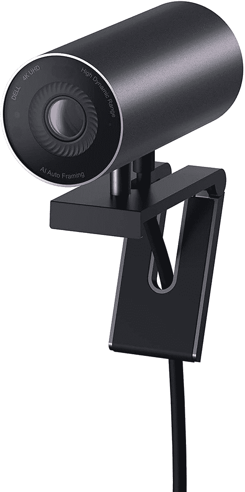
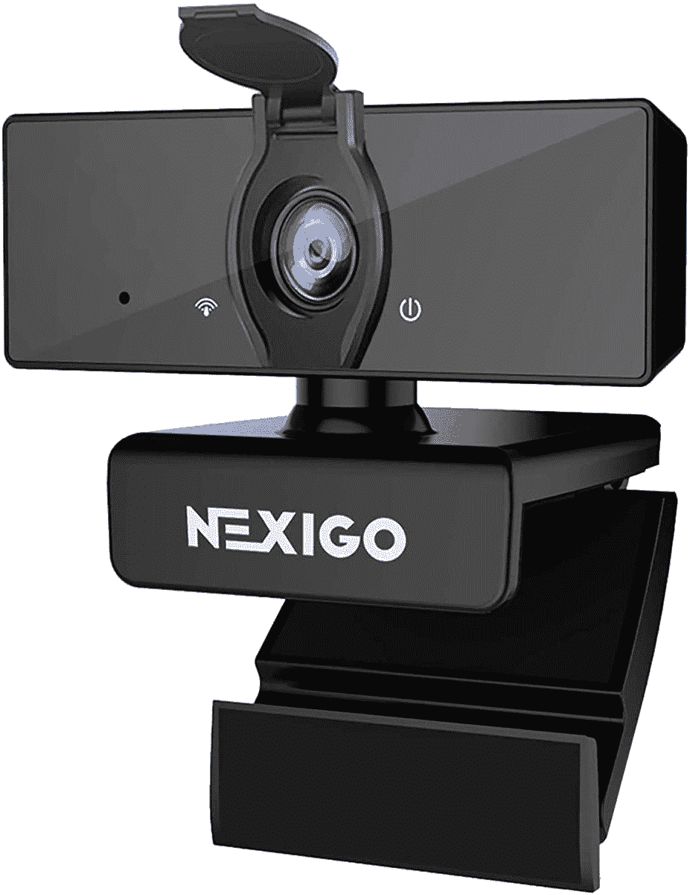
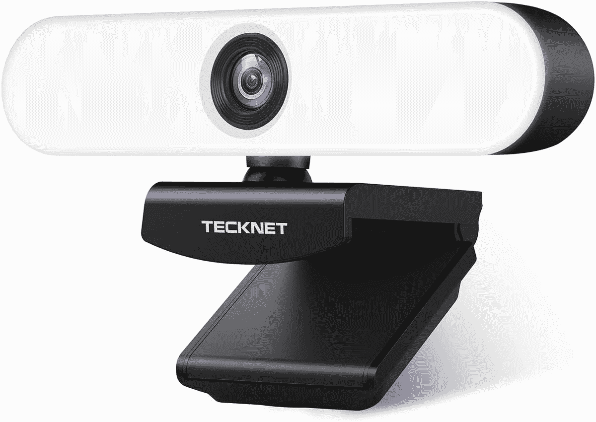

# Mac 工作室的最佳网络摄像头

> 原文：<https://www.xda-developers.com/best-webcams-mac-studio/>

# Mac 工作室的最佳网络摄像头

苹果终于发布了 Mac Studio。这些是你目前能为你的新台式电脑买到的最好的网络摄像头。

苹果一直在慢慢从使用英特尔芯片转向自己的 SoC。如果你买了一台 Mac 电脑，它可能会包含一个 M1 芯片——因为该公司已经过渡到了大部分产品线。为了在 macOS Big Sur 和 [macOS Monterey](https://www.xda-developers.com/macos-monterey) 上提供更好的性能，开发者一直在为苹果芯片优化他们的[应用。这些高效芯片释放出的能力令人着迷，而这仅仅是开始。M1 产品线的最新成员是 M1 超芯片，苹果已经将其纳入全新的](https://www.xda-developers.com/best-apps-apple-silicon/) [Mac Studio](https://www.xda-developers.com/apple-mac-studio-m1-ultra-review/) 。这款设备看起来像两个堆叠的 Mac Minis，是目前最强大的商用台式电脑之一。考虑到 Mac Studio 不是一体机(AiO)，你需要单独购买自己的配件。以下是你目前能为你的新 Mac 工作室买到的最好的网络摄像头。

*   <picture></picture>

    戴尔 UltraSharp 4K 网络摄像头

    ##### 戴尔 UltraSharp 4K 网络摄像头

    这款 4K 网络摄像头非常适合经常参加会议的人。然而，它缺乏 macOS 上宣传的一些功能，如 HDR、FoV 角度调整和其他定制。

*   <picture></picture>

    罗技布里奥 4K 网络摄像头

    ##### 罗技布里奥 4K 专业网络摄像头

    这款来自罗技的网络摄像头支持 4K 视频通话和录制，最高 90fps，三种不同的视野，5 倍数码变焦，HDR 等等。

*   <picture></picture>

    罗技 C615 高清网络摄像头

    ##### 罗技 C615 高清网络摄像头

    这款 1080p 网络摄像头可以 360°旋转。这使您可以在通话过程中转移不同主题的焦点和角度。

*   <picture></picture>

    NexiGo N660 商务网络摄像头

    ##### NexiGo N660 商务网络摄像头

    这款 1080p 网络摄像头具有弱光校正支持、降噪麦克风和隐私保护套。

*   <picture></picture>

    TECKNET 流媒体网络摄像头

    ##### TECKNET 流媒体网络摄像头

    这款 1080p 网络摄像头有三级可调的环形灯，让昏暗环境下的会议更加明亮。

* * *

如果我个人必须为我的新 Mac 工作室购买一个这样的网络摄像头，我绝对会选择罗技 C270 高清网络摄像头。它体积小，价格实惠，而且能完成工作。虽然它的分辨率只有 720p，但它对我来说很好，因为我不太依赖网络摄像头。如果你参加了很多在线会议，或者需要更高的分辨率，那就用我们上面推荐的 1080p 或 4K 摄像头吧。

Mac Studio 重新定义了紧凑型电脑的功能。尽管尺寸很小，但它是目前在售的最强大的商用计算机之一。M1 Max 型号的起价为 1999 美元，而 M1 Ultra 型号的起价为 3999 美元。值得一提的是，这台电脑的目标是专业人士，而不是普通用户。因此，如果你需要一个轻松工作和浏览的设备，Mac Studio 不适合你。

 <picture></picture> 

Apple Mac Studio

##### 苹果 Mac 工作室

Mac Studio 由苹果 M1 Max 或全新的 M1 Ultra 芯片驱动。它只有银色可选，起价 1999 美元。

您打算为 Mac Studio 购买哪些网络摄像头，为什么？请在下面的评论区告诉我们。