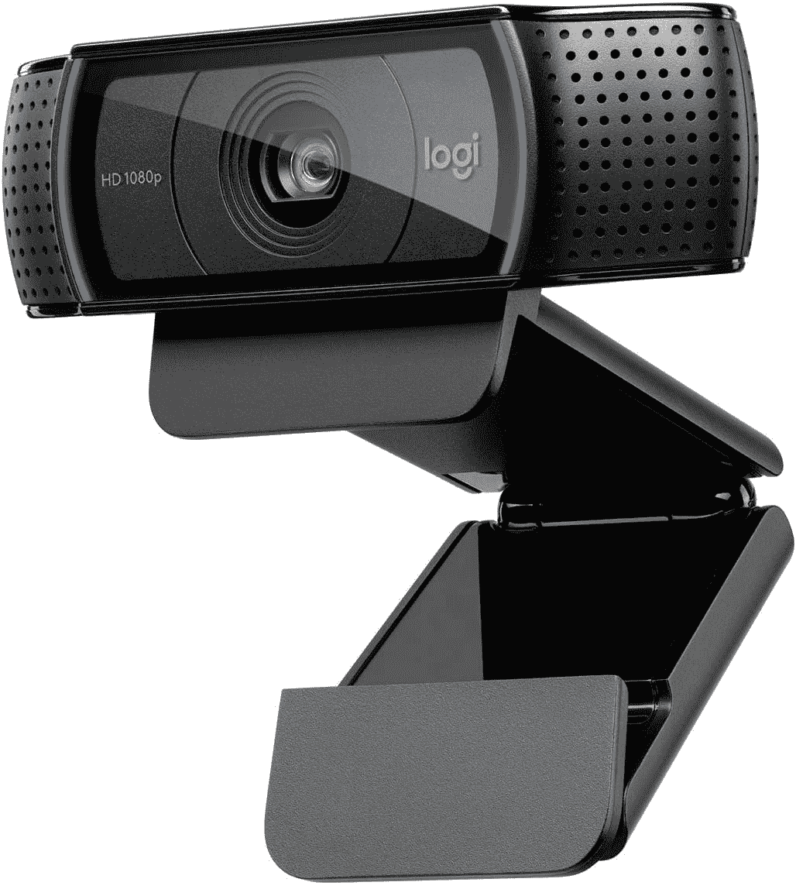
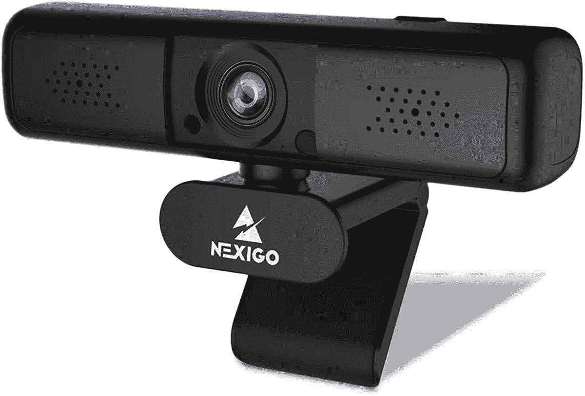
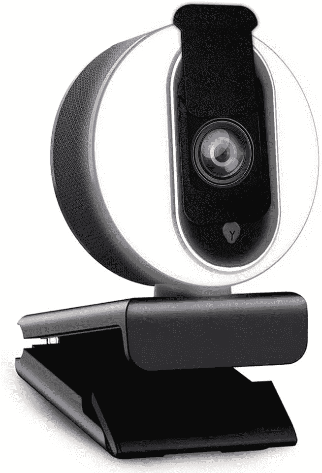

# 2023 年苹果 Mac 电脑最佳网络摄像头

> 原文：<https://www.xda-developers.com/best-webcams-mac/>

自 2020 年以来，在家工作已经成为许多人的新常态。随着这种新规范的出现，人们有必要参加工作会议，甚至在家上课，为此，你需要一个好的网络摄像头。虽然大多数笔记本电脑都有内置网络摄像头，但质量往往不尽如人意。它可能偶尔会完成工作，但它总是建议为 [Mac、](https://www.xda-developers.com/best-macs/)甚至 Windows 配备一个外部网络摄像头，以获得更专业的外观。虽然 [MacBook Pro 14](https://www.xda-developers.com/macbook-pro-2021/) 和 [MacBook Pro 16](https://www.xda-developers.com/apple-macbook-pro-2021-m1-max-review/) ，甚至 [2022 MacBook Air](https://www.xda-developers.com/macbook-air-m2-2022-review/) 都更新了网络摄像头，但它们可能仍然不是足够好的专业用例。

如果你有一台像 Mac Mini 这样的电脑，或者你已经将 MacBook Air/Pro 与外部显示器连接起来，你可能会寻找 Mac 的网络摄像头以及其他工作良好并支持基于 Mac 的应用程序的[附件](https://www.xda-developers.com/best-macbook-pro-cases/)。这里列出了一些你可以在不同价位和不同使用情况下买到的最好的 Mac 网络摄像头。

*   <picture></picture>

    罗技 C920x 高清专业网络摄像头

    ##### 罗技 C920x 高清专业网络摄像头

    罗技 C920x 是最受欢迎的网络摄像头之一，尤其适用于办公会议。它支持立体声音频，这意味着每个人都能清楚地听到你的声音。还支持高清光线校正。

*   ##### Razer Kiyo

    Razer Kiyo 是一款功能强大的流媒体相机，内置环形灯，如果您喜欢在黑暗的房间或晚上播放流媒体，它将是您的理想选择。然而不幸的是，你只能在 Windows 上使用 Razer Synapse 来调整它的设置。因此，如果你只有一台 Mac，你将被限制在默认配置。

    T34
*   <picture></picture>

    NexiGo 2K 网络摄像头，带 3 倍变焦

    ##### NexiGo 2K 网络摄像头

    这款网络摄像头是本列表中分辨率最高的摄像头之一有一个 400 万像素的传感器，你可以数字放大到 3 倍。它有一个 95 度的视野，双麦克风，以及一个隐私快门。

*   ##### 戴尔专业网络摄像头

    戴尔专业网络摄像头是一款出色的 2K 分辨率网络摄像头。它提供了人工智能自动取景和降噪等出色的智能功能，并且由于索尼 Starvis 传感器，图像质量非常出色。

*   <picture></picture>

    Neigo 带环形灯的网络摄像头

    ##### Neigo 带环形灯的网络摄像头

    网络摄像头周围的环形灯可调节亮度，有助于提高视频质量，如果您周围的环境照明不足。它还有一个隐私保护盖，自动对焦和双麦克风。

    T34
*   ##### 罗技 StreamCam

    罗技 StreamCam 是一款出色的网络摄像头，支持 60fps 的 1080p 视频，并且包括智能自动对焦和自动曝光等功能。它还为您提供了轻松旋转相机以录制垂直视频的选项，USB Type-C 的使用使其成为没有 USB Type-A 端口的现代笔记本电脑的一个伟大选择。

这些是一些最好的 Mac 网络摄像头，您可以在在线课程或会议期间提高视频和音频的质量。请注意，许多网络摄像头通过 USB-A 端口连接，这意味着您可能需要额外的[加密狗或集线器](https://pocketnow.com/best-macbook-pro-13-late-2020-accessories)才能将它们连接到您的 Mac。所有这些网络摄像头都与流行的视频会议服务和应用程序兼容。因此，Skype、Zoom、Google Meet、微软团队和其他类似平台都可以正常工作。第一次使用新的网络摄像头时，您可能会遇到这些应用程序冻结的问题。如果您遇到此类问题，您可以[强制退出应用程序](https://www.xda-developers.com/how-to-force-quit-mac/)或[卸载](https://www.xda-developers.com/how-to-uninstall-app-mac/)，如果问题仍然存在，请再次重新安装。

此列表中包含的所有网络摄像头将在众多使用案例中完成工作。如果你要在你参加的在线会议或课堂上说很多话，比如罗技 C920X 的话，要注意多个麦克风。如果流媒体是你的优先选择，你可能会考虑更高帧率的网络摄像头，如[罗技 StreamCam](https://www.amazon.com/Logitech-Streamcam-Streaming-Webcam-YouTube/dp/B07TYWPM67/ref=sr_1_49?tag=xda-7g65n3s-20&ascsubtag=UUxdaUeUpU5966&asc_refurl=https%3A%2F%2Fwww.xda-developers.com%2Fbest-webcams-mac%2F&asc_campaign=Commerce) 或 [Razer Kiyo](https://www.amazon.com/Razer-Streaming-Adjustable-Brightness-Microphone/dp/B076QK6489/ref=sxin_10?tag=xda-7g65n3s-20&ascsubtag=UUxdaUeUpU5966&asc_refurl=https%3A%2F%2Fwww.xda-developers.com%2Fbest-webcams-mac%2F&asc_campaign=Commerce) 。如果您不希望应用程序和服务在您的网络摄像头不使用时访问它，请确保您获得一个带隐私快门的网络摄像头，以增加内心的平静。