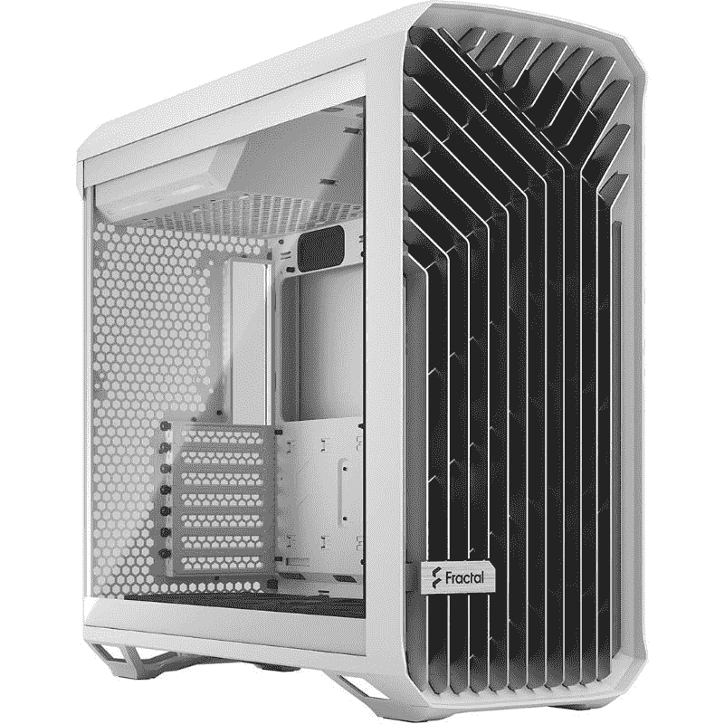
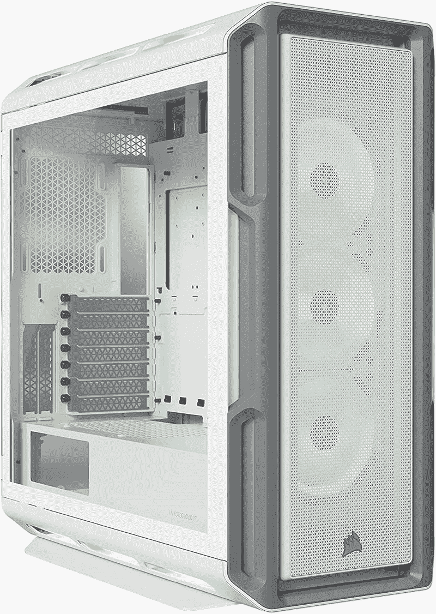
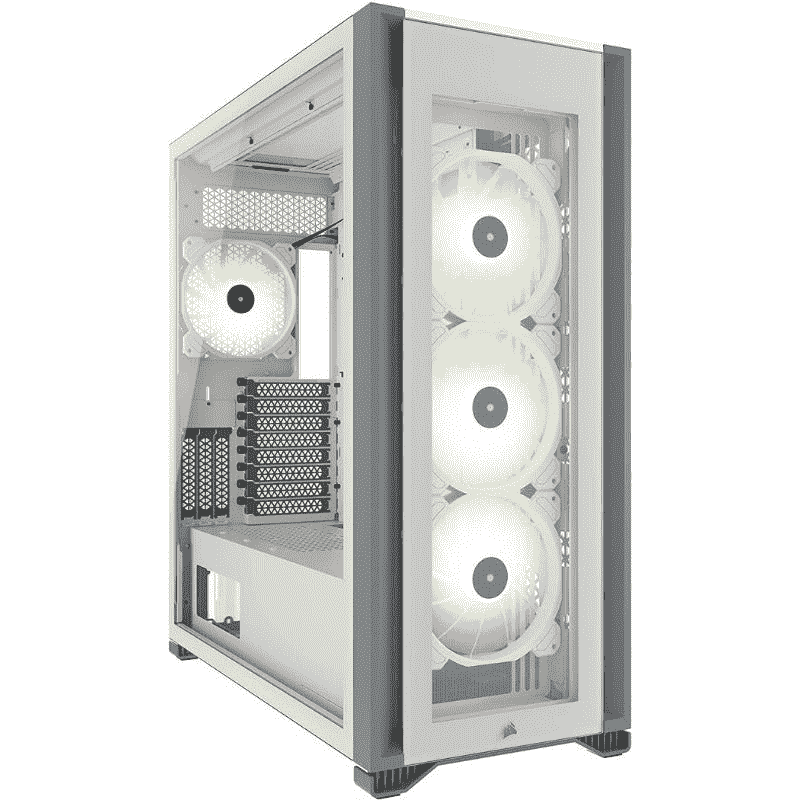
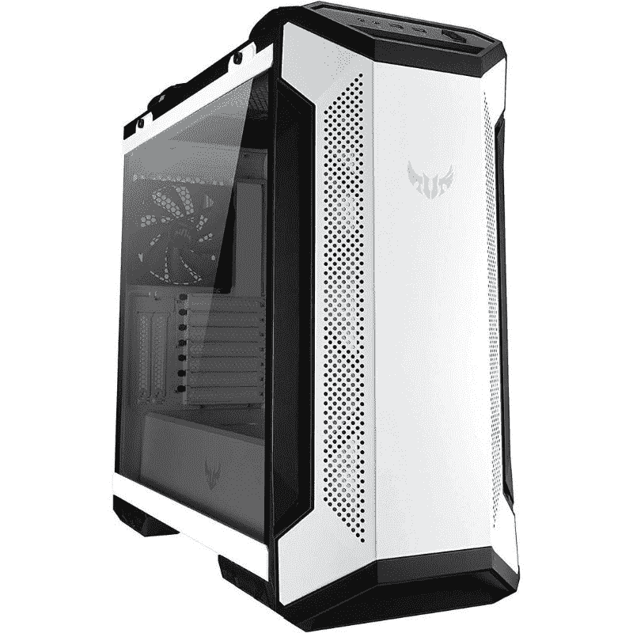
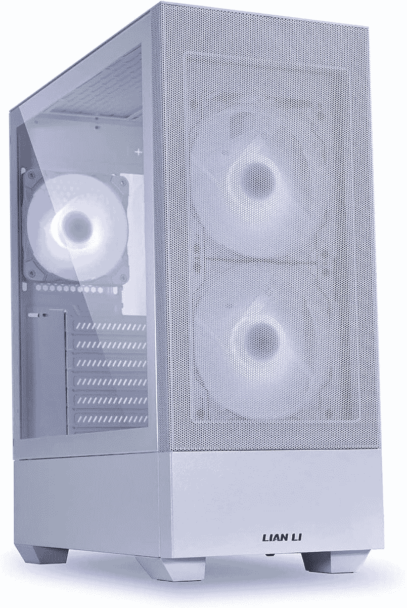
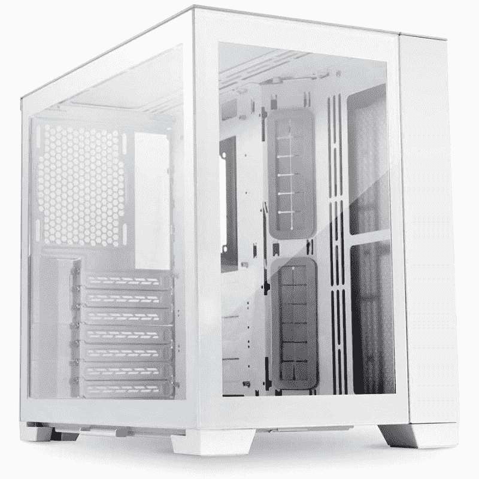
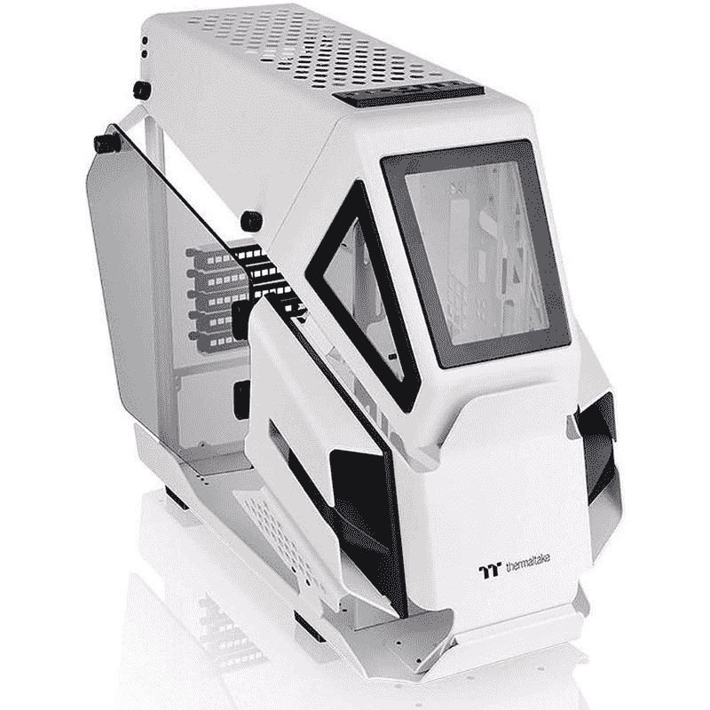

# 2023 年最佳白色电脑保护套

> 原文：<https://www.xda-developers.com/best-white-pc-cases/>

电脑机箱有多种形状和尺寸。最近，我们也看到了很多颜色选择。为电脑外壳选择一种特殊的颜色，而不是通常的黑色，这实际上是个人喜好的问题。也就是说，那些使用过白色电脑机箱的人会告诉你，它让你的装备看起来更高档、更优雅。缺点是在大多数情况下，购买白色外壳会产生额外的费用。真正的预算案例通常不会被涂成白色。

电脑外壳的白色内部也往往使 RGB 灯看起来更好。一个完全装饰好的白色电脑外壳看起来更有色彩，更有视觉吸引力，尤其是当你把它和白色的组件搭配在一起的时候。

## 最佳白色 ATX 案例:分形设计洪流

分形设计洪流是一个优秀的个人电脑案件，提供了一个简单的 ATX 建设可靠的基础。Torrent 是市场上你能找到的最好的机箱之一。这种特殊的机箱足够大，可以容纳高端内部部件，从而实现坚固的构建。这对气流也很好，因为 Torrent 机箱的前面本质上只是一个大的通风口面板。分形设计 Torrent PC 机箱有黑色和白色两种颜色可供选择，使其成为该系列的坚实补充。

正如你所看到的，分形设计的 Torrent 机箱带有一个前面板，带有通风格栅。开放式格栅板允许在风扇的帮助下吸入大量空气。后面板也有大量的穿孔，使空气进出系统。Torrent 机箱一共预装了五个机箱风扇，非常棒。这意味着机箱可以开箱即用，无需购买单独的机箱风扇。

标准版本的外壳前面带有两个动态 GP-18 风扇，而 RGB 版本带有两个 Prisma AL-18 风扇。根据您购买的版本，您还可以在底部面板获得三个标准或 RGB 风扇。正面和底部通风口都覆盖有灰尘过滤器，以防止灰尘和污垢进入内部。您还可以选择钢制或钢化玻璃侧板。RGB 版本的表壳仅配有钢化玻璃侧板。

你可以使用任何东西，从 E-ATX 到更小的 ITX 主板。你可以安装 360 毫米或 420 毫米散热器的前面和底部面板的种子情况。后面板上还有高达 140 毫米的散热器空间。对于水冷建筑来说，这是一个非常好橱柜。分形设计洪流为 GPU 和 CPU 冷却器提供了大量的间隙。您可以安装最大长度达 423 毫米的 GPU 和最大高度达 188 毫米的 CPU 冷却器。机箱还配有电缆布线通道，便于管理电缆。

分形设计洪流带有 7 个扩展槽。它还附带两个 3.5 英寸和四个 2.5 英寸驱动器支架。Torrent 外壳上的前 IO 面板包括一个 USB 3.1 Gen 2 Type-C 端口、两个 USB 3.0 端口和高清音频。使用分形设计的 Torrent PC 机箱非常容易，它还带有一个用于两侧面板的免工具锁定系统。总的来说，我们认为分形设计洪流是一个奇妙的 PC 案例。它为您的构建提供了许多非常酷的功能，并在机箱内为高端构建提供了大量空间。这是一个坚固的气流箱，有很多风扇和散热器安装支架。

 <picture></picture> 

Fractal Design Torrent PC case

##### 分形设计洪流

分形设计洪流是一个坚实的 PC 机箱，机箱内有足够的空间和许多通风孔。

## 最佳白色中塔 ATX 案例:海盗船 iCUE 5000T

我们已经在这个特别的系列中添加了几个来自 Corsair 的白色电脑机箱，但该公司的新 iCUE 5000T 中塔式机箱实在太好了，不容忽视。这是你现在能在市场上买到的最复杂的电脑外壳之一，它有着大胆的设计和大量的 RGB 照明。它有黑色和白色两种颜色可供选择，所以我们认为它是这个系列的一个很好的补充。因此，这是我们的备选选择，为最好的中塔白色电脑外壳，你可以购买。

iCUE 5000T 最大的优点之一是机箱内有足够的空间。有一个网状前面板，也允许最大的气流。海盗船还增加了许多 RGB 灯，通过这个底盘的多个开口发光。据该公司称，有多达 160 个 RGB LEDs 集成到机箱的前部、顶部和底部。此外，您还可以通过随附的风扇获得 48 个可单独寻址的 led。

在散热方面，你可以在顶部添加最多三个 120 毫米或两个 140 毫米的风扇。前面还有空间添加三个 120 毫米或两个 140 毫米风扇。如果这还不够，您还可以在侧面添加多达三个 120 毫米的风扇，在后面添加一个 120 毫米的风扇用于排气。至于散热器，您可以在前面、顶部或侧面安装多达 360 毫米的散热器。此外，背面还有空间添加一个 120 毫米的散热器。可以肯定地说，在 iCUE 5000T 电脑机箱内安装冷却散热器或机箱风扇有很多选择。

关于这种特殊情况，另一件需要注意的事情是，它附带三个预装在盒子外面的 LL120 RGB 风扇。这些是海盗船的优质案例风扇，配备了可寻址的 RGB 发光二极管。这意味着你不用花很多钱在 case 粉丝身上。事实上，海盗船还包括其指挥官核心 XT 控制器的风扇和 RGB 灯与这种情况下，这是伟大的。

海盗船 iCUE 5000T 拥有宽敞的内部空间，为您尝试使用的所有复杂组件提供了充足的空间。面板也很容易拆卸，因此您可以轻松地在机箱内工作。您还可以在前面的 IO 面板上选择合适的端口。您可以获得一个 USB 3.1 Type-C 端口、4 个 USB 3.0 端口和一个组合音频/麦克风插孔。总的来说，我们认为 Corsair iCUE 5000T 是一款坚固的中塔式机箱，值得您为新 PC 考虑。事实上，它有白色可供选择，这使它脱颖而出，尽管它也是价格较高的选择之一。

 <picture></picture> 

Corsair iCUE 5000T mid-tower ATX PC case

##### 海盗船 iCUE 5000T 吨

海盗船 iCUE 5000T 吨中塔 ATX 电脑案件是最好的选择之一，现在那些谁正在寻找建立一个高端电脑。

## 最佳白色全塔式电脑机箱:海盗船 iCUE 7000X RGB

如果你在市场上购买一个新的白色全塔电脑案件，那么我们建议拿起海盗船 iCUE 7000X RGB 案件。对于那些打算打造高端产品的人来说，这是最好的海盗船电脑包之一。这款全塔式电脑机箱空间充足，可以容纳 ATX、microATX 和 miniITX 主板。也有足够的空间来安装许多风扇、散热器等。

海盗船 iCUE 7000X RGB 拥有超过 80L 的体积。这款机箱比我们在此系列中提到的所有中塔式机箱大 60-70%。它有足够的空间来放置风扇和散热器。前面最多可以安装四个 120 毫米或三个 140 毫米的风扇。顶部面板上还有三个 120 毫米或 140 毫米风扇的空间，背面有一个 120 毫米或 140 毫米风扇。至于散热器，您可以在顶部安装高达 360 毫米的散热器，在前面安装高达 480 毫米的散热器。后部还有空间放置一个 120 毫米的小型散热器。

海盗船 iCUE 7000X RGB 可能没有其他一些全塔案件大，但我们认为它对大多数人来说足够了。底部有一个单独的 PSU 隔层，您也可以在里面安装一些存储驱动器。这种特殊的个人电脑案件还配备了海盗船的指挥官核心 XT 智能控制器。它本质上是 RGB 和粉丝的枢纽。此外，该案件还配备了四个包括海盗船 SP140 RGB 精英风扇，所以我们认为它已经准备好开箱使用，不需要任何额外的。

iCUE 7000X RGB 外壳的正面和顶部都配有玻璃面板。其中一个侧板也是由钢化玻璃制成的，所以你可以看到内部结构。这款名为 7000D 的气流型机箱在前面配备了网状面板，而不是玻璃面板，以增加气流。然而，这种特殊的情况并没有捆绑任何 RGB 风扇。7000X RGB 外壳的前面板 IO 包括多达四个 USB 3.0 端口、一个 USB 3.1 Type C 端口和音频端口。

作为一个全塔式电脑案件，海盗船 iCUE 7000X RGB 案件有足够的内部空间。您可以安装最大长度达 450 毫米的 GPU 和最大高度达 190 毫米的 CPU 冷却器。这种特殊的情况下还配备了 8 个水平和 3 个垂直扩展卡插槽，因此您甚至可以垂直安装最现代的 GPU，以展示散热器和 RGB 风扇。这种情况下还附带 2 年的保修，以防出现问题。总而言之，我们认为这是你现在能买到的最好的全塔式机箱之一，只要你的预算允许。

 <picture></picture> 

Corsair iCUE 7000X RGB PC case

##### 海盗船 iCUE 7000X RGB

海盗船 iCUE 7000X RGB 是你能买到的最好的全塔式电脑机箱之一。这款还有白色可选，是本系列的又一亮点。

## 最佳中塔式游戏案例:华硕 TUF 游戏 GT501 白色版

除了像主板和 CPU 冷却器这样的外设，华硕还制造了很多 PC 外壳。如果你打算建造一台游戏 PC，并且正在寻找与你的设置的白色美学相匹配的东西，那么我们建议挑选华硕 TUF 游戏 GT501 白色版。即使对于高端建筑来说，这种中塔式设备也是一种结构良好的机柜。

华硕 TUF 游戏 GT501 白色版电脑外壳也有一些黑色的审美。这使得它与众不同，不同于我们在本系列中提到的其他案例。这是最能吸引房间里人们注意力的电脑机箱之一。这款特殊的电脑机箱正面有一块金属面板。面板侧面有通风孔，便于空气流通。您可以在内部安装机箱风扇，以获得更好的气流。它还有一个钢化玻璃侧面板，让您可以看到电脑的内部。

这款包的一个亮点是它配有符合人体工程学的棉质编织提手，让您可以随身携带。这是该系列中唯一一款带有手柄的箱子。你可能不会经常携带和移动你的电脑机箱，但是有把手总是好的。华硕 TUF 游戏 GT501 白色版的机箱内部有很多空间用于高端组件。它自带四个预装风扇，我们认为这足够开始构建了。前面板有三个 Aura Sync RGB 风扇，后面板有一个 140 毫米 PWM 风扇。除此之外，您还可以在机箱顶部再安装三个 120 毫米的风扇。

华硕 TUF 游戏 GT501 白色版也有很好的散热器安装选项。您可以在顶部和前面板上安装多达 360 毫米的散热器。背面还有空间容纳高达 140 毫米的散热器。所有的通风口都覆盖了灰尘过滤器，以防止灰尘进入电脑。GT501 外壳也有良好的内部间隙。您可以轻松安装最大长度达 420 毫米的 GPU 和最大高度达 180 毫米的 CPU 冷却器。PSU 与存储驱动器一起存放在内部构件下方的单独隔间中。

TUF 游戏 GT501 配有三个 2.5 英寸硬盘托架和四个 3.5 英寸/2.5 英寸组合托架。除了用于垂直 GPU 安装选项的两个垂直插槽之外，您还可以获得七个扩展槽。这种情况下的前 IO 面板有两个 USB 3.1 Gen 1 端口和一个耳机/麦克风插孔。总的来说，如果你想打造一个白色主题，TUF 游戏 GT501 白色版是一个非常棒的电脑机箱。尤其是如果你想找一些更暗的对比。

 <picture></picture> 

ASUS TUF Gaming GT501 White Edition

##### 华硕 TUF 游戏 GT501 白色版

如果你想建造一台白色美学的游戏电脑，华硕 TUF 游戏 GT501 是一个很好的选择。

## 最佳安静白色案例:分形设计定义 7

分形设计 Define 7 是一款中塔式 ATX 机箱，以其惊艳的设计和低噪音的操作而闻名。这是社区中那些希望为他们的工作室构建安静的 PC 的人的流行选择。这一点有很多值得喜欢的地方，我们在收集的[最佳电脑案例](https://www.xda-developers.com/best-pc-cases/)中也提到了这一点。分形设计 Define 7 也有白色版本，所以我们认为它也值得加入到这个最佳白色电脑机箱的收藏中。

分形设计 Define 7 是最好的电脑案例之一，主要是因为它完全开放。这使得用户可以在完全开放的室内工作和建造。如你所见，前面板是由阳极氧化铝制成的。前面板侧面有通风孔，但气流会非常有限。顶部有通风口，所以你可以在顶部面板安装风扇来移动空气。分形设计让您可以选择透明钢化玻璃侧板或标准铝板。

分形设计定义 7 带有总共 9 个风扇支架空间。您可以在前面板上安装最多三个 120 毫米或 1400 毫米风扇，在顶部板上安装三个 120 毫米或 140 毫米风扇，在后面板上安装一个 120 毫米或 140 毫米风扇，在底部板上安装最多两个 120 毫米或 140 毫米风扇。然而，值得指出的是，该保护套没有预装任何风扇。你必须单独购买它们以获得更多的空气流通。未使用的风扇支架可以使用多支架转换为硬盘、固态硬盘或泵支架

至于散热器安装，你有足够的空间来安装高达 420 毫米的散热器在顶部面板，一个小的 120 毫米散热器在后面，高达 280 毫米散热器在底部。该机箱还为所有高性能组件提供了充足的空间。您可以安装最大高度达 185 毫米的 CPU 冷却器和最大长度达 491 毫米的 GPU。在底部有一个单独的空间给 PSU，它就放在硬盘架旁边。除了 7 个扩展槽，分形设计 Define 7 还带有两个垂直插槽，用于垂直安装 GPU。值得注意的是，您还可以获得一系列存储驱动器支架，包括一个 5.25 英寸驱动器支架。

Define 7 还为所有通风口配备了灰尘过滤器。前面板有两个，顶部一个，底部一个全长过滤器。这种特殊的情况下使用工业消音钢来保持电脑的整体噪音输出低。这是一个受欢迎的选择，为那些谁寻找建立一个安静的电脑。

 <picture></picture> 

Fractal Design Define 7

##### 分形设计定义 7

Define 7 PC 机箱的前面板、顶部和侧面板采用隔音材料，可实现安静的操作。

## 最佳微型 ATX 白色表壳:海盗船水晶系列 280X

海盗船水晶系列 280X 非常类似于联力 O11 动态迷你电脑案件。然而，这种情况下稍微便宜，并提供几乎相同的功能集的价格。Crystal 280X 采用双腔设计，为机箱内的所有组件提供了更多空间。尽管外形相对较小，但这种特殊的电脑外壳可用于构建功能强大的高端电脑。这可以说是市场上最好看的 SFF 包之一。

正如你所看到的，海盗船水晶 280X 配备了一堆玻璃面板。箱子的侧面、顶部和前面的一半有玻璃面板。虽然前玻璃面板不可拆卸，但其他面板可以拆卸。在这种情况下很容易构建，这也是社区中很受欢迎的选择。与其他一些机箱不同，这款机箱开箱后会预装风扇。你有两个 120 毫米的机箱风扇，机箱有足够的空间来添加更多。您可以在顶部安装两个 120 毫米或 140 毫米风扇，在前面安装两个 120 毫米或 140 毫米风扇，在底部安装两个 120 毫米或 140 毫米风扇。

由于所有的散热器安装，Crystal 280X 还支持水冷。您可以在顶部和底部添加多达 280 毫米的散热器，而前面板可以容纳 240 毫米的散热器。你可能无法建立一个自定义循环水冷电脑，但这种情况下有足够的空间来放置 AIO 冷却器。表壳的双室设计也使其非常容易安装在 280X 水晶内。PSU 和所有电缆都可以隐藏在后室内，而所有核心组件都安装在前面。

正如你所看到的，Corsair Crystal 280X 也有适当的电缆布线通道，使你更容易管理电缆。在较小的情况下，电缆管理可能会很困难，因此您肯定会发现这很有用。说到净空，可以安装最大长度可达 300mm 的 GPU 和最大高度可达 150mm 的 CPU 冷却器。值得注意的是，Crystal 280X 机箱还配有两个 3.5 英寸和三个 2.5 英寸的驱动器托架，这相当不错。

总的来说，我们认为海盗船水晶 280X 是一个神奇的微型 ATX 电脑。尽管它的外形相对较小，但这种外壳可以用来构建高端 PC，并配有水冷解决方案。在 170 美元，我们认为海盗船水晶 280X 是这个系列中最好的情况之一。你得到两个预装风扇和海盗船照明节点亲控制器太多。这款产品有白色和黑色两种颜色可供选择，因此是这款产品的完美补充。如果出现任何问题，您还可以获得 2 年的 Crystal 280X 保修。

 <picture></picture> 

Corsair Crystal Series 280X

##### 海盗船水晶系列 280X

海盗船晶体 280X 是一个伟大的选择，为那些谁正在寻找建立一个小型电脑。它有白色可选，并配有两个预装风扇。

## 最佳预算白色电脑机箱:联力蓝酷 205 目

曾经有一段时间，购买联立电脑外壳对我们大多数人来说是遥不可及的。该品牌是高端、优质空间的代名词，但时代确实发生了变化。Lancool 205 Mesh 不仅是一个很好的 PC 机箱，而且它完全在任何人组装一个坚固的中塔结构的预算之内。白色版本无疑是最好看的，但如果你愿意，它也有黑色版本。

这个案子之所以如此重要，是因为它符合所有的条件。看起来很优雅，但又不太激进。尽管没有那么大，但它有足够的空间来建造。它可以在不牺牲气流的情况下，通过 RGB 风扇和钢化玻璃发出明亮的光。无论是空气冷却或使用散热器，建立一个完整的 ATX 电脑，或更小的东西，这种情况下应该能够适应你需要的一切与一点点额外的工作空间。

Lancool 205 Mesh 采用了电源隐藏的设计(理应如此)。裹尸布只是箱子的下半部分，所以不用担心安装和拆卸。左手边的上四分之三覆盖着钢化玻璃面板。除了底部的一个小面板，前面几乎完全是网状的，后面可以藏 3.5 英寸的驱动器和电缆以及其他难看的物品。在主板托盘后面，您会发现大量的电缆管理点以及几个 2.5 英寸的 SSD caddies，还有足够的空间来处理更大的电源。

Lancool 205 Mesh 的适合度和光洁度是一流的，没有偷工减料，没有裸露的金属，至少在我们的经验中，没有过度喷涂或低于标准的油漆。连立品质无处不在。它配备了三个 120 毫米 ARGB 脉宽调制风扇，虽然 240 毫米散热器也可以安装在前面或顶部的情况下。在外面，最上面有一个灰尘过滤器，所以利用这个位置排热是值得的。不过，有一个缺点是，不管你把散热器安装在哪里，它的最大尺寸都是 240 毫米。

在背面，你会看到一整套七个扩展槽，Lancool 205 Mesh 能够容纳更大、更厚的显卡。有足够的空间来容纳更长的卡，但你需要注意的是，这种情况下不包括 GPU 支持。因此，您必须想出自己的解决方案来处理下垂的 GPU。撇开这点小挫折不谈，留给你的是一个惊人案例中的惊人构建。

 <picture></picture> 

Lian Li Lancool 205 Mesh

##### 莲丽兰库尔 205 目

这是一款经济实惠、时尚且高品质的白色电脑机箱，既美观又通风良好。

## 最佳迷你塔案例:联立 O11 动感迷你白雪公主

李连杰是个人电脑硬件领域的知名案例制作人。该公司生产大量高质量的 PC 机柜，这些机柜因其构造而受到许多人的青睐。事实上，Lian Lia Dynamic Oll XL 是我们目前在市场上可以买到的最佳电脑机箱。Lian O11 Dynamic Mini 实际上是这种情况的缩小版。它在一个小尺寸中提供了所有相同的功能。我们选择了这款表壳的雪白色变体，这意味着它是一款白色变体，非常适合这一系列。

联立 O11 Dynamic Mini 的机身使用了铝和玻璃。尽管外形小巧，但这种特殊的机箱比市场上的许多其他迷你 ITX 机箱都要大。这种情况可以很好地用于具有高性能组件的高端构建。如你所见，这个箱子的正面和侧面都使用了玻璃面板。顶部有通风孔，可以安装风扇进出机箱。侧面也有通风孔。O11 Dynamic Mini 还采用了双腔设计，为部件提供了大量空间。

你可以在机箱内安装很多机箱风扇和散热器。顶部有三个 120 毫米或 140 毫米风扇的空间，侧面板有两个 120 毫米或 140 毫米风扇，底部有三个 120 毫米或 140 毫米风扇，最后在后面有一个 120 毫米或 140 毫米风扇的空间。也就是说，这款保护套没有预装任何风扇，这意味着你必须花更多的钱来购买它们。至于散热器支架，你可以在顶部安装高达 360 毫米的散热器，在侧面安装高达 280 毫米的散热器，在底部安装高达 360 毫米的散热器。尽管外形相对较小，但您可以使用这个案例来构建一个完全装饰好的水冷 PC。

联立 O11 Dynamic Mini 还为高品质 CPU 冷却器和现代 GPU 提供了足够的空间。您可以安装最大高度高达 170 毫米的 CPU 冷却器和最大长度为 395 毫米的 GPU。您可以在背面获得多达 7 个扩展槽，用于添加 GPU、采集卡等扩展卡。机箱上的通风孔完全被灰尘过滤器覆盖，以防止灰尘进入机箱。对于 PSU，这种特殊情况下只支持 SFX 或 SFX-L PSU，所以请记住这一点。

 <picture></picture> 

Lian Li O11 Dynamic Mini

##### 联立 O11 动感迷你

联立 O11 动态迷你电脑是一款坚固的电脑包，适合那些希望在相对较小的外形中构建高端电脑的人。

## 开放式设计的最佳白色电脑包:Thermaltake AH T200 Snow

Thermaltake AH T200 Micro 是一个非常独特的案例。它有一个开放式框架底盘，形成该公司所谓的直升机式设计。我们选择这个案例来加入我们的最佳粉红色电脑案例的收集，所以它只是有意义的，我们在这里提到这个集合。它有黑色、白色和粉色三种颜色，所有这些颜色都采用了相同的开放式框架设计，这使得它成为市场上独一无二的 PC 机箱之一。

Thermaltake AH T200 微型机箱配有两块 4 毫米厚的钢化玻璃侧板。即使内部没有完全覆盖，这些面板也起到了某种防尘的作用。除了这些面板，您还可以在前面看到三个玻璃面板窗口，让您看到风扇。这种开放式框架使底盘有充足的通风。是的，有时保持组件的干净是很难的，但是这是一个你应该愿意以这种方式炫耀你的构建的折衷。

Thermaltake AH T200 微型机箱在机箱内有大量空间。机箱没有预装任何风扇，但您可以在机箱中安装很多风扇。您可以在正面和顶部安装两个 120 毫米或 140 毫米的风扇。后面没有风扇支撑，因为它完全暴露在外。CPU 冷却器散热器也将放在前面。你也可以在前面安装高达 280 毫米的散热器..像这样在一个开放的框架内运行一个自定义循环可能有点挑战，但是使用 AIO 冷却器应该没有任何问题。

Thermaltake AH T200 的风扇安装数量有限。然而，这应该不是一个真正的问题，因为机箱的开放式框架允许大量的气流。你可以使用迷你 ITX 或微型 ATX 主板建立在这个机箱内。至于组件间隙，你可以安装一个最大长度可达 320mm 的 GPU 和一个最大高度可达 150mm 的 CPU 冷却器。箱子底部有一个单独的空间用于放置 PSU，你可以安装一个长达 180 毫米的装置。

谈到前 IO 面板，有一个 USB 3.1 Type C Gen 2 端口，两个 USB 3.0 端口以及高清音频端口。总的来说，我们认为 Thermaltake AH T200 是独一无二的电脑机箱。也就是说，我们不建议购买这种情况下，除非你是一个爱好者用户，有一些经验建设个人电脑。而且真正注意保养，因为灰尘是你的敌人。

 <picture></picture> 

Thermaltake AH T200

##### Thermaltake AH T200

Thermaltake AH T200 是一款独一无二的电脑机箱，采用开放式框架设计。

## 最佳白色电脑机箱:最终想法

市场上有很多白色的电脑保护套，我们在本系列中提到的就是其中最好的几款。我们认为分形设计洪流和华硕 TUF 游戏 GT501 白色版是大多数人最好的白色电脑外壳。如果您想要一个带有自定义环路的高性能水冷构建的全塔式机箱，您也可以考虑购买 Corsair iCUE 7000X。寻找独特事物的爱好者和有经验的建筑者也可以看看 Thermaltake AH T200。

一个白色的 PC 外壳，只要你好好打理，是不会出错的。白色外壳在没有良好护理的情况下可能会随着时间的推移而褪色，并且可能令人惊讶的是，它们会非常严重地显示灰尘。也就是说，白色电脑机箱的确与众不同，尤其是当你搭配整体美学时。如果你打算建造一台新电脑，不要忘记查看我们收集的[最佳 CPU](https://www.xda-developers.com/best-cpus/)和[最佳主板](https://www.xda-developers.com/best-motherboard/)来购买。我们还鼓励您加入我们的 [XDA 计算论坛](https://forum.xda-developers.com/c/xda-computing.12289/)，从我们的专家社区成员那里获得更多产品推荐。