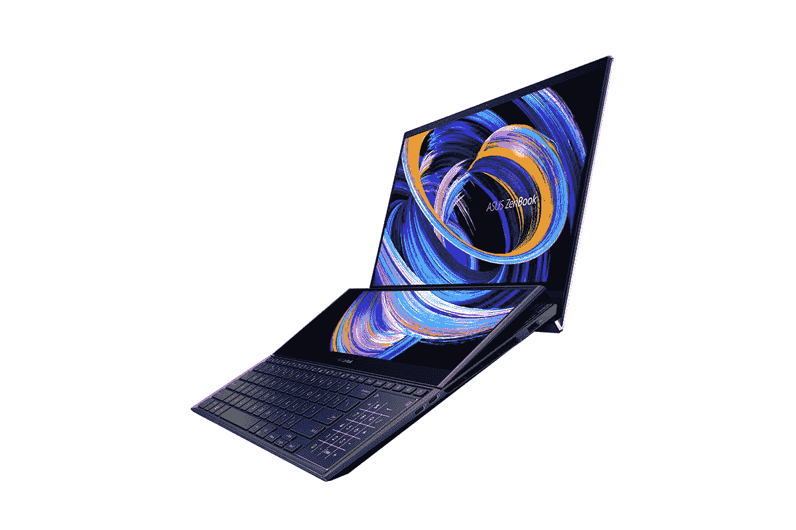

# 2023 年最佳带数字键盘的 Windows 笔记本电脑

> 原文：<https://www.xda-developers.com/best-windows-laptops-number-pads/>

随着笔记本电脑变得越来越薄越来越轻，在这个过程中往往会牺牲一些东西。例如，我们现在看到的最好的高端笔记本电脑通常很小，只有 [Thunderbolt 4 端口](https://www.xda-developers.com/best-thunderbolt-4-laptops/)以节省机箱内的空间。另一件多年来被放弃的事情是包含数字键盘，这是许多[最好的笔记本电脑](https://www.xda-developers.com/best-laptops/)没有的。

如果你和数字打交道，这些专用的数字键会非常重要。所有的键都可以在一个位置方便地使用，因此数字运算变得更加高效和方便。如今，如果你想要一个数字键盘，你必须看 15 或 17 英寸的笔记本电脑，因为 13 英寸的笔记本电脑非常小。但即便如此，仍有大量笔记本电脑没有数字键盘。

如果你找不到带数字键盘的笔记本电脑，我们已经收集了你现在能买到的最好的。让我们开始吧。

## 最佳整体:联想 Yoga 7i (16 英寸)

数字键盘可能不像过去那样常见，但这并不意味着没有高级笔记本电脑仍在使用它们，联想 Yoga 7i 就是一个很好的例子。这是一款可转换笔记本电脑，具有出色的显示屏、顶级的性能，当然还有一个数字键盘，因此无论您扔给它什么，它都准备好了。

我们将从性能开始，Yoga 7i 在这方面肯定不缺乏。这里有两种主要型号——一种包括英特尔的第 12 代英特尔酷睿 P 系列处理器，另一种包括 H 系列处理器，搭配独立的英特尔 Arc A370M GPU。前者对于办公室或学校工作来说已经足够快了，但是如果你需要更多的功能，你可能会想要带独立显卡的型号。后一种型号也配备了高达 32GB 的 RAM，而前者仅限于 16GB，但这两种配置都已经非常好了。这两款机型还配备了高达 1TB 的固态硬盘用于存储。

显示屏也很棒，是 16 英寸的面板，长宽比为 16:10。这是你在这个列表中能找到的最好的显示器之一，而且高的长宽比对于生产力来说是非常棒的。这意味着你可以用更少的滚动在屏幕上看到更多，这在 Excel 这样的应用程序中非常有用——如果你需要一个数字键盘，你可能会经常使用它。此外，这款面板采用夏普 Quad HD+ (2560 x 1600)分辨率，因此一切看起来都很清晰，亮度为 400 尼特，在户外应该很容易看到。事实上，考虑到它有一个强大的四扬声器立体声系统，在这上面消费媒体应该很棒。

除此之外，还有更好的消息，全高清 1080p 网络摄像头可以为您的视频通话和会议提供稳定的质量。此外，除了指纹识别器之外，还有一个用于 Windows Hello 面部识别的红外摄像头。

谈到设计，联想 Yoga 7i 看起来也很棒。它只有两种不同的灰色，但联想仍然通过采用弯曲光滑边缘的新设计使它看起来很独特。这给了笔记本电脑一个独特的外观，并使它更舒适地握在手中，所以这是一个双赢的局面。重量为 4.37 磅(H 系列型号为 4.76 磅)，联想 Yoga 7i 并不超轻，但对于 16 英寸的敞篷车来说，它也不是最重的。

最后，我们有端口，这也是一个可靠的设置。Yoga 7i 配有两个 Thunderbolt 4/USB-C 端口、两个 USB Type-A 端口、HDMI、一个耳机插孔和一个全尺寸 SD 读卡器。这是一个广泛的选择，应该涵盖大多数用户的需求，它只是增加了这款笔记本电脑的整体多功能性。

很难指出这款笔记本电脑的一大堆缺点，这也是为什么它在这个列表中名列前茅。

 <picture></picture> 

Lenovo Yoga 7i (16-inch) with Arc Graphics

##### 联想 Yoga 7i 2 合 1 (16 英寸)

联想 Yoga 7i 是一款高端 2 合 1 笔记本电脑，拥有出色的显示屏、高端规格和漂亮的设计-

## 带数字键盘的最佳轻薄笔记本电脑:三星 Galaxy Book 2 Pro

带数字键盘的笔记本电脑通常不会与轻薄笔记本电脑有太多重叠，但 T2 的 15 英寸 Galaxy Book 2 Pro 实际上是最好的笔记本电脑之一。第一代 Galaxy Book Pro 已经很棒了，但最新型号改进了几个关键领域，使其成为比以前更好的选择。

与上面的联想 Yoga 7i 一样，三星 Galaxy Book 2 Pro 采用了英特尔第 12 代 P 系列处理器，最高可达酷睿 i7-1260P。这意味着多达 12 个内核和 16 个线程，最高速度可达 4.7GHz，所有这些都在一个非常轻薄的设计中。它还高达 16GB 的 LPDDR5 RAM 和 512GB 的存储空间，这是您获得优质体验所需的一切。

三星 Galaxy Book 2 Pro 上的显示屏也很棒。这是一个 15.6 英寸的面板，它有全高清(1920 x 1080)分辨率，但它的伟大之处在于它是一个 AMOLED 面板。这意味着您可以获得真正的黑色、鲜艳的色彩和非常高的对比度。通常，AMOLED 显示屏是为非常昂贵的笔记本电脑保留的，所以很高兴看到它采用这种更实惠的包装和更务实的分辨率。有些人可能希望在这种尺寸下看到稍微锐利的面板，但这绝对是可用的，作为 AMOLED 面板可以弥补这一点。今年的型号在 HDR 模式下也可以达到 500 尼特的亮度。

三星今年的一大升级是网络摄像头，现在支持全高清分辨率，视野更广。这意味着在视频通话和会议中，你应该看起来更清晰，并且你也能够在框架中容纳更多的人。Windows Hello 没有面部识别功能，但笔记本电脑的电源按钮上有指纹识别器。

Galaxy Book 2 Pro 真正令人印象深刻的是它的轻薄程度。对于 15.6 英寸的笔记本电脑来说，仅 11.7 毫米的厚度令人印象深刻，重量也只有 2.45 磅。尤其令人高兴的是，实现轻薄设计并不需要牺牲数字键盘，数字键盘在这里仍然可用。Galaxy Book 2 Pro 有两种颜色:石墨色和银色，这两种颜色看起来都很棒，但不浮华。

最后，三星 Galaxy Book Pro 的端口供应有点有限，但对于这种轻薄的东西，你应该没有什么不期望的。你有一个 Thunderbolt 4 端口，一个标准 USB Type-C 端口，一个 USB Type-A 端口，HDMI，耳机插孔和 microSD 读卡器。这仍然是一个非常可靠的设置，尤其是当你考虑到这款笔记本电脑有多薄的时候。你可以用这种方式连接大多数你想要的外围设备。

在去年的型号中，三星为获得这种轻薄的设计做出了一些明显的牺牲，但在 Galaxy Book 2 Pro 中，这些牺牲就没有那么明显了。无论从哪方面来看，这都是一款非常棒的笔记本电脑，如果你想要一个数字键盘，这是最好的选择之一。

 <picture></picture> 

Samsung Galaxy Book 2 Pro

##### 三星 Galaxy Book 2 Pro

三星 Galaxy Book 2 Pro 是一款令人印象深刻的轻薄 15.6 英寸笔记本电脑，仍然拥有高端规格，甚至还有一个数字键盘。

## 最好的带数字键盘的 17 英寸笔记本电脑:LG gram 17

数字键盘需要更多的空间，如果任何笔记本电脑有额外的空间，它将是 17 英寸的笔记本电脑。谢天谢地， [LG Gram 17](https://www.xda-developers.com/lg-gram-17-2022-review/) 是一款非常棒的笔记本电脑，即使不包括数字键盘。它有很高的性能和令人印象深刻的轻量级设计，这使它很容易推荐给任何人。

首先，像上面的笔记本电脑一样，LG gram 17 配备了第 12 代英特尔酷睿 P 系列处理器，最高可达酷睿 i7-1260P，因此您已经可以获得各种日常任务的高性能。除此之外，您还可以获得高达 32GB 的 RAM 和 2TB 的 SSD 存储，这超过了大多数人的需求。这是一台彻头彻尾的高端笔记本电脑。

这也适用于展示。LG gram 17 拥有 17.3 英寸的显示屏，长宽比为 16:10，这让它看起来更大。这款更高的屏幕非常适合工作效率和多任务处理，并且分辨率也非常高，达到 2560 x 1600。对于色彩敏感的工作，你也可以指望 99%的 DCI-P3 覆盖率，所以足以说，这是一个伟大的展示。在显示屏之上，还有更好的消息，1080p 网络摄像头和 Windows Hello 面部识别支持。

然而，LG Gram 17 最令人印象深刻的事情之一是它的设计和它的重量。LG gram 17 的重量为 2.98 磅，比许多 13 英寸的笔记本电脑都轻，而且肯定比绝大多数 15 英寸的笔记本电脑都轻。这令人印象深刻，它使这台机器非常容易随身携带去工作或上学。它不会牺牲数字键盘或端口来做到这一点，你仍然可以获得两个 Thunderbolt 4 端口，两个 USB Type-A 端口，HDMI，一个 microSD 读卡器和一个耳机插孔。这样的整机，很难要求更多。

LG gram 17 真的是一款覆盖所有底座的笔记本电脑。它具有高性能、出色的显示屏、便携性、连接性和用于处理数字的数字键盘。它有点贵，但是你找不到其他类似的东西。

##### LG 克 17 (2022)

LG gram 17 颠覆了所有人的预期，它在重量不到 3 磅的机箱中提供了强大的性能、17 英寸的大显示屏、数字键盘和大量端口。

## 最佳创造者笔记本电脑:华硕 ZenBook Pro Duo 15 有机发光二极管

我们承认，我们可能在这一款上有点作弊，但华硕 ZenBook Pro Duo 15 有机发光二极管是进行创意工作的最佳笔记本电脑之一，尽管它们不是物理按键，但它确实有一个数字键盘。这可能需要一些时间来适应，但你会得到一个非常酷的外形和这种设计的性能吨。

首先，华硕 Zenbook Pro Duo 15 有机发光二极管的最新版本配备了英特尔的第 12 代处理器，但与我们迄今为止看到的大多数型号不同，这些处理器来自 H 系列，它们的 TDP 为 45W。这些处理器有 14 个内核和 20 个线程，带有内核 i9 的顶层配置可以提升到 5GHz，但如此强大的规格会延长电池寿命。您还可以获得 Nvidia GeForce RTX 3060 显卡，如果您想尝试一下，它可以为您的创造性工作负载或一些游戏提供充足的动力。此外，您还可以获得高达 32GB 的 LPDDR5 内存和 1TB 的 PCIe 存储。

我们不能像其他笔记本电脑一样谈论 Zenbook Pro Duo 15 有机发光二极管上的显示屏，因为它实际上有两个。主显示屏已经很了不起了——它是一个 15.6 英寸的面板，顾名思义，它是有机发光二极管的；这意味着您可以获得真正的黑色、鲜艳的色彩和高对比度。它也是 4K 分辨率，覆盖 100%的 DCI-P3，通过 Pantone 验证，并通过 VESA DisplayHDR 500 True Black 认证。整体而言，它只是一个令人惊叹的面板。

然而，真正的问题在于此。这里有另一个屏幕，具有相同的水平分辨率，但宽度约为一半(实际分辨率为 3840 x 1100)。这是一个支持触摸的 IPS 面板，但它可以让您快速访问 Photoshop 等创意应用程序中的控件，或者通过容纳不需要太多空间的窗口来帮助您执行多项任务。当您打开笔记本电脑时，屏幕会以一定角度升起，因此在使用时更容易看到，并且它允许额外的进气口来冷却笔记本电脑。

在底座上有这么大的屏幕意味着键盘必须被按下，所以触摸板不是在键盘下面，而是实际上在键盘的右侧。这可能很难习惯，但如果你想要一个数字键盘，它实际上并没有那么糟糕。这是因为这个触摸板可以通过触摸一个按钮变成一个虚拟的数字键盘，在这种情况下，数字键盘正是你期望它在键盘上的位置。你需要一些时间来适应它，但这是如此独特的设计所期望的。

不过，这种设计确实有一些牺牲，因为这是一款相当重的笔记本电脑，只有 5.16 磅，而且也相当厚。再说一遍，这并不意外。至于端口，你有两个 Thunderbolt 4 端口，一个 USB Type-A，HDMI 2.1 和一个耳机插孔。它不像这里的其他一些笔记本电脑那样多功能，但考虑到这台笔记本电脑的所有功能，这是可以理解的。还有一个不好的地方要提一下，就是网络摄像头只有 720p，但至少支持 Windows Hello。

乍一看可能有点奇怪，但华硕 Zenbook Pro Duo 15 有机发光二极管肯定是你作为创作者可以购买的最好的笔记本电脑之一，而且有了虚拟数字键盘，它也可以很好地处理数字。你可以购买下面的最新型号，配有酷睿 i7-12700H 处理器、16GB 内存和 1TB 存储空间，以及 GeForce RTX 3060 显卡。你可能还想关注华硕的网站，看看是否有更强大的配置出现。

 <picture></picture> 

ASUS Zenbook Pro Duo 15 OLED

##### 华硕 ZenBook Pro Duo 15 有机发光二极管

华硕 Zenbook Pro Duo 15 有机发光二极管是创作者的理想笔记本电脑，为您提供直观的触摸控制或改进的多任务处理的第二大屏幕。

## 最佳商务笔记本电脑:惠普 EliteBook 860 G9

即使在商用笔记本电脑中，也不是每个设备都给你一个数字键盘，但谢天谢地，它们确实存在。惠普的 EliteBook 860 G9 就是一个很好的例子，它在时尚的机箱中集成了高端规格、高显示屏和面向商务的功能。

从性能开始，HP EliteBook 860 G9 配备了英特尔第 12 代处理器，就像我们迄今为止看到的许多笔记本电脑一样。它们来自 28W P 系列，您可以升级到支持英特尔博锐技术的酷睿 i7-1280P，为您的企业提供额外的安全性和可管理性。Core i7-1280P 也有 14 个内核，20 个线程，速度高达 4.8GHz，因此它是 P 系列中最强大的型号。RAM 可配置高达 64GB 的 DDR5(您也可以随时自行升级)，并且您可以获得高达 2TB 的 SSD 存储，或者如果您需要额外的安全性，还可以获得自加密驱动器。

EliteBook 860 G9 的显示屏是 16 英寸的面板，长宽比为 16:10，这实际上是该系列的第一款。不过，这对生产率来说是个好消息。分辨率是全高清+ (1920 x 1200)，除此之外你真的无法升级，但你确实有一些选项，包括触摸屏，防眩光涂层，或者最重要的是，内置的隐私屏幕，这样你周围的人就不会在你工作的时候看到你屏幕上的内容。对于商业用户来说，这是一个非常重要的特性。

就像惠普的其他高端笔记本电脑一样，这款笔记本电脑配备了一个 500 万像素的摄像头，能够拍摄 1080p 视频，它还包括一系列智能功能，如自动取景和背光调节。此外，该相机支持 Windows Hello 面部识别(作为一个可选的升级)，如果你喜欢以这种方式解锁你的电脑，还包括指纹(也是可选的)。

就设计而言，这是一款非常标准的惠普笔记本电脑，采用银色金属机箱，整体外观柔和。它的重量为 3.87 磅，并不是最轻的机器，但对于它的尺寸来说也不重，而且应该很容易携带。

连接性是商用笔记本电脑往往表现出色的一个领域，在这种情况下，您将获得两个 Thunderbolt 4 端口、两个 USB Type-A 端口、HDMI 和一个耳机插孔，另外还可以选择添加智能卡读卡器和 NFC 支持。当然，许多商用笔记本电脑都倾向于拥有蜂窝连接，这也不例外——你可以在 LTE Cat 16 或 5G 支持之间进行选择，两者都由英特尔调制解调器提供支持。两者都可以让你在几乎任何地方都保持与互联网的连接，另外，如果你在公共场所工作，你可以绕过不安全的 Wi-Fi 网络，如果你在处理敏感数据，这一点很重要。

对于企业用户来说，惠普生产了一些最好的笔记本电脑，EliteBook 860 G9 比上一代产品有了很大的升级，因此很容易推荐。

 <picture></picture> 

HP EliteBook 830 G9

##### 惠普 EliteBook 860 G9

HP EliteBook 860 G9 是一款商务笔记本电脑，具有最新的规格和 16:10 显示屏，非常有利于提高工作效率，并配有 500 万像素网络摄像头，可进行高质量的视频通话。

## 最佳带数字键盘的游戏笔记本电脑:联想军团 5i Pro

数字键盘非常有助于提高工作效率，但它们也可以为您提供一些额外的游戏键，如果您想要一台带数字的游戏笔记本电脑，[联想军团 5i Pro](https://www.xda-developers.com/lenovo-legion-5i-pro-2022-review/) 是一个绝佳的选择。这款笔记本电脑为游戏提供了很高的性能，除了有一个数字键盘之外，它还有一些可靠的显示选项。

从这一性能开始，联想 Legion 5i Pro 配备了第 12 代英特尔酷睿 i7-12700H，这是一款功能强大的处理器，具有 14 个内核，20 个线程，加速速度高达 4.7GHz。你可以将其与高达 Nvidia GeForce RTX 3070 Ti 搭配，这仍然是最强大的笔记本电脑 GPU 之一。这款机型拥有高达 150 瓦的功率，因此它可以很好地处理您的所有游戏，并且您可以以高帧率玩它们。除此之外，您可以为这款笔记本电脑配置高达 32GB 的内存和 2TB 的固态硬盘，以存储大量游戏。

显示器是这款机器的另一个亮点，它是一个 16 英寸的面板，长宽比为 16:10，这有助于使这款笔记本电脑除了游戏之外，还能提高工作效率。但是，如果您专注于游戏，那么 Quad HD+ (2560 x 1600)分辨率和 240Hz 刷新率将非常适合您，让您能够以相当高的质量和超流畅的帧速率玩游戏。在显示器上方，还有一个 720p 的网络摄像头，这并不惊人，但它是主流游戏笔记本电脑的典型特征。

仅从外观上看，联想军团 5i Pro 是一款游戏笔记本电脑，但它并不花哨。笔记本电脑大部分是灰色的，键盘上有一些可选的 RGB 照明。然而，这款笔记本电脑相当重，只有 5.49 磅，19.9 毫米的厚度使它有点厚，尽管对于规格来说还不算太差。大底盘确实容纳了很多端口，尽管包括三个 USB Type-C 端口(一个支持 Thunderbolt 4)、三个 USB Type-A 端口、HDMI、以太网和一个耳机插孔。这是一个很大的连接。

如果你没有高得离谱的预算，联想军团 5i Pro 是你能买到的最好的游戏笔记本电脑之一。它拥有强大的功能、出色的游戏显示屏，当然还有一个数字键盘。当然，就规格而言，它的价格相当合理。

 <picture></picture> 

Lenovo Legion 5i Pro

##### 联想军团 5i Pro

联想军团 5i Pro 是一款功能强大的游戏笔记本电脑，最高配有英伟达 RTX 3070 Ti 显卡和四核高清+ 240Hz 显示屏，非常适合以高帧率玩游戏。

## 最佳预算笔记本电脑:惠普 Pavilion 15t-eg200

想要一台带数字键盘的笔记本电脑而又不花很多钱？如果您正在寻找价格实惠但功能强大的产品，名副其实的 HP Pavilion 15t 是一个不错的选择。从官方来说，它有点贵，但你经常可以发现它的售价不到 700 美元。它还为您提供了一些配置选项，因此如果您的预算允许，您可以做得更好，但我们将专注于入门级产品，因为如果您预算有限，您可能会更感兴趣。

从性能开始，HP Pavilion 15t 采用英特尔第 12 代处理器，这一次是 U15 系列。它不会像列表中的其他笔记本电脑那样强大，但有 10 个内核和 12 个线程，它仍然不会慢。当然，如果你愿意，你可以升级到 Core i7，如果你想要稍微好一点的游戏体验，也可以选择 Nvidia GeForce MX550 显卡，但这可能不符合你的预算。该笔记本电脑还配有 8GB 内存(高达 16GB)和 256 GB PCIe 固态硬盘存储(高达 1TB)，因此它涵盖了所有基本功能，为您带来良好的预算意识体验。

Pavilion 15t 配备了 15.6 英寸的显示屏，采用传统的 16:9 纵横比，这绝对是您在这个价格范围内的预期。从好的方面来看，默认情况下你会得到一个全高清面板，所以这实际上对于它的起始价格来说是相当不错的。有一些升级是为了让它更亮或者增加触摸支持，但是否需要取决于你。250 尼特的基础亮度可能会使其难以在户外阅读，所以这一点要记住。

这款笔记本电脑的一个缺点是它有一个标准的 720p 高清网络摄像头，这并不惊人，但在这个价位上很常见。它也不包括 Windows Hello 面部识别，但有一个指纹识别器可用。

就设计而言，惠普 Pavilion 系列通常并不出众，这也不例外。它整体看起来很标准，但有一点值得一提的是它有多种颜色可供选择。你可以选择天然银、陶瓷白、暖金、雾蓝和上图美丽的森林蓝绿色。至少，你可以得到一个符合你喜好的颜色，这就是一大胜利。重量为 3.87 磅，这并不是一台非常轻的笔记本电脑，但它是你对经济型设备的期望。

最后，在端口方面，你会得到一个 USB Type-C 端口(没有 Thunderbolt)，两个 USB Type-A 端口，HDMI 和一个耳机插孔。这是一个相当基本，但仍然非常强大的设置。当然，有些人会喜欢 Thunderbolt 支持，但这是像这样的预算设备的标准。

在撰写本文时，所有这些产品的价格都不到 530 美元，可以说，你花了这么多钱，买到了很多笔记本电脑。第 12 代英特尔酷睿 i5 处理器、全高清显示屏、多种有趣颜色的高级外观设计，如果您预算有限，这将是配备数字键盘的最佳笔记本电脑之一。可以自己配置，下面买。

 <picture></picture> 

HP Pavilion 15

##### 惠普展馆 15

HP Pavilion 15 是一款经济型笔记本电脑，但它仍然拥有英特尔的最新硬件和外观出众的设计。

## 最佳 Chromebook:联想 IdeaPad 游戏 Chromebook

最后，我们为 Chromebook 粉丝准备了一款游戏笔记本，是的，我们知道这听起来很奇怪。虽然 i-s 宣传为游戏笔记本电脑，但它是一款云游戏笔记本电脑，这意味着它与其他笔记本电脑非常相似。

联想 IdeaPad 游戏 Chromebook 内部是英特尔酷睿 i5-1235U，坦率地说，这是 Chromebook 中最好的处理器之一，所以这是一个很好的开始。它有 10 个内核和 12 个线程，可以比市场上的大多数其他 Chromebooks 更优雅地处理 Chrome OS。最重要的是，这款笔记本电脑包括 8GB 内存和 256GB 固态硬盘，也优于大多数其他 Chromebooks。

显示屏也比市面上的很多 Chromebooks 要好。你将获得一个 16 英寸的面板，长宽比为 16:10，分辨率为 Quad HD+ (2560 x 1600)，因此这是一个大而清晰的显示器，非常适合云游戏，也非常适合生产力。如果你计划使用支持它的服务来玩游戏，显示器还具有 120Hz 的刷新率，可以提供更流畅的体验。谢天谢地，网络摄像头在这个过程中没有被牺牲，你得到了一个漂亮的 1080p 摄像头，应该可以很好地处理视频电话和会议。

联想 IdeaPad 游戏 Chromebook 的设计相当低调，整个机箱几乎都是灰色，没有太多的风格。键盘有 4 个区域的 RGB 背光，但如果你想要融合而不是突出的东西，你可以让它都是一种简单的颜色。当然，还有一个数字键盘。这款笔记本电脑重 4.01 磅，与你对这种尺寸的预期一样重，厚度不到 20 毫米。

最后，对于端口，有两个 USB Type-C 端口，两个 USB Type-A 端口，一个 microSD 读卡器和一个耳机插孔，所以你有几个外设选项，尽管如果你想使用外部显示器，你可能需要一些适配器。

尽管以游戏为重点的品牌，联想 IdeaPad 游戏 Chromebook 只是市场上这个价格最好的 chrome book 之一，如果你想要一个数字键盘，它通常会超越任何竞争对手。

##### 联想 IdeaPad 游戏 Chromebook

联想 IdeaPad Gaming Chromebook 是为云游戏设计的，但它实际上只是一台很棒的笔记本电脑。它有一个快速的 CPU，一个平滑的显示屏，和一个数字键盘来处理数字。

* * *

这些是你现在能买到的最好的有数字键盘的笔记本电脑。你可能会注意到，这份名单与我们其他的最佳笔记本电脑名单完全不同，这主要是因为现在很难找到数字键盘。我们选择联想 Yoga 7i 作为榜首，因为它具有顶级的性能、敞篷车的多功能性、漂亮的设计和出色的显示屏。这其实很难要求更多，你真的不会错。

不过，名单上的每台笔记本电脑都非常棒。我个人更喜欢功能更强大的笔记本电脑，如联想军团 5i Pro 和华硕 Zenbook Pro Duo 15 有机发光二极管，但这里有适合每个人的东西。