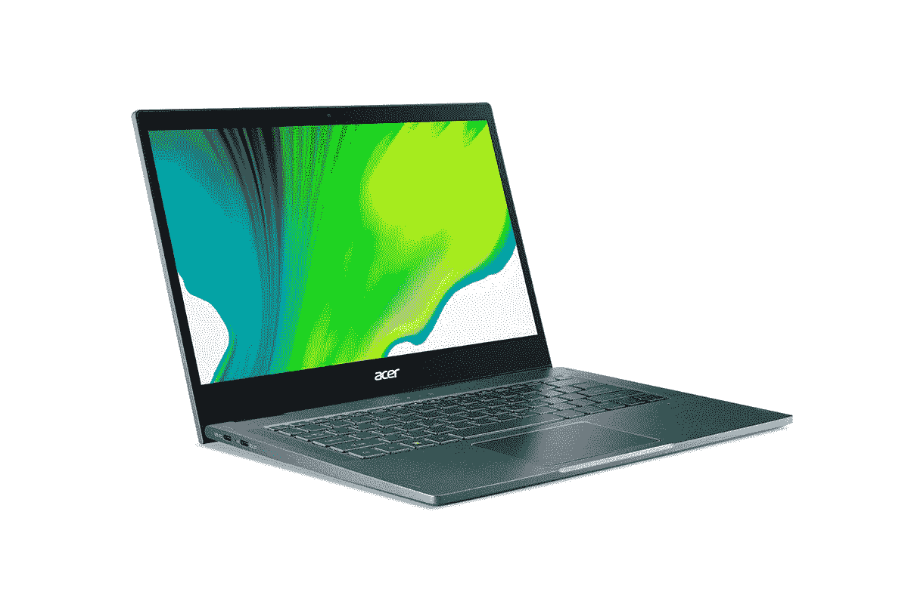
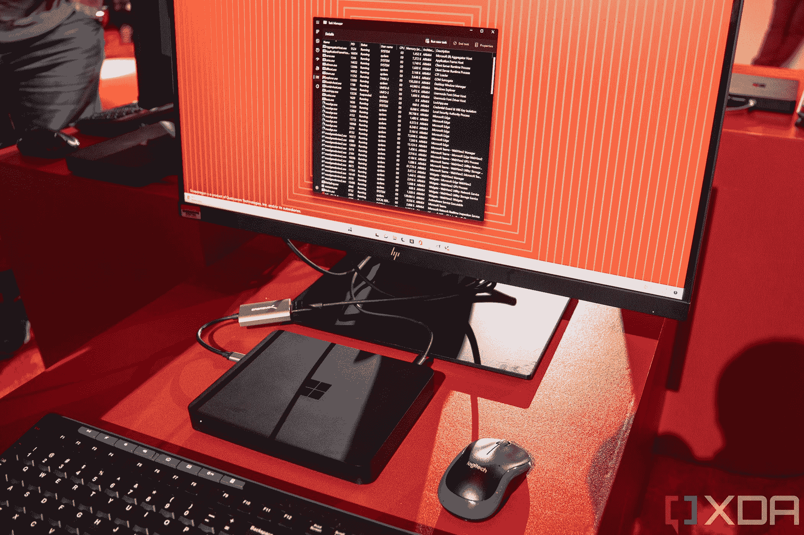

# 2023 年 ARM 笔记本电脑上的最佳 Windows

> 原文：<https://www.xda-developers.com/best-windows-on-arm/>

微软和高通早在 2017 年就首次推出了基于 Arm 的 Windows，但 Arm 设备的普及需要一些时间。能够在基于 Arm 的处理器上运行 Windows 是一件大事。Arm 处理器提供永远在线的连接和即时唤醒功能，其中许多处理器都带有蜂窝连接功能，而无需额外付费。Arm 设备上最初的几个 Windows 都有相同的处理器，这不是很好。

但是现在，有多种 Arm 处理器为使用每种处理器的个人电脑和设备而设计。同样值得一提的是，由于 [Windows 11](https://www.xda-developers.com/windows-11/) ，这些设备现在甚至更好，微软增加了对 x64 仿真的[支持。这意味着你现在可以在这些笔记本电脑上运行大多数应用程序，即使它们不再有 32 位版本。尽管如此，这一领域的选择比以前多了，尽管我们不得不说仍然没有太多的变化。如果您一直在寻找一款搭载出色 Windows 操作系统的 Arm 笔记本电脑，我们已经为您收集了最佳选择。](https://www.xda-developers.com/windows-11-features-in-preview/)

## 最佳整体:带 5G 的 Surface Pro 9

也许现在搭载 Arm 处理器的 Windows 笔记本电脑并不多，但这并不能阻止 5G 的 [Surface Pro 9 成为你今天可以买到的](https://www.xda-developers.com/surface-pro-9-5g-review/)[最好的 Windows 平板电脑](https://www.xda-developers.com/best-microsoft-surface-pcs/)之一，也可以说是最好的 Windows 笔记本电脑之一。与它的前辈 Surface Pro X 相比，它有一个快速的处理器和一些受欢迎的升级。

这款新处理器是微软 SQ3 芯片组，是高通骁龙 8cx Gen 3 的略微调整版本，它是一款非常快速的处理器，具有八个内核(四个 Cortex-X1 内核和四个 Cortex-A78 内核)，能够提升至 3GHz。与以前的型号相比，它在性能上有了很大的提升，并且更加符合现代英特尔设备。配备 5G 的 Surface Pro 9 还可以配置高达 16GB 的 RAM 和 512GB 的 SSD 存储，实现全面的高端体验。

配备 5G 的 Surface Pro 9 的一大亮点是显示屏，这是一个 13 英寸的面板，具有非常清晰的 2880 x 1920 分辨率，观看体验非常棒。更重要的是，120Hz 的刷新率使一切，从过渡到动画，都显得更加流畅。

在显示屏上方，有一个支持 Windows Studio Effects 的 500 万像素网络摄像头，添加了人像模糊、眼神交流和语音聚焦等功能，使视频和语音通话更加出色。Windows Studio Effects 应该在大部分搭载 Arm 处理器的 PC 上支持。前置摄像头还支持 Windows Hello 面部识别，背面有一个 100 万像素的摄像头，可以录制 4K 视频。

在设计方面，配备 5G 的 Surface Pro 9 与常规 Surface Pro 9 基本相同，厚度为 9.4 毫米，重量为 1.84 磅，用于 6GHz 以下的型号，而 mmWave 型号(在美国上市)略重，重量为 1.95 磅。然而，与基于英特尔的型号不同，5G 型号只有经典的铂金色。除此之外，它就是你对 Surface 的所有期望，拥有干净时尚的外观和可选的可拆卸键盘。

至于端口，5G 的 Surface Pro 9 并不惊艳。它只有两个 USB Type-C 端口，专门支持 USB 3.2 Gen 2，甚至没有耳机插孔。如果你想将许多外设连接到你的笔记本电脑，你可能需要[适配器或扩展坞](https://www.xda-developers.com/best-docking-stations-surface-pro-9/)，因为没有 Thunderbolt 支持，当谈到你可以购买的坞站时，你的选择有点有限。当然，如果你想使用蜂窝连接，也有一个 nano-SIM 卡插槽。

它在端口选择上确实有一个很大的缺点，但 [Surface Pro 9 很容易成为](https://www.xda-developers.com/surface-pro-9-windows-on-arm-ready-mainstream/)周围最好的 Arm 笔记本电脑之一，你可以在下面购买。

##### 微软 Surface Pro 9 带 5G

Surface Pro 9 with 5G 是一款高端 Windows 平板电脑，具有时尚的设计、漂亮的显示屏和出色的微软 SQ3 处理器，提供了 Windows Arm 笔记本电脑中的一些最佳性能。

## 最佳翻盖笔记本电脑:联想 ThinkPad X13s

紧随 Surface Pro 9 的是[联想 ThinkPad X13s](https://www.xda-developers.com/lenovo-thinkpad-x13s-review/) ，这是第一款搭载高通骁龙 8cx Gen 3 的 Windows 笔记本电脑。这仍然使它成为这一类别中最快的设备之一。此外，标志性的 ThinkPad 设计也在这里，如果你想用你多年来习惯的外观尝试新技术，这是理想的选择。

骁龙 8cx Gen 3 处理器是上一代性能的巨大飞跃，它使这款笔记本电脑实际上可以用于多任务处理和要求更高的办公室工作，即使你必须运行一些模拟应用程序。这款笔记本电脑还可以配置高达 32GB 的内存，这在几乎任何其他基于 Arm 的笔记本电脑上都找不到。存储容量高达 1TB 固态硬盘。

说到显示器，ThinkPad X13s 有一个 13 英寸的面板，顾名思义，它有 16:10 的宽高比，这意味着你有更多的空间来阅读和编写文档、电子表格和其他任何东西。它采用全高清+分辨率(1920 x 1200)，如果你愿意，你可以添加触摸支持。分辨率没有升级选项，但你可以选择一个低功耗的显示器选项，亮度高达 400 尼特，比基本型号的 300 尼特略好。

在显示屏上方，有一个 500 万像素的网络摄像头，这是你在这个列表中可以找到的最好的摄像头之一。基本配置不包括 Windows Hello 支持，但它是一个可选的升级。您还可以添加计算机视觉，使笔记本电脑能够检测您何时靠近或远离它，并相应地唤醒或锁定它。

在设计方面，联想 ThinkPad X13s 正是你对 ThinkPad 的期望，无论是好是坏。很高兴看到这一点，因为直到现在还没有任何采用 Arm 处理器的 ThinkPads，所以如果你想要采用 Arm CPU 的标志性设计，你终于可以选择了。然而，这不是每个人都会喜欢的样子，所以这取决于你的个人喜好。这款笔记本电脑相当薄，只有 13.4 毫米，重量只有 2.35 磅，因此非常容易随身携带，虽然它有一点老派的外观，但在这方面它绝对是现代的。

至于端口，你有两个 USB 型端口，一个耳机插孔...仅此而已。这是基于 Arm 的笔记本电脑的常见限制，但是如果你愿意，你可以用一个 [USB-C 集线器](https://www.xda-developers.com/best-usb-c-hub/)添加更多端口。还有一个 nano-SIM 卡插槽，这是可选的，如果你给笔记本电脑添加 5G 连接，就会包括在内。如果你这样做，你可以选择获得低于 6GHz 的 5G 或添加毫米波支持，这是你只能在 Arm 笔记本电脑中看到的东西。英特尔或 AMD 型号仅支持 6GHz 以下。

单就性能而言，联想 ThinkPad X13s 当之无愧是最好的基于 Arm 的 Windows 笔记本电脑。然而，除此之外，你还可以获得一个出色的显示屏，一个带有可选面部识别功能的出色的网络摄像头，以及我们首次在 Arm 笔记本电脑中看到的标志性的 ThinkPad 设计。

 <picture></picture> 

Lenovo ThinkPad X13s

##### 联想 ThinkPad X13s

联想 ThinkPad X13s 是目前最强大的基于 Arm 的 Windows 笔记本电脑。它很轻，5G 包装，并具有其他出色的规格。

## 最佳 Arm 敞篷车:宏碁 Spin 7

如果你更喜欢敞篷车，而不是平板电脑或经典翻盖手机，那么 Acer Spin 7 仍然是你的最佳选择，尽管它已经过时了。它仍然有一个功能强大的处理器，但它足够旧，越来越难找到销售，所以我们建议检查前两个选项，除非你绝对需要这种外形。

与 2022 年之前的任何高端 Windows Arm 笔记本电脑一样，Acer Spin 7 配备了高通骁龙 8cx Gen 2 芯片组，具有 8 个内核，运行速度高达 2.84GHz。它还配备了 8GB 内存和 512GB 固态硬盘存储，因此随着时间的推移，您应该会获得可靠的多任务处理能力和充足的文件空间。然而，最有助于它脱颖而出的是，它承诺长达 29 小时的电池寿命，这使得它成为长时间远离插座的长途旅行的理想选择。

显示器是一个 14 英寸的面板，具有 16:9 的宽高比(对于高端笔记本电脑来说这不是最现代的)和全高清分辨率。然而，宏碁 Spin 7 的亮度不如其他产品，最大亮度达到 300 尼特。由于它也是一个可转换的产品，Acer Spin 7 还支持笔输入，并且它内置了一支笔，您可以将其存储在笔记本电脑中，因此您永远不会丢失它。

网络摄像头有点令人失望，因为它是一个 720p 的网络摄像头，没有 Windows Hello 支持，尽管这对宏碁来说是正常的，特别是当这款笔记本电脑问世时。然而，这并不是说没有 Windows Hello 支持，因为键盘上有指纹识别器，所以解锁 PC 还是相当容易的。

得益于双色外观，宏碁 Spin 7 的设计比榜单上的其他笔记本电脑更加引人注目。笔记本电脑的主体是深蓝色的，但盖子上的 Acer 徽标、铰链、键盘按键标签和触控板的边缘都使用金色来突出它们，给设备带来一丝个性。这是一款相当薄的设备，只有 15.9 毫米，这是 Arm 笔记本电脑的共同优势之一。它重 3.09 磅，是这个列表中最重的笔记本电脑之一。不过，它应该还是非常便携的。

Spin 7 在端口方面遇到了与上述笔记本电脑相同的问题，只有两个 USB Type-C 端口和一个耳机插孔。宏碁 Spin 7 还支持 5G，sub-6 和 mmWave 网络都支持。

总的来说，Acer Spin 7 是一款基于 Arm 的出色笔记本电脑，提供出色的性能、漂亮的双音设计，并且可能是该列表中电池寿命最好的设备。

 <picture></picture> 

Acer Spin 7

##### 宏基 Spin 7

Acer Spin 7 是一款高级敞篷车，具有令人惊叹的设计、5G 支持和内置笔，可随时随地记下笔记。

可以说，Arm 设备上最多产的 Windows 之一是微软的 Surface Pro X，它代表了该公司对采用 Arm 处理器的 Windows 设备的大力推动。它于 2019 年首次推出，虽然它已被 Surface Pro 9 的 5G 所取代，但这款旧机型仍有优势，特别是便携性。

在性能方面，Surface Pro X 在 2022 年之前不会偏离其他配备 Arm 处理器的优质 Windows 设备太远。它与微软 SQ1 或 SQ2 处理器一起出售，这些基本上是高通骁龙 8cx 和 8cx Gen 2 的调整版本。他们稍微快一点，但不是很多。它还配备了高达 16GB 的 RAM 和 512GB 的 SSD 存储，这仍然使它成为运行 Arm 处理器的更高端设备之一。16GB 的内存可以在多任务处理性能方面产生很大的差异，因此拥有这一选项非常好。

Surface Pro X 最好的一点就是它的显示屏。它是一个 13 英寸的面板，使用所有 Surface 设备都具有的典型的 3:2 纵横比。就像更新的 Surface Pro 9 配 5G 一样，分辨率是超锐利的 2880 x 1920，但是 Pro X 没有更高的刷新率，所以你卡在了 60Hz。取决于你是谁，这可能不会有很大的不同，但值得记住。相机设置也与 5G 的 Surface Pro 9 相同。你可以在前面获得一个支持 Windows Hello 的 500 万像素摄像头，在后面获得一个支持 4K 视频的 100 万像素摄像头。

设计也是有利于 Surface Pro X 的一点，也是它与 5G 的 Pro 9 相比真正突出的地方。这是一款极其轻薄的平板电脑，厚度仅为 7.3 毫米，重量为 1.7 磅。即使你将 Surface Pro Signature 键盘与 Surface Slim Pen 2 一起添加，你也会看到 Surface Slim Pen 2 的重量为 2.35 磅，厚度为 13.6 毫米，这使得它比 Pro 9 更便于携带。

但是，端口情况与新型号相同。Surface Pro X 有两个 USB Type-C 口，仅此而已；它实际上是第一台没有耳机插孔的 Surface PC，后来蔓延到了 Pro 9 家族。Surface Pro X 的一些型号支持 LTE 连接，尽管一些配置现在只有 Wi-Fi。

即使市场上有了它的继任者，Surface Pro X 仍然值得一些关注，因为超薄设计加上如今你可以在它身上找到的大折扣。如果你能以折扣价找到它，这是进入 Arm 上的 Windows 生态系统的一个很好的方式。你也可以通过添加 Surface Pro 签名键盘和 Surface Slim Pen 2，将其变成更典型的笔记本电脑体验。

 <picture></picture> 

Surface Pro 8

##### 微软 Surface Pro X

Surface Pro X 是 Arm 平板电脑上最好的高级 Windows，具有高分辨率显示屏和网络摄像头。

## Arm PC 上的最佳预算窗口:三星 Galaxy Book Go

在众多基于 Arm 的高端设备中，[三星 Galaxy Book Go](https://www.xda-developers.com/samsung-galaxy-book-go-review/) 是一股新鲜空气，旨在为入门级市场提供这个价位的其他笔记本电脑所不具备的功能。

这是一款传统的翻盖式设备，它与骁龙 7c Gen 2 一起包装，是首批这样做的消费设备之一。这与我们迄今为止看到的骁龙 8cx 笔记本电脑的性能不在同一水平上，但与同价位的其他笔记本电脑相比，它一点也不差。它还配有 4GB 内存和 128GB 存储空间，对于这个价格的笔记本电脑来说，这是可以接受的。这显然不会是一个令人兴奋的体验，但是如果你在这个价格范围内购物，它和你在其他地方找到的一样好。

所有这些都适用于基本型号，但你可以购买 5G 型号，其价格超过两倍。这确实增加了一个更强大的芯片组(骁龙 8cx Gen 2)，8GB 内存和 256GB 存储空间。它还增加了 5G 支持，而基本型号没有任何蜂窝连接。你可以在三星的网站上查看 5G 型号。

不过，350 美元的基本款也有一些很好的卖点，比如显示屏。这是一个 14 英寸的面板，它有全高清分辨率。这与列表中的许多高端笔记本电脑相同，虽然有些人可能认为全高清是最低要求，但这个价位的许多笔记本电脑都没有全高清。当然，屏幕质量本身与那些高端笔记本电脑不在同一水平上，尽管它的摄像头所在的边框有点大，但没有 Windows Hello，它仍然是 720p。事实上，这里没有任何形式的 Windows Hello。

到目前为止，Galaxy Book 超越高端笔记本电脑的一个领域是端口。它配有两个 USB Type-C 端口，一个 USB Type-A，一个耳机插孔和一个 microSD 读卡器。在大多数 Arm 笔记本电脑上你看不到 USB Type-A 端口，所以对于仍然需要它的外设来说，在这里有它是很好的。

它仍然是一款非常便携的笔记本电脑，厚度不到 15 毫米，基本款重 3.04 磅。尽管它仍然是由塑料制成的，但整体设计感觉很棒。在我们的[对三星 Galaxy Book Go](https://www.xda-developers.com/samsung-galaxy-book-go-review) 的评测中，我们甚至注意到它摸起来像金属，规格表也是这样说的。

总的来说，三星 Galaxy Book Go 不是一款令人兴奋的笔记本电脑，但它的价格令人印象深刻。如果你想体验一下 Arm 上的 Windows，而又不想倾家荡产，这是你最好的选择之一。

 <picture></picture> 

Samsung Galaxy Book Go 5G

##### 三星 Galaxy Book Go

三星 Galaxy Book Go 是一款出色的经济型笔记本电脑，具有不错的入门级性能、全高清显示屏和高端设计。

## 最佳商务预算平板电脑:华硕 ExpertBook B3 可拆卸

如果你想要一台比 Surface Pro 9 和 5G 甚至 Pro X(至少在 MSRP)便宜一点的平板电脑，那么华硕有 ExpertBook B3 可拆卸。正如你可能从品牌上猜测的那样，这是一款[商务型设备](https://www.xda-developers.com/best-business-laptops/)，它不是特别高端，但如果你需要它，它是一个可靠的预算选择。

AsusExpertBook B3 可拆卸的核心是一款高通骁龙 7c Gen 2，这是一款入门级处理器，正如我们上文提到的三星 Galaxy Book Go 一样。它仍然有八个内核(两个用于提高性能，六个用于提高效率)，可以提升到 2.54GHz。它可以处理基本的网络浏览，但不适合要求苛刻的工作负载。它还配备了 4GB 的内存和 128GB 的 eMMC 存储，因此这无疑是为那些不需要大量性能的用户准备的。

华硕 ExpertBook B3 可拆卸的一个优点是显示屏。这并不令人惊讶，但这款 10.5 英寸的面板具有 16:10 的高纵横比，因此不会感觉过时。它在 1920 x 1200 的分辨率下也相当清晰。它甚至有一个平滑的 144Hz 刷新率，所以屏幕上的一切都显得更加平滑，虽然它在 320 尼特时不会过于明亮，但它确实有纯色覆盖，所以只要你不在阳光下使用它，你就会获得良好的观看体验。摄像头也相当不错，500 万像素的前置摄像头用于视频通话，1300 万像素的后置摄像头用于拍照和录像。

华硕在设计上也做得很出色，这款平板电脑仅重 1.3 磅，厚度为 9 毫米。结合 10.5 英寸的小显示屏，这是一款非常便携的设备，您可以轻松放入包中。与大多数平板电脑不同，ExpertBook B3 可拆卸电脑是随键盘盖一起出售的，因此你可以将其作为开箱即用的笔记本电脑使用，这使得价格标签更具吸引力。它还包括一个用于 Windows Ink 的 garaged 手写笔。

最后，对于端口，有两个 USB Type-C 3.2 Gen 1 端口和一个 3.5 毫米耳机插孔，这与我们在其他 Arm 设备上看到的非常接近。它不是很好，USB 端口也很慢，但这些都不令人惊讶。

华硕 ExpertBook B3 可拆卸笔记本售价 599.99 美元，包括支架盖和触控笔，是一个不错的预算选择，但如果你打算用这款设备做一些轻度密集型的事情，就很难推荐它。你可以在下面查看一下。

##### 华硕专家书 B3 可拆卸

华硕 ExpertBook B3 可拆卸是一款由高通骁龙 7c Gen 2 处理器驱动的经济型商务平板电脑。

## 奖励选择:Windows 开发套件 2023

 <picture></picture> 

Snapdragon-powered Windows Dev Kit 2023

这多少说明了现在市场上可用的 Arm 笔记本电脑的选择很少，但我们为那些可能想要在办公桌上使用或用于开发目的的人提供了一个选择。Windows Dev Kit 2023 最初被称为 Project Volterra，是一个 Arm 驱动的开发套件，如果你想要强大的性能，并且已经有一个屏幕，这是一个尝试 Arm PCs 的好方法。

就像最新的高级 Arm 笔记本电脑一样，Windows Dev Kit 2023 配备了高通骁龙 8cx Gen 3 芯片组，具有八个内核，速度高达 3GHz，可为各种日常任务提供相当强大的性能，特别是针对 Arm 优化的应用。它还有一个巨大的 32GB 内存，非常适合软件开发，还有一个 512GB 的固态硬盘用于存储。

这是一台非常紧凑的机器，只有 8 英寸宽，6 英寸深，1.1 英寸高。此外，它的重量仅为 960 克，因此您可以轻松地将它带到您需要的任何地方。它还有一个不错的端口选择，包括两个 USB Type-C 端口，三个 USB Type-A 端口，迷你显示端口和以太网。这是 Windows Arm 设备上的最佳端口选择，尽管这基本上是台式 PC 的必需品。

Windows Dev Kit 2023 售价 599.99 美元，是在 Windows PC 上测试最快的 Arm CPU 的一个很好的方式，而无需花费昂贵的笔记本电脑。它甚至包括 Windows 11 Pro 许可证，使价格更加合理。

##### Windows 开发工具包 2023

Windows Dev Kit 2023 专为希望采用 Arm 的开发人员打造，具有强大的骁龙 8cx Gen 3 芯片组和一系列端口，非常适合桌面设置。

* * *

这涵盖了 Arm 笔记本电脑(和一台台式机)上的大多数当前窗口，与英特尔和 AMD 产品相比，这仍然显示出一个缺乏的生态系统。尽管如此，在外形、设计甚至价位上还是有变化的。我们选择了支持 5G 的 Surface Pro 9 作为最佳选择，因为它拥有最快的处理器以及非凡的显示屏和优质的设计，但如果你想要一些不同的东西，还有其他很好的选择。

不过，你可能不想要 Arm 笔记本电脑，因为它有很多限制。比如 Arm 笔记本电脑没有 [Thunderbolt](https://thunderbolttechnology.net/consumer/) ，所以不能用 Thunderbolt dock 进行扩展。如果你需要的话，我们有一份[最好的支持雷电的笔记本电脑](https://www.xda-developers.com/best-thunderbolt-3-laptops/)的列表。