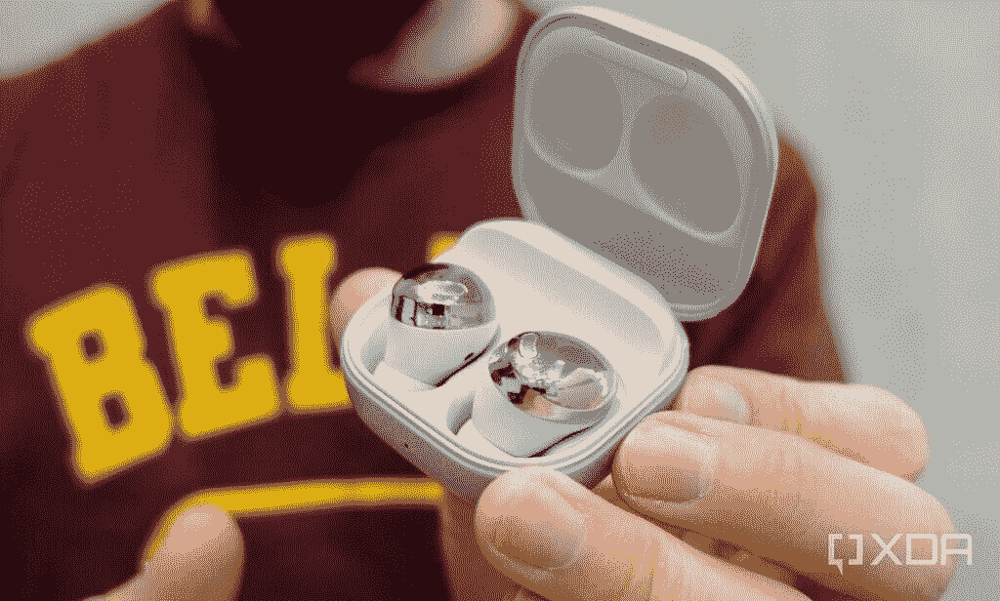
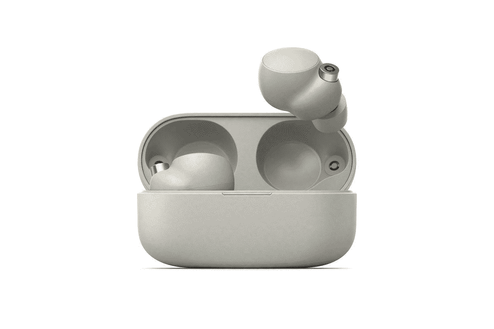
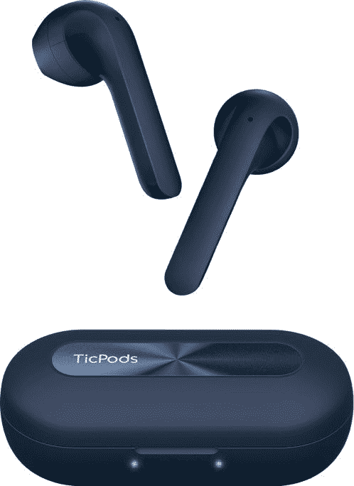

# 2023 年 Galaxy S21、Galaxy S21 Plus 和 Galaxy S21 Ultra 最佳无线耳塞

> 原文：<https://www.xda-developers.com/best-wireless-earbuds-galaxy-s21/>

三星的 [Galaxy S21](https://www.xda-developers.com/samsung-galaxy-s21) 手机是迄今为止[最好的安卓设备](https://www.xda-developers.com/best-android-phones/)，有三种型号(普通、增强和超级)，起价仅为 800 美元。最近[的 Galaxy S21 交易](https://www.xda-developers.com/best-galaxy-s21-deals/)甚至让手机降价 200 美元，你可以期待未来几个月更多的折扣。无论你花多少钱买任何一款手机，都没有太多缺点，除了耳机插孔早就没有了。

三星的旗舰系列用去年的 S20 系列失去了心爱的 3.5mm 插孔，在 S21 阵容上也没有任何回报。这意味着如果你不想处理适配器，如果你没有一副有线 USB Type-C 耳机，你需要一副无线耳塞来欣赏音乐。即使你有有线耳机，真正的无线耳塞可能是一个值得的升级。

在本指南中，我们将看看 Galaxy S21 系列的一些最佳无线耳塞。如果你还没有为你的新手机购买手机套，也可以看看我们的[最佳 Galaxy S21 手机套](https://www.xda-developers.com/best-galaxy-s21-cases/)综述。

## 三星 Galaxy Buds Pro

大多数人认为，Galaxy S21 系列的最佳耳塞是三星自己的 Galaxy Buds Pro。耳塞不仅听起来很棒，而且还支持主动降噪(ANC)，其内部电池可以持续大约五个小时。当需要给它们充电时，你可以使用 USB Type-C 电缆或 Qi 无线充电板。

 <picture></picture> 

The Galaxy Buds Pro in its charging/carrying case.

| 

规格

 | 

银河芽专业版

 |
| --- | --- |
| **电池寿命** | 大约 5 个小时，18 个小时 |
| **充电** | USB Type-C，Qi 无线 |
| **编解码器** | 可扩展(三星专有)、AAC、SBC |
| **耐水性** | IPX7 |
| **颜色** | 幻影紫，幻影银，幻影黑 |

Galaxy Buds Pro 在与三星设备配对时有一些额外的功能。buds 支持三星专有的可扩展音频编解码器，据三星称，该编解码器“通过根据蓝牙连接的强度改变比特率来防止音频斩波”。你也可以在任何最新的 Galaxy S 或 Note 手机背面无线充电耳塞外壳，尽管这也适用于任何 Qi 兼容的耳塞。

Galaxy Buds Pro 最明显的缺点是触摸控制有点挑剔——很容易通过调整耳朵上的耳塞意外暂停音乐或跳到下一首曲目。如果需要，您可以完全关闭触摸控制(以及更改其他选项)。buds 在与 Galaxy 手机配对时也使用三星的 Bixby 语音助手，但很容易将 buds 切换到谷歌助手。

如果你对我们的全部想法感到好奇，请查看我们的 [Galaxy Buds Pro 评论](https://www.xda-developers.com/samsung-galaxy-buds-pro-review/)了解所有的基本细节。

 <picture></picture> 

Samsung Galaxy Buds Pro

##### 三星 Galaxy Buds Pro

这些是 Galaxy S21 的终极耳塞，配有 ANC 并支持三星的可扩展音频编解码器。然而，在 200 美元的建议零售价，他们是昂贵的一方。

## 三星 Galaxy 芽 2

这是三星自己的又一款产品，这意味着你将获得与 Galaxy S21 系列的最佳兼容性。一般来说，三星的耳塞与三星智能手机配合得最好，因为所有需要的应用程序和服务都预装在一个用户界面中。

| 

规格

 | 

三星 Galaxy 芽 2

 |
| --- | --- |
| **电池寿命** | 5 小时(充电情况下 20 小时) |
| **充电** | USB-C，Qi 无线 |
| **编解码器** | 可扩展(三星专有)、AAC、SBC |
| **耐水性** | IPX2 |
| **颜色** | 白色、橄榄色、石墨色、淡紫色 |

Galaxy Buds 2 取代了 Galaxy Buds +, Galaxy Buds+无疑是预算中最好的 TWS 耳机之一。与上一代 Buds+相比，这些耳塞有一些急需的改进，如 ANC，使它们更具吸引力。音质非常接近你从 Galaxy Buds Pro 获得的音质，Galaxy Buds Pro 是这个列表中的首选，也是你可以获得的最好的无线耳塞之一。

Galaxy Buds 2 具有 IPX2 等级，配有三个麦克风，即使在接听电话时也能获得清晰的音频。三星还推出了一些机器学习算法，以帮助降低高达 98%的环境噪音。这些耳塞的唯一缺点是你不能进行入耳式检测，所以如果你在播放音乐时把耳塞从耳朵上摘下来，音轨不会自己暂停。如果你不介意，那么 Galaxy Buds 2 是一个很好的选择。

 <picture></picture> 

Samsung Galaxy Buds 2

##### 三星 Galaxy 芽 2

Galaxy Buds 2 拥有一副优质 TWS 耳塞的所有核心功能，但价格合理，是大多数人的理想选择。

## 三星 Galaxy Buds 直播

如果你通常不喜欢入耳式耳塞(像我一样)，或者 Galaxy Buds Pro 太贵，Galaxy Buds Live 可能适合你。buds 的独特形状为它们赢得了“银河豆”的绰号，但它们非常适合大多数人的耳朵，并具有 Buds Pro 的大多数功能。

| 

规格

 | 

银河蓓蕾直播

 |
| --- | --- |
| **电池寿命** | 大约 6 个小时，20 个小时 |
| **充电** | USB Type-C，Qi 无线 |
| **编解码器** | 可扩展(三星专有)、AAC、SBC |
| **抗水性** | IPX2 |
| **颜色** | 神秘的青铜色，神秘的白色，神秘的黑色 |

就像 Galaxy Buds Pro 一样，Buds Live 可以通过 USB Type-C 或 Qi wireless 充电，当与 Galaxy 设备配对时，还支持三星特殊的可扩展音频编解码器。耳塞的防水能力也有限，但不要带着它们去游泳。控制和音频可通过三星可穿戴应用程序进行定制。

这里的主要缺点是主动噪声消除。虽然耳塞*在技术上*有 ANC，但你需要一个入耳式设计来适当隔离噪音，所以 ANC 在打开时几乎没有影响。如果屏蔽外界是一个必要的功能，那就选择 Buds Pro 或下面提到的索尼耳塞。查看[我们对银河芽直播](https://www.xda-developers.com/samsung-galaxy-buds-live-review/)的评论，了解我们的全部想法。

 <picture></picture> 

Samsung Galaxy Buds Live

##### 三星 Galaxy Buds 直播

Galaxy Buds Live 是 Buds Pro 的一个非常便宜的替代产品，具有大多数相同的软件功能和独特的设计。然而，非国大并没有很好地发挥作用。

## 索尼 WF-1000XM4

索尼 WF-1000XM4 取代了他们的前辈 WF-1000XM3，这是一对很棒的耳塞。索尼的新耳塞比他们的前辈更小，并配有 IPX4 防水功能。此外，您将获得惊人的主动噪声消除(ANC)，如 buds 上的 WF-1000XM3，以及卓越的音频质量。

| 

规格

 | 

索尼 WF-1000XM4

 |
| --- | --- |
| **电池寿命** | 8 小时左右，24 小时都有病例 |
| **充电** | USB Type-C，Qi 无线 |
| **编解码器** | AAC、SBC、LDAC |
| **耐水性** | IPX4 |
| **颜色** | 黑色、银色 |

索尼耳塞可以持续 8 小时，并配有快速配对支持。因此，这些耳塞将与您的 Galaxy S21 系列手机无缝配对。您可以使用 Type-C 电缆或无线方式为索尼 WF-1000XM4 充电。

 <picture></picture> 

Sony WF-1000XM4

##### 索尼 WF-1000XM4

索尼的 WF-1000XM4 可以说是市场上最好的 ANC 无线耳塞。

## 一加芽专业

一加芽专业是最令人印象深刻的一对 TWS 耳塞，你可以买到。最初，一加没有真正做好它的音频产品，尤其是在 TWS 类别。然而，他们凭借一加 Buds Pro 强劲反弹，这是我们最喜欢的 TWS 鞋之一，将于 2021 年推出。

| 

规格

 | 

一加芽专业

 |
| --- | --- |
| **电池寿命** | 5 小时(充电情况下 23 小时) |
| **充电** | USB Type-C，Qi 无线 |
| **编解码器** | LHDC、AAC、SBC |
| **抗水性** | IP55 |
| **颜色** | 黑色，白色 |

最初的一加 Buds 不是市场上声音最好的耳机。后来推出的 Buds Z 在降低成本的同时肯定对它们进行了改进，但仍然缺少一些重要的功能，如 ANC。一加芽亲修复所有这些缺点。Buds Pro 是你能以₹10,000.的价格买到的最好的 TWS 耳机之一这些耳塞的音频质量非常好，声音信号倾向于稍微重低音的一侧。

如果你正在寻找一副听起来很有趣的耳机，并且可能对每个尝试过的人都有吸引力，这是一副可以考虑的好耳机。它还拥有你所期望的所有重要功能，如入耳式检测、ANC、触摸控制等。它们与一加手机配合使用时效果最佳，但你可以通过安装应用程序将它们与几乎任何安卓或 iOS 设备配合使用。在你决定是否购买它们之前，你可以在我们的[一加芽专业评论](https://www.xda-developers.com/oneplus-buds-pro-review/)中了解更多信息。

 <picture></picture> 

OnePlus Buds Pro

##### 一加芽专业

一加 Buds Pro 是这个价位最好的 TWS 耳机之一，具有良好的音质、ANC 和一些智能功能。

## 谷歌像素芽 A 系列

如果你不想在新的无线耳塞上花费太多，谷歌 Pixel Buds A 系列是一个很好的选择。耳塞一次充电可以持续五个小时，可以使用 Type-C 端口充电。Pixel Buds A 系列没有无线充电支持或主动噪音消除功能。

| 

规格

 | 

谷歌像素芽 A 系列

 |
| --- | --- |
| **电池寿命** | 大约 5 小时，24 小时与案件 |
| **充电** | USB 类型-C |
| **编解码器** | AAC，SBC |
| **耐水性** | IPX4 |
| **颜色** | 清晰的白色，深橄榄色 |

但谷歌耳塞提供了良好的音质，以及与包括 Galaxy S21 系列在内的安卓设备的无缝配对体验。此外，鉴于这些是谷歌芽，你得到谷歌助理集成。最后，还有 IPX4 防水性。

 <picture></picture> 

Google Pixel Buds A-Series

##### 谷歌像素芽 A

谷歌 Pixel Buds A 系列是 Pixel Buds 的低调版本。这是无线耳塞的一个很好的预算选择。

## 无事耳(1)

作为一个制造智能手机配件的品牌，没有什么是今年才开始的。它的第一个产品是一副名为“无耳”的真正无线耳塞。这是你能以较低的价格买到的最好的 TWS 耳机之一，应该很适合大多数人。如果你不想要上面列出的三星耳塞，你应该考虑这些。

| 

规格

 | 

无事耳(1)

 |
| --- | --- |
| **电池寿命** | 4 小时(充电情况下 28 小时) |
| **充电** | USB Type-C，Qi 无线 |
| **编解码器** | AAC，SBC |
| **耐水性** | IPX4 |
| **颜色** | 白色，黑色 |

[Nothing ear (1)](https://www.xda-developers.com/nothing-ear-1-review/) 是₹6k 商标下进入印度 TWS 市场的最新产品，对于任何想要一副能搞定大部分事情的 TWS 耳机的人来说，这绝对是一个不错的选择。它听起来很棒，它有有效的 ANC，它有清晰、独特的设计，使它在一群相似的耳塞中脱颖而出，它拥有你在一副 TWS 耳塞上寻找的所有重要功能。

ear (1)应用程序也做得很好，可以用来定制耳塞上的触摸控制。你得到了入耳式检测，两个级别的 ANC，一个透明模式，以及在你放错地方的情况下找到耳塞的能力。还有无线充电的情况下，这是一个奖励。

当然也有一些缺点，比如平均电池寿命和略显笨重的外壳设计，但音质和功能集弥补了这一点。如果你正在寻找一副基本功能齐全的 TWS 耳机，这应该是你的选择。

 <picture></picture> 

Nothing ear (1)

##### 无耳 1

无耳(1)是一对 TWS 耳塞，会让大多数人对他们的声音签名感到满意，因此，是一个很好的选择，让基本权利。

## Mobvoi TicPods 2 Pro+

如果你想要 AirPods 风格的耳塞，更好地与 Android 设备配合，包括 Galaxy S21 系列，Mobvoi TicPods 2 Pro+是最佳选择之一。它们的设计类似于 AirPods，但外壳使用 USB Type-C 充电，所有功能在 Android 和 iOS 上都可用。

| 

规格

 | 

Mobvoi TicPods 2 Pro+

 |
| --- | --- |
| **电池寿命** | 大约 4 小时，204 小时 |
| **充电** | USB 类型-C |
| **编解码器** | 高通 aptX，AAC，SBC |
| **耐水性** | 没有人 |
| **颜色** | 冰，海军 |

TicPods 是这个列表中唯一支持高通 aptX 音频编解码器的耳塞，这意味着你可以在任何使用高通芯片组的 Android 设备上获得出色的无线性能(包括 Galaxy S21)。如果你要在几款不同的手机和平板电脑之间切换，如果它们中的大多数都有高通硬件，那么它们可能是最佳选择。然而，耳塞没有 ANC 或无线充电。

 <picture></picture> 

TicPods 2 Pro+

##### TicPods 2 Pro+

这些耳塞与苹果 AirPods 的设计非常匹配，但可以通过 USB Type-C 充电，并支持高通的 aptX 音频编解码器。

* * *

这些是市面上最好的三星 Galaxy S21 系列手机无线耳塞。如果你在寻找 Galaxy S21 系列之外的更多选择，你可以看看我们为所有手机策划的[最佳真无线耳塞](https://www.xda-developers.com/best-wireless-earbuds/)列表。