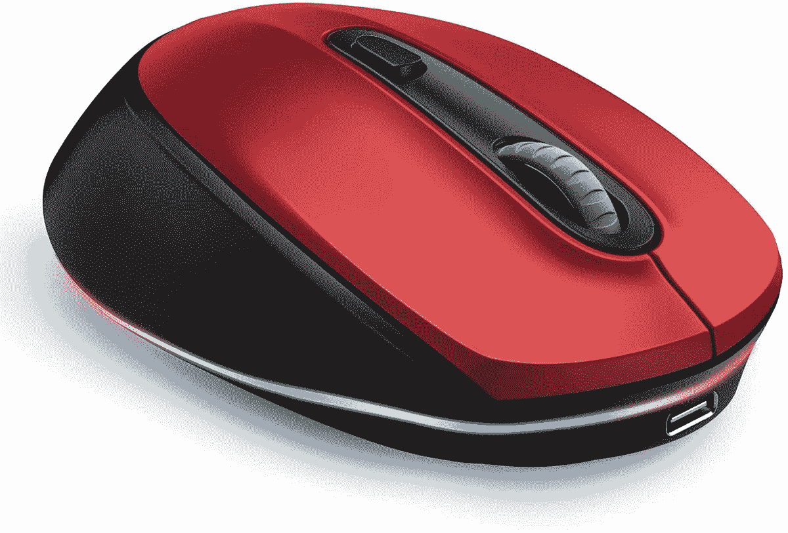
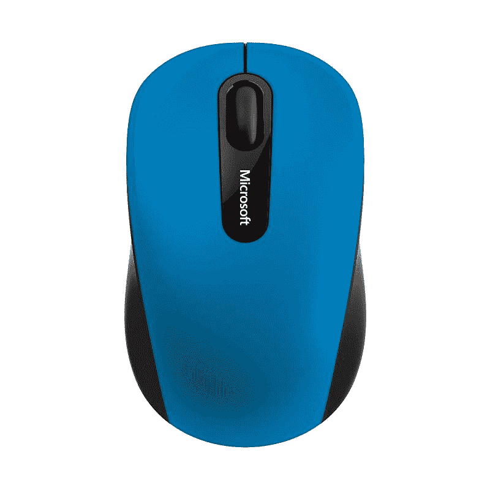
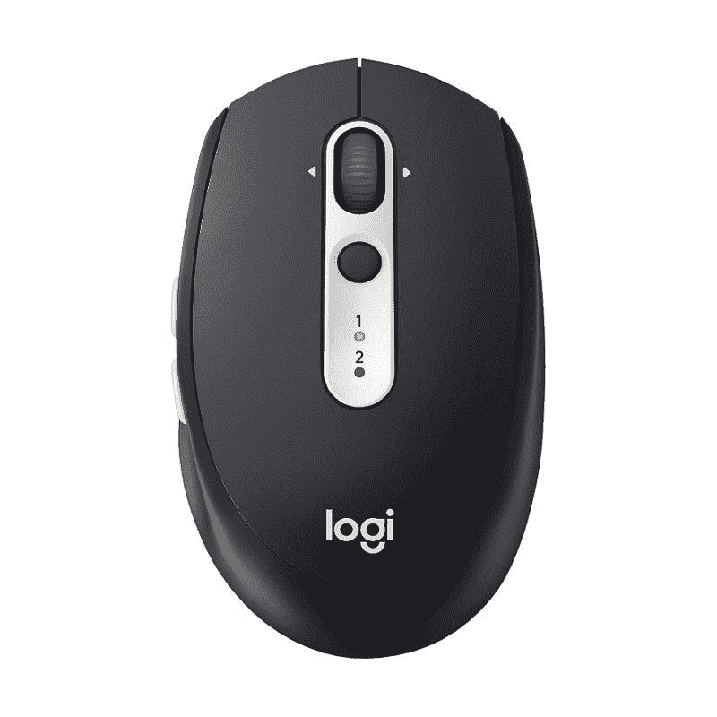
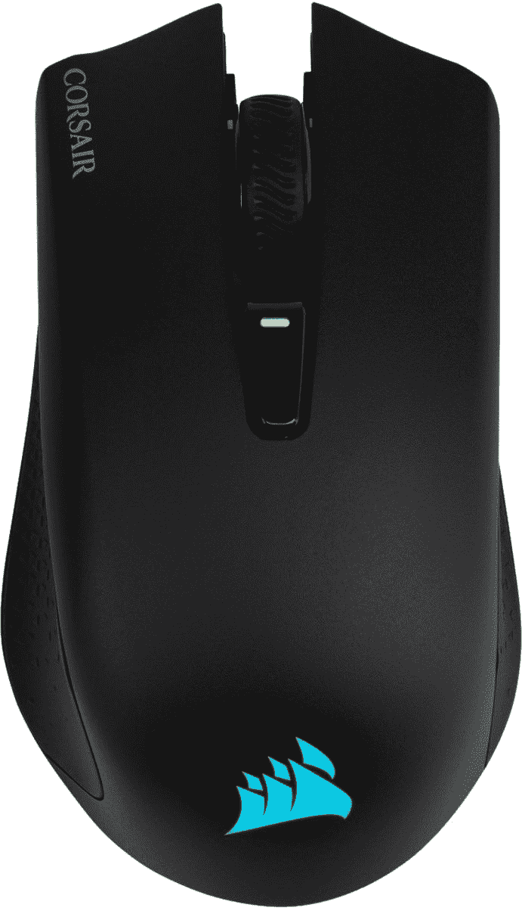
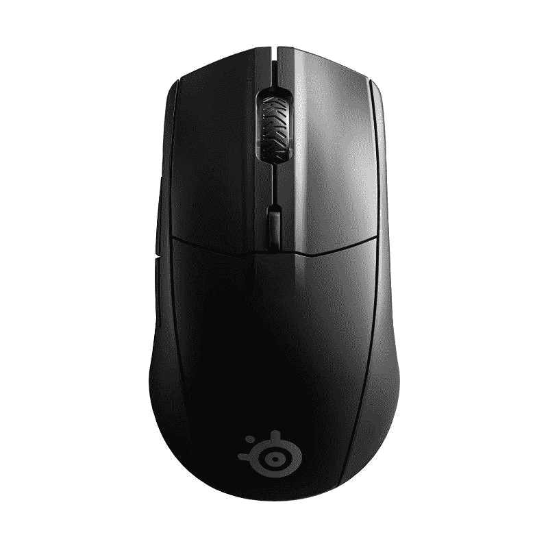
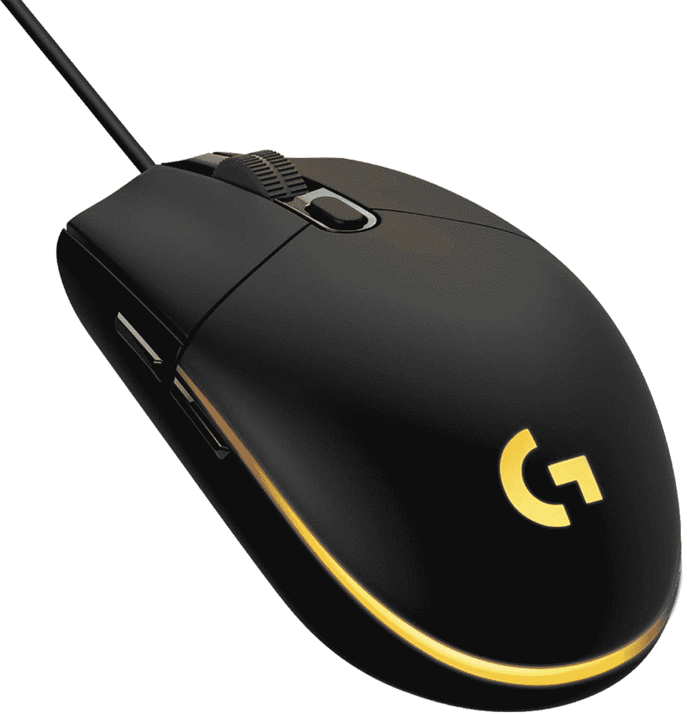
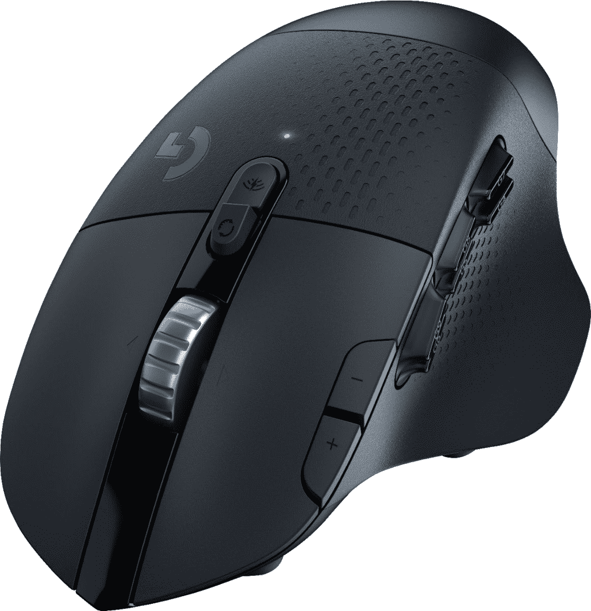

# Mac 的最佳有线和无线鼠标选择

> 原文：<https://www.xda-developers.com/best-wireless-mouse-mac/>

鼠标是 Mac 的一个方便附件。与触控板相比，它们使用起来没有那么麻烦，并且更容易完成比平时要求更高精确度的任务。然而，由于市场上有很多好的鼠标，为你的 Mac 挑选一个可能会很困难。首先，你必须考虑你对鼠标有什么要求——你需要什么特别的功能吗？你玩很多游戏吗？或者是否适合旅行？

其次，假设 USB 端口在你的 Mac 上是奢侈品。在这种情况下，连通性是任何鼠标都要探索的另一个领域。在有线和无线鼠标之间，带蓝牙的无线鼠标将是您更好的选择。它不仅可以为您节省一个 USB 端口，而且不会占用您的桌面空间，也不会与其他外围设备纠缠在一起。

为了让您更轻松地找到鼠标，我们收集了一些市场上最好的有线和无线鼠标。此外，如果你在市场上为你的 MacBook Pro 寻找一个外壳，我们在我们的[最佳 MacBook Pro 外壳指南](https://www.xda-developers.com/best-macbook-pro-cases/)中有一些很好的选择，并且还有[为你的 MacBook Pro 提供的优秀 USB C 集线器](https://www.xda-developers.com/best-macbook-pro-usb-c-hubs/)。

## Mac 的最佳有线和无线鼠标选择

 <picture></picture> 

Apple Magic Mouse

##### 苹果魔法鼠标

作为苹果公司的产品，神奇鼠标可以与每台 Mac 电脑无缝配合。然而，就价格而言，它偏高。这款神奇鼠标也可以充电，但闪电接口奇怪的位置可能会让一些人感到厌烦。

 <picture></picture> 

Roccat Kone Pro

##### Roccat Kone Pro

Roccat Kone Pro 是一款出色的有线鼠标，适用于从办公到游戏的几乎所有应用。它超级轻，有一个舒适的形状，和整体良好的建设质量。您还可以获得较低的点击延迟。不幸的是，用于定制的配套软件只与 Windows 兼容。

 <picture></picture> 

Logitech M720 Triathlon

##### 罗技 M720 铁人三项赛

罗技 M720 Triathlon 最多可以与三台机器配对，您只需按一个按钮就可以在它们之间切换。它可以使用蓝牙和 USB 接收器工作。此外，它有六个按钮，可使用 Logitech 软件定制。

 <picture></picture> 

Seenda Bluetooth Mouse

##### Seenda 蓝牙鼠标

Seenda 蓝牙鼠标价格实惠，支持蓝牙和 USB 接收器连接。它可以在三个 DPI 级别下工作，并提供卓越的耐用性。此外，该鼠标有 10 种颜色可供选择，带 LED 照明。

 <picture></picture> 

Microsoft Bluetooth Mobile Mouse 3600

##### 微软蓝牙移动鼠标 3600

如果你的预算有点紧张，这款微软蓝牙鼠标值得考虑。它只使用蓝牙连接，其设计适用于左手和右手用户。

 <picture></picture> 

Logitech M585

##### 罗技 M585

罗技 M585 是 M720 铁人三项的一个略微低调的版本。它匹配 M720 的所有功能，除了超快速滚动。它还可以与蓝牙和 USB 接收器一起工作。

 <picture></picture> 

Corsair Sabre RGB Pro

##### 海盗船军刀 RGB 专业版

Corsair Sabre RGB Pro 是一款卓越的有线游戏鼠标，但它也非常适合办公室工作。它是市场上首批提供 8000MHz 最大轮询速率的鼠标之一。轮询速率决定了鼠标告诉计算机其位置的频率。Sabre RGB Pro 的构造也很好，重量很轻，并且具有非常低的点击延迟。

 <picture></picture> 

Corsair Harpoon RGB Wireless

##### 海盗船鱼叉 RGB 无线

海盗船鱼叉 RGB 无线鼠标是另一个伟大的游戏鼠标，你可以在 MAC 上使用。它小巧轻便，非常适合旅行使用。此外，它提供了非常低的延迟，并与蓝牙和 USB 接收器一起工作。

 <picture></picture> 

Logitech MX Master 3 for Mac

##### 罗技 MX Master 3

罗技 MX Master 3 是我们挑选的最贵的鼠标之一，的确如此。它充满了应用程序特定的配置文件和 macOS 手势支持等功能。更重要的是，它甚至可以在玻璃上工作。

 <picture></picture> 

SteelSeries Rival 3

##### 钢铁系列竞争对手 3

如果你打算在 Mac 上玩游戏，你最好买 SteelSeries 的对手 3。这款无线游戏鼠标提供超低延迟的无线性能。它还具有极高的耐用性。此外，它双手灵活。

 <picture></picture> 

Logitech Pebble M350

##### 罗技 Pebble M350

如果您正在寻找一款不占用太多空间且适合移动生活的产品，罗技 Pebble M350 可能是您的最佳选择。它采用极简现代设计，超便携。此外，它可以通过蓝牙和 USB 接收器连接。

 <picture></picture> 

Satechi M1

##### 萨特奇 M1

如果你正在寻找一个严肃的鼠标，但比微软的选项更有天赋，Satechi M1 是你的选择。它可以毫不费力地与所有 MAC 兼容，并采用符合人体工程学设计的铝合金表面。

 <picture></picture> 

Logitech G502 Hero

##### 罗技 G502 英雄

罗技 G502 Hero 是 macOS 用户的另一款好鼠标。它看起来很好，有一个优秀的构建质量。鼠标带有可编程按钮，您可以使用 G Hub 软件定制这些按钮。然而，它稍微大一点，重一点。

 <picture></picture> 

Logitech G203 LightSync

##### 罗技 G203 Lightsync

罗技 G203 LightSync 是一款简单的有线鼠标。如果你不想花太多的钱，需要一些基本的权利，你不能出错与 G203 光同步。它看起来也很体面，有一个良好的建设质量。

 <picture></picture> 

Logitech MX Vertical

##### 罗技 MX 垂直

如果你正在寻找一个符合人体工程学的鼠标，罗技 MX 垂直是市场上最好的。其独特的设计减少了肌肉紧张和前臂扭曲。此外，由于板载电池和蓝牙支持，您可以通过有线和无线方式使用它。

 <picture></picture> 

Razer Basilisk V3

##### 雷蛇蛇怪 V3

虽然定位于游戏爱好者，但 Razer Basilisk V3 在办公和多媒体工作方面同样出色。它制作精良，对于大多数手的尺寸来说使用起来都很舒适。不幸的是，你不能在 macOS 上使用配置文件切换功能，因为没有 macOS 软件来创建多个配置文件。

 <picture></picture> 

Logitech G604 LIGHTSPEED Wireless Gaming Mouse ($55 off)

##### 罗技 G604 光速

罗技 G604 Lightspeed 主要是一款游戏鼠标，也是一款很棒的鼠标，但如果你想要一款顶级的办公用鼠标，它是右手用户的绝佳选择。握持舒适，性能出众。然而，由于它的尺寸很长，手小的人可能很难够到所有的按钮。

 <picture></picture> 

Contour Design Unimouse

##### 轮廓设计

如果你正在为你的 Mac 电脑寻找一个很棒的符合人体工程学的鼠标，Contour Design 的 Unimouse 值得考虑。它有右手和左手两种型号，配有可调角度和拇指支架。然而，没有蓝牙支持，但你有一个 2.4GHz 的无线 USB 适配器。

这些是目前最适合 Mac 的有线和无线鼠标。罗技 M720 Triathlon 是无线鼠标的绝佳选择，而 [Roccat Kone Pro](https://shop-links.co/1755080369678537148?u1=1f76c327-9a2c-47d8-80b8-1a1e6ecc245f) 对于大多数人来说是一款很棒的有线鼠标。然而，如果你对游戏感兴趣，你可能更喜欢海盗船军刀 RGB Pro。如果你想要与 Mac 无缝连接，并且不担心花费更多，Apple Magic Mouse 也是不错的选择。

说到选择鼠标，这完全取决于你的个人喜好。只要确保您的选择具有您需要的所有功能。当你为你的 Mac 电脑买鼠标时，一定要买一个像样的鼠标垫——你不会后悔的。与此同时，请务必查看我们关于[如何强制退出应用](https://www.xda-developers.com/how-to-force-quit-mac/)和[如何完全卸载 Mac 上的应用](https://www.xda-developers.com/how-to-uninstall-app-mac/)的指南。