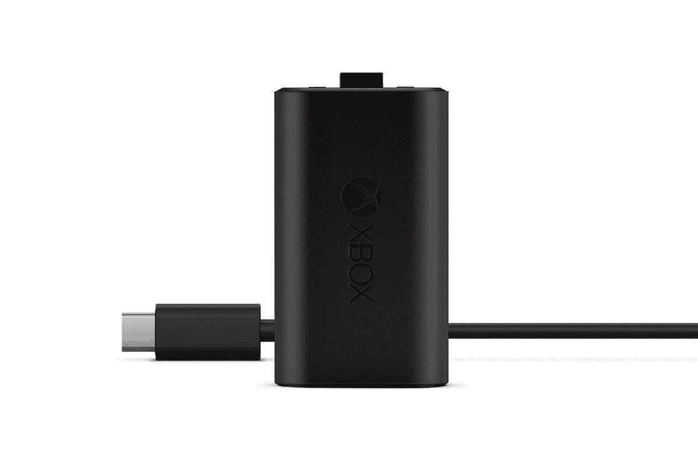
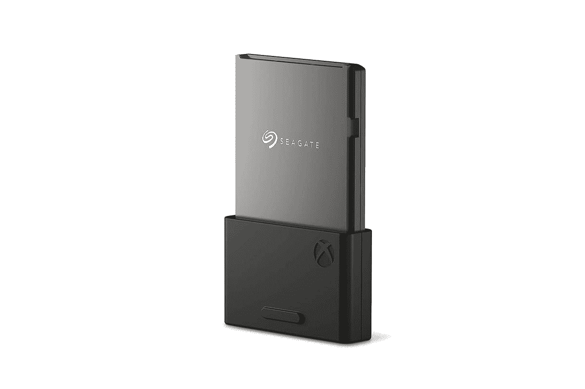
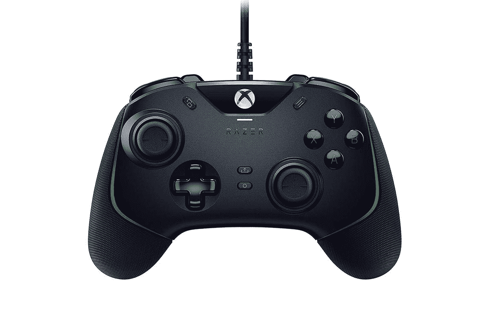
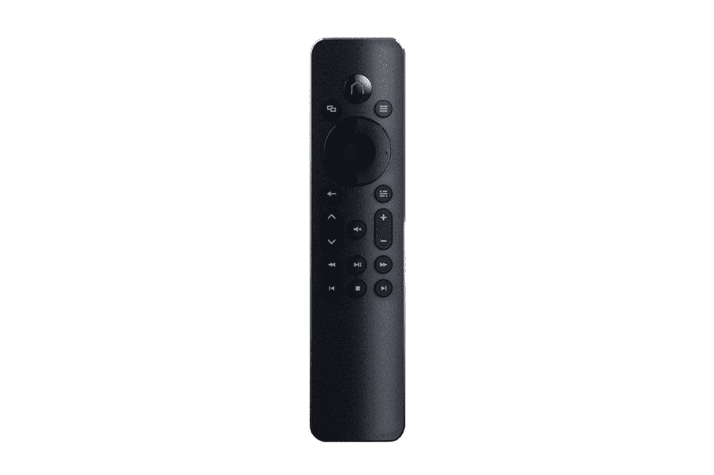
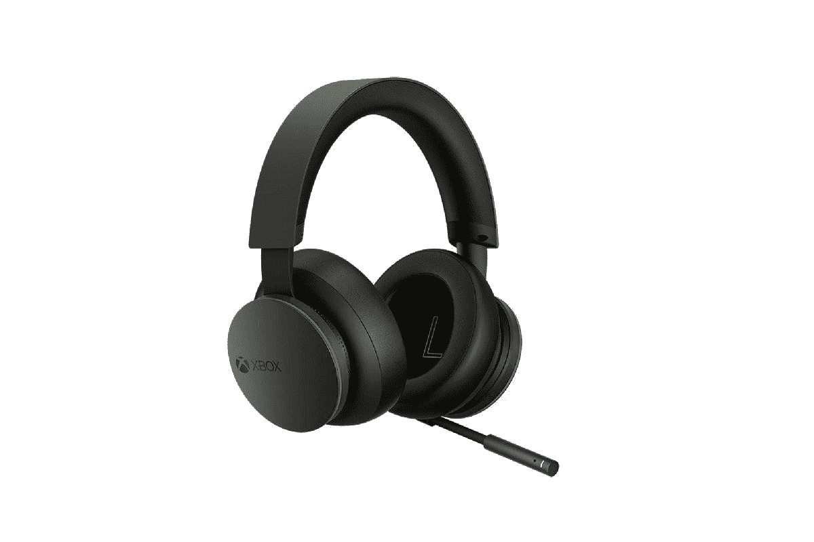
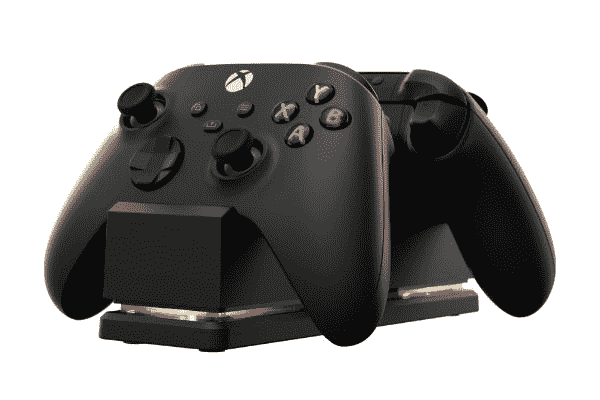
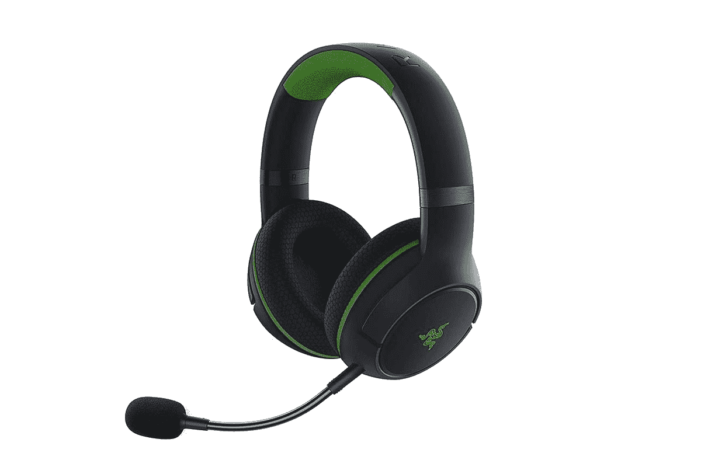
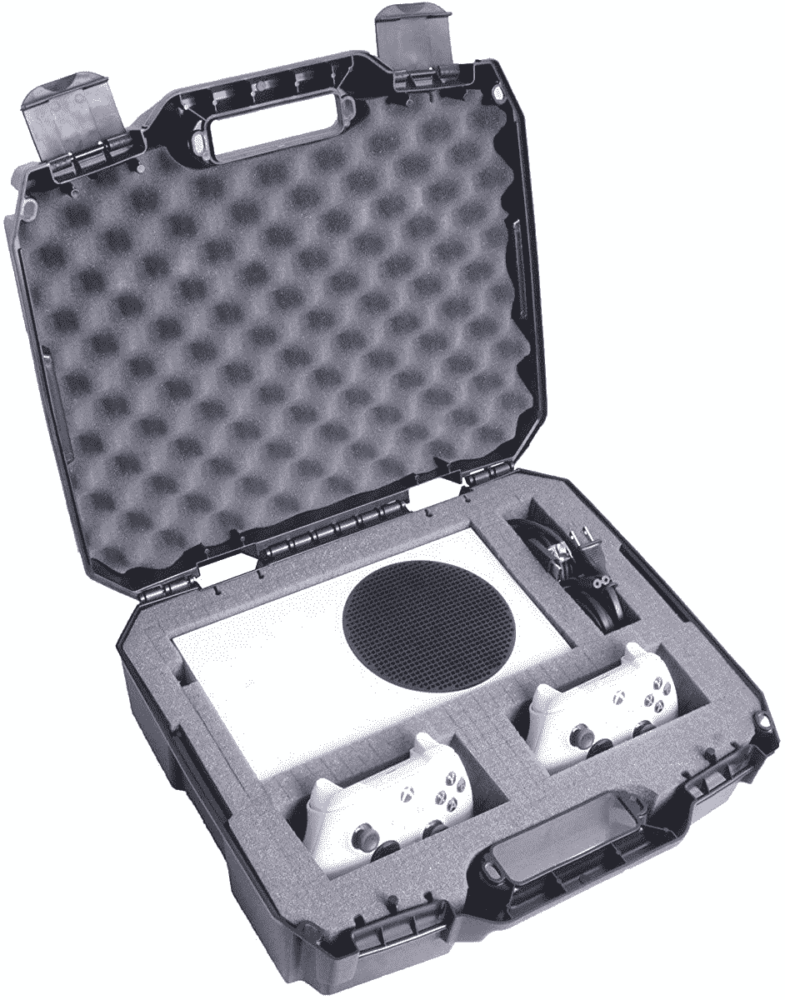

# 2023 年最佳 Xbox 系列 S 配件

> 原文：<https://www.xda-developers.com/best-xbox-series-s-accessories/>

# 2023 年最佳 Xbox 系列 S 配件

Xbox 系列可能不是更强大的主机，但你可以投资这些配件来增强你的游戏体验。

微软最新的游戏控制台,[Xbox X 系列和 S 系列](https://www.xda-developers.com/xbox-series-x-restocks/)标志着该品牌的一次坚实飞跃，因为它们在硬件和软件功能方面引入了急需的升级。虽然 Xbox Series X 是更大、更强大的主机，但 [Xbox Series S](https://www.xda-developers.com/xbox-series-s-review/) 主要针对那些不想花很多钱，但仍想玩具有增强视觉效果的最新 Xbox 游戏的游戏玩家。该控制台由基于 Zen 2 架构的定制 AMD 八核处理器提供支持。它的主频为 3.6GHz，通过多线程，它可以达到 3.4GHz。它配有 10GB 的 DDR6 内存，而图形由 AMD 的 RDNA2 GPU 处理，能够利用 20 个 1.565GHz 的计算单元实现 4 万亿次浮点运算性能。存储方面，有一个 512GB 的 NVMe 固态硬盘，其中约 364GB 可供用户使用。

考虑到其 299 美元的低价格，以及我们已经测试了较小的主机这一事实，我们相信你应该在配件上投资一些额外的钱。我们并不是说你必须这么做，但是如果你想要一个更好的整体体验，那么你肯定需要仔细阅读下面的列表。

 <picture></picture> 

Xbox Rechargeable Battery + USB-C Cable

##### 微软 Xbox 可充电电池

如果你不想时不时地花钱为你的 Xbox 控制器买新的 AA 电池，你最好给自己买一个这样的充电电池组。

 <picture></picture> 

Seagate Storage Expansion Card

##### 希捷存储扩展卡

Xbox 系列的基本存储被限制在 364GB 左右，这款卡不仅可以扩展这一容量，还可以提供与内置存储类似的最佳性能和速度。

 <picture></picture> 

Razer Wolverine V2 Wired Gaming Controller

##### 雷蛇狼獾 V2

作为新 Xbox 系列的最佳第三方控制器之一，Razer Wolverine V2 采用了最先进的技术来增强您的游戏体验。

 <picture></picture> 

Insignia Media Remote for Xbox

##### Xbox 的 Insignia 媒体遥控器

如果您想将 Xbox Series S 用作媒体娱乐设备，那么这款遥控器可以让事情变得更简单。

 <picture></picture> 

Xbox Wireless Headset

##### 微软 Xbox 无线耳机

新的 Xbox 无线耳机与所有 Xbox 主机兼容，并且支持蓝牙连接。它具有 Windows Sonic、杜比 Atmos 和 DTS Headphone X 以及 15 小时的电池寿命。

 <picture></picture> 

PowerA Dual Charging Station for Xbox

##### Xbox 的 PowerA 双充电站

PowerA 双充电站可让您同时为两个无线控制器充电，还配有两块充电电池。

 <picture></picture> 

Razer Kaira Pro

##### Razer Kaira Pro

在玩游戏时，拥有优质的音频是必须的，它不可能比 Razer 为 Xbox 用户制作的新 Kaira Pro 无线游戏耳机更好。

 <picture></picture> 

Case Club Hard Case

##### 案例俱乐部 Xbox 系列 S 案例

旅行时携带 Xbox 系列的硬壳包。它采用了抗冲击和可锁定的设计，在控制台旁边有空间存放两个控制器和充电线。

* * *

一个更大的建议是[扩展卡](https://www.amazon.com/Seagate-Storage-Expansion-Solid-State/dp/B08K3S6WJM/?tag=xda-7fnn4kf-20&ascsubtag=UUxdaUeUpU4765&asc_refurl=https%3A%2F%2Fwww.xda-developers.com%2Fbest-xbox-series-s-accessories%2F&asc_campaign=Short-Term)，我们估计很多人都需要得到一个。如果你也打算四处移动你的游戏机，那么[案例](https://www.amazon.com/Case-Club-Controllers-Cords-Accessories-S/dp/B08NFF78VT?tag=xda-7fnn4kf-20&ascsubtag=UUxdaUeUpU4765&asc_refurl=https%3A%2F%2Fwww.xda-developers.com%2Fbest-xbox-series-s-accessories%2F&asc_campaign=Short-Term)也是有意义的。

你可以查看我们对 Xbox 系列的[全面评论，了解更多我们对游戏主机的想法。此外，如果你是索尼团队，我们在 PlayStation 5](https://www.xda-developers.com/xbox-series-s-review/) 上玩了几天[，提示一下——它也真的很好。查看 Xbox Series X](https://www.xda-developers.com/sony-playstation-5-first-impressions/) 和 Series X 控制台的一些[最佳控制器，如果你喜欢流媒体，我们也有一个](https://www.xda-developers.com/best-xbox-series-x-controller/)[最佳采集卡的列表](https://www.xda-developers.com/best-capture-cards-xbox-series-x-s/)。