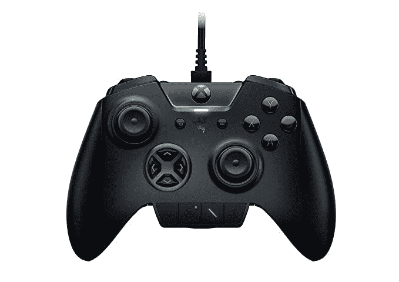
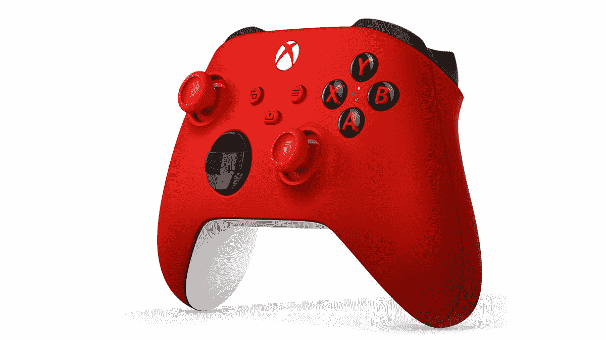
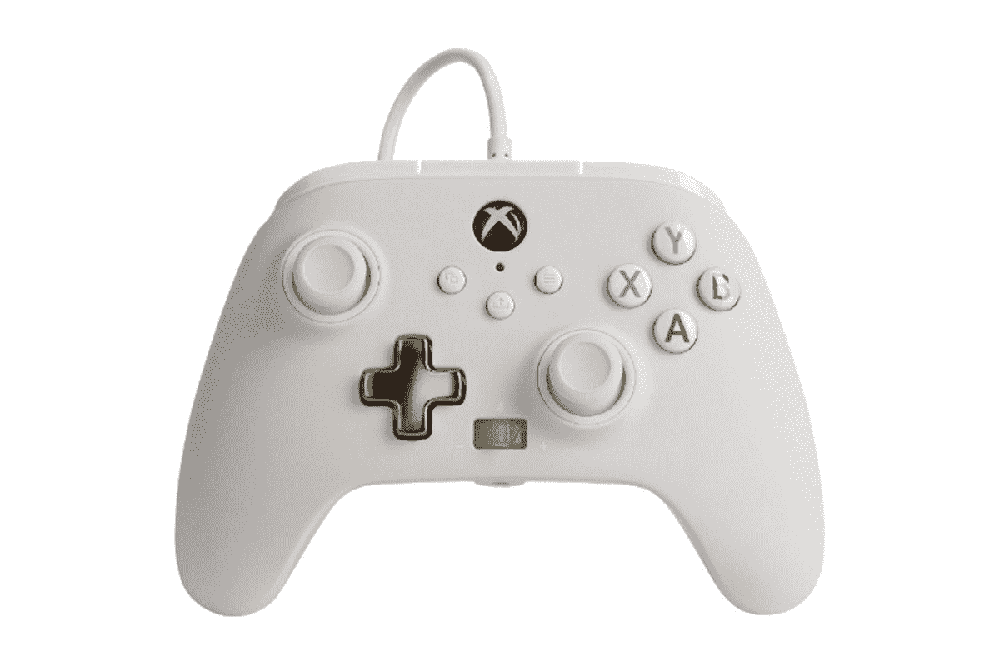
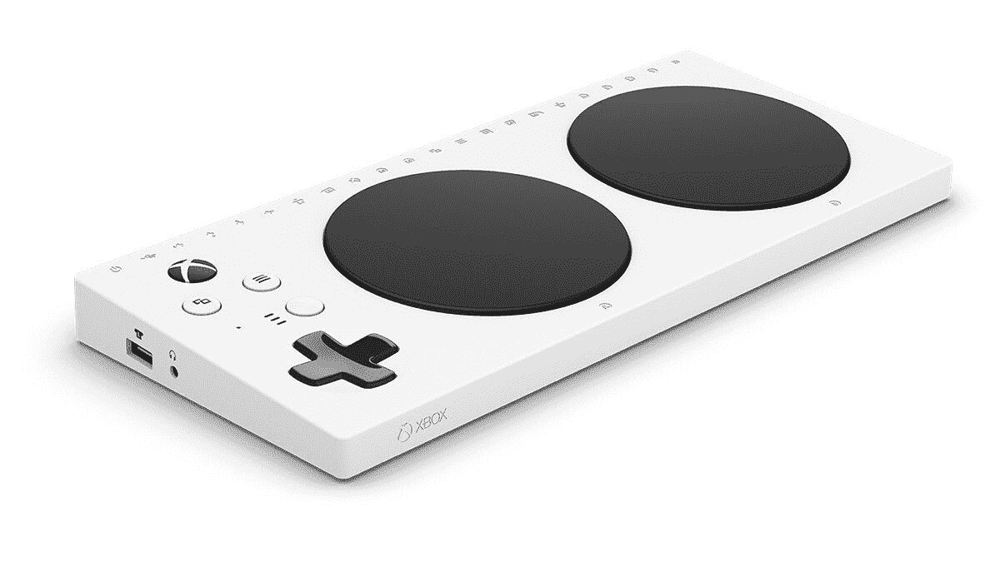

# 2023 年最佳 Xbox 系列 X 控制器

> 原文：<https://www.xda-developers.com/best-xbox-series-x-controller/>

Xbox 系列 X 和更实惠的 Xbox 系列 S 是微软迄今为止最雄心勃勃和最强大的游戏主机。自从它们上市以来，在全球范围内有着巨大的需求。因此，如果你是成功获得新主机的幸运儿之一，那么我们已经获得了一系列控制器，包括来自微软和其他公司的官方控制器，可以帮助你将游戏体验提升到一个新的水平。无论你是想用普通的 Xbox 手柄玩多人游戏，还是想用格斗棍或方向盘玩更小众的游戏，总有适合你的。

## 最佳整体:Xbox 无线控制器

Xbox Series X 最好的控制器是自带的那个，官方 Xbox 无线控制器。如果你需要一个额外的本地多人游戏或者需要替换，这是你应该购买的控制器。它售价 60 美元，有多种颜色可供选择，包括经典的黑色和白色，或者更鲜艳的蓝色和红色。无论您的选择如何，您都会喜欢纹理手柄、混合 D-pad 以及通过蓝牙无线使用 PC 控制器的能力。对于那些喜欢分享游戏片段的人，你还可以在控制器上获得一个专用的分享按钮，这使得分享你的主机上捕捉的记录变得很容易。

 <picture></picture> 

Xbox Wireless Controller

##### 微软 Xbox 无线控制器

Xbox 无线控制器有纹理触发器和保险杠，一个混合 D-pad，并支持蓝牙技术，使其成为大多数人在 Xbox 新游戏机上玩游戏的最佳控制器。

## 最佳精选:Xbox 精英控制器系列 2

如果你想从你的控制器中得到更多，并且不介意支付额外费用，微软为你制作了精英控制器系列 2。它提供了可调张力的拇指操纵杆、较短的头发触发锁、环绕式橡胶手柄、可分配的按钮(包括背部的拨片)和重新设计的组件，这使它成为专业游戏玩家或需要更多定制选项的人的绝佳选择。它还配有内置电池，据说可以持续 40 小时，可以使用 USB Type-C 电缆快速充电。

 <picture></picture> 

Xbox Elite Wireless Controller Series 2 ($40 off)

##### 微软 Xbox 精英无线控制器 2

Elite Wireless 2 控制器提供了比普通 Xbox 无线控制器更多的定制选项。您还可以选择更换背面的按钮和拨片。

## 最佳功能:Scuf Instinct Pro

Scuf 是许多伟大游戏配件的背后，Instinct Pro 也不例外。它的外观和感觉与微软的 Xbox Elite Controller 2 相似，但包含一些额外的改进——因此价格较高。这款控制器背面有四个可重新映射的拨片，可以配置成 16 种不同的游戏功能。甚至还有一个很棒的橡胶把手和触发器，有助于在长时间的游戏过程中放松双手。除此之外，控制器的正面有一个专用的麦克风静音按钮。为了进一步定制，你甚至可以交换面板。就 PC 上的实际游戏而言，你可以获得额外的可调即时触发器，让你从常规触发器立即切换到鼠标点击动作。

##### Scuf 本能专业版

Scuf Instinct Pro 是 Xbox Series X 和 Xbox Series S 的一款出色的第三方控制器。它背面有四个可重新映射的拨片，可调节的即时触发器，橡胶手柄，前面有一个麦克风按钮。你甚至可以更换面板。

## 最佳竞技游戏:雷蛇金刚狼终极版

Razer 是视频游戏行业的主力，因此该公司的 Wolverine Ultimate 当然会在我们的名单中。虽然这是一个有线控制器(列表中的大多数其他选项都是有线的)，但它是当今功能最丰富的控制器之一，非常适合竞技游戏玩家。据说面部按钮提供了类似于鼠标点击的触觉，使它们对一触即发的反应更加敏感。可互换的拇指棒也相当流畅。

该控制器还有六个可重新映射的按钮——四个在背部，两个在肩部按钮附近——并且还可以选择在不同的 D-pad 之间切换。除了按钮定制之外，您还可以玩 RGB 灯光效果，调整拇指操纵杆的精确灵敏度，以及定制触发按钮和触觉电机的振动强度，以增强体验。

 <picture></picture> 

Razer Wolverine Ultimate

##### 雷蛇金刚狼终极版

Razer 的 Wolverine Ultimate 是一个功能丰富的控制器，具有两个可重新映射的多功能缓冲器，四个多功能触发器和一个快速控制面板。

## 最佳定制:Xbox 设计实验室控制器

新的 Xbox 无线控制器或多或少与 Xbox One 系列附带的控制器相同，它只有几种标准颜色。如果你正在寻找第二个控制器，并且已经完成了单色配色方案，请查看 Xbox Design Lab，它允许你创建自己的控制器。

您可以混合和匹配颜色，定制按钮、触发器、模拟棒以及雕刻文本选项等一切。这对于那些关心其设置的配色方案或只想拥有一个突出的控制器的人来说是非常棒的。需要考虑的唯一重要的事情是定制服务仅在有限的地区可用。

 <picture></picture> 

Xbox Design Lab Controller

##### 微软 Xbox 设计实验室控制器

如果你厌倦了 Xbox 无线控制器简单的黑白外观，那就去 Xbox 设计实验室完全定制外观，并按照你想要的方式改造它

## 最实惠的控制器:PowerA 增强型有线控制器

控制器可能相当昂贵，这就是 PowerA 存在的原因。如果您的 Xbox 或 s 系列需要另一个控制器，增强型有线控制器是更实惠的选择之一。它是一个有线控制器，有多种颜色，背面有两个可映射的按钮。该控制器还具有放置在左右手柄中的双隆隆电机，以获得身临其境的游戏体验。此外，当您通过 3.5 毫米立体声耳机插孔连接耳机时，还有一个控制游戏音频的转盘。

 <picture></picture> 

PowerA Enhanced Wired Controller

##### PowerA 增强型有线控制器

PowerA 增强型有线控制器可与新的 Xbox 系列和 S 系列游戏机配合使用，并有多种颜色可供选择。它没有很多额外的功能，但考虑到价格低廉，很难抱怨。

## 最适合行动受限的人:Xbox 自适应控制器

游戏不应该有任何界限，微软的自适应控制器就是一个很好的例子。它是为行动不便的用户设计的，不同于这里列出的任何控制器，它具有根据用户需求完全定制控制器的选项。控制器也是一个集线器，可以连接各种辅助设备，然后将这些设备分配给特定的控制器输入。大约有 20 个端口，可以让您插入各种拇指棒、开关、按钮和其他辅助设备。除了 Xbox 游戏机，Adaptive Controller 还适用于任天堂 Switch 和 Windows 电脑。

 <picture></picture> 

Xbox Adaptive Controller

##### 微软 Xbox 自适应控制器

对于行动受限的游戏玩家来说，自适应控制器提供了各种各样的端口，允许连接多个控制器输入。

## 最佳街机棍:堀斗棍α

喜欢老式街机游戏机的魅力吗？看看 Hori 格斗棍α。这款控制器获得了微软的官方许可，配备了 Hori 自己的 Hayabusa 操纵杆，该操纵杆是为竞技游戏制作的，在格斗游戏社区很受欢迎。它通过顶部的快速按钮提供了轻松的配置文件切换，以及更改顶部外壳以定制外观的选项。其他显著的功能包括易于维护，麦克风和耳机的音频控制，以及通过专用应用程序进行微调。

##### 堀斗棍

这款格斗棍是一个格斗游戏迷的完美推荐，他想回到在老式街机控制器上砸按钮和转动操纵杆的日子。

## 最佳复古:Hyperkin Duke

你是 Xbox 的忠实粉丝吗？那么你可能还记得最初的 Xbox 控制器，绰号“公爵”好吧，Hyperkin 的人为现代观众和游戏机制作了原始 Xbox 控制器的工作副本，最重要的是，它得到了官方许可。这个控制器的形状和形式与原来的 Xbox 控制器相同，你甚至可以在 Xbox 按钮内看到原来的 Xbox 动画启动屏幕。还有振动反馈和现代风格，如精密模拟触发器。请注意，您需要使用带有 USB 电缆的控制器。

##### Hyperkin Duke 有线控制器

Hyperkin Duke Wired 控制器是原始 Xbox 控制器的现代复制品和翻拍版。它有振动马达，以及精密的模拟触发器和缓冲器。

## 最佳赛车车轮:罗技 G923

对于拥有 Xbox Series X 和玩 *Forza Motorsport、*等游戏的赛车迷来说，享受游戏的最佳方式是使用赛车轮子。罗技 G923 是我们推荐的一款，因为它以实惠的价格提供了真实的驾驶体验。这款车轮可旋转 900 度，配有优质皮革把手和三个脚踏板。为了控制游戏中的菜单，滚轮还有 A/B/X/Y 按钮，甚至还有一个转盘和后部的金属换档器。至于力反馈，这个轮子比它的前辈装有更强的振动马达，确保你在你最喜欢的游戏中获得模拟级别的驾驶体验。

##### 罗技 G923 赛车车轮

罗技 G(23 赛车车轮是伟大的 Xbox 系列 X 以及 PC 游戏玩家。它的功能包括改进的振动马达、900 度旋转、高级金属移位器和控制游戏菜单的 A/B/X/Y 按钮。

* * *

市场上有许多视频游戏控制器可以与 Xbox 系列 X 和 s 兼容。大多数人会选择我们的首选，标准 Xbox 无线控制器，因为它为大多数人提供了最佳的兼容性和最合理的价格。然而，如果你决定你需要更多的定制选项或功能，有精英无线控制器 2 或 Razer Wolverine 旗舰版。如果你有更多的小众需求——比如你玩格斗游戏或竞技游戏——总有一款控制器适合你。

如前所述，Xbox 系列和 s 系列有巨大的需求。如果你打算购买其中一款游戏机，请确保阅读我们的[进货指南](https://www.xda-developers.com/xbox-series-x-restocks/)。