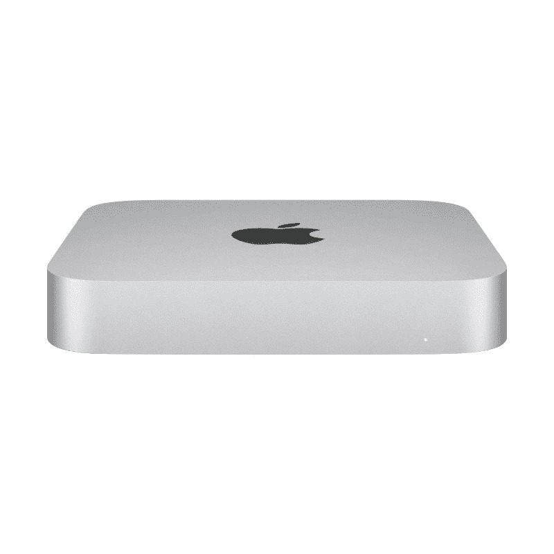

# 当心:苹果神奇键盘上的触控 ID 无法在英特尔 MAC 电脑上运行

> 原文：<https://www.xda-developers.com/beware-touch-id-on-apples-magic-keyboard-wont-work-with-intel-macs/>

在今年早些时候推出采用苹果 M1 芯片组的 [24 英寸 iMac](https://www.xda-developers.com/imac-24-inch-review/) 之后，苹果终于在今天[单独推出了带有触控 ID 的魔法键盘](https://www.xda-developers.com/you-can-now-buy-apples-magic-keyboard-with-touch-id-for-m1-macs/)。这个新的神奇键盘让你更容易登录你的 Mac 桌面，所以你不能单独购买它总是很奇怪。然而，也不全是好消息。如果你有一台基于英特尔的 Mac 电脑，新的神奇键盘上的触控 ID 就不能用了。它是专为苹果芯片设备设计的，所以你的选择非常有限。

让我们倒回去一点。苹果在 2020 年 WWDC 大会上推出了自己的处理器，名为 Apple Silicon，并在当年晚些时候发布了第一批设备。MacBook Air、MacBook Pro 13 英寸和 Mac mini [是首次亮相的设备](https://www.xda-developers.com/apple-macbook-air-macbook-pro-13-mac-mini-m1-arm-soc/)，采用了苹果 M1。然后，今年春天，该公司还推出了采用相同处理器的 [iPad Pro](https://www.xda-developers.com/apples-new-ipad-pro-has-a-super-fast-m1-chip-and-5g-support/) 和 24 英寸 iMac。这款 24 英寸 iMac 引入了触控 ID 的新魔法键盘，这是迄今为止你唯一能买到它的方式。

关于苹果 M1 芯片组的事情是，他们的特点是所谓的安全飞地。这是一个内置在芯片组中的安全设备，需要[才能让](https://www.xda-developers.com/use-apple-magic-keyboard-touch-id-other-computers/)触控 ID 工作——至少是与像新的魔法键盘这样的外部设备一起工作。触控 ID 内置在一些基于英特尔的 MacBooks 中，但这不适用于这里。

但前述 MAC 是目前唯一运行在苹果硅上的 MAC，苹果仍在销售大量采用英特尔处理器的 MAC。也就是说，27 英寸的 iMac 和 Mac Pro 仍然列在该公司的网站上，采用英特尔处理器。另外，其他高端设备可能仍在使用，如 2017 年的 iMac Pro。带有触控 ID 的新魔法键盘是你可以在 Mac 上使用的唯一生物认证形式，但如果你想把它添加到你数千美元的英特尔 Mac 上，你不能。你仍然需要输入你的密码。是的，键盘本身可以用，但触控 ID 不行。

目前仅限于苹果芯片意味着你只能在 MacBook Air、13 英寸 MacBook Pro、Mac mini 和 24 英寸 iMac 上使用触控 ID。但其中三款设备已经配备了键盘和触控 ID。公平地说，触控 ID 在 iMac 上是可选的，但如果你没有在你的机型上安装它，你可能不会急于现在安装它。

不过，这并不是说这是一次毫无价值的发射。Mac mini 毕竟是一台台式电脑，它没有配备任何键盘。如果你有一个或打算得到它，你现在可以和触控 ID 一起拥有它。当然，只要你买的是苹果 M1 动力版；苹果也仍然有英特尔版本。如果你有兴趣购买 Mac mini，你可以使用下面的链接。带触控 ID 的魔法键盘[可以在这里找到](https://www.apple.com/shop/product/MK293LL/A/magic-keyboard-with-touch-id-for-mac-models-with-apple-silicon-us-english)。

 <picture></picture> 

Apple Mac Mini M1

##### 苹果 Mac Mini (M1，2020 年)

最新的 Mac mini 配备了苹果 M1 芯片组，全面提供更快的性能。它配有 8GB 内存和高达 512GB 的存储空间。