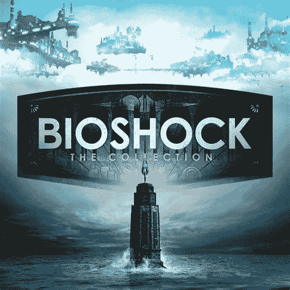

# 生化奇兵:PS4 上的合集现在只有 12 美元

> 原文：<https://www.xda-developers.com/bioshock-the-collection-on-ps4-is-only-12-right-now/>

# 生化奇兵:PS4 上的合集现在只有 12 美元

你会购买 PS4 版的《生化奇兵:合集》吗？实体版本目前仅售 11.97 美元。

《生化奇兵》游戏仍然很有趣，尽管最初的参赛作品已经有 15 年的历史了。2K Games 在 2016 年发布了一个针对 Windows、PS4 和 Xbox One 的*生化奇兵*系列的重制版包(Switch 和 macOS 版本随后推出)，现在你只需花 11.97 美元就可以从亚马逊获得 PS4 版本。这比原价低了 8 美元，而且是享受几个小时乐趣的杀手锏。

*生化奇兵*第一部和第二部发生在水下城市狂喜，这是一个资本主义的乌托邦，在基因改良广泛普及后陷入了混乱。第一个游戏在崩溃后不久就让你沉浸在狂喜中，与亚当和坦克一样的大爸爸们战斗。在《生化奇兵》2 中，你在第一个游戏的事件发生八年后扮演一个大爸爸，狂喜继续崩溃。最后，*生化奇兵无限*设定在 1912 年的漂浮城市哥伦比亚，在那里你的任务是找到一个被俘虏的拥有奇怪力量的女人。

 <picture></picture> 

Bioshock: The Collection (PS4)

##### 生化奇兵:收藏

《生化奇兵》的实体版:该系列现在在亚马逊上仅售 11.97 美元。可悲的是，只有 PS4 版本在售。

《生化奇兵》是我最喜欢的游戏系列之一，这个系列是在现代游戏机上享受这一切的好方法。这个包还包括了每个游戏的所有原始 DLC。《生化奇兵无限》的海葬 DLC 尤其值得一玩，因为它将最终游戏与前两部作品的世界联系了起来。该软件包也可以在 PlayStation 5 上运行，但没有任何 PS5 特有的改进——只是加载速度更快。