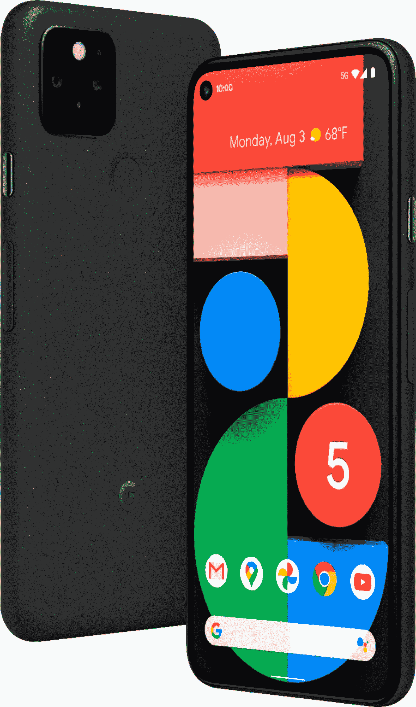
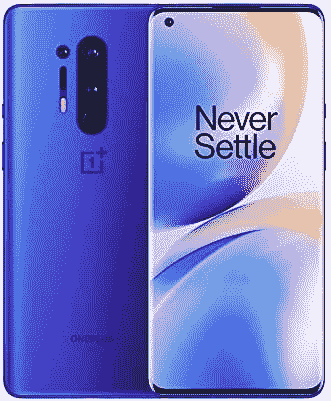
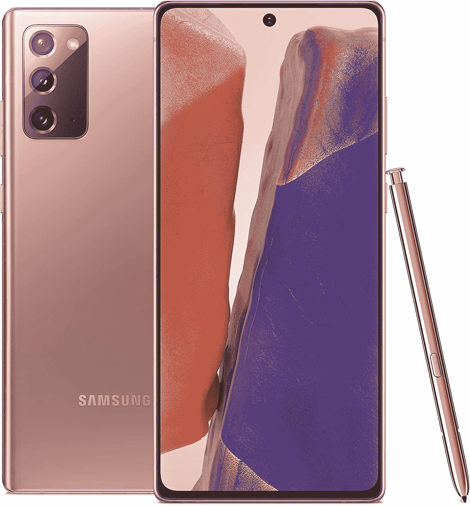
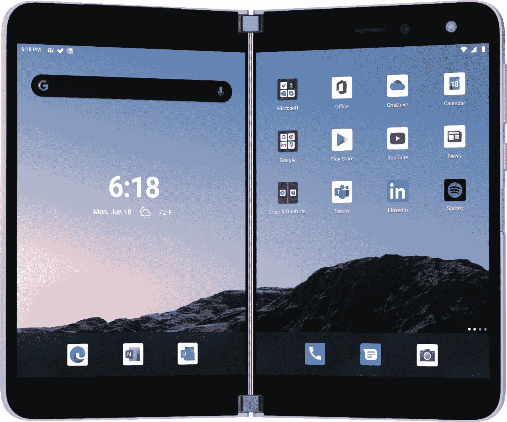
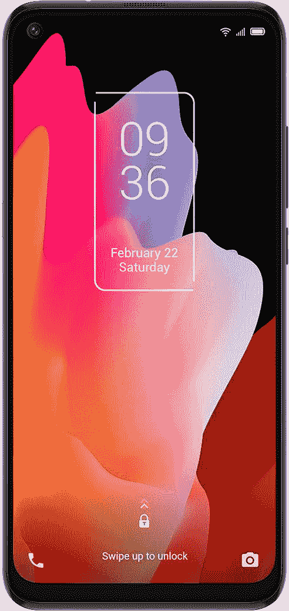
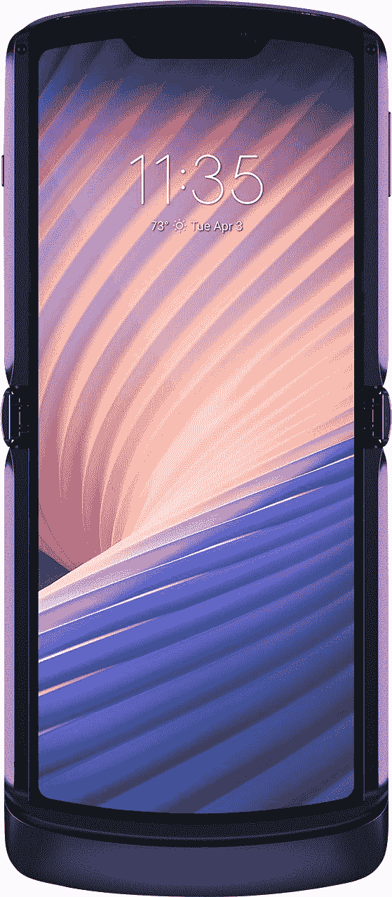

# 最后一分钟网络星期一电话交易:一加，谷歌，等等！

> 原文：<https://www.xda-developers.com/black-friday-phone-deals/>

# 最后一分钟网络星期一电话交易:一加 8T 为 630 美元，Razr 为 950 美元和更多！

在网络星期一期间购买智能手机是一个明智的想法！我们已经收集了最好的网络星期一电话交易，只为你！

黑色星期五终于来了。在整个互联网上，有这么多的交易可以尝试和利用，你会晕头转向。简直是铺天盖地！然而，我们并没有试图筛选长长的名单，而是从万维网上收集了一些最好的网络星期一电话交易。跳过研究，直接得到你想要的！

我们知道你来这里的目的-智能手机优惠。从最前沿的智能手机到价格最低的智能手机，从亚马逊、T2 百思买到 T3，我们应有尽有。无论您希望如何升级，我们都有适合您的网络星期一电话优惠！

寻找更多优惠？查看我们其他的网络星期一综合报道:

 <picture></picture> 

Google Pixel 5

谷歌 Pixel 5 降价 200 美元？已经吗？那是网络星期一给你的！如果你今天激活威瑞森，你将只需 500 美元就能获得谷歌 Pixel 5。你只需在 24 个月内支付 20.83 美元！

 <picture></picture> 

OnePlus 8T

##### 一加 8T

当你能得到一加 8T 的时候，为什么要接受更低的价格呢？在亚马逊，你只需花 630 美元就能买到这款旗舰设备。不要拖延，因为销售在一天结束时结束。

 <picture></picture> 

OnePlus 8 Pro

你有耐心拿起一加 8 Pro 吗？我称赞你，因为我不是，但亚马逊已经进一步降低了旗舰产品的价格，降至 750 美元。

 <picture></picture> 

Samsung Galaxy Note 20

##### 三星 Galaxy Note 20

想买 Galaxy Note 20 吗？你可以在亚马逊上节省 250 美元，使总数降到 750 美元。不需要激活或特定的运营商！

 <picture></picture> 

Microsoft Duo

##### 微软 Surface Duo

想找微软二人组吗？现在是你拯救的机会。如果你今天就激活这种新的但不是真正可折叠的东西，这对组合在百思买可以便宜 300 美元。

 <picture></picture> 

Motorola G Stylus

##### 摩托罗拉 G 唱针

在廉价手机上省钱可能看起来有点傻，但这正是你在黑色星期五可以做的！你可以在百思买(Best Buy)以 50 美元的价格买到 Moto G 手写笔手机，让这款手机更划算。

 <picture></picture> 

TCL 10L

##### TCL 10L

TCL 10L 是另一款价格实惠的经济型手机，对于那些只需要一部简单、没有尖端技术或太多花里胡哨的手机的人来说，是一个很好的选择。

 <picture></picture> 

Moto Razr 5G

##### 摩托罗拉摩托 Razr 5G

准备好尝试可折叠手机了吗？在 Moto Razr 上节省 450 美元，享受旧经典的现代风格。这也比市场上另一款出色的可折叠产品 Galaxy Z Fold 2 便宜一些。