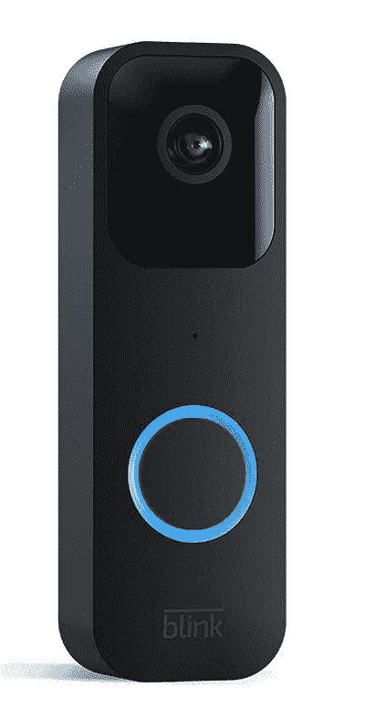

# 在黄金时段，只要 35 美元就能买到一个眨眼视频门铃

> 原文：<https://www.xda-developers.com/blink-video-doorbell-early-prime-day-deal/>

Ring 并不是亚马逊唯一的联网相机品牌，另一个品牌 Blink 也融入了 Prime Day 精神。作为亚马逊 7 月 12 日至 13 日旗舰购物活动的一部分，Blink 视频门铃正在进行一项热门交易，在其已经很有吸引力的价格基础上降低 30%。

它不如一些竞争视频门铃先进，但 35 美元无疑代表了一个有吸引力的价格点，尤其是对那些迈出第一步的人来说。

闪烁视频门铃可以有线或无线操作，电池寿命长达两年。白天的视频是以 1080p 拍摄的，而当太阳下山时，红外视图就开始工作了。与任何连接的摄像机一样，Blink 视频门铃有一个配套的应用程序，完全支持实时视图以及运动事件和门铃按下的通知。有了双向音频，你就可以听到和和你家门口的任何人说话。

因为它也需要 AA 电池，所以当电池充电时，你永远都不需要覆盖。正如你所期望的，它也是不受天气影响的，而且不像门铃，它可以在没有订阅计划的情况下充分发挥作用。

 <picture></picture> 

Blink Video Doorbell

##### 闪烁视频门铃

一个预算替代环与本地存储选项，如果你也抓住同步模块 2。

需要注意的是，需要额外的 35 美元同步模块 2。有了它，您可以保存来自 Blink 视频门铃和多达九个附加摄像机的本地镜头。Blink 确实有一个云计划，可以提供存储和访问您的镜头，但同步模块 2 总体来说更有价值。如果你选择了这个，你将为每台设备每年支付 30 美元，或者为覆盖 10 台设备的计划每年支付 100 美元。

但是因为是黄金时段，你还可以在同步模块 2 上省钱。只需额外支付 16 美元，你就可以获得一个包含[眨眼视频门铃和同步模块 2](https://www.amazon.com/Introducing-Blink-Doorbell-Two-way-enabled/dp/B08SGC46M9/?tag=xda-207ctgh-20&ascsubtag=UUxdaUeUpU42332&asc_refurl=https%3A%2F%2Fwww.xda-developers.com%2Fblink-video-doorbell-early-prime-day-deal%2F&asc_campaign=Affiliate) 的套装，价格仅为 51 美元。不管你去哪，时间已经不多了，因为黄金日在 7 月 13 日比赛结束时结束。