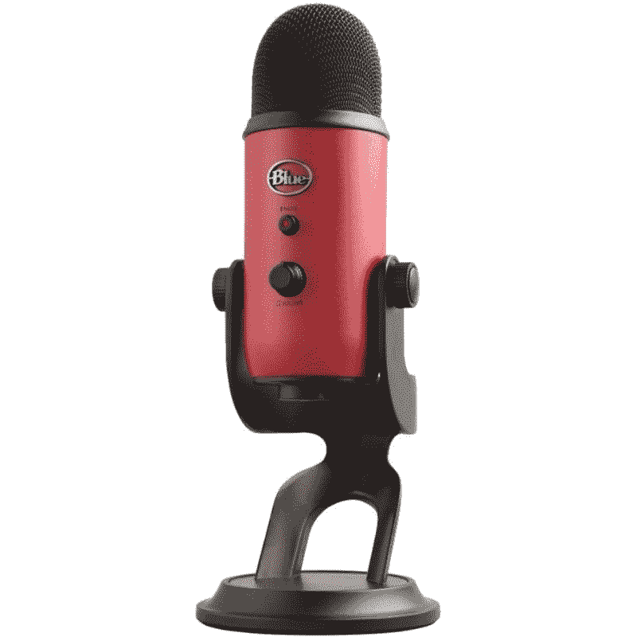
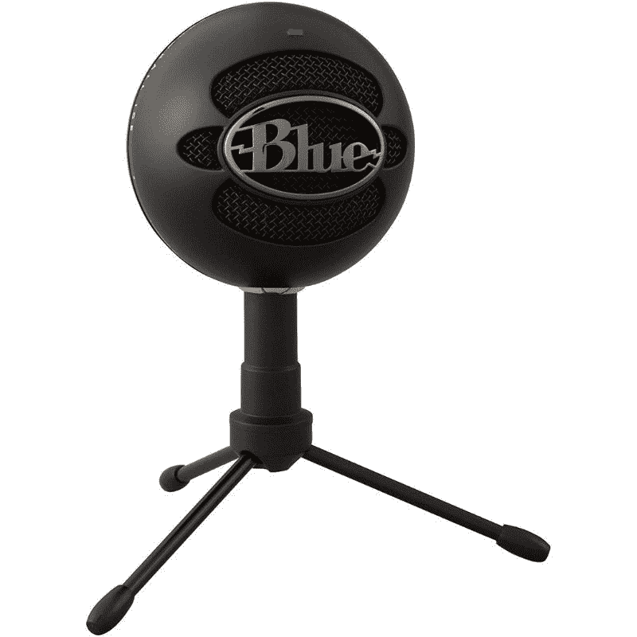

# 这个黑色星期五，在亚马逊上只需 70 美元就能获得蓝色雪人麦克风，开始你自己的播客

> 原文：<https://www.xda-developers.com/blue-yeti-mic-black-friday-deal/>

# 这个黑色星期五，在亚马逊上只需 70 美元就能获得蓝色雪人麦克风，开始你自己的播客

蓝色雪人是最好的播客麦克风之一，在黑色星期五销售期间，它在亚马逊上仅售 69 美元。

蓝色雪人是市场上最好的麦克风之一，它是一个神奇的音频设备，无论是播客，流媒体，录音等。多亏了黑色星期五的促销活动，这款伟大的麦克风现在在亚马逊上只卖 70 美元，低于平时 130 美元的价格。这是 Yeti 麦克风有史以来最便宜的，至少在其亚马逊商店上是这样。这笔交易使它比蓝色 Yeti Nano 更实惠，蓝色 Yeti Nano 通常被认为是更便宜的替代品。值得指出的是，蓝色雪人黑色星期五交易仅适用于红色变种。这款话筒也有多种不同的颜色，但价格会贵一点。

 <picture></picture> 

Blue Yeti

##### 蓝色雪人

蓝色雪人麦克风是一个很好的麦克风，可以用来开始你自己的播客。

蓝色 Yeti 麦克风在社区中很受欢迎，主要是因为它出色的广播音频和坚实的构建质量。这是一个专业外观的麦克风，可以轻松融入大多数设置，没有任何问题。它与 Windows 和 macOS 都兼容，并提供一个相对简单的即插即用操作，让您开始满足录音需求。

 <picture></picture> 

Blue Snowball Ice

##### 蓝色雪球冰

蓝色雪球冰麦克风是蓝色雪人的廉价替代品。这是一个伟大的预算工作室设置。

你也可以看看蓝色的雪人 X 作为一个值得选择。它目前从平时的 170 美元降到了 140 美元。还有蓝色雪球冰麦克风，适合那些希望建立一个预算工作室的人。你可以省下 10 美元来买一个已经很便宜的超棒的麦克风。现在开始你自己的播客或 Twitch 频道并不是一个坏时机。这些麦克风可以让你以最好的方式激发你的激情。

我们还鼓励您查看我们收集的[最佳黑色星期五 PC 和游戏交易](https://www.xda-developers.com/best-black-friday-pc-gaming-deals/)，看看您是否能找到其他外设或 PC 组件来升级您的设置。