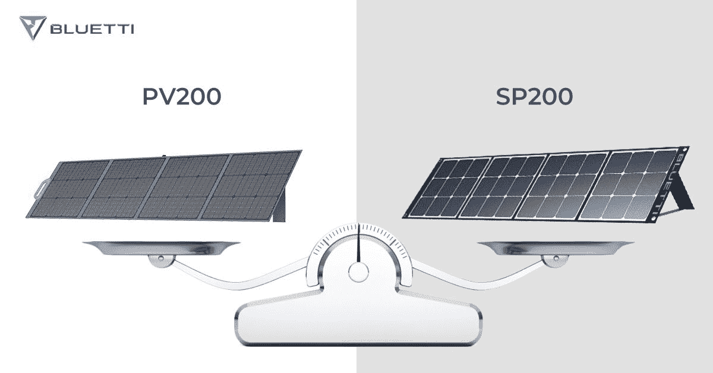
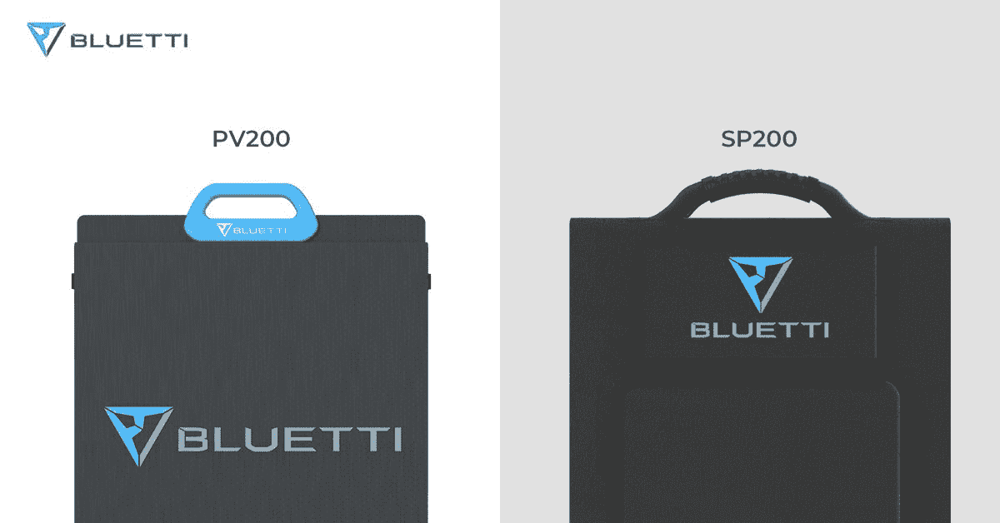
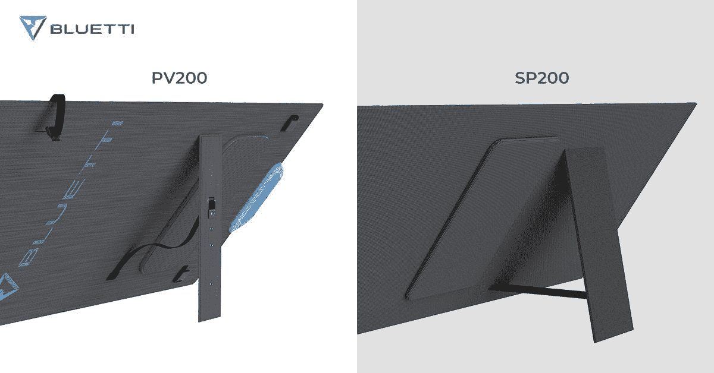
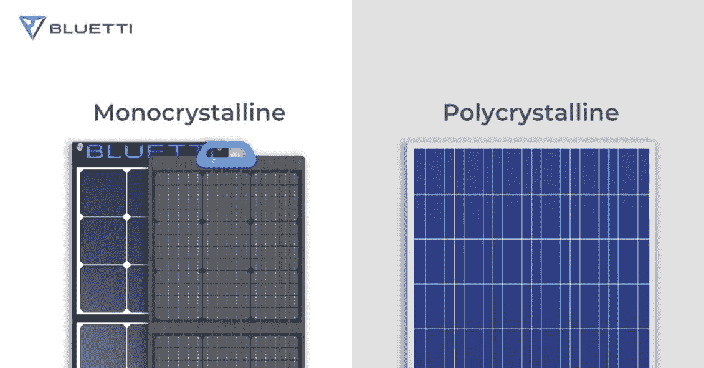
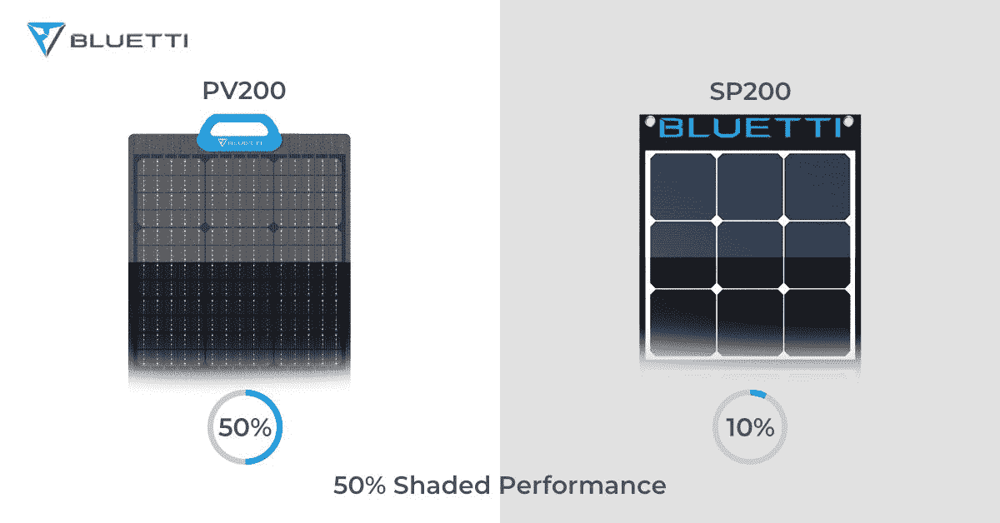
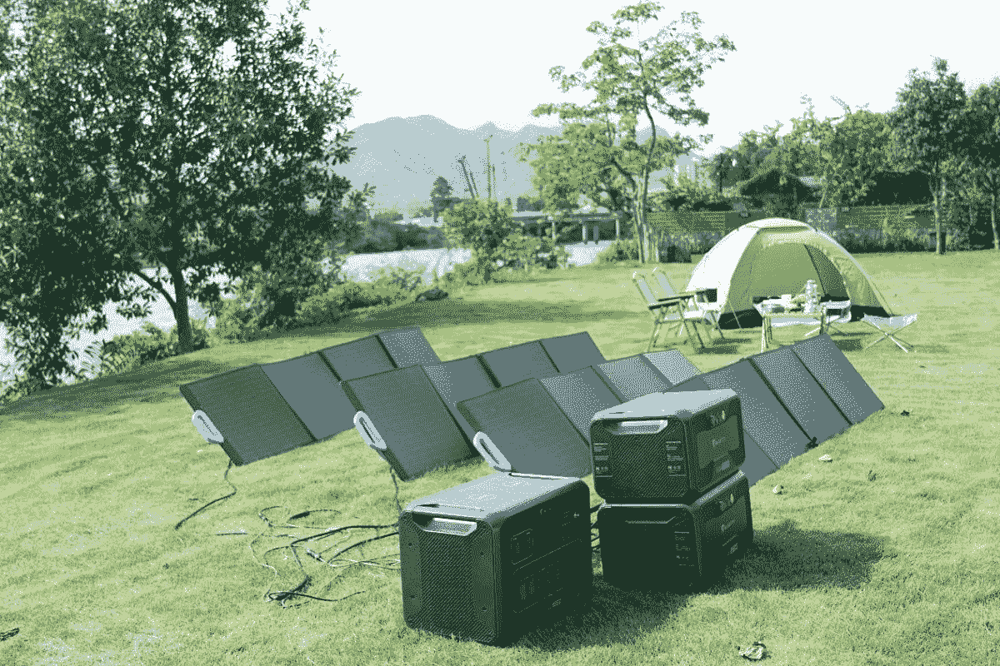

# Bluetti 发布 PV120/PV200 太阳能电池板

> 原文：<https://www.xda-developers.com/bluetti-releases-pv120-pv200-solar-panels/>

发电站公司 Bluetti 正在不断突破界限，改进便携式发电站背后的技术。他们的产品有各种尺寸，适合各种情况，无论您是需要短途露营的小物件，还是寻找停电时的完整备份解决方案。Bluetti 是为任何需要动力的情况做好准备的最佳选择之一。现在，他们更进一步，提供两个新的太阳能电池板为你的发电站充电。

你希望自己很快就能脱离网络去露营吗？你可以带着你的 Bluetti 发电站，以及他们的新太阳能电池板，即使在你没有任何电源的情况下，也可以保持充电。这些模块化太阳能电池板采用便携式轻质设计，是实现完全电力独立的关键。

*将新的 PV120/PV200 型号与以前的选项进行比较:*

 <picture></picture> 

Bluetti PV200 vs. SP200

| **型号:** | **PV200 [** **【新】** | **SP200** | **PV120 [** **新增]** | **SP120** |
| **瓦数** | 200W | 200W | 120W | 120W |
| **细胞类型** | 单晶 | 单晶 | 单晶 | 单晶 |
| **电池连接类型** | **平行** | 系列 | **平行** | 系列 |
| **尺寸** **(折叠)** | 23.2*24.8 英寸 | 20.5*20.7 英寸 | 21*18.5 英寸 | 16.3*16.1 英寸 |
| **尺寸(展开)** | 23.2*89.2 英寸 | 20.5*86.6 英寸 | 21*65 英寸 | 16.3*66.1 英寸 |
| **重量** | 16.1 磅 | 14.3 磅 | 12.6 磅 | 9.5 磅 |
| **开路电压(Voc)** | 26.1 伏 | 24V | 24.4 伏 | 23.7 伏 |
| **电池效率** | 高达 23.4% | 23% | 高达 23.4% | 23% |
| **保修** | 2 年无忧保修 | 2 年无忧保修 | 2 年无忧保修 | 2 年无忧保修 |

## 总设计

随着新 PV 系列的发布，设计有了一些重大改进。手柄进行了一些改进，使用了蓝色 ABS 材料。PV 系列采用了一体式防水涂层设计，封装了所有的太阳能电池，而 SP 系列的电池板则缝合在一块巨大的原始画布上。

 <picture></picture> 

Bluetti PV200 vs. SP200 Handle Design

改进的支架设计为 PV200 提供了更多角度调节选项。PV 和 SP 系列的尺寸相似。然而，PV 系列太阳能电池板重约两磅。这要归功于先进的防水涂层。

 <picture></picture> 

Bluetti PV200 vs. SP200 Kickstand Design

## 效率

Bluetti PV200 采用单晶设计，使用单个大型硅晶体。单晶电池板可以说是最有效的，因为即使在缺乏阳光的情况下，它们也能产生大量的电力。说到效率，单晶太阳能电池板是最好的。虽然它们是三种类型(单晶、多晶、非晶)中最贵的，但它们通常最耐用，对高温最不敏感。

这就是为什么 Bluetti 的 PV 和 SP 太阳能电池板都是由单晶制成，导致整体效率在 23%~24%左右。Bluetti 声称这是市场上最好的便携式太阳能电池板。

 <picture></picture> 

Monocrystalline vs. Polycrystalline

## 遮光性能

当你安装 PV200 太阳能电池板时，你显然想尽量避免遮挡，但有时这是不可避免的。如果一个面板被遮挡，即使是部分遮挡，也会降低整个系统的产量。在 SP200 面板中，当 10%的面板被阴影覆盖时，您将经历高达 40%的功率损失。

为了改善这个问题，Bluetti 改变了 PV 系列中太阳能电池单元的连接类型。这些新的太阳能电池板现在使用并联连接，这意味着电池板上的每个电路都可以在相同的电压下独立运行。你只会从直接被阴影覆盖的电池中失去能量。

 <picture></picture> 

Bluetti PV200 vs. SP200 Shaded Performance

## **在哪里买**

Bluetti 的新型光伏电池板目前与太阳能发电机组一起出售。[200 w PV200 上市售价为每块 549 美元](https://www.bluettipower.com/products/bluetti-pv200-200w-solar-panel) ，而 [120W 版售价为每块 399 美元](https://www.bluettipower.com/products/bluetti-pv120-120w-solar-panel) ，但搭配一个 AC200P 和三个 PV 200 套装，你就可以得到每块低至 425 美元的 **200W 面板。**

销售将于 9 月 30 日**美国**太平洋时间**晚上 7 点**结束。抓住你的折扣，趁它还有效。****

 **<picture></picture> 

Bluetti PV Solar Panels

###### 我们感谢 Bluetti 赞助了这篇文章。我们的赞助商帮助我们支付与运行 XDA 相关的许多费用，包括服务器成本、全职开发人员、新闻撰稿人等等。虽然您可能会在门户内容旁边看到赞助内容(这些内容将始终被标记为赞助内容),但门户团队对这些帖子不承担任何责任。赞助内容、广告和 XDA 仓库完全由一个独立的团队管理。XDA 绝不会通过接受金钱来赞扬一家公司，或以任何方式改变我们的观点或看法，从而损害其新闻诚信。我们的意见不能被收买。**