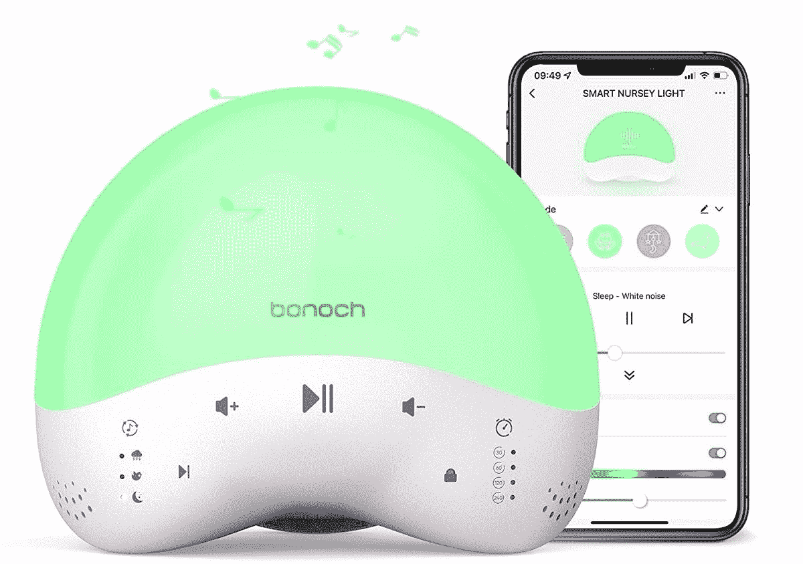

# 博诺奇“Ok-to-Wake”智能育儿灯评论:睡眠和醒来的舒缓声音和光线

> 原文：<https://www.xda-developers.com/bonoch-smart-nursery-light-review/>

让一个蹒跚学步的孩子养成规律的睡眠模式本身就是一项艰巨的任务。但是这家公司为你的托儿所设计了一款智能设备，旨在帮助你和你的孩子睡得更香。Bonoch 推出了“可以唤醒”的智能育儿灯，它不仅智能，而且非常棒。

它不仅可以帮助你的小家伙在正确的时间睡觉和醒来，这意味着父母可以得到一些睡眠，而且可以帮助你放松下来，在一天的其他时间专注于一项特定的任务。Bonoch 叫醒闹钟不仅仅是一个可以帮助小家伙入睡的夜灯和白噪音机器。

它的一系列舒缓的声音和定时器将在指定的时间长度内播放声音，并可以自动关闭声音，而小夜灯则提供舒适。“叫醒灯”还能让你的小宝宝知道早上什么时候该起床。这种灯可以帮助他们适应独自睡在自己的房间里，并自动醒来。

 <picture></picture> 

Bonoch smart nursery light

##### Bonoch 智能幼儿园灯

Bonoch 有一个为托儿所设计的智能小夜灯，由一个应用程序管理，所以你可以放心，你的小家伙们睡得很香

#### **浏览此评论:**

## Bonoch 智能育儿灯:价格和可用性

[博诺奇提供一系列专为托儿所设计的产品](https://bonoch.com/collections/all)。这款叫醒闹钟在博诺奇商店的售价为 49.99 美元。亚马逊上也有同样价格的。

* * *

## Bonoch 智能育儿灯:规格

| 

特征

 | 

描述

 |
| --- | --- |
| 投入 | 100-240 伏～50/60 赫兹 |
| 力量 | 灯 3.8W，扬声器 3W |
| 支持的无线网络 | 2.4GHz |
| 支持的操作系统 | 安卓 5.0 以上，iOS 9.0 以上 |
| 流明 | 125 毫米+/- 10% |
| 色温 | 2700K |
| 显色指数 | > 80 |
| 工作温度 | –10C 至 40 摄氏度 |
| 寿命 | 25000 小时 |

***关于这篇评论**:这篇评论是在测试了 Bonoch 智能托儿所灯之后写的，由 Bonoch 提供，为期两个月。博诺赫在这篇文章中没有任何投入。*

* * *

## 盒子里有什么？

Bonoch 智能育儿灯配有交流电源适配器、USB A 到 USB C 电源线和用户手册。

要使用育儿灯，请插上电源并打开。灯体上有几个控制按钮可以让你开始。您可以按下音符来循环播放三种声音模式中的一种，播放与自然、动物和催眠曲类别相关的声音。

使用声音类别选项旁边的播放图标，在类别中选择您需要的声音。短按可播放或暂停声音，并使用音量控制来调节音量，使声音不会太大。您可以使用应用程序打开或关闭灯，并调整计时器，使其在 30、60、120 或 240 分钟后自动关闭。

其他功能显然必须在应用程序中控制。

* * *

## 设计和功能

这种智能托儿所灯可以通过一个集成了 Alexa、Siri 和 Google Home 的应用程序来控制。

*   可定制的浅色
*   可调睡眠定时器
*   入睡和醒来时听到不同的声音和灯光
*   由简单的应用程序控制
*   语音助手兼容性

尽管如此，Bonoch nursery light 还是很容易与手机上的应用程序配对。下载应用程序并创建一个帐户。插上幼儿园灯，并确保您连接到 2.4GHz Wi-Fi 网络(大多数智能应用程序在 2.4GHz Wi-Fi 连接上工作得最好)。

当育儿灯通电时，它将自动进入配对模式，应用程序将显示图标以连接到智能育儿灯。单击图标并添加设备。整个过程只需几秒钟。添加好育儿灯后，点击图标进入应用程序调整设置。

### 超控

该应用程序真正让这种灯变得有用，并让它超越了儿童夜灯的范畴。瑜伽和冥想爱好者也会喜欢它。显然，你可以安排一个特定的时间来打开灯和发出声音，并定制不同颜色的灯，以获得你想要的颜色。

具体来说，您可以根据自己的需要播放多长时间的声音。灯光和声音将在预定的时间关闭。你也可以设置一个计时器来倒计时和停止。如果您的手机不在附近，您可以点击灯单元的顶部，打开温暖柔和的白光灯-例如，在预定时间过后给婴儿喂奶。

### 定制颜色

首先，应用程序中有一系列预设的场景，这些场景配置有预设的声音和颜色。从这些声音/颜色组合中选择一种，并为灯光操作设置一个计时器。在保存场景之前，您可以添加不同的颜色和声音组合，并预览选择。

除了标准配置之外，即使您选择了默认选项，似乎也没有限制您可以选择的组合。总的来说，我花了太多时间为一天的不同时间创建声音颜色选项。即便如此，每个预定场景都会显示在应用程序上，并选择颜色。

在使用过程中，您可以快速改变场景，以便播放不同的声音和灯光组合。同样，你也可以在应用程序中改变音量，改变颜色。

### 轻微刺激

我有点失望的是，如果你想的话，没有在颜色范围内循环的选项。尽管如此，我完全理解，如果你试图训练一个孩子只在某一种亮色出现时才起床，颜色循环可能会非常混乱。

此外，我对其中一些声音没什么印象。一般来说，孩子们会在行驶的汽车里睡着——但有风扇和吸尘器的声音可供选择——为什么不是汽车呢？

另一点是，大自然的声音包括水滴，雨水，喷泉，溪流，波浪和瀑布。因此，每次听到流水声，你都会发现自己需要去厕所。相反，如果你能随着水声放松，那就完全放松了。此外，噼噼啪啪的火焰声非常逼真，如果我被这种声音吵醒，它会发出警报。

* * *

## 谁应该购买 Bonoch 育儿灯？

**购买 Bonoch 托儿所灯，如果:**

*   你有一个不会安定下来的新生婴儿
*   你有刚学会走路的孩子，需要建立睡眠和醒来的常规，不要打扰你的睡眠
*   你需要一个助手来帮助你的日常冥想，让你听一两个小时的白噪音

### 为什么我喜欢 Bonoch 婴儿室灯

考虑到所有的事情，我最初认为 Bonoch 托儿所灯只是一个婴儿夜灯。然而，我已经自动设置灯光为我做不同的事情。

因此，灯光和声音组合现在可以由我的[智能扬声器](https://www.xda-developers.com/best-smart-speakers/)控制。当然，现在我可以在一个黑暗的房间里享受凉爽的蓝色灯光，在洗澡的时候听像马尔代夫这样的地方的声音。

一般来说，白天我工作的时候既有环境声音也有光线。我用它来盖过邻居修车的声音。我可以盯着光线，希望它围绕着颜色循环——尽管我并不想这么做。

总而言之，Bonoch 托儿所灯在亚马逊和 Bonoch 网站上都不便宜，只要 49.99 美元——但它不仅仅是哄婴儿睡觉。事实上，作为一种训练辅助工具，它可以帮助孩子们学习什么时候可以起床。此外，当您不想吵醒房间里的其他人时，它还能为您提供柔和的照明。但最棒的是，它用海浪拍打沙滩的声音唤醒了我。至少，有那么一瞬间，我觉得我真的在那里。

 <picture></picture> 

Bonoch smart nursery light

##### Bonoch 唤醒时钟

一盏带有定时时间表、一系列声音和几乎无限的色彩范围的育儿灯，可以抚慰家中的每个人，在柔和放松的声音中轻轻唤醒他们。