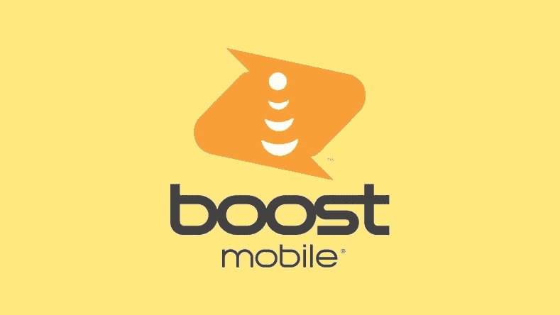

# 如果你支付一整年的费用，Boost Mobile 将“无限制”计划降至每月 25 美元

> 原文：<https://www.xda-developers.com/boost-mobile-unlimited-25/>

# Boost Mobile 再次升级移动计划，推出每月 25 美元的“无限”选项

Boost Mobile 再次更新了其移动计划列表，推出了一个新的选项，以每月 25 美元的价格支付一年的“无限”数据。

 <picture></picture> 

DISH unveils new Boost Mobile logo

Boost Mobile 在美国多年来一直是一家受欢迎的移动虚拟网络运营商(MVNO)，最初使用 Nextel 的网络，然后在 2005 年转向 Sprint。最近在 2020 年， [Boost 被出售给 Dish](https://www.xda-developers.com/dish-network-sprint-prepaid-business-boost-mobile-virgin-mobile-july-1/) ，作为让步，允许 T-Mobile 收购 Sprint 的交易向前推进。自那以后，Boost 一直在更新其计划和服务选项，现在该公司又在更新其产品。

[在此之前](https://web.archive.org/web/20210508201833/https://www.tomsguide.com/buying-guide/best-boost-mobile-plans)，Boost Mobile 提供每月 10 美元的 1GB 数据计划，每月 25 美元的 5GB 数据计划，每月 35 美元的 10GB 数据计划，每月 50 美元的“无限”数据计划(35GB 后变慢)，以及每月 60 美元的另一个包含更多热点数据的“无限加”选项。还有各种各样的激励措施(比如连续几周按时支付账单)使价格略有下降。Boost Mobile 现在[正在推出新的计划](https://www.prnewswire.com/news-releases/boost-mobile-launches-its-first-carrier-crusher-plans-leading-with-a-full-year-of-service-for-just-100-301427926.html) ( [通过 *CNET*](https://www.cnet.com/tech/mobile/boost-introduces-unlimited-data-plan-for-25/) )，如果你一次支付几个月的费用，价格就会下降——与 [Mint Mobile](https://mint-mobile.58dp.net/c/2233363/444520/7915?subId1=UUxdaUeUpU6438&subId2=exda&u=https%3A%2F%2Fwww.mintmobile.com%2F) 和其他运营商已经提供了一段时间的支付方案相同。

其中最划算的是无限计划，如果你一次性支付一整年的费用(总共 300 美元)，每月只需 25 美元。这给了你无限的通话和文本，30GB 的热点数据和 35GB 的高速数据。是的，就像其他大多数运营商一样，“不限量”并不真的意味着不限量。尽管如此，大多数人不会在一个月内使用那么多手机数据。以下是 Boost 目前的所有计划选项。

|  | 

每月

 | 

3 个月

 | 

6 个月

 | 

12 个月

 |
| --- | --- | --- | --- | --- |
| **1GB/月** | 不适用的 | 不适用的 | 不适用的 | 每月 8.33 美元* |
| **2GB/月** | 15 美元/月* | 不适用的 | 不适用的 | 不适用的 |
| **5GB/月** | 每月 25 美元* | 15 美元/月* | 15 美元/月* | 不适用的 |
| **15GB/月** | 不适用的 | 不适用的 | 不适用的 | 20 美元/月 |
| **无限制** | 50 美元/月 | 30 美元/月 | 不适用的 | 25 美元/月 |
| **无限加** | 60 美元/月 | 不适用的 | 不适用的 | 不适用的 |

*注:标有星号(*)的计划仅供新客户使用。*

你可以从 Boost Mobile 的网站上了解更多关于新计划的信息。该运营商最近还在[为其新的 Celero5G 手机](https://www.xda-developers.com/boost-mobile-free-service-buy-celero5g/)提供一年的免费服务，但该促销活动早在 10 月份就结束了。