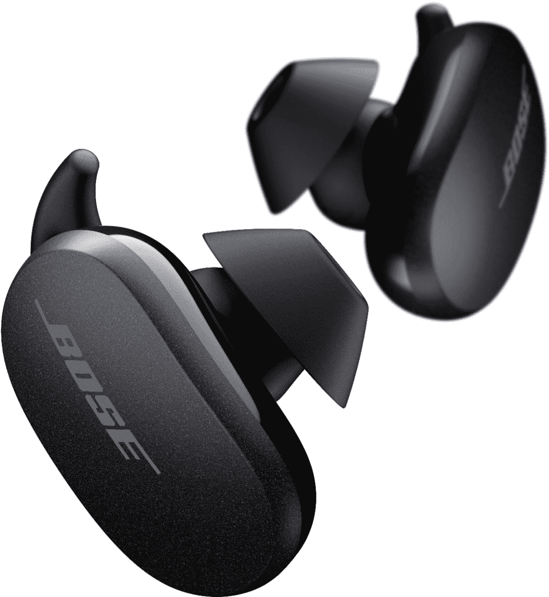

# Bose QuietComfort ANC 耳塞降至 199 美元的历史最低价格

> 原文：<https://www.xda-developers.com/bose-quietcomfort-anc-earbuds-drop-to-all-time-low-price-of-199-80-off/>

# Bose QuietComfort ANC 耳塞降至 199 美元的历史最低价格(优惠 80 美元)

Bose QC 降噪耳塞在多家零售店已经降至 199.00 美元，比通常价格节省了 80 美元。

Bose 可能不是第一个想到真正的无线耳塞的公司，但 Bose 在优质音频领域的悠久历史不应被忽视。Bose 静音舒适降噪耳塞(多好的名字！)于去年发布，作为 AirPods Pro 和其他优质 ANC 耳塞的全功能替代品，现在它在多家零售店以 199 美元的价格出售。这比通常的价格低了 80 美元，也是耳塞自发布以来的第一次大折扣。

这是一对真正的无线耳塞，具有主动降噪(ANC)功能，因此您周围的声音会被内置麦克风屏蔽掉。像大多数其他带 ANC 的耳塞一样，有一个手势(双击左耳塞)可以在噪音消除和透明模式之间切换，因此您仍然可以在需要时听到周围的声音。智能手机应用程序可用于管理设置，如每次点击和手势的操作。

 <picture></picture> 

Bose QC Noise Cancelling Earbuds

##### Bose QC 降噪耳塞

这些高级 ANC 耳塞售价 199 美元，比通常价格节省了 80 美元。

Bose 声称，这些耳塞的电池续航时间为 6 小时，充电 15 分钟可以让你听两个小时。该保护套使用 USB Type-C 进行充电，或者您可以将其设置在 Qi 无线充电板的顶部(或者在某些智能手机上反向充电)。

PCMag 在评论中给这款耳塞打了 4/5 分，称其噪音消除非常出色，音频也很平衡，但指出外壳有点笨重。SoundGuys 对耳机的评分为 7.6/10，注意到 IPX4 评级和自动播放/暂停非常好，但缺乏 AptX 音频编解码器和蓝牙多点功能是一个遗憾。在大多数评论中，279 美元的高零售价也被认为是一个缺点，但与目前 199 美元的销售相比，它并不太昂贵。

如果你还没有一副高级无线耳塞，或者你正在寻找一个潜在的节日礼物，Bose QuietComfort 降噪耳塞是这个价格的绝佳选择。