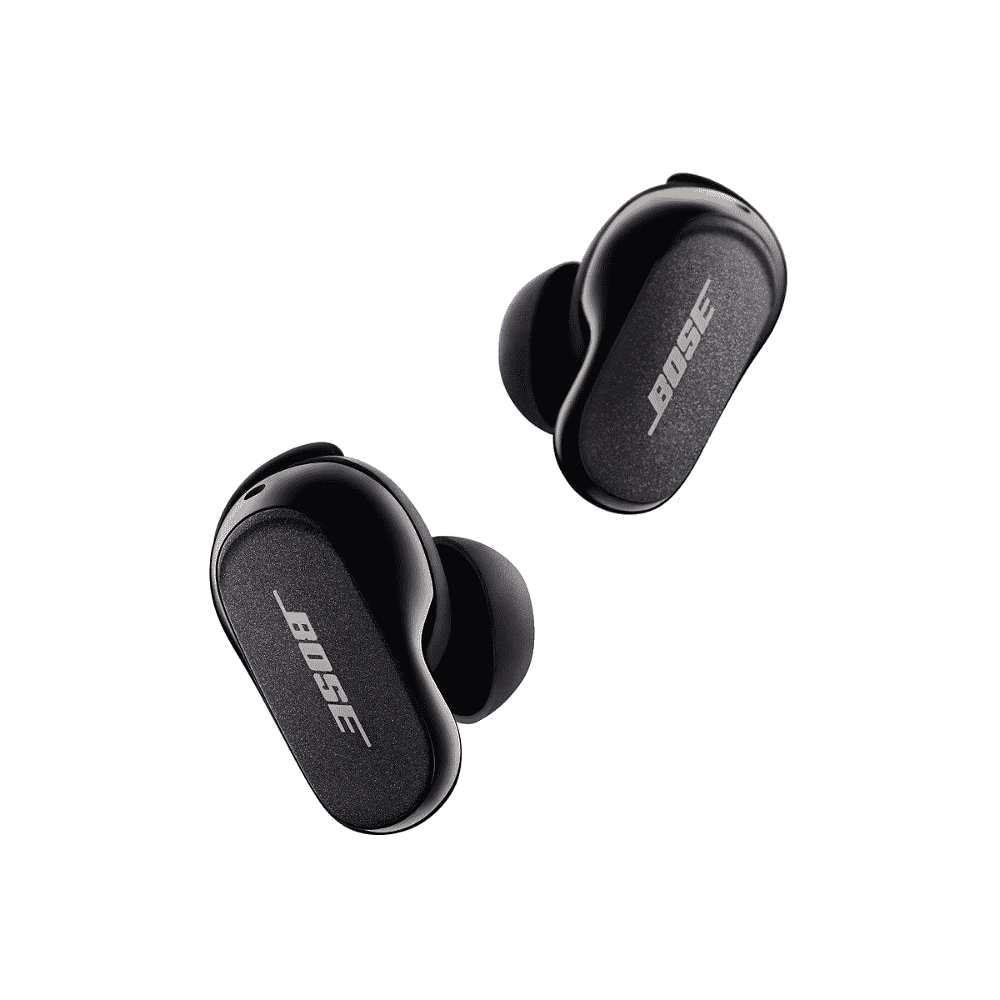

# Bose QuietComfort 耳塞 2 评论:你愿意为静音支付多少额外费用？

> 原文：<https://www.xda-developers.com/bose-quietcomfort-earbuds-2-review/>

如今，无线耳塞一毛钱一打，整体标准已经提高了这么多，你可以买一副 30 美元的无线耳塞，获得至少像样的音频和可靠的连接。如果你支付 99 美元以上，你会得到一副音质好、结构坚固、甚至可能有主动噪音消除(ANC)的好耳机。因此，当我被要求评测 Bose QuietComfort 耳塞 2 时，我面临的最大问题不是耳塞是否好——它们当然好！而是，“这些东西证明 300 美元的高价是合理的吗？”。

剧透:Bose QuietComfort 2 确实拥有我测试过的最好的 ANC，但其他一切，从外观/设计到音频质量到特殊功能，它们都落后于[苹果的 AirPods Pro 2](https://www.xda-developers.com/airpods-pro-2-review/) ，后者便宜 17%，售价 250 美元。

##### Bose 静音舒适耳塞 2

Bose 的 QuietComfort 耳塞 2 带来了巨大的主动噪音消除和安全舒适的贴合感。

**Battery Life**

Six hours on a single charge (case adds another three charges)

**Brand**

Bose

**Bluetooth**

5.3

**Price**

$299

**IP Rating**

IPX4

**Driver Size**

9.4mm

**Wireless Charging**

No

**Dimensions (earbuds)**

1.2" x 0.68" x 0.88"

**Dimensions (case)**

2.61" x 2.34" x 1.05"

**Colors**

Black, White

**Charging Port**

USB-C

**Noise Cancellation**

Yes

**Pros**

*   任何耳塞中最好的主动噪音消除
*   稳定环有助于更安全的配合
*   易于使用的触摸控制

**Cons**

*   昂贵的
*   开箱即用的音频调谐低于标准
*   没有无线充电

**关于这篇评论:**这篇评论是在对 XDA 购买的 Bose QuietComfort 耳塞 2 进行了一周的测试后撰写的。显然，Bose 在这篇文章中没有投入。

## 价格和可用性

Bose QuietComfort 耳塞 2 现在可以在大多数电子产品零售商(亚马逊、百思买等)买到，售价 299 美元。

## 包装、硬件和设计

*   除了硅头之外，额外的“稳定环”使得佩戴非常安全
*   相对较大的外壳和耳塞
*   9.3 毫米驱动器

QC 耳塞 2 配有一个由两部分组成的黑色盒子和一个白色套筒。取下耳塞套，拉下上半部分，你会看到耳塞套。你会注意到，与苹果或三星等手机品牌的几乎所有其他无线耳塞相比，这款耳机相对较大。

该包包括两本指导手册——一本薄薄的快速入门手册，另一本厚厚的手册，里面有 2023 年似乎不必要的多种语言。有一个短的 USB-A 到 USB-C 充电电缆和额外的硅耳塞和“稳定环”。

大多数人应该熟悉硅耳尖，这是进入我们耳道内的部分。然而，稳定环包裹在耳塞的核心周围，并适合放置在外耳或我们的耳朵下，以防止耳塞脱落。当我骑自行车或进行高强度锻炼时，我很欣赏这种戒指，因为耳塞感觉更安全一点。

如上所述，外壳相对较大，尺寸为 2.61 英寸 x 2.34 英寸 x 1.05 英寸，但耳塞也比竞争对手更大，每个耳塞 6.24 克，也比苹果、Nothing 或华为等公司的其他耳塞更重。想想 QC 耳塞 2 已经比原来的 QC 耳塞大了 30%(这个我还没亲眼见过)，就觉得很狂野。

这下一点纯粹是我的意见，但无论是外壳还是耳塞的形状，我觉得 Bose 的设计与我最近几个月测试的其他耳塞相比，看起来笨重而不优雅。Bose 产品的额外尺寸甚至没有带来更好的电池寿命，因为 QC 耳塞 2 一次充电可以持续 6 个小时，而外壳则增加了 18 个小时的充电时间。苹果 AirPods Pro 2、三星 Galaxy Buds 2 Pro、华为 FreeBuds Pro 2 和 Nothing Ear 1 都提供了更长的电池寿命。

每个 bud 都有一个 9.3 毫米的驱动器，四个麦克风(两个在外面，两个在里面)和一个触摸感应面板。塑料结构上有一层黑色或白色的光滑涂层。

 <picture></picture> 

Bose QuietComfort Earbuds II

### 合身舒适

我是一个不喜欢入耳式耳塞的感觉的人，其中硅尖进入我的耳道内——我更喜欢外耳设计(如有可能，像非 Pro AirPods 或 [Nothing Ear Stick](https://www.xda-developers.com/nothing-ear-stick-review/) )，但对于入耳式耳塞，当我把默认的中等大小的耳塞换成小耳塞时，QC 耳塞 2 很舒服。如上所述，稳定环塞入我的外耳，以增加“抓力”，更安全地保持花蕾。我经常在城里骑自行车，一想到中途耳塞会从耳朵里掉出来就很担心，这些耳塞比苹果的 AirPods Pro 更让我安心。

## 软件:配对、应用程序、控制

*   配套应用程序允许定制触摸控制、音频均衡器等
*   巨大的主动噪音消除
*   缺少一些在其他大牌耳塞中看到的特殊功能

QC 耳塞 2 可以直接连接到任何设备，但要充分利用这种体验，您需要下载 Bose 的配套应用程序。该应用程序提供了触摸控制和 ANC 强度的定制，但更重要的是，它允许你调整均衡器，我发现这是必要的，因为我认为开箱即用的调谐听起来很平淡。

触摸面板的工作方式与你预期的一样:轻按一次以开始/暂停音频，轻按两次以跳过曲目，长按以在 ANC 或透明模式(Bose 称之为“感知”模式)之间切换。你可以更改长按操作，改为激活 Siri 或谷歌助手。该应用程序还有一个“耳塞密封测试”，在这个测试中，耳塞会发出相当大的声音，并确定耳塞头是否正确。

*主动噪音消除是不可思议的好，也是我听过的最好的。*

## 表演

如前所述，我发现开箱即用的音频调谐听起来有点单调，但在进入应用程序并对均衡器进行一些调整后，音频听起来非常好，低音非常精确，有力。QC Earbuds 2 仅支持 SBC 和 AAC 编解码器，老实说这已经足够了，听起来非常好，但有些人需要更高的比特率选项，如 AptX 可能会失望。

让我们来看看这些耳塞的主要卖点，这也是我在这篇评论中多次提到的:主动噪音消除(ANC)出奇的好，是我听过的最好的。这几乎让人觉得 Bose 也在炫耀它，因为与其他无线耳塞不同，其他无线耳塞的噪音消除是一步到位的(你可以在一瞬间从听到完整的环境噪音到明显减少)，Bose 是通过延迟的两步过程来实现的。当你第一次戴上耳塞时，你会像平常一样听到外界噪音，然后大声的 Bose 谐音响起，接着是机器人的声音告诉你电池的百分比和配对的设备，之后，噪音消除分为两部分开始:你首先听到外界噪音的大幅减少，然后，在大多数情况下，几乎完全沉默。

我不能强调这一点，除非你在一个非常嘈杂的环境中，当 ANC 完全启动时，QC 耳塞 2' ANC 几乎可以提供完全的静音。就连 ANC 本身就很优秀的 AirPods Pro 2 也落后了。作为一项测试，我把我所有的主要无线耳塞带到了一条主要道路旁边，交通噪音很大，我可以确认 Bose QC 耳塞 2 的 ANC 轻松击败了华为 FreeBuds 2 Pro、Nothing Ear 1 和另一对中国手机品牌“Pro”耳塞，由于禁运限制，我还不能谈论它们。苹果的 AirPods Pro 2 比其他那些 bud 表现要好，但还是输给了 Bose。

我身上不再有三星的 Galaxy Buds 2 Pro 或谷歌的 Pixel Buds Pro，但几个月前我彻底测试了它们，我确定它们的 ANC 也比不上 Bose 的。

Bose 的“感知”模式(透明模式)也非常好用。该公司将这项技术宣传为“主动感知”，显然，这种技术让耳塞的大脑不断分析周围的声音，然后调整通过的音量。这个想法是，感知模式将知道突出人类的声音，以及像汽车喇叭声这样的重要声音，但淡化没有实际用途的声音，如空调的嗡嗡声。

我不能说我注意到了音频的智能调节，但我可以说这里的感知模式听起来非常自然，就好像我根本没有戴耳塞一样，这正是一个伟大的透明模式应该做的。我之前认为 AirPods Pro 2 的透明模式是业内最好的，我认为 Bose 可以非常接近第二名，甚至可以与苹果的 1A 相提并论。

无论如何，这些 Bose 耳塞的绝对最佳功能是 ANC 和 Aware 模式，其他一切，从每次充电六小时的电池寿命到音频性能到手势控制，都很好，但与其他六个优质耳塞相比并无特别之处。

### 缺少其他品牌的特色

QC 耳塞 2 确实错过了一些在其他耳塞中发现的重要功能。例如，没有无线充电，所以你必须通过 USB-C 线充电。没有多点连接，这意味着耳塞一次只能连接一个设备。buds 还缺少智能功能，如苹果的空间音频，或 Galaxy Buds 2 Pro 的无线麦克风功能。

Bose QC 耳塞 2 有一个明确而重要的吸引力:你想要一个能让你消除大部分外界噪音并给你一些宁静的耳塞吗？

## 你应该买 Bose QuietComfort 耳塞 2 吗？

**如果:**你应该买 Bose 静音舒适耳塞 2

*   拥有最好的 ANC 对你来说至关重要——假设你经常在嘈杂的环境中工作
*   你想要一个比其他无线耳塞更安全的耳塞
*   你喜欢 Bose 品牌

**如果:**你不应该购买 Bose QuietComfort 耳塞 2

*   节省 50-80 美元对你很重要
*   你想要一个更时尚设计的耳塞还是一个更紧凑的外壳

Bose QC 耳塞 2 有一个明确而重要的吸引力:你想要耳塞，让你最大限度地消除外界噪音，给你一些和平与安静？作为一个经常在咖啡店工作、一年中大部分时间呆在东京和香港等人口密集和拥挤的城市的人，我可以说，是的，我非常欣赏一流的 ANC。

但事情是这样的:AirPods Pro 2 的 ANC 也非常好(如果我要给出分数，Bose 的 ANC 是 10/10，AirPods Pro 2 是 8.5/10)，然后 AirPods Pro 2 在其他所有领域都赢了，包括出色的音频输出，略好的透明模式，更时尚的结构而不牺牲电池寿命，以及所有额外的功能，如无线充电和与苹果 FindMy 网络的兼容性。哦，也更便宜！因此，我认为如果你是 iPhone 用户，AirPods Pro 2 仍然更有意义。如果你是安卓用户，有出色的 [Galaxy Buds 2 Pro](https://www.xda-developers.com/samsung-galaxy-buds-2-pro-review/) ，它们更时尚，音频输出更好，也更便宜——尽管它的 ANC 不如 Bose 或苹果的好。此外，我想补充一点，如果你不介意没有空间音频，AirPods Pro 2 在 Android 上也很好。

所以说真的，Bose 耳塞的理由是:你愿意再花 50 美元买更好的 ANC 吗？评估你的生活方式，你生活的城市，决定应该是明确的。

##### Bose 静音舒适耳塞 2

Bose QuietComfort 耳塞 2 拥有我们在所有耳塞中测试过的最佳 ANC，以及出色的音频质量。但是原来的零售价比其他耳塞要高。然而，它现在正在打折。