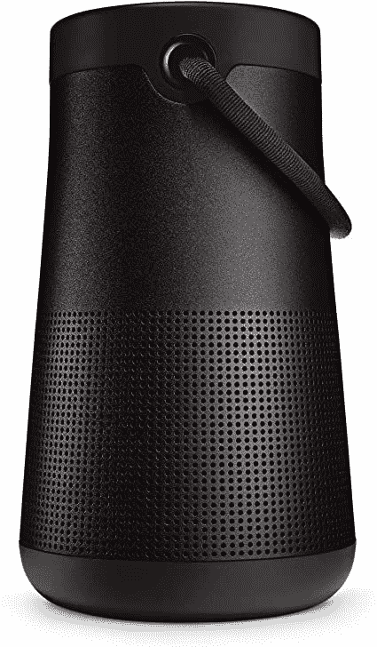

# 在黄金时段购买 Bose SoundLink Revolve+ II 可节省 100 美元

> 原文：<https://www.xda-developers.com/bose-soundlink-revolve-ii-deal-prime-day/>

尽管我们已经进入了亚马逊 [Prime Day](https://www.xda-developers.com/amazon-prime-day/) 促销活动的第二天，也是最后一天，但电子商务平台上仍有不少打折商品。亚马逊自己的系列产品 [Echo 智能产品](https://www.xda-developers.com/amazon-echo-prime-day-deals-roundup/)、[Fire TV](https://www.xda-developers.com/best-prime-day-fire-tv-deals/)和 Kindle 电子阅读器仍然以很高的折扣出售，还有三星、摩托罗拉、一加等品牌的各种产品。音频产品也有一些令人兴奋的折扣，包括 TWS 耳塞、游戏耳机和 Bose 的 SoundLink Revolve+ II 扬声器。

Bose SoundLink Revolve+ II 是一款便携式蓝牙扬声器，可提供 360 度环绕声输出。这是一款 IP55 认证的防尘防水扬声器，一次充电可以连续播放 17 个小时你最喜欢的音乐。这款扬声器配有一个漂亮的手柄，所以你可以很容易地把它带到任何地方。

这款扬声器还配有内置麦克风，因此你可以在不断开智能手机的情况下接听电话，甚至可以调用设备的默认语音助手。此外，您可以将 SoundLink Revolve+ II 与支持亚马逊 Alexa 的设备配对，以便更好地免提控制您的音乐和智能家居控制。

 <picture></picture> 

Bose SoundLink Revolve+ II

##### Bose SoundLink II

Bose SoundLink Revolve+ II 是一款高级蓝牙扬声器，提供 360 度音频输出，防尘防水等级为 IP55。

Bose SoundLink Revolve+ II 通常在亚马逊上的零售价为 330 美元，但在 Prime Day 期间，你可以以 30%的价格购买一台。银色和黑色都有折扣价格，您可以通过上面提供的链接立即订购。如果你有多余的钱，你可以订购两个便携式蓝牙扬声器，并将它们配对以立体声模式播放音乐。如果您已经有一个 Bose SoundLink 扬声器，您应该能够将该型号与您当前的扬声器配对，以获得相同的效果。

你会在促销期间订购 SoundLink Revolve+ II 吗？请在下面的评论区告诉我们。