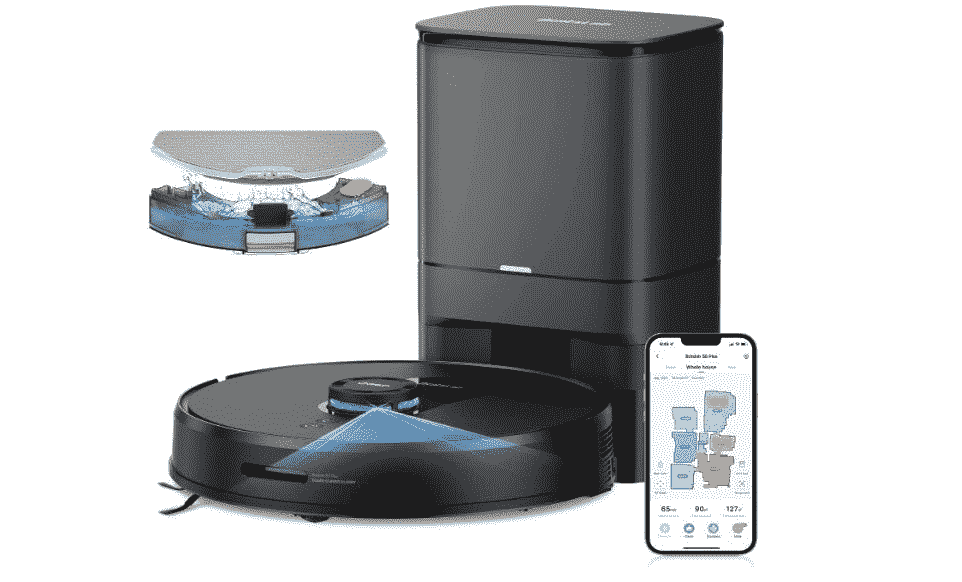

# Botslab NaviClean S8 Plus 机器人真空评论:带自动清空站的中等价位扫地和拖地机器人

> 原文：<https://www.xda-developers.com/botslab-naviclean-s8-plus-robot-vacuum-review/>

人们购买机器人吸尘器，让他们的日常清洁变得更容易、更轻松。但是独立的机器人吸尘器有一个小垃圾箱，这对于几个周期来说是好的，但是它确实需要人工干预来定期清空。如果你有很多地毯、满是灰尘的地板或宠物，清空机器人真空吸尘器上的垃圾箱会成为一项乏味的任务，因为这些固有地会吸引更多的污垢和灰尘。Botslab NaviClean S8 Plus 机器人吸尘器及其自动清空站意味着您只需每月更换一次集尘袋，这对无法每天更换集尘袋的人来说是个好消息。如果你想同时扫地和拖地，机器人吸尘器还有一个相当大的水箱。

 <picture></picture> 

Botslab NaviClean S8 Plus

##### Botslab NaviClean S8 Plus

Botslab 二合一机器人吸尘器和拖把自动完成日常清洁工作

#### **浏览此评论:**

## Botslab NaviClean S8 Plus:定价和供货情况

Botlsab 是 360 系列机器人吸尘器的新品牌名称，该品牌尚未在所有在线商店中确立。目前，Botslab 似乎只提供两款产品，一款机器人吸尘器和一款智能相机。然而，Smart360 品牌在一系列价格范围内提供了一系列性能良好的机器人。 [Botslab NaviClean S8 Plus](https://www.amazon.com/360-Navigation-Detection-Personalized-Cleaning/dp/B09PFN6SZK?tag=xda-2q68nia-20&ascsubtag=UUxdaUeUpU43896&asc_refurl=https%3A%2F%2Fwww.xda-developers.com%2Fbotslab-naviclean-s8-plus-robot-vacuum-review%2F&asc_campaign=Authority) 是一款中等价位的待售机器人。它在亚马逊上售价 499.99 美元

| 

规范

 | 

Botslab NaviClean S8 Plus

 |
| --- | --- |
| 规模 | 长*宽*高 340*340*95 毫米(13.4*13.4*3.7 英寸) |
| 额定电压(伏) | 14.8 伏 |
| 额定功率(P) | 30 瓦 |
| 电池(毫安时) | 5000 毫安时 |
| 工作时间(分钟) | 250 &#124; 210 &#124; 140 &#124; 110 |
| 吸力(帕) |  600 &#124; 1000 &#124; 1500 &#124;2700 |
| 垃圾箱(左) | 0.35 升 |
| 水箱(L) | 0.3 升 |
| 噪音(分贝) | 59 &#124; 61 &#124; 63 &#124; 65 |
| 障碍攀登 | 20 毫米(0.79 英寸) |

***关于这篇评论**:这篇评论是在对公司提供的一款 Botslab NaviClean S8 Plus 进行了为期三个月的测试后撰写的。Botslab 在这篇文章中没有任何投入。*

* * *

## Botslab NaviClean S8 Plus:盒子里是什么？

Botslab NaviClean S8 Plus 机器人真空吸尘器装在一个大盒子里，里面装有您开始使用所需的一切。有机器人真空吸尘器，带有板载垃圾箱和水箱，自动清空站，拖把支架和拖把垫。还有备用的集尘袋，滚筒清洁工具，刷子，用户手册。

要使用机器人真空吸尘器，请将自动清空台连接到电源，从保险杠后面取下任何包装，从机器人真空吸尘器上取下薄膜，打开机器人真空吸尘器的电源，并将其放在自动清空台上充电。如果机器人吸尘器顶部的电源开关还没有打开，你还需要按下它。机器人会用令人恼火的友好声音宣布它正在充电。自动清空站上应该有一个白色 LED 灯来指示该站的电源。

Botslab NaviClean S8 Plus 机器人真空包包含您开始自动清洁和拖地所需的一切，所有这些都由一个应用程序控制。

您可以使用机器人顶部的开关启动机器人，并通过另一个开关将其发送回家，但要充分利用 NaviClean S8 Plus，请安装 Botslab 应用程序并配置您的首选设置。

* * *

## 设计和功能

一个机器人真空和自动清空站，可以由一个应用程序控制，并集成了 [Alexa](https://www.xda-developers.com/best-amazon-echo-devices/) ，Siri 和 [Google Home](https://www.xda-developers.com/best-google-assistant-speakers/) 。

*   同时拖地和吸尘
*   综合应用
*   多地图管理
*   2D 和 3D 地图视图
*   房间划分和禁区

Botslab NaviClean S8 plus 可轻松与手机上的应用程序配对。下载 Botslabb 应用程序并创建一个用户帐户。扫描用户手册中的二维码或在要连接的设备列表中搜索机器人吸尘器。

该应用程序将通过 2.4GHz Wi-Fi 网络连接到机器人(大多数智能应用程序通过 2.4GHz Wi-Fi 连接工作得最好)。该应用程序看到了机器人，并迅速连接，没有任何问题。

### 功能齐全的应用程序

该应用程序具有许多适用于 NaviClean S8 Plus 的可配置功能。你可以配置应用程序，让机器人清洁一个房间，整个房子，或者只是一个区域。您可以指定是要清洁该区域一次还是两次，设置禁区，以及分隔房间。安装拖把模块后，您可以指定要使用多少水，并设置机器人吸尘器是用于拖把、吸尘器还是吸尘器和拖把。

### **自定义设置**

您可以进一步定制应用程序，实现全自动清洁。您可以指定“请勿打扰”时间，以便机器人在此期间不工作。您可以指定机器人在穿过它检测到的任何地毯时增加吸力，如果您认为机器人灯太亮，请关闭按钮灯。

您可以设置一系列不同的清洁时间表，指定机器人是每天清洁、工作日清洁、周末清洁还是仅清洁一次，以及希望开始清洁的时间。您还可以指定要清洁的区域或房间，或者设置整个房间的清洁。

当机器人运行时，您可以更改时间表、暂停、更改设置或将机器人送回充电站。你甚至可以使用你的移动设备作为遥控器，将机器人送到特定的区域进行清洁。

### 轻微刺激:语音提示音很烦人

最让我恼火的是机器人过于欢快、甜腻的声音。这听起来像是一个过分热情的销售助理拼命想做成一笔买卖。如果我暂停清洁循环并重新启动，机器人会宣布“清洁让我快乐！”出发的时候。我想踩在上面。幸运的是，您可以改变语音通知的音量。然而，如果你把声音调小太多，你将听不到它欢快地宣布“我在这里！”当你点击“寻找机器人”图标。

* * *

## 谁应该购买 Botslab NaviClean S8 Plus 机器人吸尘器？

*   如果你想要二合一的扫地和拖地，买一台 NaviClean S8 Plus 机器人吸尘器
*   如果你讨厌每隔几天就清理车上的垃圾箱，你应该买这个机器人吸尘器
*   如果您喜欢通过功能全面的应用程序管理吸尘器，请购买 Botslab NaviClean S8 Plus 机器人吸尘器

还有其他类似价位的机器人出售。然而，如果你以相似的价格购买了一台 Yeedi Vac 2 Pro ，你将不得不额外支付一笔额外的费用来购买一台自动清空工作站。如果你家里主要是地毯，可以考虑买一个吸力更大的机器人吸尘器，比如有 4000 帕吸力的[梦幻机器人 D10](https://www.xda-developers.com/dreame-bot-d10-plus-review/) 。

其他品牌领导者提供类似价格范围的竞争产品。无论是售价 429.99 美元的[robo rock Q5](https://www.amazon.com/Roborock-Q5-Upgraded-Navigation-Multi-Level/dp/B09N3JKFFY?tag=xda-2q68nia-20&ascsubtag=UUxdaUeUpU43896&asc_refurl=https%3A%2F%2Fwww.xda-developers.com%2Fbotslab-naviclean-s8-plus-robot-vacuum-review%2F&asc_campaign=Authority)还是售价 499.99 美元的[Ecovacs dee bot T8 AIVI](https://www.amazon.com/Objection-Recognition-Advanced-Programming-Efficiency/dp/B086214HTZ?tag=xda-2q68nia-20&ascsubtag=UUxdaUeUpU43896&asc_refurl=https%3A%2F%2Fwww.xda-developers.com%2Fbotslab-naviclean-s8-plus-robot-vacuum-review%2F&asc_campaign=Authority)都没有自动清空站，如果你想整包购买，Botslab 很划算。

### 为什么我喜欢 Botslab NaviClean S8 Plus 机器人吸尘器

我发现 Botslab NaviClean S8 Plus 机器人吸尘器很容易连接到应用程序，并配置清洁和拖地模式，以适应我的生活模式。拖地对于日常拖地来说是合理的，虽然偶尔，我不得不在继续日常拖地之前求助于手动擦洗地板来去除根深蒂固的污垢。

NaviClean S8 Plus 不是你能买到的最便宜的机器人吸尘器。但它的自动清空站和大容量垃圾箱，无需手动清洁和最小干预，当然值得一看

 <picture></picture> 

Botslab NaviClean S8 Plus

##### Botslab NaviClean S8 Plus

具有长电池寿命和大容量自动清空站的二合一扫地和拖地机器人真空吸尘器