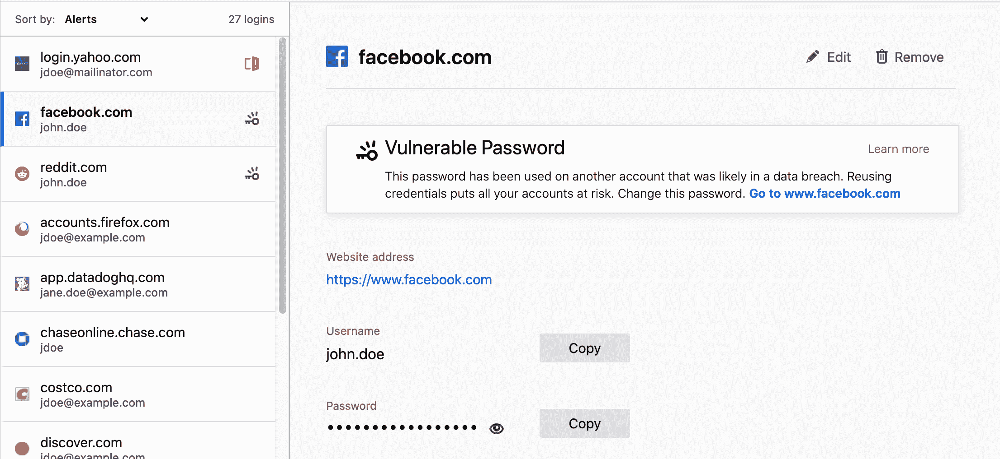
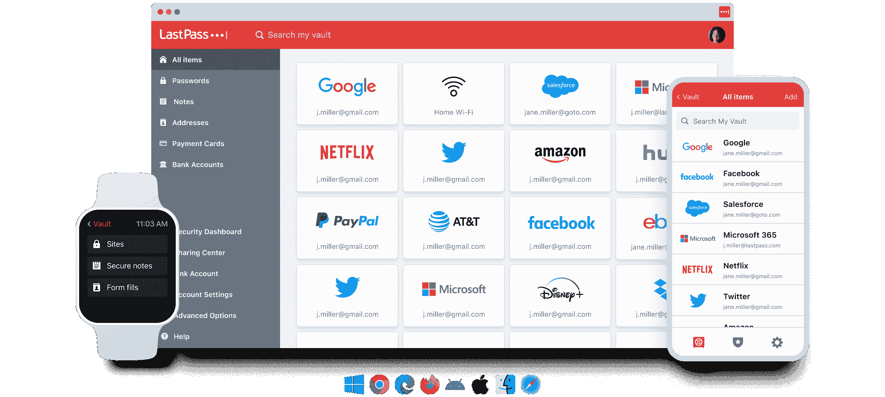

# 我在网络浏览器中使用了这些内置的密码管理器，所以你不必

> 原文：<https://www.xda-developers.com/browsers-with-built-in-password-managers/>

在 2023 年，密码管理器的重要性不可低估，尤其是如果你的在线账户越来越多。密码管理器不仅能保证你的在线安全，还能让你更容易创建和存储强密码。我最近[注册了一个密码管理器](https://www.xda-developers.com/password-manager-beginner-guide/)，并发现了许多可供选择的选项，包括内置的密码管理器，这是大多数网络浏览器的特色。

是的，您也可以使用您的网络浏览器内置的密码管理器来管理您的登录数据。只要浏览器在您的所有设备上运行，这些密码就会在该平台上同步。但是这些内置的密码管理工具有用吗？而且更重要的是，把自己所有的密码交给这些浏览器真的安全吗？嗯，我试着用了几天，看看它是如何工作的，是否值得采用专用的密码管理器。这是我的发现。

## 内置密码管理器的浏览器

2023 年，大多数现代网络浏览器都内置了密码管理器。默认情况下，它通常是打开的，因此每次您在特定网站上输入登录详细信息时，您的浏览器都会询问您是否要保存密码。如果你选择保存它，那么你的浏览器将记录你的密码并保存在云中，以便在你下次访问同一页面时自动填写凭证。因此，如果你选择保存密码，你的浏览器已经在云端收集了你的密码。下面是我试过的，但是大多数浏览器都有。

### 谷歌浏览器

谷歌 Chrome 无疑是 T2 最受欢迎的网络浏览器之一，可以在不同平台上运行。它还有一个内置的密码管理工具，可以让你为你的网上账户创建和保存密码。它使用 AES 256 位 SSL/TLS 加密和个人信息，因此它与这里提到的其他选项一样安全。除了生成和保存密码，Chrome 还可以告诉你你的密码是否脆弱或何时被泄露。

### 旅行队

对于使用苹果设备的人来说，苹果的 Safari 浏览器是一个理想的选择。它还可以为你生成 store 和 autofill 密码，只要你用同一个 Apple 帐户使用 Apple 设备，所有信息都会保存在 iCloud 钥匙串中。它还使用端到端的 256 位 AES 加密，这意味着您的登录凭据由登录密钥保护。

### 火狐

Firefox 内置的密码管理器可以让你生成和管理你所有的凭证。当 Firefox [结束对 Firefox Lockwise](https://www.xda-developers.com/firefox-lockwise-shutdown/) 的支持，并将其变成 Firefox 桌面和移动浏览器的内置功能时，这一点变得更加突出。此外，它还可以提醒您注意保存在您帐户中的易受攻击的密码。

### 微软 Edge

新的 Edge 基于与 Chrome 相同的开源 Chrome 引擎，因此它也有一个功能丰富的密码管理器，可以用来保护你的帐户。它还利用 AES-256 加密来增加您的密码的安全性，并允许您从设置页面中访问它们。最突出的特点是 Edge 允许你用微软的自动填充扩展在 Chrome 上自动填充你的密码，这非常简洁。

如你所见，所有这些内置工具都非常相似。它们都可以为你的在线帐户生成和保存密码，所以你不必担心手动管理它们。在这个特别的实验中，我最常用的是 Chrome 和 Safari，但是不管你用什么浏览器，你的体验可能都是一样的。

## 在浏览器中使用内置密码管理器的利与弊

如果你打算在你的浏览器中使用内置的密码管理功能，那么这里有一些你应该知道的优点和缺点，从一些明显的优点开始。

### 利:方便

我最喜欢使用内置密码管理器的一点是，一旦你开始使用浏览器本身，它们就能开箱即用。这个工具，正如我前面提到的，默认情况下是打开的，所以你的浏览器会自动询问你是否想保存你的密码。事实上，它不需要强迫你下载任何文件或创建新的帐户，这使得它非常方便。是的，你必须在你的网络浏览器中登录这个账户，但是你还是要这样做才能访问其他东西，比如你的书签和历史记录。

### Pro:跨设备同步数据

只要使用相同的网络浏览器，您还可以在所有设备上准备好所有密码。跨平台支持并不是基于浏览器的密码管理器所独有的，但它是一种功能，可以省去您下载单独的应用程序并在您的设备上设置它的麻烦。您必须登录您的帐户来保存/访问保存的密码，但同样，您可能还是会这样做。

只要使用相同的网络浏览器，您就可以在所有设备上准备好所有密码。

### 亲:免费使用

大多数专门的密码管理服务可以做的不仅仅是管理你的密码。它们通常捆绑了额外的功能或额外的东西，如用于保存重要文件的安全保险库。一些密码管理器甚至提供暗网监控功能来查看你的密码是否落入坏人之手。拥有新奇的东西通常是件好事，尤其是当它们是免费的时候，但是你会喜欢 web 浏览器内置密码管理器的简单性。

 <picture></picture> 

via LastPass.

这些基于浏览器的密码管理器只能在登录表单中生成、存储和自动填充您的密码。有些不允许您导入或导出密码，甚至不允许您自定义任何设置，因为当您打开浏览器时，它们就准备好了，这可以通过专用的密码管理器来完成。我喜欢使用像广告宣传的那样简单、实用的服务，但这取决于个人偏好。如果你想要更多的功能和自定义不同设置的灵活性，这些基于浏览器的密码管理器会让你想要更多。

### 缺点:密码仅限于浏览器

内置密码管理器的一个明显的限制是你的密码仅限于浏览器。您只能使用它们通过保存有您密码的浏览器登录帐户。这意味着您不能使用它来登录安装在同一台设备上的应用程序。因此，如果你想通过这个应用程序登录你的 Twitter 账户，你必须复制你的密码和用户名并粘贴进去。

这是一个额外的步骤，可以通过使用像 Bitwarden 这样的专用密码管理器来避免，它有专门的应用程序来为您导入和填写密码。这也意味着您的登录凭证仅限于保存密码的浏览器，这就引出了我的下一点。

基于浏览器的密码管理器的一个明显的局限性是，您的密码仅限于浏览器。

### 缺点:很难切换浏览器

不能在保存密码的浏览器之外访问密码也意味着你不能立即切换到不同的浏览器。在切换之前，你必须小心你的密码，尤其是如果你已经使用浏览器为你生成了唯一的和强有力的密码。大多数主流浏览器都允许你轻松导出密码，但这是一个额外的步骤，你可以通过使用跨不同浏览器和应用程序的专用密码管理服务来避免。

以 Bitwarden 为例，我可以为我正在使用的浏览器安装一个扩展，并准备好我所有的密码。它同样适用于许多其他密码管理器，并且比每次切换或使用新密码时导出和导入密码要容易得多。

### 缺点:没有简单或安全的共享选项

独立的密码管理器，包括免费的 Bitwarden 或 Zoho Vault，可以让你轻松地与你信任的人分享你的密码。他们中的许多人甚至有家庭层，提供所有成员都可以访问的共享文件夹。这是浏览器内置的密码管理器做不到的。在这里，您唯一的选择是手动导出或复制它们以供共享。

## 你应该使用浏览器内置的密码管理器吗？

在使用了基于浏览器的和成熟的密码管理器之后，我可以肯定地说，我更倾向于使用合适的工具，而不是依赖我的浏览器。基于浏览器的密码管理器似乎没有一长串的缺点，但是在日常使用时，现有的因素是值得考虑的。例如，无法在浏览器之外的应用程序上访问我的密码，对我来说是一个巨大的障碍。同样，我也希望能够轻松地与我的一些朋友和家人共享我的密码，而不是必须处理手动过程。

然而，你的里程可能会有所不同，尤其是如果你是一个临时用户。如果您的使用仅限于偶然的 web 浏览，或者如果您只想保存仅在 web 浏览器上访问的服务的密码，那么您可以考虑这些基于浏览器的密码管理器。但是其他人应该订阅一个专门的服务来管理他们的密码。我这么说是因为即使是免费的密码管理器也提供了大量的功能，让你的生活变得更加轻松。

我想知道你对网络浏览器自带的内置密码管理器的看法。你积极使用或计划使用吗？请在下面的评论中告诉我！