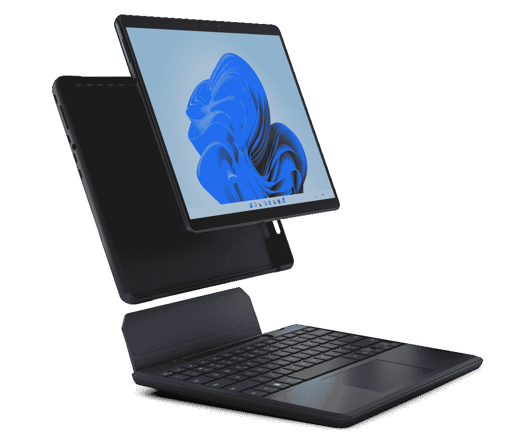

# Brydge SP Max+是 Surface Pro 8 的坚固外壳和键盘

> 原文：<https://www.xda-developers.com/brydge-sp-max-plus-case-keyboard-surface-pro-8/>

以平板电脑和笔记本电脑的键盘和坞站而闻名的公司 Brydge 宣布了 SP Max+，这是一种新的配件，将外壳和键盘盖结合在一起，用于 Surface Pro 8。Brydge 通常更专注于键盘，这有助于 Surface 平板电脑更像笔记本电脑，但这款平板电脑也配有坚固的外壳，增加了一定程度的保护。

与其他 Brydge 产品相比，Brydge SP Max+的一个显著区别是，它实际上使用的是 pin 连接，而不是无线连接。这意味着你必须永久地将 Surface Pro 8 连接到键盘上才能使用它，但它的好处是潜在的更可靠的连接，更少的延迟或连接丢失，此外还不需要自己的电池。

另一个有趣的功能是可以将 Surface Slim Pen 存储在键盘内部，就像官方的 Surface Pro 签名键盘一样。但是，它不能给笔充电，所以你必须使用 USB Type-C 端口单独充电。

虽然这不是一个新功能，但 Brydge SP Max+也有一个触摸板，尺寸为 110 毫米 x 60mm 毫米，带有精密驱动器，因此您也可以在这方面获得很好的体验。这意味着完全支持触摸板手势，这是 T2 Windows 11 T3 设备的标准。此外，该键盘拥有您所期望的所有按键，并且是背光的，有三种亮度可供选择。

键盘部分和外壳本身或一起使用时都可以承受高达 4 英尺的跌落。这应该有助于保护你的 Surface Pro 8 免受跌落和碰撞，而且它肯定会比官方键盘盖做得更好。当然，你是否应该购买它而不是另一个 [Surface Pro 8 外壳](https://www.xda-developers.com/best-surface-pro-8-cases/)还有待商榷。

如果您确实想购买 Brydge SP Max+，您可以使用下面的链接。它会花掉你 229.99 美元。

 <picture></picture> 

Brydge SP Max+

##### 桥 SP 最大值+

Brydge SP Max+为您提供了一个带触摸板和 Surface 超薄笔存储的键盘盖，以及一个保护 Surface Pro 8 的外壳。