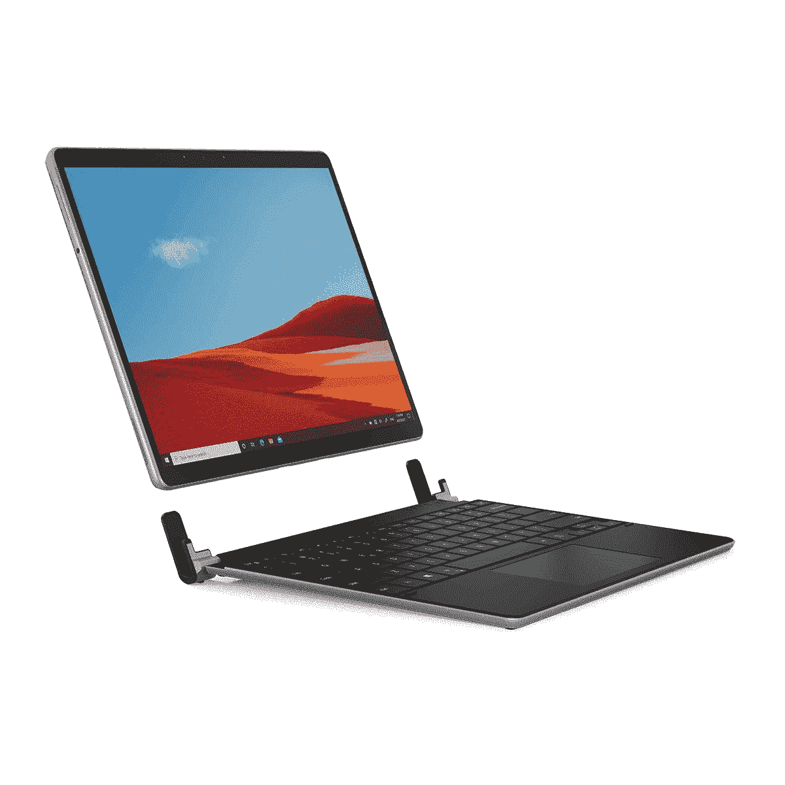

# Brydge SP Plus 评测:把 Surface Pro 8 变成笔记本电脑

> 原文：<https://www.xda-developers.com/brydge-sp-plus-review/>

。bestawarddiv {

浮动:对；

宽度:20%；

边距:1em

边距-顶部:0；

}

自从最初的 Surface 平板电脑在 2012 年发布以来，我就觉得它们有一个致命的弱点。它们是可以用作笔记本电脑的平板电脑，但它们在这两方面都不是特别出色。Brydge 用它的 SP Plus 键盘解决了这个问题。

有了 Brydge SP Plus， [Surface Pro 8](https://www.xda-developers.com/surface-pro-8-review/) 可以紧密地放入两个夹子中，这两个夹子有一个铰链，感觉比松软的 Surface 键盘更紧。这有很大的不同，用微软自己的 Panos Panay 的话来说，它更容易理解。

事实上，即使在第八代产品中，微软也没有很好地制作出自己的便携式产品。对于所有第一方产品，您必须使用带有内置支架和可连接键盘的 Surface。放在你腿上不舒服。另一方面，Brydge SP Plus 的底座很重，所以感觉就像在使用一台合适的笔记本电脑，直到你将平板电脑从夹子中拔出来。

此外，它带有 Designed for Surface 品牌，这意味着 Brydge 实际上与微软在这方面进行了合作。

 <picture></picture> 

Brydge SP+

##### 桥 SP+

Brydge SP Plus 将 Surface Pro 8 的外形完全改变为笔记本电脑的外形，而不会限制平板电脑的体验。

**浏览此评论:**

## 定价和可用性

Brydge SP Plus 现在售价 139.99 美元，你可以从亚马逊或 Brydge 自己的网站上购买。你可以选择铂金色或黑色，就像 Surface Pro 8 一样，所以你可以选择搭配或想要双色外观。

虽然这是一个蓝牙键盘，从技术上讲，它可以与任何支持蓝牙 5.0 的设备一起工作，但值得记住的是，它是为 Surface Pro 8 设计的，而*只是*而已。Surface Pro X 是一款非常相似的设备，在它的三个维度中，有两个是相同的，但它更薄。这意味着 Pro X 将从 SP Plus 的夹子中掉出。好消息是，如果你使用的是 Surface Pro X，Brydge 也制作了一款名为 Surface Pro X 的键盘，被恰当地称为 SPX Plus，亚马逊上也有。

## Brydge SP Plus:规格

| 

和睦相处

 | Surface Pro 8 |
| 

尺寸和重量

 | 长:11.3 英寸(287.5 毫米)宽:8.2 英寸(208.5 毫米)高:0.77 英寸(19.5 毫米)重:1.5 磅(678 克) |
| 

型号和颜色

 | BRY70312 -铂灰色 70322 -黑色 |
| 

背光按键

 | 是- 3 级 |
| 

连通性

 | 蓝牙 5.0USB-C(充电) |
| 

电池寿命

 | 6 个月(每天使用 2 小时，不使用背光)或每次充电 40 小时(持续背光时)，可通过 USB-C 电缆充电 |
| 

材料

 | 铝金属 |
| 

保证

 | 1 年有限保修 |
| 

盒子里有什么

 | 1 个 Brydge SP+键盘 1 个用户手册 |
| 

价格

 | $139.99 |

***关于本次评测:**布莱奇给我们发来了 SP Plus 进行评测。它没有对这次审查的内容提出任何意见。*

## 我喜欢什么

*   Brydge SP Plus 通过赋予 Surface Pro 8 笔记本电脑的感觉，为其增添了新的活力。
*   它有背光和微软精密触摸板，所以它的整体体验很棒。

Brydge SP Plus 最棒的地方在于，它就像使用笔记本电脑一样。它像笔记本电脑一样打开，你可以在膝盖上舒服地使用它，在上面打字也很舒服。该公司还为其余的 [Surface 平板电脑系列](https://www.xda-developers.com/best-microsoft-surface-pcs/)以及[苹果的 ipad](https://www.xda-developers.com/best-ipad/)生产其他键盘。他们都很棒。

它也没有从平板电脑体验中带走任何东西。正如你从上面的图像中看到的，平板电脑只是放在一对夹子中，这些夹子连接到支撑设备的铰链上。这些夹子的内部有衬垫，因此您可以轻松地取出平板电脑并像这样使用。毕竟，如果你根本不打算移除它，你可能只会购买一台 Surface 笔记本电脑，甚至更大尺寸的 Surface Laptop Go。

Brydge SP Plus 从根本上改变了 Surface Pro 8 的外形，这是一种好的方式。

它不仅为产品增添了新的活力，而且我觉得它从根本上以一种好的方式改变了外形。这让人想起了 Surface Book 的外形，但更薄、更轻，并且没有专用图形。你仍然可以得到一个完整的笔记本电脑外形，带有可拆卸的显示屏，但不会非常昂贵或比你需要的更强大。

在使用它的过程中，我真的想知道 Brydge 是否考虑过在中间使用单铰链，而不是在两侧使用双铰链。中间的一个铰链可以让你将 Surface Pro 8 放置在纵向位置。尽管如此，这仍然是所有 Brydge 键盘产品的总体设计。

电池寿命也很长。Brydge 在这方面的指标有点分散，因为有一个不使用背光的统计数据和一个使用背光的统计数据，它们的测量方法不同。如果背光打开，Brydge 承诺 40 小时，这是五个完整的工作日。没有背光，该公司承诺六个月，但每天只有两个小时，所以应该算出约 365 小时。

我可以告诉你，我没有用这个做任何电池测试。是蓝牙键盘，我去用的时候一直有充电。如果你需要充电，旁边有一个 USB Type-C 端口，所以你可以随时充电。

这就是我如何看待这些类型的设备，这些设备的电池寿命长达数周。在那一点上这不是问题。因为你很少需要充电，所以你可能会忘记，但是你可以在需要的时候给它充电，并且你可以在充电的时候一直使用它。

关于 Brydge SP Plus，还有其他一些非常棒的地方。键盘有三种不同亮度的背光，这对于蓝牙键盘来说非常好。它也有一个微软精密触摸板，所以它支持你习惯的所有手势。

这款产品是官方为 Surface 设计的，也就是说它经过了微软的认证。对于第三方配件来说，这是一件大事。

## 我不喜欢的是

*   笔无法存放或充电。

我对 Brydge SP Plus 最大的问题是没有存放笔的方法。事实上，这也是我对 Brydge SPX Plus 的问题。在前几代 Surface Pro 中，Surface Pen 通过磁力附着在平板电脑的侧面，并且使用 AAAA 电池。对于 Surface Pro 8(和 Surface Pro X)和 Slim Pen 或 Slim Pen 2，笔实际上是存放在 Surface 键盘内部，也可以无线充电。

微软确实出售一款带有独立充电器的超薄 Pen 2。尽管如此，你还是得随身携带。

有了 Brydge SP Plus，就没有地方存放笔或给笔充电了。

我真的希望从 Brydge 看到的另一件事是键盘可以连接到 Surface 自己的键盘连接器。当然，蓝牙键盘很好，但是有线的总是比无线的好。需要说明的是，我在使用这个优秀的产品时没有遇到任何连接问题。虽然有时候，当我第一次开始使用它时，需要一点时间来连接。此外，如果它是物理连接的，你就不必充电。

我之前提到过，我认为中间的单个夹子比两侧的两个夹子更有意义，因为它可以让你垂直使用平板电脑。这样，假设增加了功能，当它水平使用时，您也可以连接到键盘端口。很明显，垂直方向永远是蓝牙。

最后，我不喜欢夹子有多厚。笔记本电脑和平板电脑一般都是平的，所以把其他平的东西放在包里旁边也不成问题。这些夹子足够厚，以至于它不再是真正平的了，这一点值得注意。出于显而易见的原因，我从来不会把平板电脑放在它旁边，让玻璃面向 Surface Pro 8 的背面。

## 谁该买？

我将这篇评论分为我喜欢和不喜欢的部分，因为虽然 Brydge SP Plus 是一款很棒的产品，但它并不适合所有人。

**谁应该购买 Brydge SP Plus:**

*   希望将 Surface Pro 8 主要用作笔记本电脑而不放弃平板电脑体验的人
*   只想为 Surface Pro 8 配备一个出色键盘的人

**谁不应该购买 Brydge SP Plus:**

*   经常使用细长笔画画、做笔记或做其他任何事情的用户

正如我所说，Brydge SP Plus 是一款非常棒的产品，原因有很多。is 不仅以一种好的方式改变了 Surface Pro 8 的外形，而且它也是一个很棒的键盘。比起 Surface 键盘，我更喜欢使用它，我认为它对大多数用户来说都很棒。