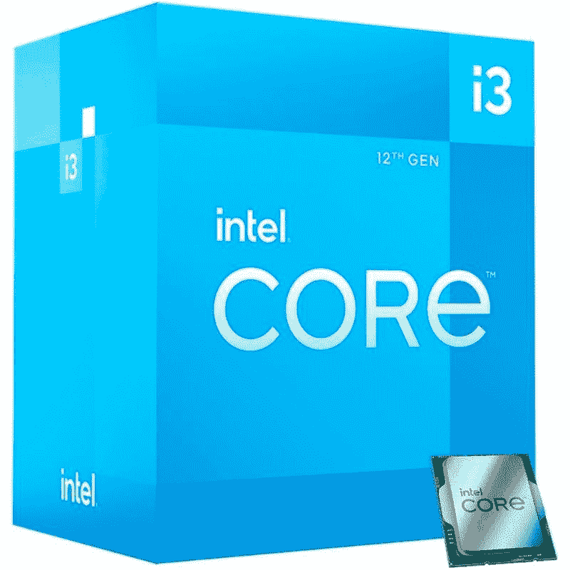
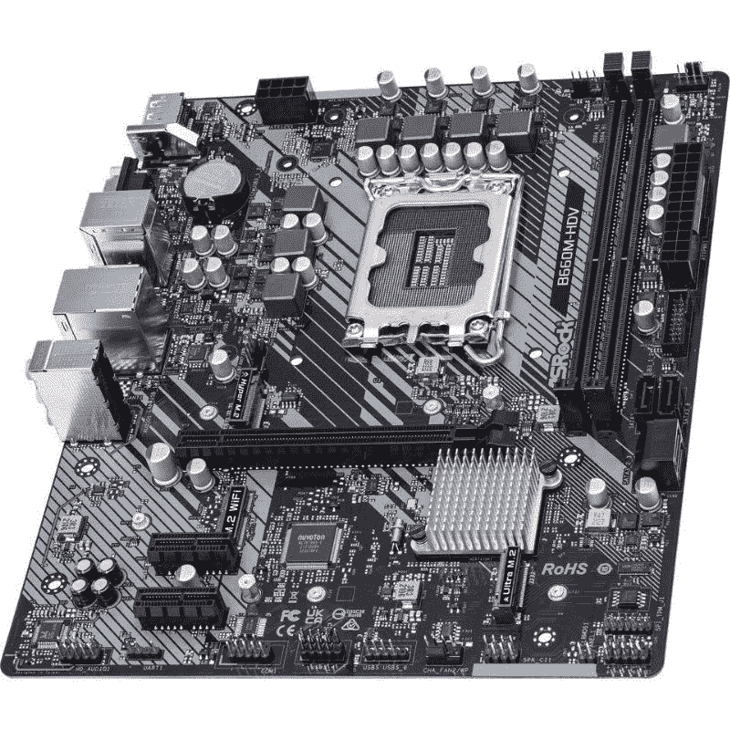
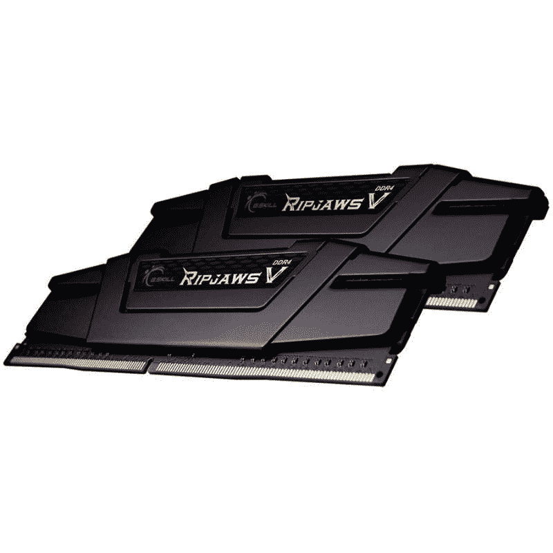
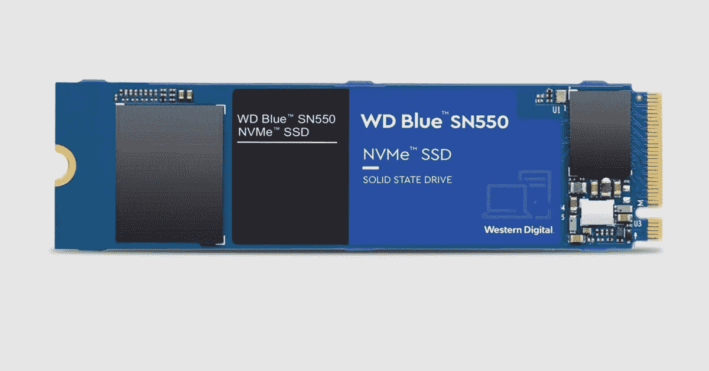
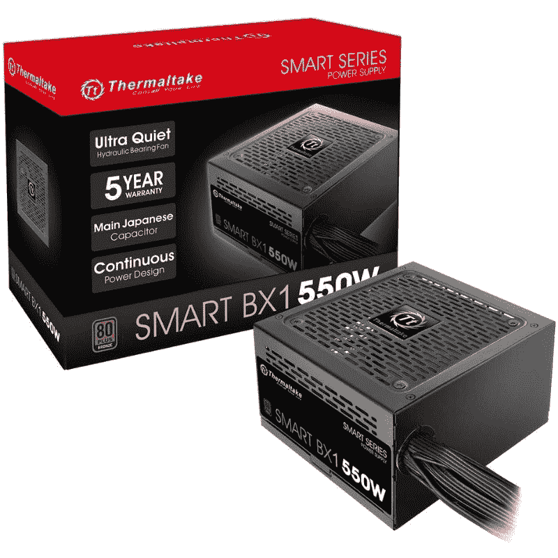
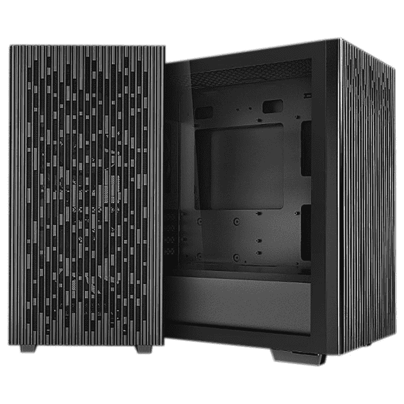

# 预算家庭/办公室工作 PC 构建指南:这些是 450 美元构建的最佳部分

> 原文：<https://www.xda-developers.com/budget-office-pc-guide/>

众所周知，由于目前 PC 组件市场的状况，构建自己的 PC 比以往任何时候都更加困难。生产问题和高需求的不幸结合导致了个人电脑部件的大量短缺。很难拿到很多部件，包括[显卡](https://www.xda-developers.com/best-graphics-cards/)，内存套件等等。也就是说，您仍然可以为日常工作负载构建强大的计算机。在本指南中，我们将告诉您目前市场上可以买到的最适合家庭/办公用电脑的部件。

我们为这种特殊构造挑选的零件都可以在市场上买到，这意味着您在网上或零售店购买它们应该没有问题。这种构建的成本不到 450 美元，如果你希望在 2023 年最终建立一个家庭/办公室工作站，这是一个很好的选择。

## 预算家用/办公用电脑的最佳 CPU:英特尔酷睿 i3-12100

对于 CPU，我们选择了新的英特尔酷睿 i3-12100 处理器，这是该公司新的[第 12 代 Alder Lake](https://www.xda-developers.com/intel-12th-gen-alder-lake/) 产品线的一部分。12100 配有四个核心和八个线程，最大睿频为 4.3GHz。这种特殊的芯片没有 P 核心和 E 核心的混合组合，但我们认为四个 P 核心将能够处理你扔给它的任何东西，就像我们的[最佳 CPU](https://www.xda-developers.com/best-cpus/) 系列中的许多其他选项一样。虽然像酷睿 i5-12400 处理器这样的处理器对于家庭/办公室工作电脑来说似乎有些多余，但我们认为酷睿 i3-12100 对于这种构建来说是完全可行的。你也可以选择前代或更老的 CPU，如酷睿 i3-10100，但我们认为最好选择一款支持 [DDR5 内存](https://www.xda-developers.com/best-ddr5-ram/)和 PCIe Gen 5 的新芯片。

你也可以走 [AMD CPU](https://www.xda-developers.com/best-amd-cpu/) 路线，满足于锐龙 5 3600 等前代芯片或 AMD Athlon 系列的低功率单元。然而，我们设法保留了这一版本的核心 i3-12100 以及其他兼容组件，价格约为 450 美元，这是我们最初设定的预算。这台电脑功能强大，足以让你在未来的许多年里都过得很好。这种配置也可以在未来升级为更强大的机器，只需增加一块显卡和高速 RAM。值得指出的是，我们没有为这一特定版本使用显卡，主要是因为 12100 配备了足够强大的集成显卡，可以轻松处理日常工作负载。

 <picture></picture> 

Intel Core i3-12100 Processor

##### 英特尔酷睿 i3-12100

英特尔酷睿 i3-12100 是一款稳定的入门级办公电脑。它配备了四个性能内核(P-Cores)和八个线程，可以处理您在生产力应用程序方面遇到的任何问题。

## 最适合经济型家用/办公电脑的主板:ASRock B660M Pro

对于主板，我们使用基于英特尔 600 系列芯片的较新主板之一。B660 芯片组为那些希望使用 Alder Lake CPUs 进行构建的人带来了更实惠的[英特尔主板](https://www.xda-developers.com/best-motherboard-intel/)选项。特别是 ASRock B660M Pro，它是入门级 Alder Lake builds 的绝佳主板。当然，你可以为 Alder Lake 购买更多价格合理的主板，但 ASRock B660M Pro 与 12100 配合使用效果很好，并为未来的升级开辟了道路。这款主板支持 DDR4 内存模块，这意味着您不必担心花费更多或等待获得更新的 DDR5 RAM 套件。它还有两个 M.2 插座，并提供了包括 HDMI 和 DisplayPort 在内的多种端口选择。值得指出的是，这种主板不是为通过高端构建供电而设计的，比如说，一个未锁定的 Alder Lake 芯片，所以最好保持你的期望。ASRock B660M 是一个 mATX 主板，这意味着如果你有一个更大的机箱，你可能需要一个标准的 ATX 版本的主板。

 <picture></picture> 

ASRock B660M Pro RS motherboard

##### ASRock B660M Pro RS

ASRock B660M Pro RS 是一款坚固的入门级主板。它完全能够处理 Core i5-12400，也为未来的升级开辟了道路。

## 最适合经济型家用/办公电脑的内存:GSkill Ripjaws V DDR4 16GB 套件

我们决定选择 GSkill Ripjaws V 作为这个版本的内存，因为它的性能可靠。不到 60 美元，你就可以得到两个 8GB 的 DDR4-3200 速度的记忆棒。G.Skill Ripjaws 是经过试验和测试的模块，它们已经是我们现在在市场上可以买到的[最佳 DDR4 RAM](https://www.xda-developers.com/best-ddr4-ram/) 套件的一部分。这些可靠的记忆棒可以用于从中级生产力机器到相对强大的游戏 PC 的任何东西。你总是可以选择不太强大的记忆棒来节省更多的现金，但我们决定使用这些 Ripjaws 记忆棒，主要是因为我们的主板和 CPU 都支持 DDR4-3200 速度。

 <picture></picture> 

G.Skill Ripjaws V RAM kit

##### G.技能 Ripjaws V DDR4

G.Skill Ripjaws V DDR4 记忆棒是市场上最可靠的记忆棒之一。这些棒提供高存储速度和更紧的时间，整体性能稳定。

## 最适合经济型家用/办公电脑的存储硬盘:Western Digital Blue SN550 M.2 固态硬盘

Western Digital Blue SN550 一直是相当长一段时间以来的首选 M.2 固态硬盘，因此我们将其添加到这一版本中也就不足为奇了。这可能是目前市场上最实惠、最可靠的固态硬盘之一。它可以在各种不同的平台上很好地工作，是向您的系统添加更快的 M.2 存储的最佳方式之一。您也可以选择 SATA 驱动器而不是 M.2 驱动器来节省一些现金，但我们认为 SN550 绝对是显而易见的。它可以作为 windows 和您工作所需的所有日常应用程序的出色启动驱动器。

 <picture></picture> 

Western Digital Blue SN550

##### WD Blue SN550 NVMe M.2 固态硬盘

Western Digital SN550 对于这种构建来说是显而易见的。它将成为 Windows 和所有日常应用程序的绝佳启动驱动器。

## 经济型家用/办公电脑的最佳电源设备:Thermaltake Smart BX1 550W PSU

基于我们为这种特殊构造挑选的零件，我们认为 550 瓦的 PSU 应该足以为整个钻机提供动力，不会有任何问题。因此，我们选择了 Thermaltake Smart BX1 550W 作为这一版本的 PSU。这款特别的 PSU 为 PC 提供了可靠的 550W 功率，并且它具有 80 Plus 青铜级效率评级，这使它优于市场上的许多其他预算 PSU。这款 PSU 唯一的缺点是没有完全模块化，这意味着你在组装电脑时可能会遇到一些麻烦。当你考虑它可承受的价格标签时，这是一个小小的权衡。您可以随时升级更好的产品，如 Corsair RM550x PSU，这是一个完全模块化的电源设备，具有 80+黄金效率评级。市场上并不缺少[电源单元](https://www.xda-developers.com/best-power-supply-pc/)，但是一定要选择一个可靠的选项，因为 PSU 基本上可以决定你整个系统的成败。

 <picture></picture> 

Thermaltake Smart BX1 550W PSU

##### Thermaltake Smart BX1 550W PSU

Thermaltake Smart BX1 550W 是一款价格合理、性能可靠的入门级电脑 PSU。它为电脑提供 550 瓦的功率，并具有 80+青铜级能效等级。

## 最适合经济型家庭/办公电脑的机箱:Deepcool Matrexx 40

Deepcool Matrexx 40 是一款售价 50 美元的[电脑保护套](https://www.xda-developers.com/best-pc-cases/)，代表了平价电脑保护套市场的最佳选择。尽管价格较低，但 Deepcool Matrexx 40 有很多优点，包括宽敞的内部空间，所有组件都有足够的间隙，气流设计等等。这种特殊的电脑机箱还配有滤网和预装的机箱风扇，价格仅为 50 美元。当然，你可以进一步购买一个非常基本的电脑机箱，价格低至 30 美元，但我们认为 Deepcool Matrexx 40 是一个坚固的机箱，如果你计划升级你的钻机，也可以在未来使用。这款中塔式电脑机箱也可以轻松容纳我们的 mATX 主板。

 <picture></picture> 

Deepcool Matrexx 40 mid-tower PC case

##### Deepcool Matrexx 40 中塔式电脑机箱

Deepcool Matrexx 40 是一款出色的中塔式电脑机箱，尽管价格实惠，但它有许多值得注意的功能。

## 预算家庭/办公室工作 PC 构建:价格汇总

根据我们为这一版本选择的部件，这里快速浏览一下经济型家用/办公电脑的价格汇总。不言而喻，价格会根据库存情况而变化。

| 

成分

 | 

挂牌价格

 |
| --- | --- |
| **英特尔酷睿 i3-12100 处理器** | $140 |
| **华硕 B660M Pro RS** | $95 |
| **英特尔层流 RM1 冷却器(包含在 CPU 中)** | $0 |
| **G . Skill rip jaws V DDR 4-3200 2x8GB RAM 套件** | $60 |
| **西数蓝 SN550 M.2 NVMe SSD** | $60 |
| **Thermaltake Smart BX1 550 w** | $50 |
| **Deepcool Matrexx 40 中塔式电脑机箱** | $52 |
| **总计** | **$457** |

注意:我们没有在价格汇总中包括机箱风扇的成本，但根据机箱的选择，您可能需要它们。例如，Deepcool Matrexx 40 电脑机箱配有一个预装的机箱风扇，这意味着您至少需要两个以上的风扇来保持机箱内的最佳气流，以维持热量。所需机箱风扇的数量取决于 PC 机箱的选择，幸运的是，只要你坚持购买价格合理的机箱，它们并不贵。

我们建议粉丝的开销为 10-15 美元。热粘贴解决方案也是如此。你可能不需要它，因为大多数 CPU 冷却器都有预先涂好的糊状物，但最好以很低的价格买一个装有热溶液的注射器。您可以查看我们收集的[最佳热贴解决方案](https://www.xda-developers.com/best-thermal-paste/)，找到一些可靠且实惠的选择。

* * *

除了高性能完全解锁的器件，英特尔的 Alder Lake 系列还包括少量用于基本构建的低功耗入门级芯片。英特尔酷睿 i3-12100 是低功耗部件之一，我们认为它是一款出色的入门级 CPU。12100 芯片提供了令人印象深刻的性能超过了许多其他旧的英特尔和 AMD 的同行。将它与一款更实惠的 B660M 主板搭配使用，我们能够以略高于 450 美元的价格组装出一个高效的工作平台。

在这个价格范围内，缺少独立显卡不应该是一个惊喜，但它也不是一个交易破坏者，特别是对于以预算为中心的生产力机器。Core i3-12100 自带集成显卡，我们认为这足以保证运行。这可能不是最强大的 PC，但它会比许多使用旧 CPU 的其他版本更耐用。更不用说，它还通过支持 DDR5 内存和 PCIe 第五代支持保持了升级路径的畅通。请在下面的评论中留言，让我们知道你的想法。或者，您也可以加入我们的 [XDA 计算论坛](https://forum.xda-developers.com/c/xda-computing.12289/)来讨论类似的构建，或者从我们社区的专家那里获得更多产品建议。