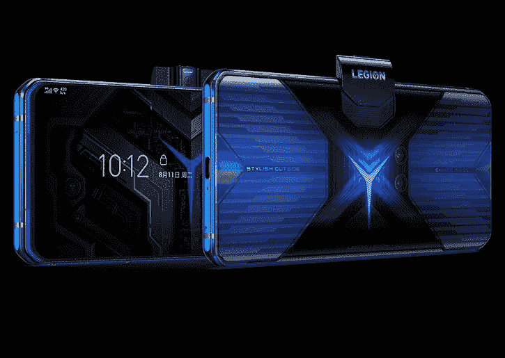

# 联想军团手机决斗开始在欧洲销售€1000

> 原文：<https://www.xda-developers.com/buy-lenovo-legion-phone-duel-gaming-phone-europe-price/>

# 联想军团手机决斗开始在欧洲销售€1000

联想军团手机决斗是一款游戏智能手机，现在在欧洲上市，价格为€1000 英镑。这里是你能购买它的地方。

在游戏智能手机的海洋中，每个制造商都需要一些功能来使他们的设备脱颖而出。就华硕和他们的 ROG 设备而言，他们用尖端技术制造了体积庞大、功能强大的智能手机。联想的 Legion Phone Duel 采用了一种独特的方式来玩智能手机游戏。我们已经在[之前的文章](https://www.xda-developers.com/lenovo-legion-phone-duel-snapdragon-865-plus-90w-charging-side-popup-launch/)中详细介绍了这款设备，但让联想军团手机决斗脱颖而出的不是它的规格。这些都在意料之中:它拥有高通骁龙 865+ SoC，高达 16 GB 的内存和 512 GB 的存储空间，以及流畅的 144Hz 显示屏。这款手机的与众不同之处在于它可以水平使用。

现在，考虑到它是一款游戏手机，并且 Android 上的大多数严肃游戏实际上都是横向运行的，这似乎是理所当然的。但联想走得更远，因为 Legion Phone Duel 的弹出式前置摄像头位于手机的侧面，而不是顶部。这对于喜欢水平使用手机而不是垂直使用手机的用户来说是一个福音，如果你主要是在上面玩游戏，这是有意义的。

但是我们现在不再拐弯抹角了。如果联想军团决斗听起来像你喜欢的那种手机，并且你住在欧洲，那么你会很高兴地知道这款手机很快将以€1000 的价格( *via: [GSMArena](https://www.gsmarena.com/the_lenovo_legion_duel_gaming_phone_launches_in_europe_at_1000-news-45614.php)* )进入欧洲，这与具有相同功能集的其他手机相当。在一些国家，你还可以将这笔费用分成四次€250 支付，这样更容易接受。您还可以使用 LEGIONEARLYBIRD 促销代码在购买时免费申领联想智能时钟或联想 Yoga ANC 入耳式耳机。

**从联想购买军团手机决斗于:** [法国](https://shop-links.co/link/?exclusive=1&publisher_slug=xda&article_name=The+Lenovo+Legion+Phone+Duel+goes+on+sale+in+Europe+for+%E2%82%AC1000&article_url=https%3A%2F%2Fwww.xda-developers.com%2Fbuy-lenovo-legion-phone-duel-gaming-phone-europe-price%2F&u1=UUxdaUeUpU30085&url=https%3A%2F%2Fwww.lenovo.com%2Ffr%2Ffr%2Fphones%2Flenovo%2Flegion-phone-duel%2FLegion-Phone-Duel%2Fp%2FPPIPPIZ7931) ||| [德国](https://shop-links.co/link/?exclusive=1&publisher_slug=xda&article_name=The+Lenovo+Legion+Phone+Duel+goes+on+sale+in+Europe+for+%E2%82%AC1000&article_url=https%3A%2F%2Fwww.xda-developers.com%2Fbuy-lenovo-legion-phone-duel-gaming-phone-europe-price%2F&u1=UUxdaUeUpU30085&url=https%3A%2F%2Fwww.lenovo.com%2Fde%2Fde%2Fphones%2Flenovo%2Flegion-phone-duel%2FLegion-Phone-Duel%2Fp%2FPPIPPIZ7931%3FIPromoID%3DLEN339328)| ||[意大利](https://shop-links.co/link/?exclusive=1&publisher_slug=xda&article_name=The+Lenovo+Legion+Phone+Duel+goes+on+sale+in+Europe+for+%E2%82%AC1000&article_url=https%3A%2F%2Fwww.xda-developers.com%2Fbuy-lenovo-legion-phone-duel-gaming-phone-europe-price%2F&u1=UUxdaUeUpU30085&url=https%3A%2F%2Fwww.lenovo.com%2Fit%2Fit%2Fphones%2Flenovo%2Flegion-phone-duel%2FLegion-Phone-Duel%2Fp%2FPPIPPIZ7931%3FIPromoID%3DLEN927651)|| |[西班牙](https://shop-links.co/link/?exclusive=1&publisher_slug=xda&article_name=The+Lenovo+Legion+Phone+Duel+goes+on+sale+in+Europe+for+%E2%82%AC1000&article_url=https%3A%2F%2Fwww.xda-developers.com%2Fbuy-lenovo-legion-phone-duel-gaming-phone-europe-price%2F&u1=UUxdaUeUpU30085&url=https%3A%2F%2Fwww.lenovo.com%2Fes%2Fes%2Fphones%2Flenovo%2Flegion-phone-duel%2FLegion-Phone-Duel%2Fp%2FPPIPPIZ7931)

### 联想军团手机决斗规格

| 

规格

 | 

联想军团手机决斗(欧洲)

 |
| --- | --- |
| **尺寸&重量** |  |
| **显示** |  |
| **SoC** |  |
| **风筒&储存** |  |
| **电池&充电** |  |
| **指纹传感器** | 显示屏内指纹传感器 |
| **后置摄像头** | 

*   **主** : 64MP，0.8 米像素，f/1.89，1/1.72”传感器
*   **辅助** : 16MP 广角，120 FoV，f/2.2，1.0 m 像素

视频: |
| **前置摄像头** | 20MP，f/2.2，侧装弹出式 |
| **音频** |  |
| **端口&按钮** |  |
| **连通性** |  |
| **安卓版本** | 搭载 ZUI 12/Legion OS 的 Android 10 |

**[联想军团手机决斗论坛](https://forum.xda-developers.com/lenovo-legion-duel)**

你打算买一个吗？