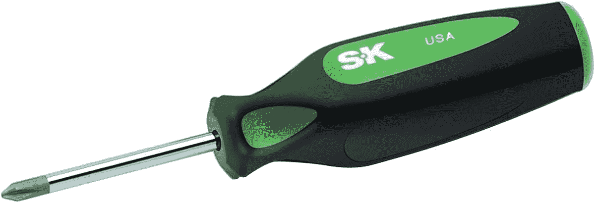

# 我可以升级 HP EliteBook 840 G9 的内存和存储吗？

> 原文：<https://www.xda-developers.com/can-i-upgrade-the-ram-and-storage-on-the-hp-elitebook-840-g9/>

与其他商用笔记本电脑一样，您可以在购买后自行升级 HP EliteBook 840 G9。惠普甚至有一个视频指导你如何做到这一点。虽然看起来很小，但它很重要。当你购买一台[新笔记本电脑](https://www.xda-developers.com/best-laptops/)时，你可能不想在零售商那里结账时坚持使用 RAM 和存储。通过零售商升级可能会很贵，而你自己升级可能会省钱。

在惠普 EliteBook 840 G9 的情况下，最大 RAM 是 64GB DDR5，最高存储是 2TB PCIe NVMe TLC SSD。因此，假设你有足够的耐心，并从亚马逊或 Crucial 等零售商那里购买了合适的部件，你可以遵循我们的指南，该指南将解释如何升级 HP EliteBook 840 G9 的 RAM 和存储。

## 准备升级

在开始升级这些组件之前，您必须了解一些事情。首先，请务必关闭系统电源，并拔下电源插头。然后，通过触摸金属表面并远离织物或宠物来接地。您还需要确保已经备份了数据，并准备好 Windows 安装驱动器，以便可以在新的 SSD 上重新安装 Windows。

除此之外，你还得带上一些工具。首先是 P1 十字螺丝刀，帮助您进入笔记本电脑的底部。第二个工具是一个 spudger，帮助您释放笔记本电脑的底部。我们在下面列出了其中的一些。

您还需要确保您已经购买了 DDR5 4800 SODIMM 笔记本电脑 RAM 棒，并确保它们的大小匹配(例如，使用 2 个 8GB RAM 棒)，以获得最佳的双通道性能。至于固态硬盘，请确保它是 PCIe 4x 4 2280 固态硬盘。一定要检查它是否是 2280 SSD，因为较小的 2230 尺寸不适合笔记本电脑。

 <picture></picture> 

SK Hand Tool 79205 P1 Phillips Cushion Grip Screwdriver,

##### SK 手动工具 79205 P1 飞利浦坐垫握柄螺丝刀

这款十字螺丝刀将帮助您进入惠普笔记本电脑的背面

 <picture></picture> 

Samsung 980 Pro 2TB

##### 三星 970 EVO Plus 固态硬盘

三星 980 PRO 是一款速度惊人的固态硬盘，由于支持 PCIe 4.0，读取速度高达 7000 MB/s。

 <picture></picture> 

Crucial RAM

##### 至关重要的 CL40 DDR5 RAM

适用于 HP EliteBook 840 G9 的各种尺寸的 SODIMM DDR5 RAM

## 升级 HP Elitebook 840 G9 上的内存

有了这些基本材料，您现在就可以开始升级 HP Elitebook 840 G9 中的 RAM 了。同样，请首先检查笔记本电脑是否关闭并拔掉电源。然后你可以跳到我们下面的台阶上。

1.  将笔记本电脑翻转过来，使顶盖面向您正在工作的表面的底部。
2.  将笔记本电脑转过来，让转轴背对着你，让防水透气产品面向顶部。
3.  寻找五个固定的 P1·菲利普斯头螺丝。左边有两个，中间上方有一个，右边有两个。右上角的螺丝在盖子下面。你得用螺丝刀刺穿盖子。
4.  用 P1 螺丝刀拧下螺钉，并按照取出螺钉的方向将其放在远离笔记本电脑的单独空间。
5.  使用撬动工具将机箱盖的后边缘、右边缘和左边缘从笔记本电脑上分开。
6.  抬起基本外壳的后边缘，撬起顶盖，然后将前边缘的卡舌从顶盖的切口中滑出。
7.  卸下护盖，从系统板上卸下电池连接器。这是笔记本电脑中间的一根白线。
8.  查看笔记本电脑的右侧，撕下覆盖内存模块护盖的两片黑色聚酯薄膜。
9.  向上拉内存护罩上的卡舌，使护罩与系统板上的固定夹分离。
10.  卸下护罩后，同时向外推出两臂，将内存模块移至弹簧张紧位置。抓住内存模块的边缘，轻轻拉动以将其卸下。
11.  对第二个内存模块重复上述步骤。
12.  将新 RAM 模块上的槽口与系统板上内存模块插槽中的键对齐。以一定角度将内存模块轻轻插入系统板上的插槽，然后向下按压内存模块将其固定。聆听咔嗒声，确认它是否安全。
13.  将内存护板按入系统板上的固定夹，并沿边缘向下按压以将其固定，然后将其平滑地放回覆盖护板的黑色聚酯薄膜上。
14.  将电池插回系统板。
15.  装回底盖，方法是将基本外壳前边缘上的卡舌插入顶盖的切口中，然后将其降低到位，施加压力以重新盖上顶盖。更换并拧紧螺钉。

按照上述步骤操作后，您应该已经成功更换了内存。你可能还想在底部打开时升级存储，我们在下面有更多的内容。

## 升级 HP Elitebook 840 G9 上的存储

升级 HP Elitebook 840 G9 上的存储非常简单。就像升级内存一样，你需要卸下底盖和隔热板。请记住，您应该首先克隆原始 SSD，或者备份您的文件。新驱动器不会安装操作系统。因此，您需要安装介质。说了这么多，下面是升级的步骤。

1.  重复上面提到的步骤 1-7。
2.  查看笔记本电脑的右上方，剥下部分覆盖 M.2 固态硬盘护罩的聚酯薄膜。
3.  向上拉 M.2 固态硬盘上的卡舌，使固定夹与系统板分离，然后将其卸下。
4.  卸下固定固态硬盘的 P1 十字螺钉，将其释放到弹簧张紧位置。由于有散热垫，您需要抬起硬盘。抓住它的边缘，轻轻拉动将其取出。
5.  将 M.2 固态硬盘上的槽口与主板上 M.2 固态硬盘插槽中的钥匙对齐。以一定角度将 M.2 固态硬盘插入主板。
6.  更换 P1 螺钉。
7.  放置 M.2 固态硬盘护罩，并沿边缘向下按压，将其固定至系统板。
8.  光滑的黑色聚酯薄膜。
9.  将电池插回系统板。
10.  按照上面第 15 步所述，装回底盖。

升级 HP Elitebook 840 G9 上的 RAM 和存储是一项简单的任务。您只需要一些耐心来获得长期性能的好处，并为您的关键文件提供更多存储空间。在一些[最好的惠普笔记本电脑](https://www.xda-developers.com/best-hp-laptops/)上也不总是可能的，所以一定要对你购买的 Elitebook 840 G9 感到满意。

 <picture></picture> 

HP EliteBook 840 G9

##### 惠普 EliteBook 840 G9

HP EliteBook 840 G9 是一款 14 英寸笔记本电脑，采用英特尔 P 系列处理器，设计时尚低调。

**来源:** [HP](https://www.youtube.com/watch?v=HOFzfWRy37w)