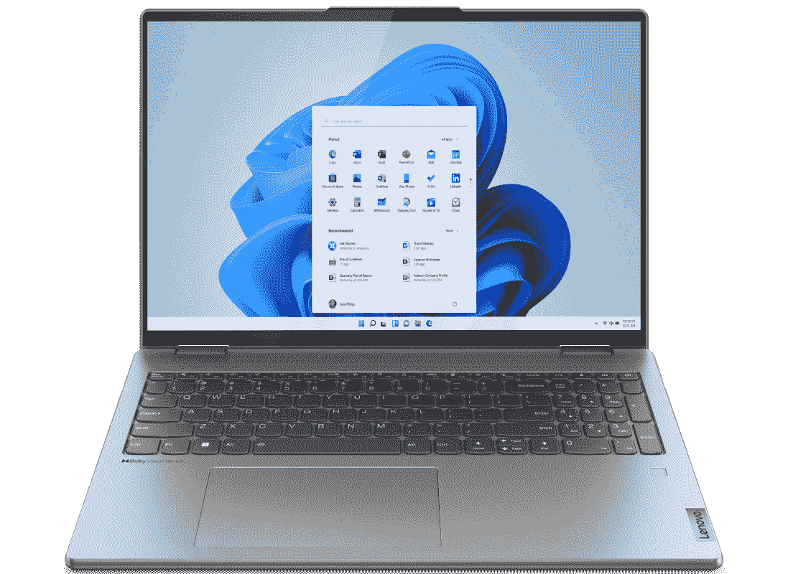

# 联想 Yoga 7i (2022)可以运行 Linux 吗？

> 原文：<https://www.xda-developers.com/can-lenovo-yoga-7i-2022-run-linux/>

联想制造了一些神奇的笔记本电脑，最新的 Yoga 7i 也不例外。这是一款高端可转换笔记本电脑，更注重主流，在我们的[对联想 Yoga 7i](https://www.xda-developers.com/lenovo-yoga-7i-2022-review/) 的评测中，我们发现它提供了很多价值。这是你在这个价格范围内可以买到的[最好的 Windows 笔记本电脑](https://www.xda-developers.com/best-microsoft-surface-pcs/)之一，但是如果 Windows 不是你的首选平台或者你只需要 Linux 来完成特定的任务呢？如果你是 Linux 的粉丝，有很多方法可以让它在联想 Yoga 7i 上运行。

在你的 PC 上安装 Linux 的方法在复杂性和风险上各不相同，但是它们也提供了不同的最终结果，所以你必须选择适合你的用例的方法。我们将从更简单、风险更低的方法开始，然后扩展到更高级的选项。

关于这种方法需要注意的一点是，联想没有正式支持 Yoga 7i 上的 Linux，所以你不能从联想获得驱动程序，如果你遇到任何问题，该公司可能无法帮助你。

## 使用 Linux 的 Windows 子系统

Windows 附带一个名为 Windows Subsystem for Linux 的功能已经有几年了，在 Windows 11 中，它比以往任何时候都更强大。这允许您使用一个特殊的虚拟化层在 Windows 中运行 Linux 发行版，该虚拟化层将 Linux 与 Windows 更紧密地集成在一起。随着 Windows 11 的变化，你甚至可以使用 Windows 子系统运行完整的 GUI Linux 应用程序。它的工作方式类似于本机使用操作系统，并且您不局限于基于终端的应用程序。

[要在 Windows 11](https://www.xda-developers.com/how-to-install-wsl-2-windows/) 上设置 Linux 的 Windows 子系统，请在微软商店中搜索。然后，在商店上搜索您喜欢的 Linux 发行版。有几个选项可用，包括 Ubuntu、Kali Linux 和 openSUSE。然后，您可以使用 Windows 终端启动您的 Linux 发行版并安装应用程序，或者执行您在 Linux 上执行的其他任务。你不能访问 Linux 风格的桌面，但如果你安装了一个基于 GUI 的应用，它会按预期运行。

这种方法是最容易设置的，如果您需要两种环境，它不需要离开 Windows。另外，这并不涉及太大的风险。然而，你不能访问你选择的 Linux 发行版的完整用户界面，而且性能仍然不能达到原生水平。

## 使用虚拟机在您的 PC 上安装 Linux

如果您想体验完整的 Linux 安装，而不弄乱您的磁盘或删除 Windows，虚拟机是另一个很好的选择。顾名思义，它使用虚拟化技术来创建一种 Linux 体验，您可以在 Windows 内部运行，而不会对您的 Windows 安装产生任何影响。虚拟机给你正在安装的 Linux 发行版的完整体验，所以你可以感受一下使用 Linux 的感觉。

要设置虚拟机，你需要虚拟化软件，如微软自己的 Hyper-V。这是 Windows 11 Pro 和大多数其他 SKU 的内置软件，但你可以[通过一些改动将其安装在 Windows 11 Home](https://www.xda-developers.com/how-to-install-hyper-v-windows-11-home/) 上。然后，你可以从网上下载你最喜欢的 Linux 发行版的 ISO 文件。比如你可以[这里](https://ubuntu.com/download/desktop)下载 Ubuntu。我们有一个关于[如何使用虚拟机来试用 Windows 11](https://www.xda-developers.com/how-to-install-windows-vm/) 的指南，但是相同的步骤通常也适用于 Linux，所以一旦你有了正确的 Linux 安装程序，你就可以遵循那个指南。

如果您想知道 Linux 是什么样的，但是仍然希望 Windows 是您的主要平台，那么这个选项是理想的。它在很大程度上为您提供了完整的体验，但是由于虚拟化层的原因，您将会错过一些性能。它也不需要任何可能会丢失数据的复杂步骤。

## 通过双引导在你的电脑上安装 Linux

但是，如果您想看到 Linux 的全部本机性能，并且愿意尝试一些更高级的设置，您也可以将 Linux 与 Windows 一起安装。双引导允许您每次打开计算机时选择 Linux 或 Windows，因此您可以获得任何一种的完整体验，并且在使用它们时不会错过任何性能。如果你想尝试一下，我们有一个指南可以帮助你双启动 Windows 11 和 Linux。如果您决定只需要一个或另一个，您可以删除另一个分区(一旦您备份了数据),只使用您喜欢的那个分区。

* * *

正如你所看到的，有几种方法可以让 Linux 应用程序在联想 Yoga 7i 上运行，其中许多方法不需要完全放弃 Windows 11。哪种方法最适合您在很大程度上取决于您想要的体验是什么，但是如果您的工作流只需要一些 Linux 应用程序，那么 Linux 的 Windows 子系统可能是最好的方式，而不用离开 Windows。

如果你有兴趣，你可以使用下面的链接购买联想 Yoga 7i。这是你现在可以买到的最好的联想笔记本电脑之一，几乎对任何类型的用户来说都是一个很好的选择，尤其是因为 14 英寸和 16 英寸型号迎合了不同的人。

*   <picture></picture>

    联想 Yoga 7i

    ##### 联想 Yoga 7i (14 英寸)

    联想 Yoga 7i 14 英寸型号封装了第 12 代英特尔酷睿 U 系列处理器和 2.2K IPS 显示屏，非常适合便携性和日常使用。

*   <picture></picture>

    联想 Yoga 7i (16 英寸)带弧形显卡

    ##### 联想 Yoga 7i 2 合 1 (16 英寸)

    联想 Yoga 7i 的 16 英寸版本具有更高的性能，并可选择 P 系列处理器或带有专用英特尔弧形显卡的 H 系列处理器