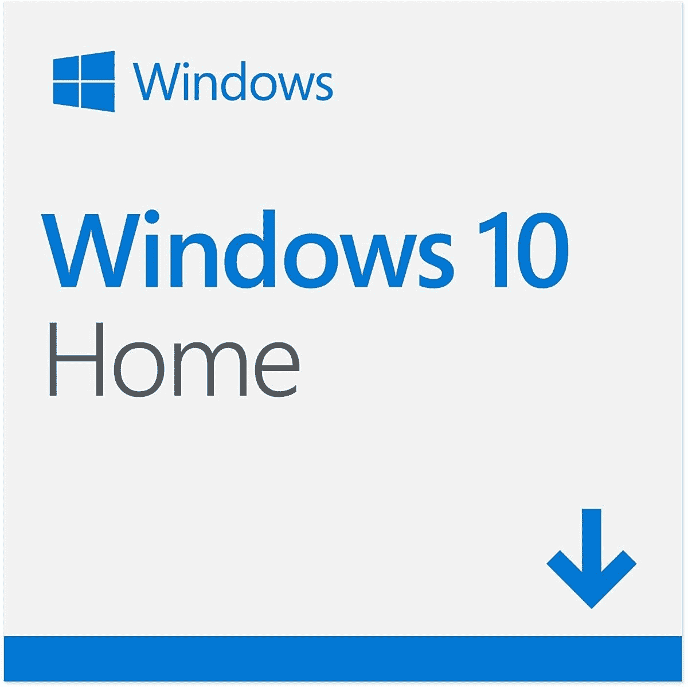

# Mac Studio 可以运行 Windows 吗？是的，做了一些工作

> 原文：<https://www.xda-developers.com/can-mac-studio-run-windows/>

最近推出的 Mac Studio 是有史以来最强大的 Mac 电脑之一，如果不是最强大的话。苹果公司宣称其性能与最高端的台式电脑不相上下，但体积却只有其一小部分，如果许多用户有兴趣购买一台，这是可以理解的。但大多数用户可能习惯于 Windows，许多应用程序只能在 Windows 上使用，因此被限制在 macOS 上可能是一个很大的障碍。如果你想在新的 Mac Studio 上运行 Windows，我们有好消息和坏消息。

坏消息是苹果硅 MAC 不支持 Boot Camp，这意味着官方将 Windows 和 macOS 并列的方式不再可用。此外，苹果硅处理器使用 Arm 架构，微软没有向普通消费者提供 Arm 兼容版本的 Windows。

谢天谢地，有一个变通办法，这都要感谢 Parallels。使用最新版本的 Parallels Desktop 虚拟化软件，您可以在 Mac Studio 上安装 Windows 10 或 Windows 11，尽管这不是理想的解决方案。

## 如何在 Mac Studio 上安装 Windows

如果你想让 Windows 在 Mac Studio 上运行，你首先需要一个 [Parallels Desktop 17](https://www.anrdoezrs.net/links/100122946/type/dlg/sid/UUxdaUeUpU7540/https://www.parallels.com/products/desktop/) 的许可证。这是一款非常流行的 Mac 虚拟化软件，可以让你通过虚拟化在 macOS 内部运行其他操作系统。对于 Parallels Desktop 17，这是一款特别有用的苹果硅 MAC 的[应用，因为它正式支持 Windows 10 和 11。该软件的标准版每年收费 79.99 美元，专业版每年收费 99.99 美元。此选项为您提供了更多虚拟 RAM 和 CPU 内核，此外，您还可以获得高级支持，并在 Parallels Desktop 推出时升级到最新版本。标准许可证也可以一次性购买，价格为 99.99 美元。](https://www.xda-developers.com/best-apps-apple-silicon/)

接下来，你需要为基于 Arm 的电脑下载一个 [Windows 11 Insider 预览版 VHDX 文件](https://www.microsoft.com/en-us/software-download/windowsinsiderpreviewarm64)。VHDX 文件是一个虚拟硬盘，包含最新的 Windows 11 内部版本。微软没有以这种方式提供 Windows 11 的稳定版本，所以你必须下载一个预览版。这意味着你可能会遇到一些不稳定，但这是在 Mac Studio 上安装 Windows 的唯一支持方法。使用常规的 ISO 文件是行不通的。请记住，你还需要一个 Windows 11 许可证。

一旦你有了这两个东西，只需运行 Parallels Desktop 并创建一个新的虚拟机。选择您下载的 VHDX 文件作为虚拟机的映像，并按照步骤完成工作。我们有一个关于如何以这种方式在苹果硅 Mac 上安装 Windows 10 的指南，如果你需要更多帮助，你可以遵循 Windows 11 的相同系统。

一旦完成，你就可以在任何需要使用 Windows 的时候运行你的 Windows 11 虚拟机。之后，您需要进入设置应用程序并进入**激活**页面，输入您的许可证密钥。

由于您已经安装了 Windows 的预览版，您将获得虚拟机的主要更新。然而，一旦你在一个稳定的版本上，你可以选择退出预览版本，这样你就不必处理不稳定的软件。

* * *

这是在 Mac Studio 上运行 Windows 的一个有点昂贵和麻烦的解决方案，但如果你愿意处理这个问题，你可以在下面购买它，以及 Parallels Desktop 17。下面我们还有一个 Windows 10 Home 的产品密钥，也适用于 Windows 11。随着大多数 Mac 系列产品升级到苹果芯片，这看起来将是未来在 Mac 上运行 Windows 的唯一方式。

 <picture></picture> 

Mac Studio

##### 苹果 Mac 工作室

新的 Mac Studio 由苹果硅驱动，但它可以通过虚拟化运行 Windows。

 <picture></picture> 

Parallels Desktop

##### Parallels 桌面

用于在 macOS 上运行 Windows 或 Linux 的 Parallels Desktop 虚拟化软件。最新版本还支持苹果 Silicon Macs 和 Arm 上的 Windows。

 <picture></picture> 

Windows 11 Home

##### Windows 10 主页

激活 Windows 10 或 11 的产品密钥。