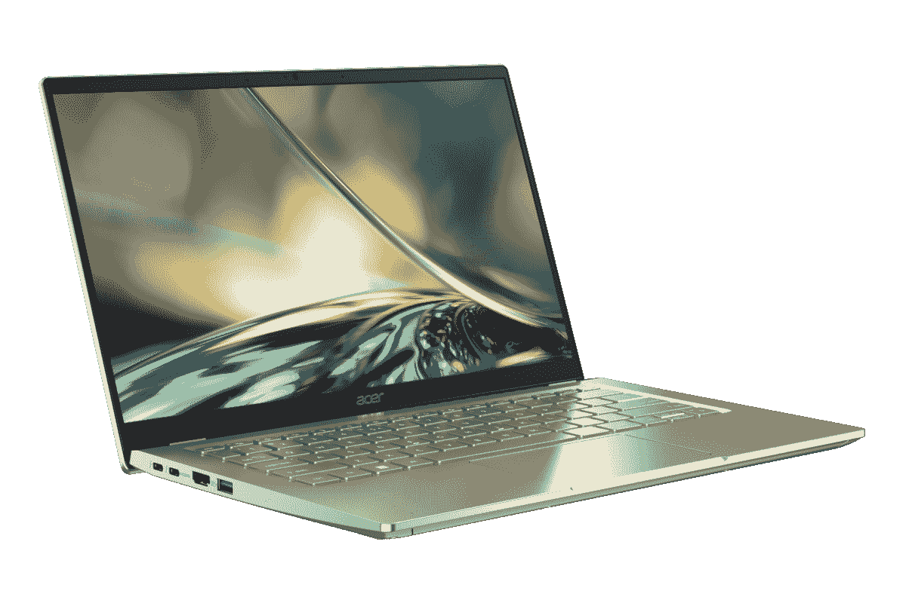

# 我可以升级 Acer Swift 3 (2022)中的 RAM 和存储吗？

> 原文：<https://www.xda-developers.com/can-upgrade-ram-storage-acer-swift-3-2022/>

[宏碁 Swift 3](https://www.xda-developers.com/acer-swift-3-2022-review/) 是一款非常受欢迎的[笔记本电脑](https://www.xda-developers.com/best-laptops/)，今年的迭代相当不错。正如我们在评论中所说，Acer Swift 3 是一款快速的笔记本电脑，它采用了第 12 代英特尔酷睿 P 系列处理器，配备了高达 16GB 的内存和 1TB 的固态硬盘。但对于一些用户来说，这可能还不够，所以你可能想知道是否可以升级宏碁 Swift 3 的 RAM 和存储。答案是否定的，也是肯定的。

宏碁 Swift 3 上的 RAM 是焊接在主板上的；可惜不能升级。但是，存储是由 M.2 固态硬盘提供的，这意味着如果你愿意，你可以升级到更大的驱动器。事实上，宏碁 Swift 3 有两个 M.2 插槽，因此您可以升级它，而不必更换内置的 SSD。

## 如何升级 Acer Swift 3 (2022)上的存储

如果你想升级你的 Acer Swift 3 的存储，你需要一些工具来进入它。我们推荐 [iFixit 基本电子工具包](https://www.amazon.com/iFixit-Essential-Electronics-Toolkit-Smartphone/dp/B0964G2Y7S?tag=xda-4id9eeb-20&ascsubtag=UUxdaUeUpU43258&asc_refurl=https%3A%2F%2Fwww.xda-developers.com%2Fcan-upgrade-ram-storage-acer-swift-3-2022%2F&asc_campaign=Evergreen)，它为您提供基本电子维修所需的一切，包括精密驱动器、撬动工具等。你还需要一个[防静电腕带](https://www.amazon.com/Wristband-Bracelet-Grounding-Alligator-Extendable/dp/B08CXQN86W?tag=xda-4id9eeb-20&ascsubtag=UUxdaUeUpU43258&asc_refurl=https%3A%2F%2Fwww.xda-developers.com%2Fcan-upgrade-ram-storage-acer-swift-3-2022%2F&asc_campaign=Evergreen)来防止在笔记本电脑上工作时放电。

当然，你还需要一个新的固态硬盘来安装。有几个选项可供选择，但最快的驱动器之一是三星 980 Pro，它使用 PCIe Gen 4，速度高达 7000 MB/s。还有更便宜的选项，包括普通的三星 980，但如果你想要速度，980 Pro 是你的选择。

 <picture></picture> 

Samsung 980 Pro M.2 NVMe SSD

##### 三星 980 Pro

三星 980 Pro 是一款快速的 PCIe 4.0 固态硬盘，其读取速度可达 7000 MB/s，写入速度可达 5000 MB/s

如果您想要更换现有的固态硬盘，您还需要备份数据。你可以使用自己的本地存储或云驱动器来备份重要文件。您还需要准备一个 Windows 安装介质，以便在新的 SSD 上安装操作系统。查看我们的指南[如何安装 Windows 11](https://www.xda-developers.com/download-windows-11/) ，了解如何创建安装介质。如果你只是给笔记本电脑添加一个新的驱动器，这应该是不需要的。

一旦你有了这些工具，你就可以进入笔记本电脑，更换固态硬盘。方法如下:

1.  关闭笔记本电脑的电源，并将其从插座上拔下。翻转笔记本电脑，使底座朝上，转轴背向您。
2.  取下固定底盖的 10 颗螺丝。您需要使用 Torx T6 或 TR6 螺丝刀，后者包含在我们上面链接的工具包中。
3.  如果需要，使用塑料撬动工具将底盖从笔记本电脑底座上拆下，然后将其取下。
4.  笔记本电脑内部有两个固态硬盘插槽。一个在底部，靠近电池，你会发现预装的 SSD，另一个藏在笔记本电脑风扇下的盖子后面。如果你想移除原来的 SSD，请继续阅读，但如果你只是添加一个新的驱动器，可以跳到第 8 步。
5.  要卸下安装在笔记本电脑中的 SSD，请使用十字螺丝刀卸下固定 SSD 的螺钉。然后，将 SSD 从 M.2 插槽中拉出，不要取下它上面的银片。确保不要直接向上拉动 SSD。
6.  以微小的角度插入新的 SSD，将连接器上的槽口与 M.2 插槽中的槽口对齐。
7.  拧紧螺钉，将 SSD 固定到位。不要把螺丝拧得太紧，否则会损坏系统。
8.  如果要接触辅助 SSD 插槽，请使用撬动工具抬起风扇下方银色带状电缆边缘的黑色连接器，然后从插槽中取出电缆。
9.  卸下固定 SSD 所需的螺钉，然后按照上面的步骤 6 和 7 安装新的 SSD。
10.  安装好新的 SSD 后，将底盖放回笔记本电脑上，并拧紧 10 颗 Torx 螺钉将其固定到位。小心不要过紧。

应该就是这样了。一旦你安装了新的固态硬盘，你就可以开始使用你的笔记本电脑。如果你卸下了原来的 SSD，你可能想参考我们的指南重新安装 Windows 11，但除此之外，你应该准备好了。

如果您还没有，您可以使用下面的链接购买 Acer Swift 3。但是，如果能够升级内存对你来说太重要了，那么你可能想看看其他一些笔记本电脑。[商用笔记本电脑](https://www.xda-developers.com/best-business-laptops/)是一个通常提供很多可升级性的类别，尽管它仍然取决于你选择的型号。

 <picture></picture> 

Acer Swift 3

##### 宏碁 Swift 3

Acer Swift 3 是一款速度快、规格稳定的笔记本电脑。如果你想要更快的速度，你也可以升级 SSD，但 RAM 是焊接的。