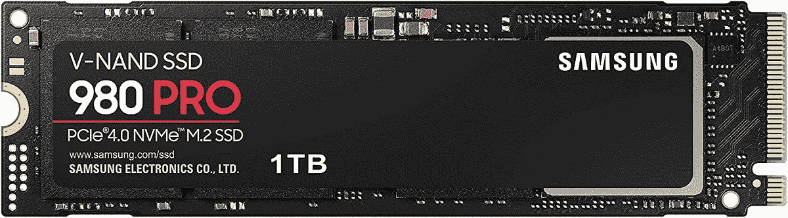

# 我可以升级惠普精英版蜻蜓 G3 的内存和存储吗？

> 原文：<https://www.xda-developers.com/can-upgrade-ram-storage-hp-elite-dragonfly-g3/>

惠普最近推出了 [Elite 蜻蜓 G3](https://www.xda-developers.com/hp-elite-dragonfly-g3/) ，看起来它可能是今年[最佳商务笔记本电脑](https://www.xda-developers.com/best-business-laptops/)之一。它与以前的车型相比有一些重大变化，包括新的 3:2 显示屏和它不再是敞篷车的事实。它还配备了新的英特尔处理器、高达 32GB 的新 LPDDR5 RAM 和 2TB 固态硬盘。但是如果你最终需要的不止这些呢？如果你想升级惠普精英版蜻蜓 G3 的内存或存储，你可能就没那么幸运了。

据惠普称，Elite 蜻蜓 G3 的内存是焊接在主板上的，所以一旦购买就不能更换或升级。另一方面，存储是以 M.2 SSD 的形式出现的，所以你可以买一个新的来替换它。

## 为什么不能升级精英版蜻蜓 G3 的内存

制造商有时选择将 RAM 焊接到笔记本电脑的主板上有几个原因。如果要有点玩世不恭的话，最明显的一条就是，公司为了获得更高的配置，希望你直接付钱给他们。如果你可以自己升级内存，这笔钱最终会流向另一家公司，所以惠普和其他制造商自然更愿意强迫你购买更贵的配置。

不过，还有其他原因。首先，焊接 RAM 有时比开槽 RAM 更快，这通常是由于在同一芯片上增加了带宽或减少了延迟。但另一个原因是，与在主板上设计 SODIMM 插槽并容纳 RAM 棒相比，焊接 RAM 占用的空间更少，重量更轻。惠普 Elite 蜻蜓 G3 是一款非常轻薄的笔记本电脑，这在一定程度上要归功于像这样的决策。事实上，由于这个原因，大多数 13 英寸笔记本电脑通常没有可升级的内存。

## 你可以(从技术上)升级存储

与 RAM 不同，许多笔记本电脑通常都可以升级存储。也有例外，但大多数商用笔记本电脑都有可更换的存储。其中一个原因是，有时企业需要在员工使用笔记本电脑后销毁敏感数据。惠普尚未公布精英版蜻蜓 G3 的维修指南，但基于以前的型号，你可以升级笔记本电脑内部的存储。然而，惠普说**你应该去授权服务中心**进行维修。

如果你真的想尝试自己动手，你需要一把十字螺丝刀(你可能会想要像[iFixit Essential Electronics Kit](https://www.amazon.com/iFixit-Essential-Electronics-Toolkit-Smartphone/dp/B0964G2Y7S?tag=xda-1dh95uj-20&ascsubtag=UUxdaUeUpU40569&asc_refurl=https%3A%2F%2Fwww.xda-developers.com%2Fcan-upgrade-ram-storage-hp-elite-dragonfly-g3%2F&asc_campaign=Short-Term)这样的东西)，一个[防静电带](https://www.amazon.com/Wristband-Bracelet-Grounding-Alligator-Extendable/dp/B08CXQN86W?tag=xda-1dh95uj-20&ascsubtag=UUxdaUeUpU40569&asc_refurl=https%3A%2F%2Fwww.xda-developers.com%2Fcan-upgrade-ram-storage-hp-elite-dragonfly-g3%2F&asc_campaign=Short-Term)以确保额外的安全，当然，还有一个 M.2 SSD。你可以买一个固态硬盘，比如下面的三星 980，或者看看你今天能买到的[最好的 M.2 固态硬盘](https://www.xda-developers.com/best-m-2-ssd/)。

 <picture></picture> 

Samsung 980 Pro M.2 NVMe SSD

##### 三星 980 Pro

三星 980 Pro 是一款快速的 PCIe 4.0 固态硬盘，容量高达 2TB。

* * *

如果你被说服购买惠普精英蜻蜓 G3，你可以使用下面的链接。如果你想探索其他选择，考虑一下今天你能买到的[最好的惠普笔记本电脑](https://www.xda-developers.com/best-hp-laptops/)，看看是否有更适合你的。如果您想要可升级 RAM 的产品，大型游戏和商用笔记本电脑通常是不错的选择。

 <picture></picture> 

HP Elite Dragonfly G3

##### 惠普精英蜻蜓 G3

惠普 Elite 蜻蜓 G3 是惠普最高端的商用笔记本电脑，配备第 12 代英特尔处理器、高达 32GB 的内存和 2TB 固态硬盘。只有固态硬盘可以在以后升级。