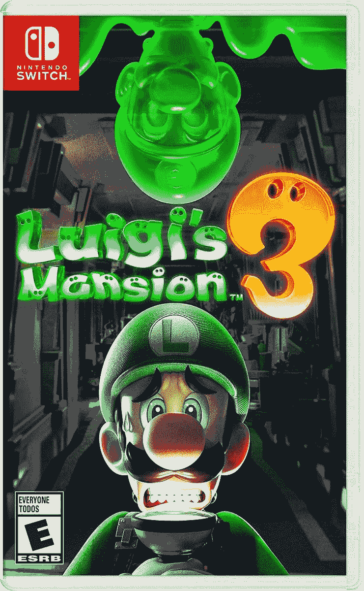

# 在《路易吉的豪宅 3》中捕捉一些鬼魂，现在售价 39 美元

> 原文：<https://www.xda-developers.com/catch-some-ghosts-in-luigis-mansion-3-now-on-sale-for-39/>

# 在《路易吉的豪宅 3》中捕捉一些鬼魂，现在售价 39 美元

路易吉豪宅中最新的幽灵物品现在在亚马逊上以 39.25 美元的价格出售，比通常价格低 10 美元左右。

任天堂在 2019 年为任天堂 Switch 发布了 *Luigi's Mansion 3* ，它最终比 GameCube 上的原版更受粉丝和评论家的欢迎。像大多数任天堂发行的游戏一样，它并不经常上市销售，但目前售价为 39.25 美元。这比通常 50 美元的价格节省了不少。

类似于之前的*路易吉的豪宅*游戏，你的目标是像路易吉一样抓鬼解谜，同时挥舞*捉鬼敢死队*——像 Poltergust G-00 真空。马里奥和朋友被困在最后的度假酒店，每层楼都有自己的主题和 boss 战。甚至还有双人合作游戏，以及一个最多可容纳 8 名玩家的特殊在线模式。

 <picture></picture> 

Luigi's Mansion 3

##### 路易吉的豪宅 3

这可能是任天堂为任天堂 Switch 发行的最好的游戏之一。它于 2019 年发布，售价为 60 美元，但最近已降至 48-50 美元，现在售价为 39.25 美元。

如果你没有玩过之前的系列作品(就我个人而言，我仍然需要在 3DS 上完成*暗月*)，不要担心，你不会错过任何重要的情节。你是 Luigi，你有一个吸鬼的真空吸尘器，你还需要知道什么？