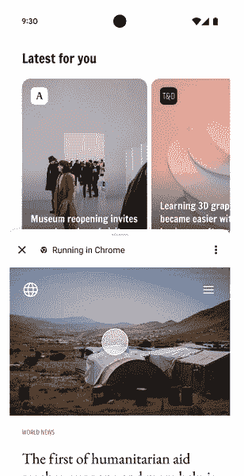

# Android 上的 Chrome 部分定制标签改善了用户体验，提高了参与度

> 原文：<https://www.xda-developers.com/chrome-android-partial-custom-tabs/>

谷歌发布了两款新工具，旨在提高用户对其喜爱应用的参与度。

根据 Android 开发者博客的帖子，应用开发者将很快能够利用部分定制标签，努力为用户在他们自己的产品中检查链接和其他来源时创建一个不太复杂的环境。正如谷歌解释的那样，目前，每当点击外部链接时，许多应用程序都使用 WebViews 来构建一种应用内浏览器。然而，部分自定义选项卡旨在通过感觉与用户可能使用的应用程序更加集成来减少旧的过程。

通过部分自定义标签，Chrome 将让用户能够改变从应用程序底部弹出的新标签的高度。通过这项新功能，用户现在可以与他们想阅读或观看的新信息进行互动，同时还可以看到原始应用程序正在谈论或提供的内容。以前，WebViews 会将用户从当前应用程序中完全移除，以此向他们显示链接的位置。

 <picture></picture> 

Source: Android Developer Blog

Android 新的部分定制标签上的 Chrome 可以实现更好的用户-应用程序交互。

*开发者博客*称，包括 Chrome 在内的许多不同浏览器都支持部分定制标签。有计划增加对更多浏览器的支持，但这似乎是一个有点远的路线，因为该功能只会变得更加广泛。对于不支持新的部分自定义标签功能的浏览器，据说将为用户提供全屏[自定义标签](https://www.xda-developers.com/google-chrome-incognito-custom-tabs/)查看。这个变体非常简单，只在标题栏中为用户提供了一个定制的主题，在侧菜单栏中提供了几个独特的按钮。

谷歌也在寻找一种方法来改善应用内交互的自定义标签视图。谷歌没有说明用户什么时候可以获得这些新功能。然而，在推出适当的支持之前，开发人员最有可能需要时间将它融入他们的应用程序中。开发者将为用户提供新的便捷工具，例如知道打开的链接将“在 Chrome 中运行”,以及其他功能，如使用他们保存的密码和设备存储的任何自动填充信息。

来源:[安卓开发者博客](https://android-developers.googleblog.com/2023/02/bringing-best-of-chrome-to-android-developers-and-users.html)