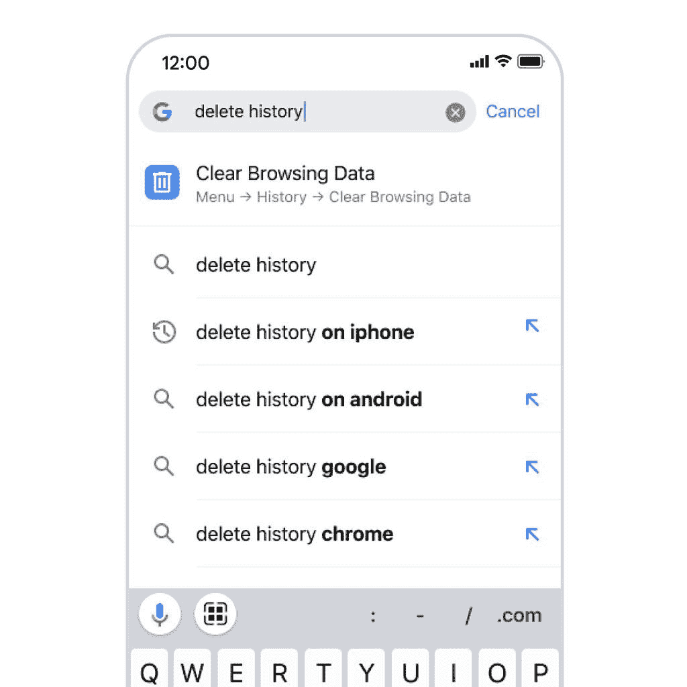

# iOS 版 Chrome 获得 6 项新功能和最新更新

> 原文：<https://www.xda-developers.com/chrome-on-ios-new-features-update/>

谷歌最近推出了适用于 Android、iOS 和桌面的 Chrome 103，并进行了一些改进，比如由于更好的链接预取，网站加载速度更快。avif 支持网络共享 API 和本地字体访问。此外，最新版本的 iOS 版 Chrome 还增加了几项功能。

除了上面提到的改进，谷歌最终将 Chrome 的增强安全浏览功能扩展到 iOS，为用户提供更加主动和定制的保护，免受网络钓鱼、恶意软件和其他基于网络的威胁。iPhone 和 iPad 上增强的安全浏览可以预测和警告用户网站是否危险，并发送关于凭据受损的警报。

通过 iOS 上 Chrome 的最新更新，你还可以将谷歌密码管理器设置为 iPhone 上的默认自动填充提供商。然后，您可以使用它来创建新密码，并登录手机上的任何应用程序。此外，谷歌正在让用户更容易在 iOS 版 Chrome 中发现新内容或开始新的搜索。目前，该公司还没有分享关于这一变化的所有细节，但它说它将很快来到 Android。

iOS 版 Chrome 103 也对网站翻译功能进行了改进，该功能利用设备上的机器学习功能，以您的首选语言提供网站。该公司正在推出一个更新的语言识别模型，它可以准确地计算出你正在访问的页面的语言，以及它是否需要翻译。

 <picture></picture> 

Chrome Actions on iOS

此次更新还为 iOS 带来了 Chrome 操作，帮助用户直接从地址栏快速完成更多事情。有了这项功能，你只需在地址栏中输入就可以执行某些操作。例如，你可以清除浏览数据，打开匿名标签，将 Chrome 设为默认浏览器。

最后，谷歌正在对 Chrome 的 three-don 菜单进行修改，以帮助用户轻松找到功能。新的菜单布局易于浏览，并突出显示最重要的选项，如历史记录、密码和设置。经常使用的选项也会出现在菜单的顶部。

谷歌计划在未来几周内为 iOS 上的 Chrome 带来更多创新，但迄今为止它尚未分享任何关于即将到来的变化的信息。如果你在 iPhone 或 iPad 上使用 Chrome，你可以从 App Store 下载最新的更新。