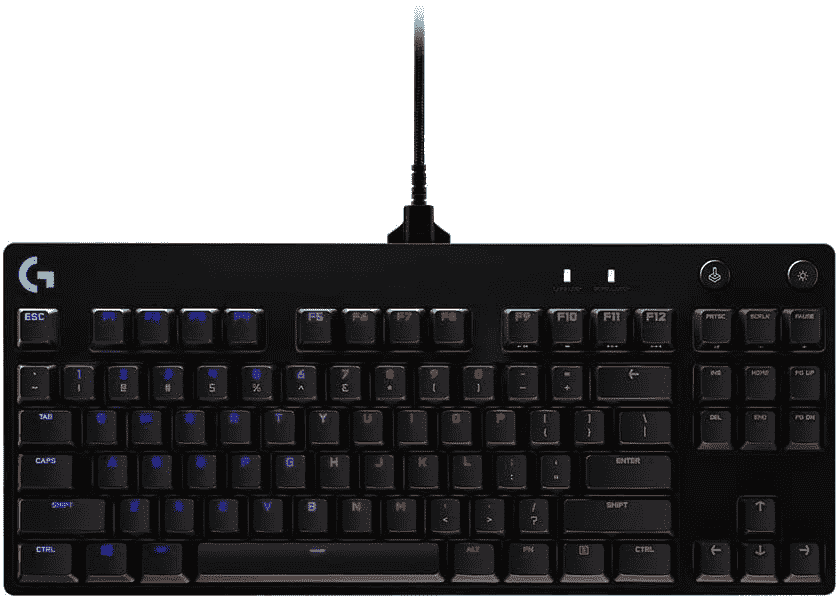
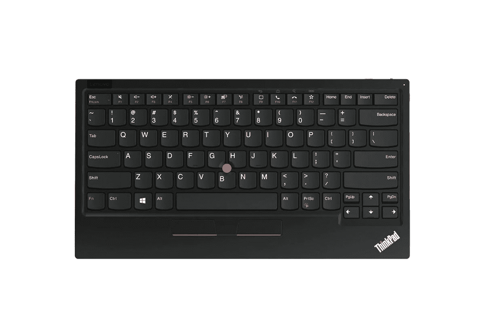
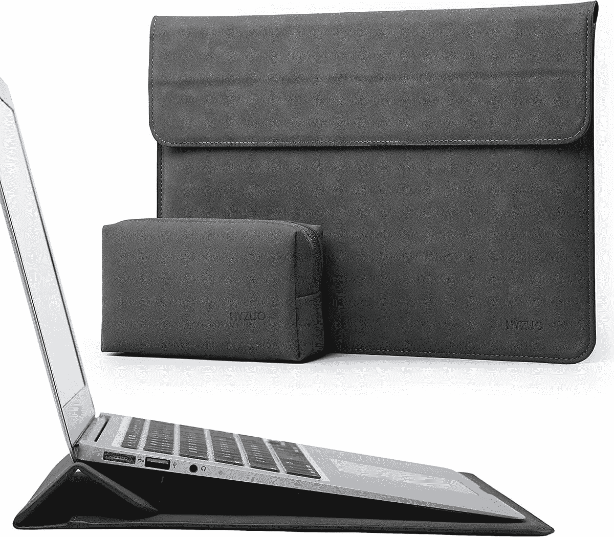

# 2023 年 Chromebooks 最佳配件

> 原文：<https://www.xda-developers.com/chromebook-accessories/>

Chromebook 有很多很好的装饰方式，就像 Windows 笔记本电脑一样。如果你在工作或学校使用 Chromebook，你可以使用一个[扩展坞](https://www.xda-developers.com/best-docking-stations-chromebooks/)和外部显示器。使用外部显示器可以为多任务处理提供更多的屏幕空间，坞站可以提供额外的端口来连接您最喜爱的附件。

当然，你还需要一个出色的鼠标和键盘来完善你的工作站，使打字和滚动更加舒适。拥有一个漂亮的袖子来日常携带 Chromebook 也很有用，即使你使用背包。在这个列表中，我们将看看与您的 Chromebook 搭配使用的最佳配件。从鼠标到网络摄像头等，我们为您提供全方位服务。

## Chromebooks 的最佳外接显示器

显示器有各种尺寸，价格范围从相当便宜到极其昂贵。在为 Chromebook 选择外部显示器时，你应该仔细考虑你的使用情况和预算。在这里，我们收集了 4K 性能的最佳显示器，创意专业人士，以及那些希望获得最佳整体效果的人。

*   <picture></picture>

    LG 超轻薄 27 寸 4K 显示器

    ##### LG 超轻薄 27 寸 4K 显示器

    这款 LG 显示器是 Chromebooks 中的佼佼者之一。它的尺寸为 27 英寸，分辨率为 4K。USB-C 连接还可以通过一根电缆轻松连接到现代 ChromeOS 设备。

*   <picture></picture>

    Innocn 有机发光二极管便携式触摸显示器

    ##### Innocn 15.6 英寸有机发光二极管 4K 显示器

    对于那些忙碌的人或没有太多桌面空间来放置专用显示器的人来说，Innocn 的这款便携式有机发光二极管显示器将满足他们的需求。它封装了 4K 分辨率，色彩精确度极高，并通过 USB-C 连接。

*   ##### 三星 M5 27 英寸 FHD 智能显示器

    对于那些对 ChromeOS 感兴趣的人来说，这就是适合你的显示器。由三星的 Tizen 操作系统支持，你甚至不用打开 Chromebook 就可以访问你最喜欢的流媒体服务。它的价格也很实惠，大约在 250 美元左右，采用基本的 FHD 分辨率。

*   ##### 惠普 24MH FHD 显示器

    没有很多钱花在新显示器上？这是给你的产品。这是惠普的一款基本 24 英寸 FHD 显示器，具有 75Hz 的刷新率和 HDMI 连接。它甚至有内置扬声器。

    T17
*   ##### 戴尔 UltraSharp u 2723 QE

    chrome book 更高端的显示器，这款戴尔 UltraSharp 采用 4K 分辨率和 IPS 黑科技。它有 USB-C 连接，还有 IPS 黑科技，可以重新创建颜色，看起来比 Chromebook 屏幕输出的内容更逼真。

*   ##### 三星 S95UA 49 英寸超宽显示器

    对于终极多任务处理，您会想要看看三星的这款 49 英寸显示器。它采用 QHD 分辨率，虽然它可能不适合放在每个人的桌子上，但它就像是两台显示器并排放在一起。你将有足够的空间进行多任务处理。

    T37

## Chromebooks 的最佳扩展坞

如果你想将 Chromebook 与外部显示器配合使用，你可能需要添加一个扩展坞来增加可用端口的数量。有了一个好的坞站解决方案，你可以大大扩展你的 Chromebook 的多功能性。您可以使用它来连接鼠标、机械键盘、外部存储设备、多台显示器或同时连接所有设备。最重要的是，有了一些扩展坞，你甚至可以让你的 Chromebook 保持充电，只要它有一个兼容的 USB Type-C 端口或 [Thunderbolt 端口](https://www.xda-developers.com/best-thunderbolt-docks/)。

*   <picture></picture>

    Baseus 17 合 1 USB-C 扩展坞

    ##### Baseus 17 合 1 USB-C 扩展坞

    这款来自 Baseus 的扩展坞可以为您提供尽可能多的端口。你有 17 个端口，一个连接到你的 Chromebook。该组合包括 HDMI、USB-A、USB-C，甚至以太网和 SD 卡读卡器。

*   ##### Anker 651 USB-C Dock

    Anker 的这款 USB-C Dock 不仅可以为您提供额外的 USB-A 端口和显示端口以及双显示器的 HDMI，还可以兼作您的 Android 设备或 iPhone 的无线充电器。

*   <picture></picture>

    肯辛顿 SD 1610 p

    ##### 肯辛顿 SD1610P USB-C 迷你坞站

    这款 Chromebook 坞站是经常出差人士的理想之选。它很小巧，有一根可折叠的 USB 线。除了以太网，您还可以通过这个坞站进行 VGA、USB-A、HDMI 和 USB-C 直通充电。

    T34
*   <picture></picture>

    Anker power expand 13-in-1 USB Dock

    ##### Anker power expand 13-in-1 USB Dock

    Anker 制造最好的配件，用这个 Dock 绝对不会错。它有 13 个不同的端口。该组合包括三个 USB Type-C 端口，两个用于双显示器的 HDMI 端口，三个 USB Type-A 端口，以及音频端口和读卡器。

*   ##### CalDigit Element Hub

    这款来自 CalDigit 的 dock 是一款专为放在办公桌上而设计的。它具有 Thunderbolt 连接功能，旨在将多个显示器连接到 Chromebook，并扩展了四个 USB Type-A 端口。

*   ##### Belkin Connect USB-C 11 合 1 多端口坞站

    Belkin 的坞站为您的 Chromebook 提供了 11 个额外的端口。有了这个坞站，您可以享受 SD 读卡器、100W USB-C 直通充电以及额外的 USB-A 端口等等。

    T17

## Chromebooks 的最佳鼠标

当购买新鼠标来搭配你最喜欢的 Chromebook 时，舒适才是王道。在此列表中，我们将把每个鼠标的舒适操作置于其他高级功能之上。在考虑了日常使用后，我们将关注电池寿命、价格点，当然还有与 Chrome OS 的集成。鼠标有各种形状和大小，所以在做出最终决定之前，查看大量选项是值得的。

*   ##### 罗技 MX Master 3S

    罗技 MX Master 3S 是任何 Chromebook 的最佳鼠标。它可以通过 USB-C 轻松充电，最多可与三个设备配合使用，并且具有出色的人体工程学设计。也别忘了 mag speed 滚轮。

*   <picture></picture>

    罗技升降式垂直人体工学鼠标

    ##### 罗技升降式垂直人体工学鼠标

    如果你打算整天在办公桌前使用你的 Chromebook，那么这款鼠标就是给你的。鼠标采用符合人体工程学的设计，可将您的手抬离桌面，让您以更舒适的角度抓握。鼠标使用电池，但通过蓝牙低能耗或 Logi Bolt USB 连接。

*   ##### 罗技 Pebble M350

    这款鼠标来自罗技，是一款比较小巧的鼠标，专为那些随身携带 Chromebooks 的人设计。它由电池供电，可以通过蓝牙或 USB 接收器工作。

    T34
*   ##### 戴尔顶级可充电无线鼠标

    这款来自戴尔的可充电鼠标是他们最高端的产品之一。它可以通过 USB-C 充电，最多可以连接三个设备。

*   <picture></picture>

    罗技 M510

    ##### 罗技 M510

    这款罗技鼠标号称是续航冠军，续航时间长达一年。

    T34
*   <picture></picture>

    Anker 立式人体工学鼠标

    ##### Anker 立式人体工学鼠标

    Anker 的立式人体工学鼠标是一款价格实惠的鼠标，专为长时间使用而设计。它握感舒适，在滚动和点击时有助于让您的手腕保持自然姿势。

## Chromebooks 的最佳键盘

使用外接显示器可以提供更多的屏幕空间，坞站可以为多任务处理提供额外的端口。准备好新鼠标后，你需要一个[质量的键盘](https://www.xda-developers.com/best-mechanical-keyboards)来完成你的工作站。选择日常使用的键盘时，你会希望既舒适又可靠。选购键盘时，需要考虑一系列人体工程学设计、按键布局和高级功能。在这个列表中，我们将看看各种价位的 Chromebook 的最佳键盘。

首先，没有多少键盘是专门为 Chrome 操作系统设计的。为了提供多种选择，我们还在列表中包括了为 PC 和 Mac 设计的键盘。请记住，这些键盘仍然可以与 Chromebook 配合使用，使用 F1-12 作为功能键的替代品。此外，请记住，ChromeOS 可以在各种[硬件](https://www.xda-developers.com/install-chrome-os-non-chromebook-pc-tablet/)上运行，因此这些键盘也适用于你的平板电脑或 Chromebox。

*   <picture></picture>

    罗技 K580 ChromeOS Edition

    ##### 罗技 K580 ChromeOS Edition

    如果你正在寻找一款专为 Chromebooks 打造的键盘，这款就是你要找的。它有 ChromeOS 功能键、数字键盘以及谷歌助手键，能够在多个设备之间切换

*   ##### 罗技 MX 键

    罗技 MX 键是 Windows 和 Mac 设备上评价最好的键盘之一，它与 ChromeOS 也很好。它有背光按键，可以在三个设备上使用，还可以通过 USB-C 充电。

*   <picture></picture>

    罗技 G PRO 游戏键盘

    ##### 罗技 G Pro 游戏键盘

    对于那些热衷于 ChromeOS 上的云游戏或 Steam 游戏的人来说，这款键盘可以与任何 Chromebook 完美搭配。它使用普通的 USB 电缆，不是无线的，内置真正反应灵敏的按键和可定制的 RGB 照明。

*   ##### 微软 Sculpt 人体工程学键盘

    即使这个键盘是为 Windows 设计的，但它在 ChromeOS 设备上仍然非常好用。这是一个符合人体工程学的键盘，设计用于长时间使用。它配有一个带衬垫的腕垫，并且有一个很棒的弧形设计。这个组合产品还包括一个鼠标和一个数字键盘。

*   <picture></picture>

    联想 ThinkPad TrackPoint 键盘 II

    ##### 联想 ThinkPad TrackPoint 键盘 II

    如果你是联想 ThinkPad 键盘和 TrackPoint 的粉丝，那么这款产品就是为你准备的。它几乎和你在 ThinkPad 上看到的完全一样，但它是可充电和无线的。

*   <picture></picture>

    罗技 MX Mechanical

    ##### 罗技 MX Mechanical

    那些在寻找更适合 Chromebook 办公的机械键盘的人应该看看罗技 MX Mechanical。它可以与多达三种不同的设备配合使用，具有游戏般的白色 LED 背光，可以通过 USB-C 充电。还有三种不同类型的开关可供选择。

## Chromebooks 最佳网络摄像头

虽然没有鼠标或键盘那么重要，但新的网络摄像头可以改善您的视频会议体验。虽然大多数笔记本电脑都有内置网络摄像头，但质量往往不尽人意。它可能偶尔会完成工作，但建议您为 Chromebook 配备一个外部网络摄像头，以实现视频会议中更专业的外观。如果你有一台 Chromebook，或者你已经将 Chromebook 与外部显示器连接起来，你可能会寻找能够与 ChromeOS 设备完美匹配的网络摄像头。

*   ##### 罗技 4K 专业网络摄像头

    售价 130 美元，这款罗技网络摄像头是我们搭配 Chromebooks 使用的最佳选择。它内置了一个 4K 传感器，甚至还有内置麦克风。

*   ##### 戴尔专业网络摄像头

    戴尔专业网络摄像头是市场上最好的 2K 分辨率网络摄像头之一。许多智能功能在 ChromeOS 上无法工作，但你仍然可以通过 USB-A 端口很好地使用它，并享受广角电话会议。

    T17
*   <picture></picture>

    微软现代网络摄像头

    ##### 微软现代网络摄像头

    微软现代网络摄像头与 Chromebooks 配合非常好。它有一个 1080p 传感器和一个隐私滑块。甚至还有 HDR 的支持。

*   ##### 戴尔 UltraSharp 4K 网络摄像头

    戴尔 UltraSharp 4K 网络摄像头是戴尔 Pro 网络摄像头的更昂贵版本。它有类似的设计，但更高级的 4K 传感器。这将使你在电话中看起来最好。

    T34
*   ##### Anker PowerConf C200 2K 网络摄像头

    这款 Anker 网络摄像头是在 ChromeOS 上运行良好的戴尔 Pro 网络摄像头的替代产品。它内置一个 2K 传感器，价格几乎是戴尔选项的一半。

*   <picture></picture>

    XPCAM 4K 网络摄像头

    ##### XPCAM 4K 网络摄像头

    这款 4K 网络摄像头带有高分辨率传感器，并配有三脚架，因此您可以在通话时保持最佳状态。它价格实惠，功能相同，与更高级的网络摄像头相比，不会让你多花太多钱。

    T34

## Chromebooks 的最佳保护套

Chromebooks 被设计成便携式的。为了在外出时保护你的投资，你可以以相当低的价格买一个袖子或包。这些选项中的大多数经常打折，使得交易更加甜蜜。有如此多的选项可供选择，您可以找到符合您个人风格的产品，并为日常工作和娱乐提供功能。

*   ##### Inateck 笔记本电脑套

    这是一个很棒的笔记本电脑套，应该适合大多数新的 Chromebooks。它在前面有口袋，有填充的角落和一个手提把手。

*   ##### Tomtoc 360 保护套

    Tomtoc 的这款保护套非常适合 Chromebooks，因为它有坚硬的加固边角。这有助于保护你的 Chromebook 在包里时免受碰撞。它也有不同的颜色和尺寸。

    T17
*   ##### 联想 ThinkPad X1 皮套

    你的 Chromebook 需要一个花哨的套吗？联想的这款皮套可能会有用。它的内部还具有光滑的微纤维表面，可以防止您的 ChromeOS 设备在移动时被划伤。

*   ##### TIMBUK2 Stealth Folio

    我们喜欢 Chromebooks 的这款保护套，因为它采用了折叠打开的设计。你甚至可以获得多个储物格来存放充电器和其他配件。

    T37
*   <picture></picture>

    hyzo 手机套带支架

    ##### hyzo 笔记本电脑套

    hyzo 的这款手机套有许多不同的颜色，甚至包括一个附赠的配件包，如果你带着充电器或耳机带着 Chromebook 旅行，它会非常棒与其他产品不同，它还可以兼作支架。

*   ##### 联想 ThinkPad Essential 15.6 top load

    用这款 ThinkPad topload 包携带您的笔记本电脑、充电器以及您需要的任何额外物品。它符合联想 ThinkPad 笔记本电脑的设计语言，因此对该品牌的粉丝来说非常棒。

    T34

这是我们为您的 Chromebook 收集的最佳配件。希望你现在已经拥有了在家或在旅途中舒适使用 Chromebook 所需的一切。我们的理想设置包括 LG 超细 27 英寸显示器，配有 Baseus 坞站、罗技 MX Master 3S、罗技 K580、4K 专业网络摄像头和 Hyzuo 笔记本电脑套。当然，你可以随意混合搭配你想要的配件，但我们的建议都是同类最佳的，我们认为你会最喜欢的。