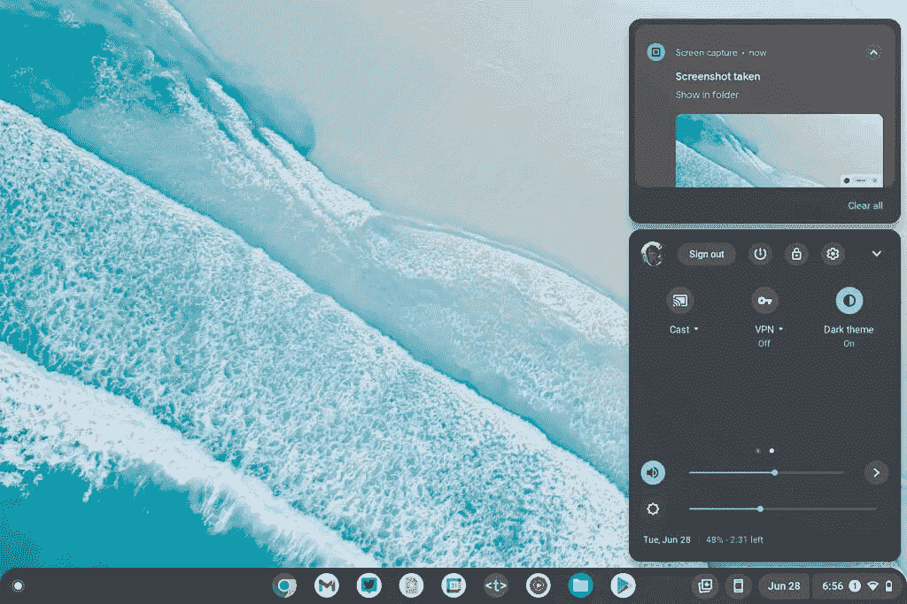

# ChromeOS 更新将全系统黑暗主题带到了最前沿

> 原文：<https://www.xda-developers.com/chromeos-update-dark-theme/>

谷歌已经为 ChromeOS 的全系统黑暗主题工作了很长时间。黑暗主题最初于今年早些时候在稳定频道上向用户推出。然而，在当时，它被隐藏在一个功能标志后面。谷歌现在终于在稳定频道上推出了最新的 ChromeOS 更新(版本 104)，以及其他一些方便的功能。

谷歌最近开始在稳定频道推出 ChromeOS 104.0.5112.83，最新版本在快速设置中添加了新的黑暗主题切换。虽然在以前的版本中，您可以通过启用功能标志来访问这个黑暗主题切换，但在最新的 ChromeOS 版本中，您不再需要这样做。

 <picture></picture> 

Screenshot: 9to5Google

据 *9to5Google* 报道，新的黑暗主题切换出现在快速设置的第二页。您可以点击它来启用系统范围的黑暗主题，这改变了用户界面的每个方面的外观。为了补充新的黑暗主题，谷歌还根据该主题创建了“从亮到暗微妙变化”的新壁纸。

*截图:9to5Google*

除了黑暗主题，ChromeOS 104 还在货架上带来了新的月历视图，让你可以查看一个月中任何一天的所有活动，并打开谷歌日历 PWA。此外，更新引入了一个紧凑的，重新设计的应用程序启动器，它不会占据整个屏幕，一个功能丰富的图库应用程序，可以打开 PDF 文件，以及一个新的壁纸和风格应用程序，可以让你使用谷歌照片库中的照片作为 Chromebook 壁纸。

最后，这次更新稍微改变了 ChromeOS 处理接收通知的方式。它现在将来自同一发件人的通知进行分组，并为警报操作提供更大的触摸目标。

*你如何看待 ChromeOS 104 引入的所有变化？请在下面的评论区告诉我们。*

* * *

**来源:** [谷歌](https://chromereleases.googleblog.com/2022/08/stable-channel-promotion-for-chromeos.html)

**Via:**[9 to 5 Google](https://9to5google.com/2022/08/04/chromeos-104-rolling-out/)