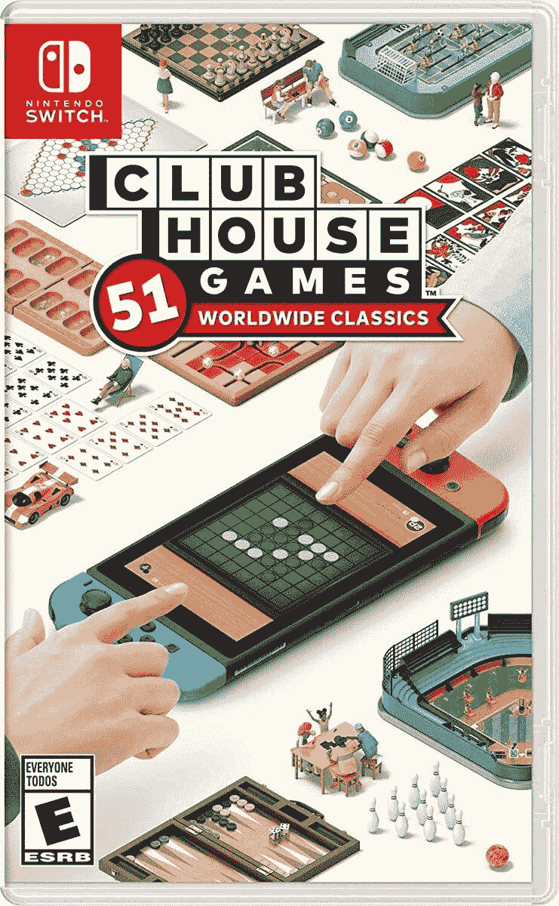

# 俱乐部游戏:51 款世界经典游戏现仅售 33 美元(7 折)

> 原文：<https://www.xda-developers.com/clubhouse-games-51-worldwide-classics-now-on-sale-for-just-33-7-off/>

任天堂 Switch 可能因马里奥和塞尔达游戏而闻名，但*club house Games:51 world wide Classics*是去年 Switch 图书馆中一个令人惊讶的好成员。这是一个集棋盘、卡牌和迷你游戏为一体的游戏，拥有多种控制方式和多玩家支持。现在你在亚马逊上只需花 32.88 美元就能买到，比平时 40 美元的价格低了 7.11 美元。

*Clubhouse Games: 51 款世界经典游戏*拥有你能想到的几乎所有流行的经典棋盘和纸牌游戏，包括国际象棋、21 点、中国跳棋、游艇骰子、战争、Seens 和德州扑克。还有一些迷你游戏更接近于 Wii Sports 或 Mario Party 中的游戏，如飞镖、玩具足球、战斗坦克、钓鱼和钢琴。大多数游戏支持本地和在线多人游戏，要么是朋友，要么是随机配对——我在网上玩过很多*的游艇骰子。如果其他人都从 eShop 下载了(免费的)俱乐部会所游戏访客卡，你也只需要一份本地多人游戏的副本。*

 <picture></picture> 

Clubhouse Games: 51 Worldwide Classics

##### 俱乐部游戏

任天堂的这一系列经典桌面游戏非常有趣，有多种玩法和本地/在线多人游戏。它以 32.88 美元的价格出售，比通常的价格节省了 7.11 美元。

大多数游戏都可以用标准控制器或 Switch 的触摸屏来玩，这可以在玩棋盘游戏时增加额外的沉浸感。还有一个马赛克模式，你可以在多个开关控制台上扩展游戏的观看区域，但这只适用于一些游戏。

自从我开始玩俱乐部游戏以来，我从中获得了很多乐趣。它感觉更像是早期游戏如 Wii Play 的精神继承者，而不仅仅是一系列棋盘和纸牌游戏——图形和视觉呈现甚至让我不太关心的游戏(看着你，下棋)成为一种愉快的体验。我的一个抱怨是，大多数游戏不适合两个人以上玩。