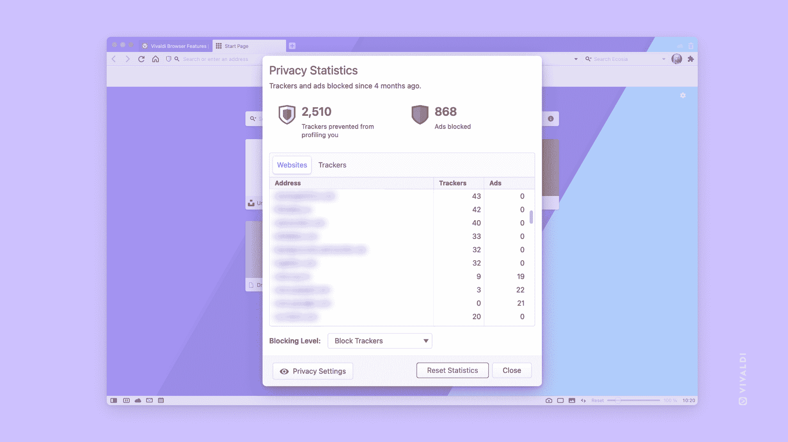

# 维瓦尔第联合创始人:广告商“偷走了我们的互联网”

> 原文：<https://www.xda-developers.com/co-founder-vivaldi-interview-mwc-2023/>

智能手机无处不在，它们给了我们如此多的接触机会。我们可以立即找到信息，在网上购买几小时后就能到货的产品，并通过无数的信息服务进行交流。然而，这是一把双刃剑，能够在网上做所有这些意味着广告商可以了解你的习惯并跟踪你。

这就是维瓦尔第的切入点。这是一个有着短暂但传奇历史的浏览器。它由 Opera 前首席执行官兼联合创始人谭咏文和 Tatsuki Tomita 创建，于 2016 年推出，旨在迎合技术倾向的用户和那些可能不喜欢 Opera 从 Presto 引擎转换到 Chromium 的人。虽然 Vivaldi 也使用 Chromium，但对浏览器进行了大量修改。它提供了许多定制你的体验的方式，更重要的是，一种让你的浏览更加私密的方式。

你可以想象，Tetzchner 对 2023 年互联网的状态有很多想法，尤其是在广告方面。XDA 在今年的[世界移动通信大会](https://www.xda-developers.com/mwc-2023/)上与他交谈，他很清楚广告客户“从我们这里偷走了互联网”

## 作为小玩家与大技术公司竞争

对 Tetzchner 来说，一个很大的症结是在一个日益敌对的空间里与其他大型科技公司竞争。他说，像谷歌和微软这样的公司“看到了小公司，他们认为它们是一种威胁”，维瓦尔第属于“实际上与这些家伙竞争的一小群人”他认为这是一个信号，表明如果其他人“看到我们并想给我们制造麻烦”，公司一定在做正确的事情。

Tetzchner 告诉我，过去谷歌和微软的网站是如何软屏蔽 Vivaldi 浏览器和 Opera 浏览器的。“你可以用维瓦尔第、[连接到谷歌文档之类的东西，它会告诉你切换浏览器](https://www.quora.com/Why-does-Google-see-Vivaldi-as-a-non-compatible-browser-Vivaldi-is-built-around-the-Chrome-engine-a-Google-product-and-all-browsers-are-free-so-why-do-I-get-this-message)。”他还提到如何简单地改变用户代理的一些文本将立即导致网站再次工作，很明显，维瓦尔第被视为一种威胁。

值得一提的是，像谷歌这样的公司可能存在的部分问题是，维瓦尔第阻止了大量的跟踪，并以新颖的方式绕过广告。例如，Tetzchner 说，Vivaldi 最近在手机上增加了标签页在背景中播放音频的选项，他特别指出，这在 YouTube 上也可以使用。这是典型的 YouTube 高级功能，但有了 Vivaldi，你就不需要付费了。这是否违反道德由你决定，但可以理解的是，公司会对此提出异议，并试图保护他们的收入来源，有时这可能是通过不公平的手段。

## 安卓的隐私沙箱什么也改变不了

对于不熟悉的人来说，Android 的隐私沙箱可以通过创建用户的离线档案来跟踪用户，并基于此显示相关广告。这是一项为期多年的计划，旨在向最终用户介绍更多的私人广告解决方案，多亏了主题 API 和 FLEDGE，这一计划才得以实现。它的目标是在默认情况下优先考虑用户隐私，但仍然保持移动生态系统依赖广告来支持免费和广告支持的应用程序。这是一个专属于 Android 的解决方案，使用独立的 SDK，与应用程序代码的其余部分分离，目的是最终取代 Ad ID。然而，Tetzchner 看不出标准跟踪和使用 Topics API 的公司之间有什么不同。

“对我们来说，你如何在技术上进行跟踪，你可以说在客户端进行比在服务器端进行好一点，但对我来说，你的浏览器正在建立你的个人资料……不不不这是错的。这是错误的，”他告诉我。

最困扰他的似乎不是数据去了哪里，而是这些数据可以用来实现什么。他提到这些数据可以用来影响人们投票的方式。这些数据是否在您的设备上并不重要；不管怎样，政治广告还是会出现。

 <picture></picture> 

Via Vivaldi

“他们从我们这里偷走了互联网”，他这样评价广告商。“互联网应该是开放和自由的，你不应该害怕被监控。你收集数据以提供广告的想法……我可以理解获得大量数据以提供服务，但这与描述你的用户是不同的。”

作为一个从 1992 年就开始从事互联网工作的人，Tetzchner 对互联网的现状深感沮丧。事实上，他认为现在网站的广告利润比广泛跟踪到位之前的状态要低。

他提到“正常广告”，你可能在杂志或电视上看到，是大约十年的标准，甚至在互联网上。“许多网站利润更高，人们也不太担心不得不屏蔽广告。广告是正常的，这有点像你去看杂志时所看到的。有广告，但他们没有关注你。”

“他们从我们这里偷走了互联网...互联网应该是开放和自由的，你不应该害怕被监控。”

广告商不想在质量差的网站上投放质量差的广告，这意味着现在的网站都在苦苦挣扎。较大网站和算法试图判断为拥有高质量内容的网站之间的付费被稀释。

他指出，付费墙在互联网上已经变得司空见惯，而 15 年前并非如此。"那么，我们为什么需要改变，而这种改变实际上造成了这种局面？"他问道。他认为，由于广泛的跟踪，广告整体利润较低。广告客户以前支付更多的费用，因为他们确切地知道他们的广告将投放到哪里。现在有了算法和谷歌广告，并不是所有东西都是高质量的，即使那些算法试图扫描页面寻找高质量的内容。

维瓦尔第浏览器是当今互联网的对立面。Tetzchner 特别推广了 fediverse 和[乳齿象](https://www.xda-developers.com/what-is-mastodon/)，以此来逃避持续的商业化和对更广泛的互联网的追踪。Vivaldi 在添加谷歌 Chrome 和 Edge 等公司没有的功能时阻止了跟踪器，并且[你可以在 MacOS、Windows、Android 上下载它，很快，iOS](https://vivaldi.com/) 。