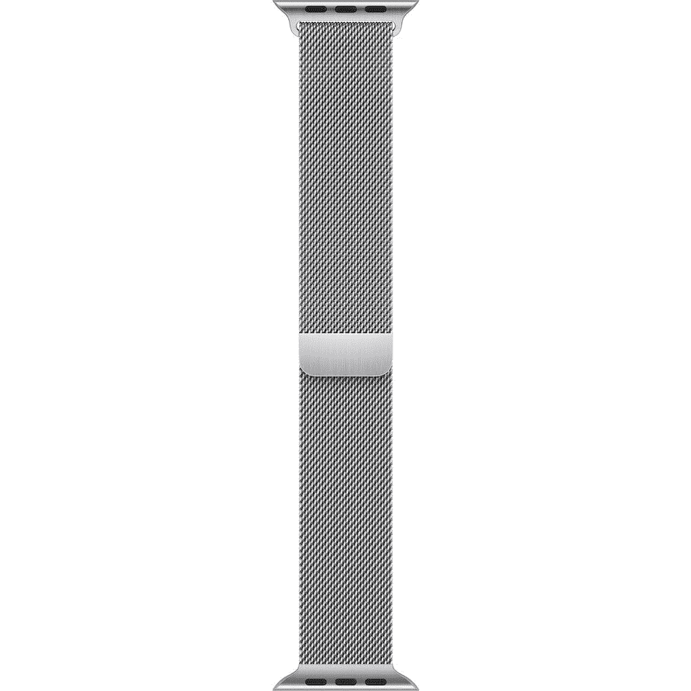
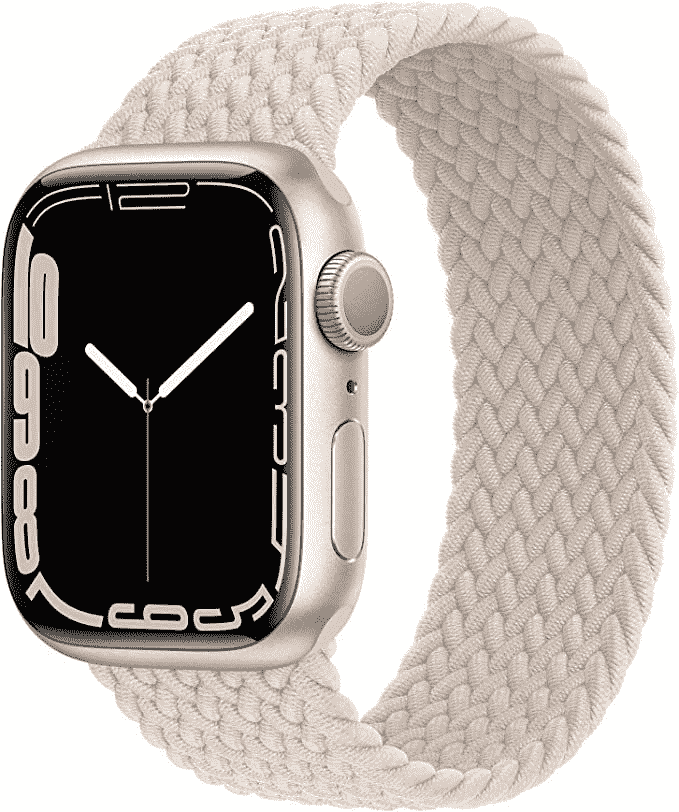
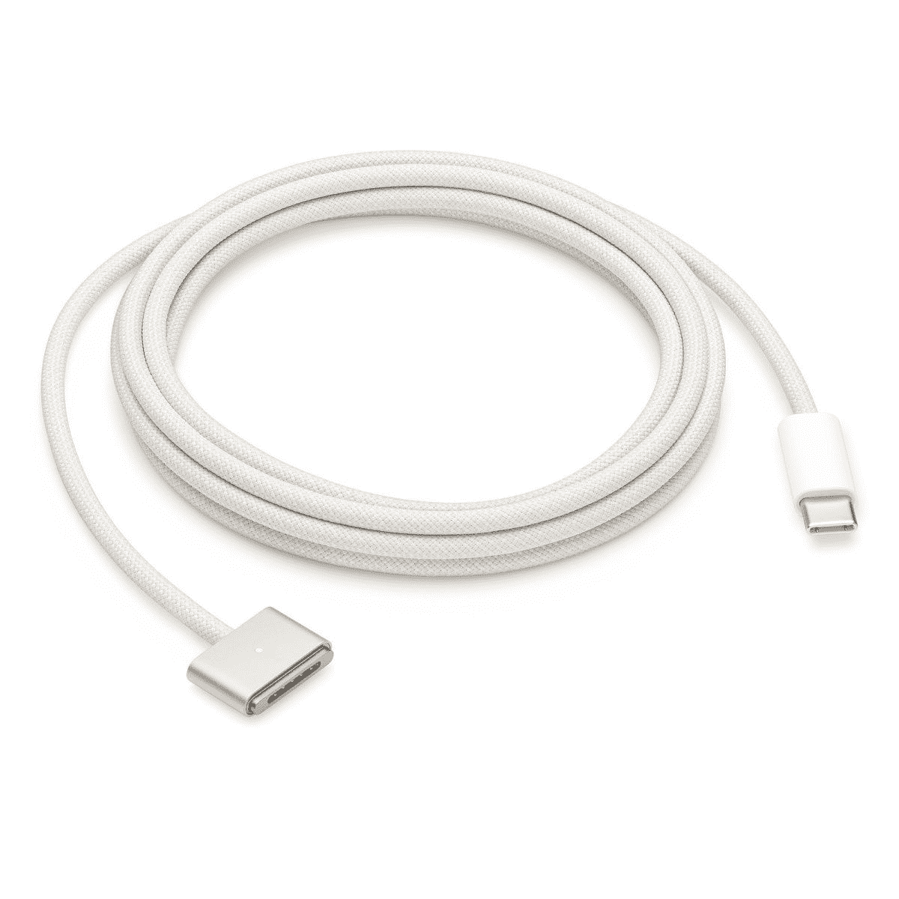
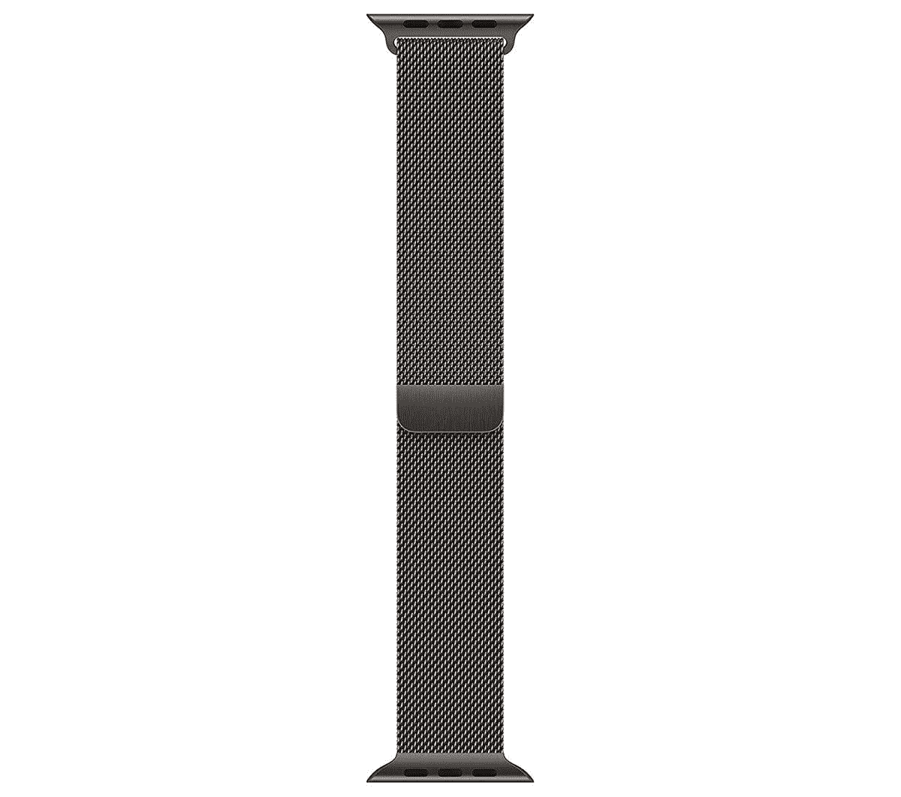
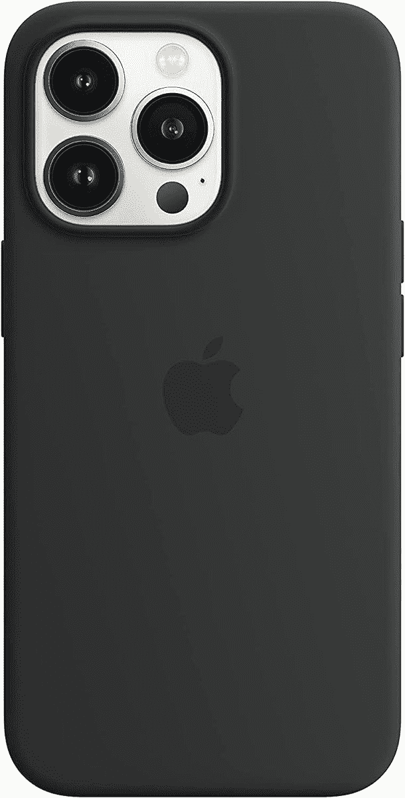
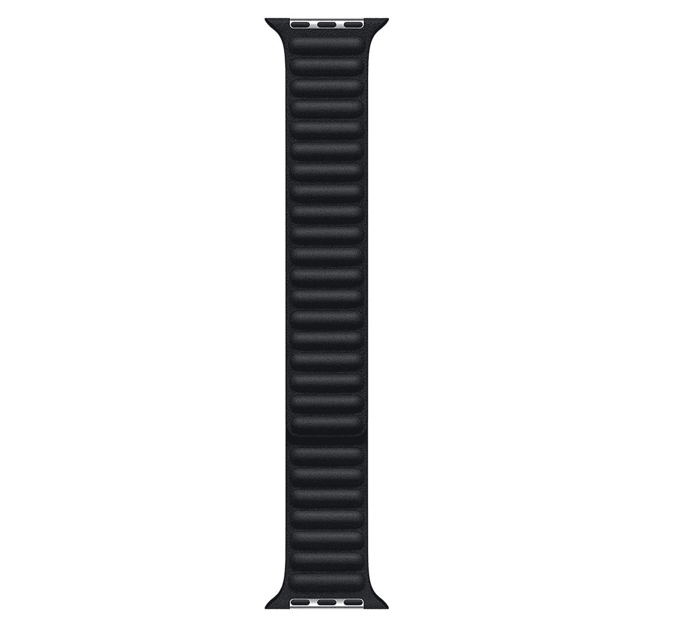

# 与您的 MacBook Air M2 的颜色相匹配的最佳配件(2022)

> 原文：<https://www.xda-developers.com/color-accessories-macbook-air-2022/>

# 与您的 MacBook Air M2 的颜色相匹配的最佳配件(2022)

你在寻找和你的苹果 MacBook Air M2 (2022)颜色一样的配件吗？这里有一个完整的列表！

在 WWDC22 的主基调上，苹果发布了 [MacBook Air M2 (2022)](https://www.xda-developers.com/macbook-air-m2-2022-review/) ，以及 [macOS Ventura](https://www.xda-developers.com/macos-ventura) 。这款闪亮的[新 Mac](https://www.xda-developers.com/best-macs/) 采用了重新设计的底盘和大修的内部部件。它现在有更盒装的设计，更广泛的颜色选择，更清晰的网络摄像头等。如果你拿到了一个，一定要查看我们的苹果硅 MAC 最佳应用列表[。这些应用程序是专为不断扩大的 Apple M 芯片组家族而设计和优化的。您可能还想购买与您的新 MacBook Air 颜色相匹配的配件。这样，你的整个设置看起来是苹果提供的默认设置，而不是你自己构建的。这些是与您的 MacBook Air M2 (2022)的颜色相匹配的最佳配件。](https://www.xda-developers.com/best-apps-apple-silicon/)

**浏览本文:**

## 银色配饰

*   <picture></picture>

    Apple Milanese Loop

    ##### Apple Watch Milanese Loop

    Apple Watch 的 Milanese Loop 在扣上时会使用强力磁铁吸附在自身上。它很花哨，看起来很正式，但缺乏防水性。

*   <picture></picture>

    best and 铝制支架

    ##### best and 铝制支架

    这款铝制支架非常适合那些想要抬起和倾斜 MacBooks 以获得完美工作角度的人。它有硅胶垫，可以避免刮伤你的 Mac，并防滑。

## 星光饰品

*   <picture></picture>

    Proworthy 蕾丝编织单环

    ##### Proworthy 蕾丝编织单环 Apple Watch Band

    这款编织单环价格实惠。它由耐用、亲肤的材料制成。更不用说，由于其灵活的设计，可以轻松佩戴。

*   <picture></picture>

    苹果 USB-C 转 MagSafe 3 线

    ##### 苹果 MagSafe 充电器

    如果你已经损坏了原装的，或者可能只是喜欢在身边放一根备用线，这款官方的与你的 MacBook Air 的颜色相匹配。它有一个编织的建设，并提供两米的长度。

## 太空灰配饰

*   <picture></picture>

    Apple Milanese Loop

    ##### Apple Watch Milanese Loop

    Apple Milanese Loop 既坚固又时尚。尽管它不防水，但由于它的磁性扣，它仍然具有耐用的结构，可以毫无麻烦地穿着。

*   <picture></picture>

    苹果 AirPods Max

    ##### 苹果 AirPods Max

    就像 AirPods Pro 一样，ai rpods Max 自带主动降噪(ANC)和杜比 Atmos 支持。不过，由于尺寸更大，Max 变种提供了更多的音频沉浸感。

## 午夜配饰

*   <picture></picture>

    苹果硅胶保护套

    ##### 苹果硅胶 iPhone 13 Pro 保护套

    此官方午夜保护套支持 MagSafe 充电。如果你没有 Pro 机型，它也适用于其他 iPhone 13 版本。

*   <picture></picture>

    苹果皮链

    ##### 苹果手表皮链

    这款威尼斯皮链的苹果手表来自意大利的 Arzignano。你只要把它缠绕在你的手臂上，磁铁就会把它固定住。

* * *

我个人得到了午夜的 MacBook Air M2 (2022)。然而，午夜颜色选项不适用于苹果的许多产品。因此，在选择 HomePod Mini 和一对 AirPods Max 时，我不得不满足于太空灰——因为这是最暗的颜色，也是最接近午夜的颜色。不过，我找到了一个非官方的午夜苹果手表米兰循环。否则，我的大多数配件都满足于太空灰的颜色——这几乎与我的 MacBook Air 相匹配。

MacBook Air (2022)包括 M2 芯片，这是对 2020 年首次亮相的原始 M1 处理器的更强大、更高效的升级。它有一个 13.6 英寸的凹口显示屏，但它仍然缺乏 Face ID 功能。尽管如此，网络摄像头获得了非常受欢迎的 1080p 升级，这是其前身 720p 的一大进步。更不用说 MagSafe 3 充电支持的回归了。你可以花 1199 美元买到一个基本单元。

 <picture></picture> 

Apple MacBook Air M2

##### 苹果 MacBook Air (2022)

2022 年的 MacBook Air 提供了 M2 芯片和重新设计的带缺口的机箱，支持 MagSafe 和更多的颜色选择。

*你选择了哪种 MacBook Air 颜色，你会购买哪些配套配件？请在下面的评论区告诉我们。*