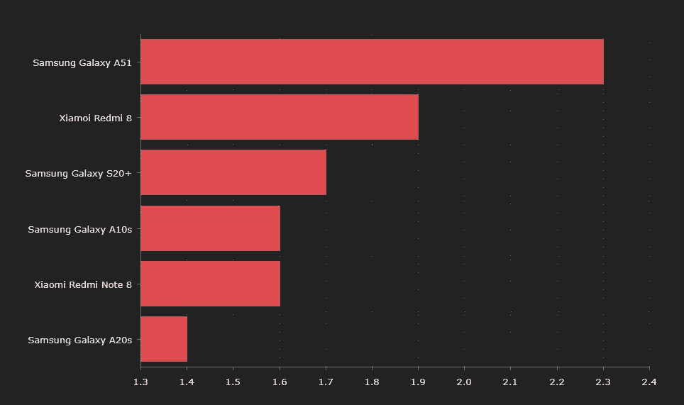
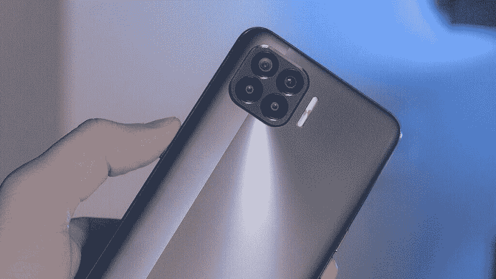
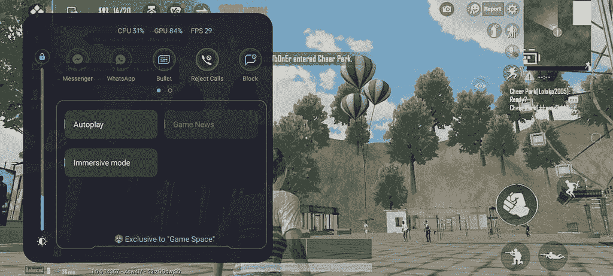
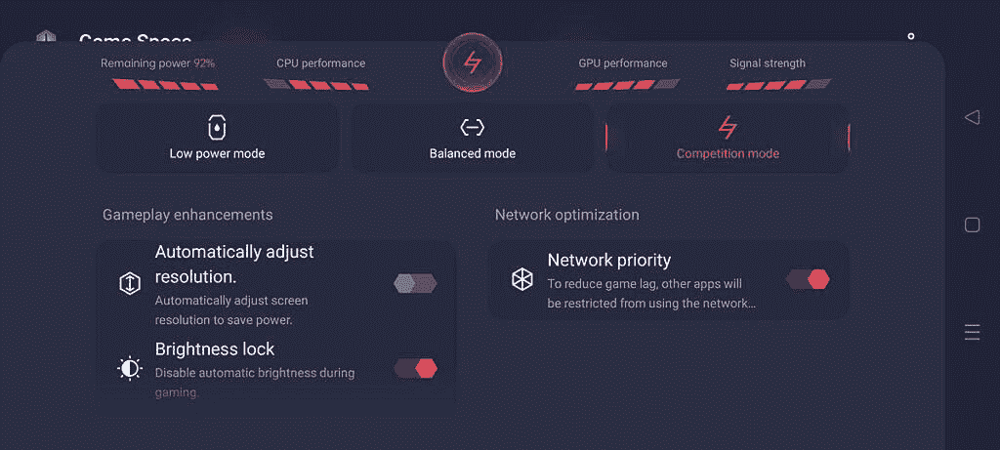
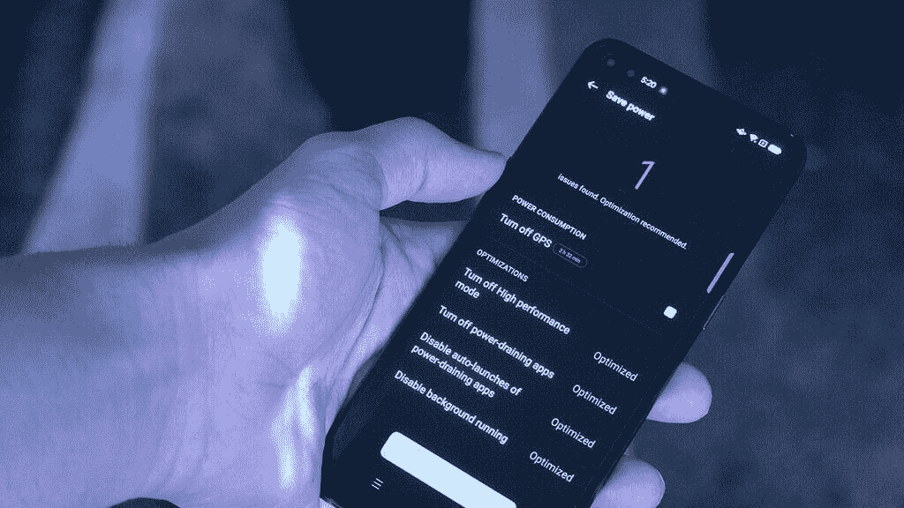

# OPPO 的 ColorOS 11 如何充分利用中端 F17 Pro

> 原文：<https://www.xda-developers.com/coloros-11-f17pro/>

随着旗舰手机价格开始攀升至 1000 美元以上，中档手机看起来比以往任何时候都更有吸引力。随着世界经济开始走下坡路，更实惠的手机开始占据中心位置。2020 年，经济型手机是市场上销量最大的手机之一。消费者在关注他们的钱包，希望以合理的价格买到最好的手机。现在随着 Android 11 的发布，OPPO 的目标是充分利用中端硬件，ColorOS 11 更新。

 <picture></picture> 

Android smartphone sales Q1 [Market share percentages]

如果你购买中档手机，你通常会牺牲高端功能，如更高的刷新率，最新的相机传感器，更好的制造材料，或快速充电等功能。这并不意味着你必须有一个糟糕的软件体验。当利用更少量的 RAM 和中档芯片组时，设计良好的 OEM 软件可能意味着一个不同的世界。

作为他们 2020 年更实惠的手机之一，OPPO 推出了 **OPPO F17 Pro** 。这款手机搭载了 ColorOS 7.2 (Android 10)，但将成为未来 ColorOS 11 更新的首批 OPPO 设备之一。目前，我们运行的是在 Android 11 上运行的 ColorOS 11 的测试版。在本文中，我们将了解这款预算友好的手机，并了解 ColorOS 11 如何使这款中端设备既流畅又多功能。

 <picture></picture> 

OPPO F17 Pro

| 

OPPO F17 Pro

 | 

硬件规格

 |
| --- | --- |
| 显示 | 6.43 英寸 1080 x 2400 像素 |
| 芯片集 | 联发科 Helio P95 (12 纳米) |
| 随机存取存储 | 8GB |
| 储存；储备 | 128GB |
| 主摄像机 | 48+8+2+2MP |
| 自拍相机 | 16+200 万像素 |
| 电池 | 4015 毫安时 |
| 操作系统（Operating System） | 色彩 7.2 |

* * *

### 改进游戏性

当你使用像联发科 Helio P95 这样更温和的芯片组时，你需要确保你能够正常运行你最喜欢的游戏。在 ColorOS 11 中，您可以使用附带的游戏空间功能来提高游戏性能。该应用程序能够阻止通知和拒绝来电，以确保您的游戏不间断。此外，您将能够监控您的 CPU 和 GPU 的使用，以及 FPS 率。在 PUBG 中，对这些数据的实时监控将帮助您调整图形设置，以获得最佳性能。

游戏空间有三种不同的游戏模式。低功耗模式将限制你的手机性能，有利于电池寿命。平衡模式是您的标准选项，竞争模式将最大限度地发挥您的游戏优先权硬件。有了这些工具，即使是配置较低的手机也可以调整设置，以获得更好的游戏体验。

 <picture></picture> 

PUBG on OPPO F17 Pro

 <picture></picture> 

ColorOS 11 Game Space

最好的游戏方式是使用新的沉浸式模式。这种模式可以从游戏空间的快速访问气泡中选择。屏蔽所有通知、来电和警报让我更专注于游戏。沉浸式模式还可以锁定导航手势和快速设置，防止您意外离开游戏。

另一个对玩家非常有帮助的有趣功能是快速返回气泡，这是一个在屏幕上弹出的小浮动气泡。当您在玩游戏时切换到其他应用程序时，快速返回气泡会以浮动气泡的形式显示关键信息(例如重生倒计时或舱内时间)，您只需轻按气泡即可切换回游戏。

 <picture></picture> 

Quick Return Bubble

尽管我运行的是中端硬件，但我能够在 OPPO F17 Pro 上获得流畅的游戏体验。我能够在许多图形密集型游戏上持续获得大约 30FPS 的速度。这得益于 OPPO 的 Hyper Boost 技术，可以在必要的时候为游戏预分配更多的资源。平均而言，这可以防止游戏运行缓慢，并将帧速率稳定性提高 38%。Hyper Boost 还解决了触摸敏感性问题，并提出了游戏过程中快速耗电和过热的解决方案。

* * *

### UX 表演

当 OPPO 开发 ColorOS 11 时，他们试图坚持一种股票 Android 体验。当然，你可以在整个系统中找到个性化设置，但没有沉重的干扰主题或臃肿的软件会让你的手机变慢。整个系统的性能与您对旗舰 ColorOS 设备的预期一样好。

OPPO F17 Pro 上的系统动画表现没有问题-实际上，在新的操作系统下，我觉得 F17 Pro 是我在 2020 年使用过的最流畅的中端设备。ColorOS 11 经过优化，可以在硬件资源较少的设备上无延迟运行。所以即使在预算设备上，ColorOS 11 依然会表现出色。

* * *

### 电池防护装置

当你买一部便宜的手机时，手机的寿命对你来说可能是非常重要的。智能手机电池会随着时间的推移而退化，最终无法保持电量。其中一个原因是你的手机充电过度。ColorOS 11 有一个新功能，叫做电池保护。这项功能可以让你切换“优化夜间充电”设置，这将使你的手机开始学习你的日常生活。然后，您的充电将被优化为缓慢充电一整夜，并确保您醒来时有 100%的电量。

通过使用这一功能，你将保护你的手机电池的健康。随着时间的推移，你的电池会以更慢的速度退化。通过这种改进的充电方法，您将拥有健康持久的电池。

ColorOS 11 上有一个新的超级省电模式，一旦打开，电池就会开始消耗得更慢。即使激活了此设置，您仍会发现自己的演奏非常流畅。

 <picture></picture> 

ColorOS 11 Battery Tools

* * *

### 多任务处理

当一部手机拥有中低端规格时，多任务处理是一个可能会受到影响的领域。因此，需要原始设备制造商来优化他们的设备，以实现适当的 RAM 管理。随着 OPPO F17 Pro 运行 ColorOS 11，我可以在后台冻结 PUBG 游戏菜单，同时使用谷歌文档、使用 Twitter、观看视频等。之后，我可以回到游戏中，发现它仍然在运行，并准备好新的比赛。多任务处理性能在中档手机上表现尤为出色，这应该归功于操作系统。

* * *

这是一个很好的例子，说明 OEM 如何在软件中添加有用的功能，而不会以臃肿和侵入性的应用程序的形式出现。ColorOS 11 目前正在 OPPO 设备上进行测试，包括 FindX2 系列、Reno3 系列等。对于那些早期用户，你可以申请测试版。对于那些不太熟悉测试版智能手机操作系统的人，我建议等到稳定版。在我看来，OPPO F17 Pro 作为一款中端手机表现非常好，充分利用了 Android 11。

阅读更多关于 ColorOS 11 的信息:

[ColorOS 11 回顾–OPPO 在 Android 11 上增加了许多定制功能](https://www.xda-developers.com/coloros-11-android-11-oppo-review/)

【OPPO 基于 Android 11 的 ColorOS 11 测试版即将为您的智能手机推出

【OPPO 的 ColorOS 11 如何推安卓定制潮流

######  *感谢 OPPO 赞助本帖。我们的赞助商帮助我们支付与运行 XDA 相关的许多费用，包括服务器成本、全职开发人员、新闻撰稿人等等。虽然您可能会在门户内容旁边看到赞助内容(这些内容将始终被标记为赞助内容),但门户团队对这些帖子不承担任何责任。赞助内容、广告和 XDA 仓库完全由一个独立的团队管理。XDA 绝不会通过接受金钱来赞扬一家公司，或以任何方式改变我们的观点或看法，从而损害其新闻诚信。我们的意见不能被收买。

*