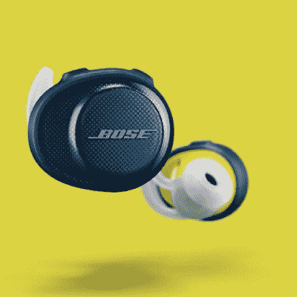
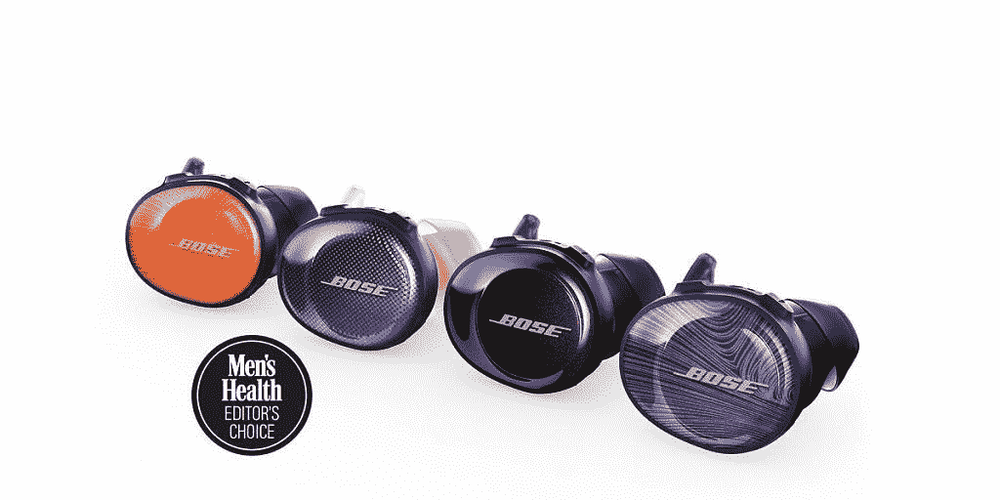

# Bose SoundSport Free 与苹果 AirPods 相比如何？

> 原文：<https://www.xda-developers.com/competition-bose/>

# Bose 耳机和苹果 AirPods 相比如何？

了解 Bose SoundsSport Free 与 Apple AirPods 和 AirPod Pros 相比有何不同。比较功能、价格和音质。

苹果 AirPods 是目前市场上最受欢迎的无线耳塞。但当谈到真正的无线耳塞时，它们不是你的唯一选择。市场上很快充斥着不同的无线耳塞选择——大多数都在预算范围内，但一些高端选择对 AirPods 构成了竞争。让我们来看看 Bose SoundSport 免费耳塞，看看它们如何与苹果 AirPods 相抗衡。

# Bose SoundSport Free 与苹果 AirPods 相比如何？

Bose 是耳机中最有信誉的名字之一，以质量著称。通过 SoundsSport 免费耳塞(有时被错误地称为“Bose Airpods”)，他们制作了一款防水的无线耳机，电池寿命与 Airpods 相当。Bose SoundSport Free 耳塞无疑更针对寻求锻炼解决方案的人，而 AirPods 则更适合日常使用。

 <picture></picture> 

Bose SoundSport Free

 <picture></picture> 

Apple AirPod Pros

 <picture></picture> 

Apple AirPods 2

谈到舒适，Bose 无线耳塞组件将适合您的耳朵，并更好地保持在那里。它们设计舒适，经得起你的日常锻炼。请参见下表，了解它们与 AirPods 和 AirPod Pros 的对比情况。

| 

特征

 | 

Bose SoundSport 免费

 | 

苹果 AirPods 2

 | 

苹果 AirPods Pro

 |
| --- | --- | --- | --- |
| 重量 | 0.6 盎司 | 0.1 盎司 | 0.2 盎司 |
| 品牌 | 玻色 | 苹果 | 苹果 |
| 价格 | $199.95 | $249.00 | $159-$199 |
| 连通性 | 无线的 | 无线的 | 无线的 |
| 声输出 | 立体声 | 立体声 | 立体声 |
| 远程控制功能 | 下一首/上一首曲目 | 下一首/上一首曲目 | 下一首/上一首曲目 |
| 最大运行时间 | 5 小时运行时间 | 5 小时运行时间 | 5 小时运行时间 |
| 特征 | 带麦克风，带充电电池 | 带麦克风，带充电电池 | 带麦克风，噪音消除 |
| 风格 | 入耳式 | 入耳式 | 入耳式 |

Bose SoundSport Free 的缺点是，与 AirPods 相比，许多人会认为它们非常丑陋。他们提供多种不同的设计，所有这些设计都同样不吸引人。

 <picture></picture> 

Design options for the Bose SoundSport Free

如果你想买无线耳塞，比较一下 Bose 和 Apple 的选择，看看哪种解决方案更适合你的生活方式。

[**获得 Bose SoundSport 无线耳机**](https://www.anrdoezrs.net/links/100122946/type/dlg/sid/UUxdaUeUpU27103/https://www.bose.com/en_us/products/headphones/sports_headphones.html)