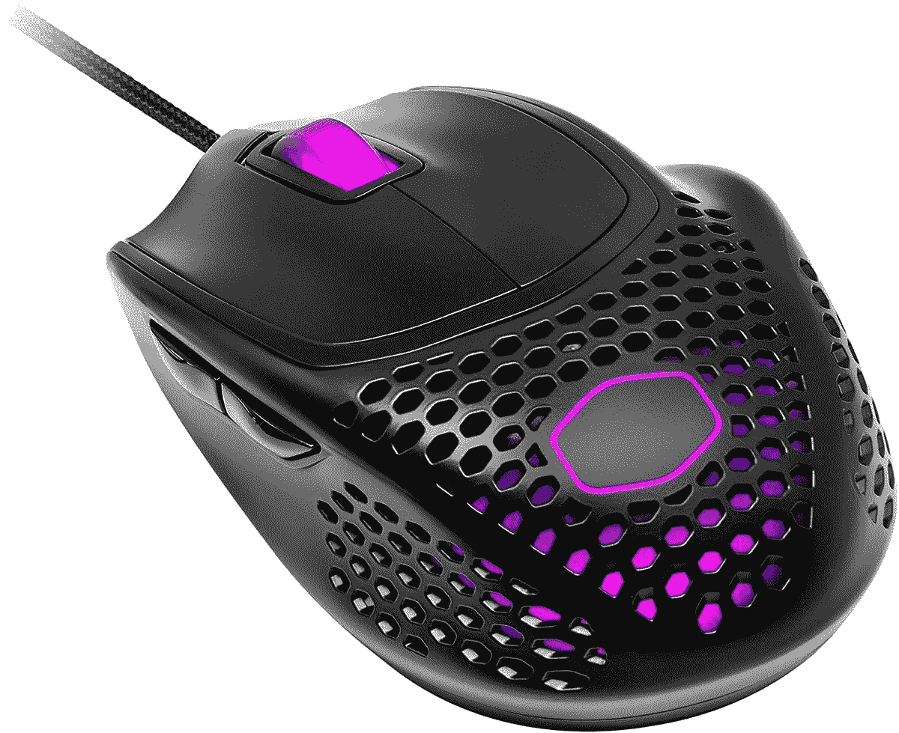

# 酷派大师推出五种新配色的 MM720 鼠标

> 原文：<https://www.xda-developers.com/cooler-master-nachocustomz-mm720-limited-edition-mice/>

台湾外设和 PC 硬件制造商酷派(Cooler Master)推出了五种全新配色的 MM720 轻型游戏鼠标。Cooler Master 与迈阿密的鼠标模型和设计师 NachoCustomz 合作，设计这种新型鼠标。

限量版[Cooler Master x NachoCustomz mm 720](https://colorways.coolermaster.com/nacho-customz-mm720-series)系列现在可以预购，价格为 99 美元，正式销售将于 9 月份开始。新的颜色选项包括鲜艳的红色、铁蓝色、粉红、绿宝石绿色和浅黄色。

*“作为世界上最好的鼠标改装师和定制艺术家之一，NachoCustomz 一直是我们潜在合作者名单的首位。Cooler Master 外围设备总经理 Bryant Nguyen 表示:“我们很高兴终于能与他对细节的非凡眼光合作，为已经广受欢迎的 MM720 制作出新的、非常性感的版本。”。*

如果你对新颜色不感兴趣，好消息是 Cooler Master 将在 7 月 4 日限时销售现有的黑色和白色 MM720 型号。该公司尚未透露折扣价，但当它上线时，你可以在[这个链接](https://www.amazon.com/Cooler-Master-Lightweight-Ultraweave-Optical/dp/B08K2NMXTZ?tag=xda-7rudgol-20&ascsubtag=UUxdaUeUpU3579&asc_refurl=https%3A%2F%2Fwww.xda-developers.com%2Fcooler-master-nachocustomz-mm720-limited-edition-mice%2F&asc_campaign=Short-Term)查看交易。

 <picture></picture> 

Cooler Master MM720 Gaming mouse

##### 酷派 MM720 游戏鼠标

Cooler Master MM720 是一款轻量级 RGB 游戏鼠标，采用独特的蜂窝外壳设计。

去年推出的 Cooler Master MM720 是一款面向游戏玩家的轻型 RGB 鼠标。它采用独特的蜂窝外壳设计，重量仅为 49 克。据该公司称，这款鼠标使用光学传感器，可调节至 32000 DPI，并具有耐用的开关，可承受 2000 万次按压。它还有一根超编织电缆，该公司表示，这可以显著减少滑动时的电缆阻力，并改进了聚四氟乙烯脚，提供超级平滑的滑动。与其他游戏鼠标类似，您也可以自定义 RGB 照明，创建宏，在不同的配置文件之间切换，等等。