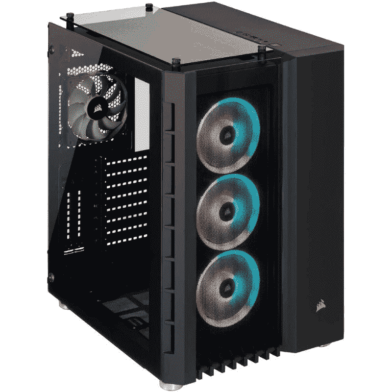

# 通过网络星期一交易，购买海盗船水晶 680X 表壳可节省 65 美元

> 原文：<https://www.xda-developers.com/corsair-crystal-680x-case-cyber-monday-deal/>

# 为网络星期一购买 Corsair Crystal 680X 机箱节省 65 美元，开始打造您梦想中的电脑

如果你在市场上为你的梦想买一个新的电脑机箱，那么我们建议在这个网络星期一看看 Corsair Crystal 680X。

我们收集的[最佳电脑案例](https://www.xda-developers.com/best-pc-cases/)中有很多案例在[黑色星期五](https://www.xda-developers.com/black-friday/)和网络星期一降价。如果你错过了这些交易，那么还有时间抓住这个令人兴奋的亚马逊海盗船水晶 680X 电脑案件网络星期一交易。这款中塔式电脑机箱非常适合构建高端电脑。作为早期网络星期一交易的一部分，它现在只需 200 美元，这使它成为您下一次构建的绝佳选择。

 <picture></picture> 

Corsair Crystal 680X PC case

##### 海盗船水晶系列 680X

Corsair Crystal 680X 中塔式电脑机箱是构建高端电脑机箱的绝佳选择。它采用独特的双室设计，配有钢化玻璃。

Corsair Crystal 680X 有黑色和白色两种颜色可供选择，配有钢化玻璃侧板。这是一个看起来非常独特的箱子，前半部分和顶部面板也覆盖着钢化玻璃。Crystal 680X 自带四个预装的 Corsair LL120 RGB 风扇。其中三个风扇位于前面板上，而一个 120 毫米的风扇位于后面。还有空间再添加四个 120 毫米或 140 毫米的风扇，但你必须单独购买。机箱也有足够的空间来安装多达四个散热器，用于添加市场上的[最佳液体 CPU 冷却器](https://www.xda-developers.com/best-liquid-coolers/)。

 <picture></picture> 

Corsair Crystal 280X PC case

##### 海盗船水晶系列 280X

Corsair Crystal 280X 是 Crystal 680X 表壳的紧凑版本，适合 SFF 造型。

或者，你也可以看看海盗船水晶 280X 微型 ATX 电脑案件。这是 680X 机箱的紧凑版本，提供了足够的空间来安装一堆风扇和散热器。它还捆绑了一个 RGB 照明控制器，使您更容易控制 RGB 灯。海盗船水晶 280X 目前仅售 140 美元，低于其通常的 175 美元的价格。这不是最低的价格，但仍然很好，因为这些电脑机箱很少打折。作为我们黑色星期五报道的一部分，我们还报道了许多其他的[个人电脑和游戏交易](https://www.xda-developers.com/best-black-friday-pc-gaming-deals/)，所以一定要去看看。