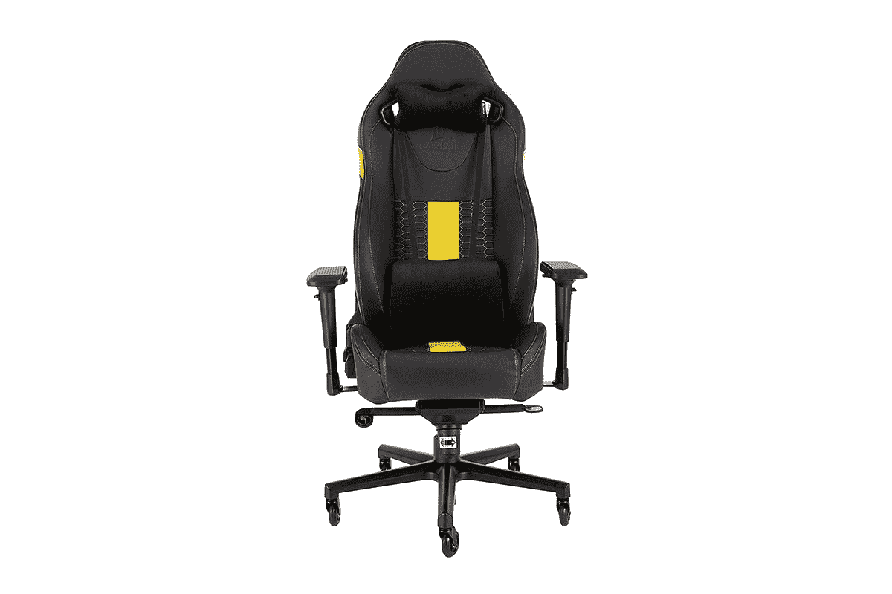

# 海盗船公司正在以 250 美元的价格出售其 T2 公路勇士游戏椅

> 原文：<https://www.xda-developers.com/corsair-t2-road-warrior-gaming-chair-black-friday-sale-amazon/>

# 黑色星期五期间，海盗船 T2 公路勇士游戏椅售价为 250 美元

Corsaid T2 公路勇士配备了一个可调靠背以及扶手和座椅高度，以及时尚和坚固的建设。

因此，您已经设法用最新的硬件和最好的外围设备设置了终极游戏装备。但是你在玩游戏的时候还在用基本的办公椅吗？是时候升级了！Corsair 在 T2 路勇士游戏椅的销售上有一笔不错的交易，在亚马逊上以 250 美元的价格出售，低于其原价 400 美元。从本质上来说，您在这笔交易中节省了 150 美元！

 <picture></picture> 

Corsair T2 Road Warrior Gaming Chair

##### 海盗船 T2 路勇士游戏椅

如果你正在寻找一个强大和时尚的宝座，也照顾你的背部，得到海盗船 T2 路勇士游戏椅。

来自 Corsair 的 T2 公路战士配备了宽座椅、高靠背和双层定制颜色口音，使其舒适而时尚。你会得到一个穿孔的 PU 皮座椅靠背和坐垫，提供更高的透气性和舒适性，以及黄色、红色、蓝色、白色或黑色的双层颜色。虽然上述交易仅适用于黄色，但其他颜色也有一些折扣。

椅子还配有一个可调节的颈部和腰部枕头，这些枕头采用柔软的超细纤维面料。你可以很容易地四处移动，这要归功于滚轮式的轮子，它可以让你在任何表面上快速移动。至于扶手，它们是可调节的，可以向任何方向移动，也可以根据你的喜好升高或降低。由于采用钢结构 4 级气举，座椅高度可在 85 毫米的移动范围内调节。当然，当你想休息时，靠背可以完全倾斜到 170 度。它可以将座椅倾斜角度调整到 17 °,为您的姿势找到合适的位置。

一定要考虑买一把舒适的游戏椅，因为它肯定会对你的姿势产生巨大的影响，尤其是如果你已经搬到了一个在家工作的环境。我最近给自己买了一个，相信我，除了帮助我集中精力工作，它对我的下背部也有奇效。如果你正在寻找其他交易，我们也为这个黑色星期五收集了一些其他[值得注意的游戏配件交易。](https://www.xda-developers.com/black-friday-gaming-deals/)